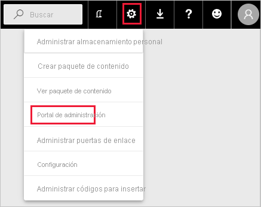
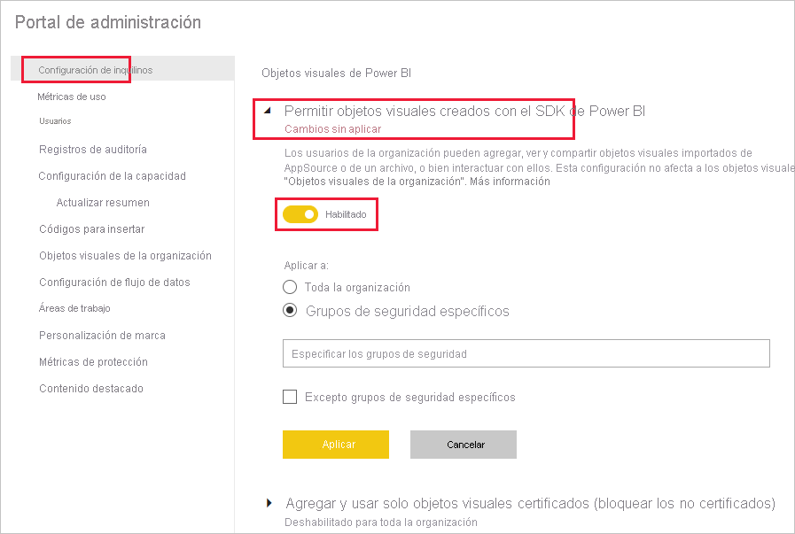
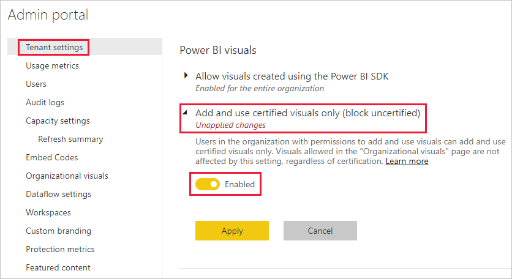
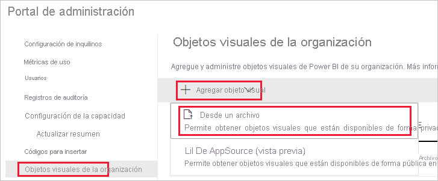
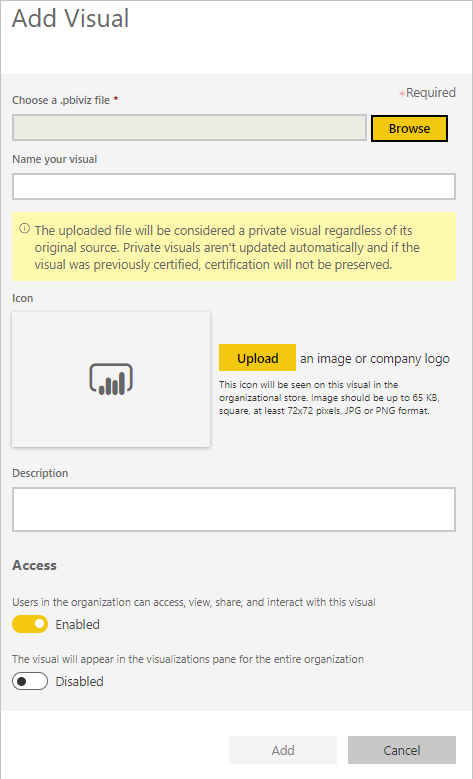
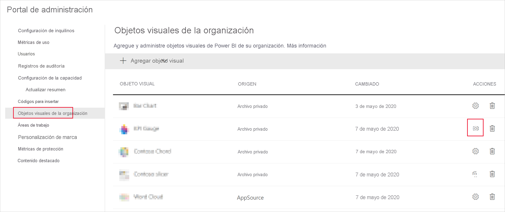

# Administración de la configuración de administrador de objetos visuales de Power BI

Como administrador de Power BI de su organización, puede controlar el tipo de objetos visuales de Power BI a los que los usuarios pueden acceder en la organización.

Para administrar los objetos visuales de Power BI, debe ser un administrador global de Office 365 o tener asignado el rol Administrador del servicio Power BI. Para más información acerca del rol de administrador del servicio Power BI, consulte [Descripción del rol de administrador de Power BI](service-admin-role.md).

## Acceso al portal de administración

Para habilitar la configuración que se describe en el artículo, necesitará acceder al portal de administración.

1. En el servicio Power BI, seleccione **Configuración**.

2. En el menú desplegable de configuración, seleccione **Portal de administración**.

    

## Configuración de inquilino de objetos visuales de Power BI

Como administrador de Power BI de su organización, puede controlar el tipo de objetos visuales de Power BI a los que los usuarios podrán acceder en la organización.

La configuración del inquilino de la interfaz de usuario solo afecta al servicio Power BI. Si quiere que esta configuración tenga efecto en Power BI Desktop, use directivas de grupo. Una tabla al final de cada sección proporciona detalles para habilitar la configuración en Power BI Desktop.

>[!NOTE]
>Los cambios en la configuración del inquilino no afectan a los objetos visuales de Power BI que aparecen en la pestaña [Objetos visuales de la organización](#organizational-visuals).

### Objetos visuales desde AppSource o un archivo

Administre el acceso a la organización para el siguiente tipo de objetos visuales de Power BI:

* Objetos visuales que crean los desarrolladores y se guardan como un archivo .pbiviz.

* Objetos visuales disponibles de AppSource.

Siga las instrucciones que se indican a continuación para permitir que los usuarios de su organización carguen archivos .pbiviz y agreguen objetos visuales de AppSource a sus informes y paneles.

1. Expanda la configuración **Permitir los objetos visuales creados con el SDK de Power BI**.

2. Haga clic en **Habilitado**.

3. Elija quién puede cargar los objetos visuales .pbiviz y de AppSource:

    * Seleccione la opción **Toda la organización** para permitir que todos los usuarios de su organización carguen archivos .pbiviz y agreguen objetos visuales de AppSource.

     * Seleccione la opción **Grupos de seguridad específicos** para administrar los archivos de carga .pbiviz y agregar objetos visuales de AppSource mediante grupos de seguridad. Agregue los grupos de seguridad que quiere administrar en la barra de texto *Especificar los grupos de seguridad*. Los grupos de seguridad especificados se excluyen de forma predeterminada. Si quiere incluir estos grupos de seguridad y excluir a todos los demás usuarios de la organización, seleccione la opción **Excepto grupos de seguridad específicos**.

4. Haga clic en **Aplicar**.

Los cambios de la interfaz de usuario en la configuración del inquilino solo se aplican al servicio Power BI. Para permitir que los usuarios de su organización carguen archivos .pbiviz y agreguen objetos visuales de AppSource a su panel de visualización en Power BI Desktop, use [Directiva de grupo de Azure AD](https://docs.microsoft.com/azure/active-directory-domain-services/manage-group-policy).

|Clave  |Nombre del valor  |Valor  |
|---------|---------|---------|
|Software\Policies\Microsoft\Power BI Desktop\    |EnableCustomVisuals    |0: deshabilitar  1: habilitar (valor predeterminado)         |
|

### Objetos visuales de Power BI certificados

Cuando esta opción está habilitada, solo los [objetos visuales certificados de Power BI](../developer/visuals/power-bi-custom-visuals-certified.md)se representarán en los informes y paneles de la organización. Los objetos visuales de Power BI de AppSource o archivos que no están certificados devolverán un mensaje de error.

1. En el portal de administración, seleccione **Agregar y usar solo objetos visuales certificados**.

2. Haga clic en **Habilitado**.

3. Haga clic en **Aplicar**.

Los cambios de la interfaz de usuario en la configuración del inquilino solo se aplican al servicio Power BI. Para administrar la configuración del inquilino de objetos visuales certificados en Power BI Desktop, use [Directiva de grupo de Azure AD](https://docs.microsoft.com/azure/active-directory-domain-services/manage-group-policy).

|Clave  |Nombre del valor  |Valor  |
|---------|---------|---------|
|Software\Policies\Microsoft\Power BI Desktop\    |EnableUncertifiedVisuals    |0: deshabilitar  1: habilitar (valor predeterminado)         |
|

## Objetos visuales de la organización

Como administrador de Power BI, puede administrar la lista de objetos visuales de Power BI disponibles en el [almacén de la organización](../developer/visuals/power-bi-custom-visuals.md#organizational-store). La pestaña **Objetos visuales de la organización** del *Portal de administración* permite agregar y quitar objetos visuales y decidir qué objetos visuales se mostrarán automáticamente en el panel de visualización de los usuarios de su organización. Puede agregar a la lista cualquier tipo de objeto visual, incluidos los no certificados y los .pbiviz, incluso si contradicen la [configuración de inquilino](#power-bi-visuals-tenant-settings) de su organización.

La configuración de los objetos visuales de la organización se implementa automáticamente en Power BI Desktop.

>[!NOTE]
>Los objetos visuales de la organización no se admiten en Power BI Report Server.

### Incorporación de un objeto visual desde un archivo

Utilice este método para agregar un objeto visual nuevo de Power BI desde un archivo .pbiviz.

> [!WARNING]
> Un objeto visual de Power BI cargado desde un archivo podría contener código con riesgos para la seguridad o la privacidad; asegúrese de que confía en el autor y el origen del objeto visual antes de implementarlo en el repositorio de la organización.

1. Seleccione **Agregar objeto visual** > **Desde un archivo**.

    

2. Rellene los campos siguientes:

    * **Elegir un archivo .pbiviz**: seleccione un archivo de objeto visual para cargar.

    * **Asignar un nombre al objeto visual**: proporcione un título corto al objeto visual para que los autores de informes puedan comprender fácilmente lo que hace.

    * **Icono**: cargue un archivo de icono para que se muestre en el panel visualización.

    * **Descripción**: proporcione una descripción breve del objeto visual para aportar más contexto al usuario.

    * **Acceso**: en esta sección hay dos opciones:
    
        * Seleccione si los usuarios de su organización pueden acceder a este objeto visual. Este valor está habilitado de forma predeterminada.

        * Seleccione si este objeto visual aparecerá en el panel de visualización de los usuarios de su organización. Este valor está deshabilitado de forma predeterminada. Para obtener más información, vea [Incorporación de un objeto visual al panel de visualización](#add-a-visual-to-the-visualization-pane).

    

3. Seleccione **Agregar** para iniciar la solicitud de carga. Una vez cargado, el objeto visual se mostrará en la lista de objetos visuales de la organización.

### Incorporación de un objeto visual desde AppSource (versión preliminar)

Utilice este método para agregar un objeto visual nuevo de Power BI desde AppSource.

Los objetos visuales de Power BI desde AppSource se actualizan automáticamente. Los usuarios de su organización siempre tendrán la versión más reciente del objeto visual.

1. Seleccione **Agregar objeto visual** > **De AppSource**.

    

2. En la ventana **Objetos visuales de Power BI**, busque el objeto visual de AppSource que quiera agregar y haga clic en **Agregar**. Una vez cargado, el objeto visual se mostrará en la lista de objetos visuales de la organización.

### Incorporación de un objeto visual al panel de visualización

Puede elegir objetos visuales de la página objetos visuales de la organización para que se muestren automáticamente en el panel de visualización de todos los usuarios de la organización.

1. En la fila del objeto visual que quiere agregar, haga clic en **Configuración**.

    Panel de la organización

2. Habilite la configuración del panel de visualización y haga clic en **Actualizar**.

    

### Eliminación de un objeto visual cargado desde un archivo

Para eliminar de forma permanente un objeto visual, seleccione el icono de la Papelera de reciclaje para el objeto visual en el repositorio.

> [!IMPORTANT]
> La eliminación es irreversible. Una vez eliminado, el objeto visual deja de representarse de inmediato en los informes existentes. Aunque se cargue el mismo objeto visual de nuevo, no reemplazará al que se ha eliminado. Sin embargo, los usuarios pueden volver a importar el nuevo objeto visual y reemplazar la instancia que tienen en los informes.

### Deshabilitación de un objeto visual .pbiviz

Se puede deshabilitar un objeto visual .pbiviz para que no esté disponible en el [almacén de la organización](../developer/visuals/power-bi-custom-visuals.md#organizational-store), a la vez que se mantiene en la lista de objetos visuales de la organización.

1. En la fila del objeto visual .pbiviz que quiere deshabilitar, haga clic en **Configuración**.

2. En la sección **Acceso**, deshabilite la configuración: *Los usuarios de la organización pueden ver y compartir este objeto visual, acceder a él e interactuar con él*.

Después de deshabilitar el objeto visual .pbiviz, ya no se representará en los informes existentes y se muestra el mensaje de error siguiente:

*This custom visual is no longer available (Este objeto visual personalizado ya no está disponible). Please contact your administrator for details* (Póngase en contacto con su administrador para más información).

>[!NOTE]
>los objetos visuales .pbiviz que se marcan siguen funcionando después de que se hayan deshabilitado.

### Actualización de un objeto visual

Los objetos visuales de AppSource se actualizan automáticamente. Una vez que haya una versión nueva disponible en AppSource, se reemplazará una versión anterior implementada a través de la lista de objetos visuales de la organización.

Para actualizar un objeto visual .pbiviz, siga estos pasos para reemplazar el objeto visual.

1. En la fila del objeto visual que quiere agregar, haga clic en **Configuración**.

2. Haga clic en **Examinar** y seleccione el archivo .pbiviz con el que quiere reemplazar el objeto visual actual.

3. Haga clic en **Update**(Actualizar).

## Pasos siguientes

> [!div class="nextstepaction"]
>[Administración de Power BI en el portal de administración](service-admin-portal.md)

> [!div class="nextstepaction"]
>[Objetos visuales en Power BI](../developer/visuals/power-bi-custom-visuals.md)

> [!div class="nextstepaction"]
>[Objetos visuales de la organización en Power BI](../developer/visuals/power-bi-custom-visuals-organization.md)