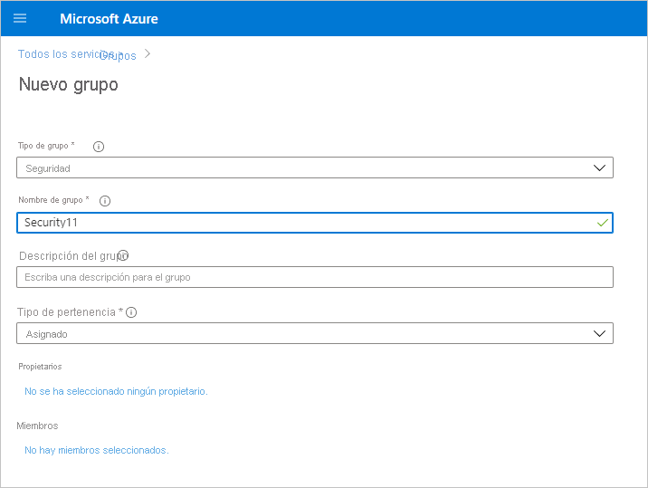
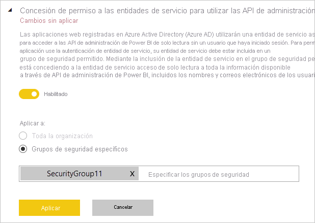

# Habilitación de la autenticación de entidad de servicio para las API de administración de solo lectura (versión preliminar)

La entidad de servicio es un método de autenticación que se puede usar para permitir que una aplicación de Azure Active Directory (Azure AD) acceda a las API y el contenido del servicio Power BI.
Al crear una aplicación de Azure AD, se crea un [objeto de entidad de servicio](/azure/active-directory/develop/app-objects-and-service-principals#service-principal-object). El objeto de entidad de servicio, también conocido como entidad de servicio, permite que Azure AD autentique la aplicación. Una vez autenticada, la aplicación puede acceder a los recursos del inquilino de Azure AD.

## Método

Para habilitar la autenticación de entidad de servicio para API de solo lectura de Power BI, siga estos pasos:

1. [Cree una aplicación de Azure AD](/azure/active-directory/develop/howto-create-service-principal-portal). Si ya tiene una aplicación de Azure AD que quiera usar, puede omitir este paso. Anote del identificador de la aplicación para los pasos posteriores. 
2. Cree un **grupo de seguridad** en Azure Active Directory. [Obtenga más información sobre cómo crear un grupo básico y agregar miembros mediante Azure Active Directory](/azure/active-directory/fundamentals/active-directory-groups-create-azure-portal). Puede omitir este paso si ya tiene un grupo de seguridad que le gustaría usar.
    Asegúrese de seleccionar **Seguridad** como el tipo de grupo.

    

3. Agregue el identificador de la aplicación como miembro del grupo de seguridad que ha creado. Para ello:
    1. Vaya a **Azure Portal > Azure Active Directory > Grupos** y elija el grupo de seguridad que ha creado en el paso 2.
    1. Seleccione **Agregar miembros**.
    Nota: Asegúrese de que la aplicación que usa no tiene roles de administrador de Power BI establecidos en Azure Portal. Para comprobarlo: 
       * Inicie sesión en **Azure Portal** como administrador global, administrador de aplicaciones o administrador de aplicaciones en la nube. 
        * Seleccione **Azure Active Directory** y después **Aplicaciones empresariales**. 
        * Seleccione la aplicación a la que quiera conceder acceso a Power BI. 
        * Seleccione **Permisos**. Asegúrese de que en esta aplicación no se ha establecido ningún permiso que necesite el consentimiento del administrador de Power BI. Vea [Administración del consentimiento a las aplicaciones y evaluación de las solicitudes de consentimiento](/azure/active-directory/manage-apps/manage-consent-requests) para obtener más información. 
4. Habilite la configuración de administración del servicio Power BI. Para hacerlo:
    1. Inicie sesión en el portal de administración de Power BI. Debe ser un administrador de Power BI para ver la página de configuración de inquilinos.
    1. En **Configuración de la API de administración**, verá **Concesión de permiso a las entidades de servicio para utilizar las API de administración de Power BI de solo lectura (versión preliminar)** . Establezca el botón de alternancia en Habilitado y, después, seleccione el botón de radio **Grupos de seguridad específicos** y agregue el grupo de seguridad que ha creado en el paso 2 en el campo de texto que aparece debajo, como se muestra en la ilustración siguiente.

        

 5. Empiece a usar las API de administración de solo lectura. Vea la lista siguiente de las API admitidas.

    >[!IMPORTANT]
    >Después de habilitar la entidad de servicio para usarla con Power BI, los permisos de Azure AD de la aplicación ya no tendrán efecto. Los permisos de la aplicación se administrarán desde el portal de administración de Power BI.

## Consideraciones y limitaciones
* No se puede iniciar sesión en el portal de Power BI con la entidad de servicio.
* Se necesitan derechos de administrador de Power BI para habilitar la entidad de servicio en la configuración de API de administración en el portal de administración de Power BI.
* La entidad de servicio admite actualmente las API siguientes:
    * [GetGroupsAsAdmin](/rest/api/power-bi/admin/groups_getgroupsasadmin) con $expand para paneles, conjuntos de datos, informes y flujos de entrada 
    * [GetDashboardsAsAdmin](/rest/api/power-bi/admin/dashboards_getdashboardsasadmin) con iconos $expand
    * [GetDatasourcesAsAdmin](/rest/api/power-bi/admin/datasets_getdatasourcesasadmin) 
    * [GetDatasetToDataflowsLinksAsAdmin](/rest/api/power-bi/admin/datasets_getdatasettodataflowslinksingroupasadmin)
    * [GetDataflowDatasourcesAsAdmin](/rest/api/power-bi/admin/dataflows_getdataflowdatasourcesasadmin) 
    * [GetDataflowUpstreamDataflowsAsAdmin](/rest/api/power-bi/admin/dataflows_getupstreamdataflowsingroupasadmin) 
    * [GetCapacitiesAsAdmin](/rest/api/power-bi/admin/getcapacitiesasadmin)
    * [GetActivityLog](/rest/api/power-bi/admin/getactivityevents)
    * [GetModifiedWorkspaces](/rest/api/power-bi/admin/workspaceinfo_getmodifiedworkspaces)
    * [WorkspaceGetInfo](/rest/api/power-bi/admin/workspaceinfo_postworkspaceinfo)
    * [WorkspaceScanStatus](/rest/api/power-bi/admin/workspaceinfo_getscanstatus)
    * [WorkspaceScanResult](/rest/api/power-bi/admin/workspaceinfo_getscanresult)