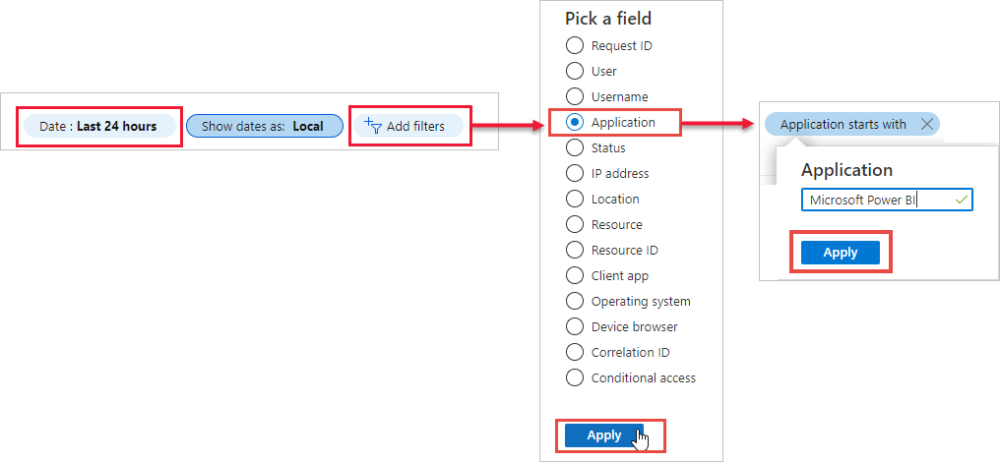

# Encontrar usuarios de Power BI que hayan iniciado sesión

Si es un administrador para la organización y quiere ver quién ha iniciado sesión en Power BI, use los [informes de acceso y uso de Azure Active Directory](/azure/active-directory/reports-monitoring/concept-sign-ins).

> [!NOTE]
> El informe de **Inicios de sesión** ofrece información útil, pero no identifica el tipo de licencia de cada usuario. Use el Centro de administración de Microsoft 365 para ver licencias.

## Requisitos

Cualquier usuario puede ver un informe de sus propios inicios de sesión. Para ver un informe de todos los usuarios, debe tener uno de los roles siguientes: Administrador global, Administrador de seguridad, Lector de seguridad, Lector global o Lector de informes.

## Uso del centro de administración de Azure Active Directory para ver los inicios de sesión

Para ver la actividad de inicio de sesión, siga estos pasos.

1. Inicie sesión en el [Centro de administración de Azure Active Directory](https://aad.portal.azure.com) y, después, seleccione **Azure Active Directory** en el menú del portal.

1. Desde el menú de recursos, seleccione **Supervisión** > **Inicios de sesión**.
   
    

1. De forma predeterminada, se muestran todos los inicios de sesión de las últimas 24 horas para todos los usuarios y todas las aplicaciones. Para seleccionar otro período de tiempo, seleccione **Fecha** en el panel de trabajo y elija entre los intervalos de tiempo disponibles. Solo está disponible la información de los últimos siete días. Para ver solo los inicios de sesión en Power BI, agregue filtros. Seleccione **Agregar filtro** > elija **Aplicación** como el campo por el que filtrar y seleccione **Aplicar**. Seleccione **Aplicación empieza con** en la parte superior del panel de trabajo y escriba el nombre de la aplicación. Seleccione **Aplicar**.

    **Microsoft Power BI** filtra por la actividad de inicio de sesión relacionada con el servicio. **Power BI Gateway** filtra por la actividad de inicio de sesión específica de la puerta de enlace de datos local.
   
    

## Exportar los datos

También se puede [descargar un informe de inicio de sesión](/azure/active-directory/reports-monitoring/quickstart-download-sign-in-report) en cualquiera de los dos formatos: un archivo CSV o un archivo JSON.

1. Desde la barra de comandos del informe **Inicios de sesión**, seleccione **Descargar** y luego una de las opciones siguientes:

   * **CSV** para descargar un archivo CSV con los datos filtrados actualmente.

   * **JSON** para descargar un archivo JSON con los datos filtrados actualmente.

2. Escriba un nombre de archivo y, después, seleccione **Descargar**.

## Retención de datos

Los datos relacionados con el inicio de sesión están disponibles durante siete días, a menos que la organización disponga de una licencia Premium de Azure AD. Si usa Azure AD Premium P1 o Azure AD Premium P2, puede ver los datos de los últimos 30 días. Para obtener más información, consulte las [directivas de retención de informes de Azure Active Directory](/azure/active-directory/reports-monitoring/reference-reports-data-retention).

## Pasos siguientes

[Auditoría de la actividad de los usuarios](service-admin-auditing.md)

¿Tiene más preguntas? [Pruebe a preguntar a la comunidad de Power BI](https://community.powerbi.com/)