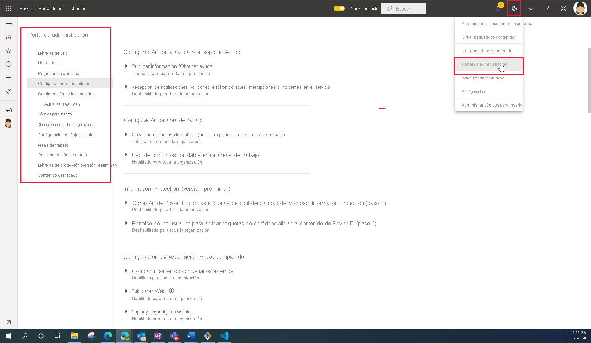

# Qué es la administración de Power BI

La administración de Power BI es la administración de la configuración de toda la organización que controla cómo funciona Power BI. Los usuarios asignados a roles de administrador configuran, supervisan y aprovisionan los recursos de la organización. En este artículo se ofrece información general sobre los roles, las tareas y las herramientas de administración para ayudarle a empezar a trabajar.

## Roles de administrador relacionados con Power BI

Hay varios roles que trabajan de forma conjunta para administrar Power BI en la organización. La mayoría de los roles de administrador se asignan en el Centro de administración de Microsoft 365 o mediante PowerShell. Los roles de administrador de Capacidad de Power BI Premium y Capacidad de Power BI Embedded se asignan cuando se crea la capacidad. Para obtener más información sobre cada uno de los roles de administrador, vea [Acerca de los roles de administrador](https://docs.microsoft.com/microsoft-365/admin/add-users/about-admin-roles?view=o365-worldwide). Para obtener información sobre cómo asignar roles de administrador, vea [Asignación de roles de administrador](https://docs.microsoft.com/microsoft-365/admin/add-users/assign-admin-roles?view=o365-worldwide).

| **Tipo de administrador** | **Ámbito administrativo** | **Tareas de Power BI** |
| --- | --- | --- |
| Administradores globales | Microsoft 365 | Tiene acceso ilimitado a todas las características de administración de la organización |
| | | Asigna roles a otros usuarios |
| Administrador de facturación | Microsoft 365 | Administrar suscripciones |
| | | Comprar licencias |
| Administrador de licencias | Microsoft 365 | Asignar o eliminar licencias para los usuarios |
| Administrador de usuarios | Microsoft 365 | Crear y administrar usuarios y grupos |
| | | Restablecer las contraseñas de los usuarios |
| Administrador de Power BI | Servicio Power BI | Acceso completo a las tareas de administración de Power BI|
| | | Habilitar y deshabilitar características de Power BI |
| | | Informar del uso y del rendimiento |
| | | Revisar y administrar la auditoría |
| Administrador de Capacidad de Power BI Premium | Una única capacidad Premium | Asignar áreas de trabajo a la capacidad|
| | | Administrar permisos de usuario para la capacidad |
| | | Administrar cargas de trabajo para configurar el uso de memoria |
| | | Reiniciar la capacidad |
| Administrador de capacidad de Power BI Embedded | Una única capacidad de Embedded | Asignar áreas de trabajo a la capacidad|
| | | Administrar permisos de usuario para la capacidad |
| | | Administrar cargas de trabajo para configurar el uso de memoria |
| | | Reiniciar la capacidad |

## Tareas y herramientas administrativas

Los administradores de Power BI trabajan principalmente en el portal de administración de Power BI. Pero debe estar familiarizado con las herramientas y centros de administración relacionados. Consulte la tabla anterior para determinar qué rol es necesario para realizar tareas mediante las herramientas que se enumeran aquí.

| **Herramienta** | **Tareas habituales** |
| --- | --- |
| [Portal de administración de Power BI](https://app.powerbi.com/admin-portal) | Adquirir capacidad Premium y trabajar con ella |
| | Garantizar la calidad del servicio |
| | Administrar áreas de trabajo |
| | Publicación de objetos visuales de Power BI |
| | Verificar los códigos utilizados para insertar Power BI en otras aplicaciones |
| | Solucionar problemas de acceso a datos y otros problemas |
| [Centro de administración de Microsoft 365](https://admin.microsoft.com) | Administración de usuarios y grupos |
| | Comprar y asignar licencias |
| | Bloquear el acceso de los usuarios a Power BI |
| [Centro de seguridad y cumplimiento de Microsoft 365](https://protection.office.com) | Revisar y administrar la auditoría |
| | Seguimiento y clasificación de datos |
| | Directivas de prevención de pérdida de datos |
| | Gobernanza de la información |
| [Azure Active Directory (AAD) en Azure Portal](https://aad.portal.azure.com) | Configurar el acceso condicional a los recursos de Power BI |
| | Aprovisionar capacidad de Power BI Embedded |
| [Cmdlets de PowerShell](https://docs.microsoft.com/powershell/power-bi/overview) | Administrar áreas de trabajo y otros aspectos de Power BI mediante scripts |
| [SDK y API administrativas](service-admin-reference.md) | Cree herramientas de administración personalizadas. Por ejemplo, Power BI Desktop puede usar estas API para crear informes basados en datos relacionados con la administración. |

## Pasos siguientes

Ahora que conoce los aspectos básicos relacionados con la administración de Power BI, consulte estos artículos para obtener más información:

- [Uso del portal de administración de Power BI](service-admin-portal.md)
- [Guía para la configuración de la administración de inquilinos](../guidance/admin-tenant-settings.md)
- [Uso de cmdlets de PowerShell](https://docs.microsoft.com/powershell/power-bi/overview)
- [Preguntas frecuentes sobre la administración de Power BI](service-admin-faq.md)
- [Licencias del servicio Power BI para los usuarios de la organización](service-admin-licensing-organization.md)
- ¿Tiene alguna pregunta? [Pruebe a preguntar a la comunidad de Power BI](https://community.powerbi.com/)
- ¿Sugerencias? [Ideas para contribuir a mejorar Power BI](https://ideas.powerbi.com/)
