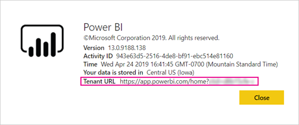

# Distribuir contenido de Power BI a usuarios externos invitados con Azure AD B2B

Power BI permite compartir contenido con usuarios invitados externos a través de Azure Active Directory Negocio a negocio (Azure AD B2B). Al usar Azure AD B2B, la organización permite y controla el uso compartido de contenido con usuarios externos en una ubicación central. De forma predeterminada, la experiencia de los invitados externos es exclusivamente de consumo. Además, puede permitir que usuarios invitados de fuera de la organización editen y administren contenido dentro de la organización.

En este artículo se proporciona una introducción básica a Azure AD B2B en Power BI. Para obtener más información, vea [Distribuir contenido de Power BI a usuarios externos invitados mediante Azure Active Directory B2B](../guidance/whitepaper-azure-b2b-power-bi.md).

## Habilitar acceso

Asegúrese de habilitar la característica [Compartir contenido con usuarios externos](service-admin-portal.md#export-and-sharing-settings) en el portal de administración de Power BI antes de invitar a usuarios invitados. Incluso cuando esta opción está habilitada, el usuario debe tener el rol de invitador de usuarios invitados en Azure Active Directory para invitar a los usuarios invitados.

La opción [Permitir a los usuarios externos editar y administrar el contenido de la organización](service-admin-portal.md#allow-external-guest-users-to-edit-and-manage-content-in-the-organization) permite conferir a los usuarios la capacidad de ver y crear contenido en áreas de trabajo, incluso examinar la instancia de Power BI de la organización.

> [!NOTE]
> La opción [Compartir contenido con usuarios externos](service-admin-portal.md#export-and-sharing-settings) controla si Power BI permite invitar a usuarios externos a la organización. Una vez que un usuario externo acepta la invitación, se convierte en un usuario invitado de Azure AD B2B de la organización. Estos usuarios aparecen en los selectores de usuarios de la experiencia Power BI. Si esta opción está deshabilitada, los usuarios invitados existentes en la organización continúan teniendo acceso a todos los elementos a los que ya tenían acceso y siguen apareciendo en las experiencias del selector de personas. Además, si se agregan invitados mediante el método de [invitación planeada](#planned-invites), estos también aparecerán en los selectores de personas. Para impedir que los usuarios invitados accedan a Power BI, use una directiva de acceso condicional de Azure AD.

## ¿A quién puede invitar?

La mayoría de las direcciones de correo electrónico se admiten para las invitaciones de usuarios invitados, incluidas las cuentas de correo electrónico personales, como gmail.com, outlook.com y hotmail.com. En Azure AD B2B, estas direcciones se denominan *identidades sociales*.

No puede invitar a usuarios que estén asociados a una nube de administración pública, como [Power BI para la Administración Pública de Estados Unidos](service-govus-overview.md).

## Invitar a usuarios externos

Los usuarios invitados solo requieren invitaciones la primera vez que los invite a su organización. Para invitar a usuarios, use invitaciones planeadas o ad hoc.

Para usar invitaciones ad hoc, use las siguientes capacidades:

* Uso compartido de paneles e informes
* Lista de acceso de aplicaciones

En las listas de acceso de área de trabajo no se admiten las invitaciones ad hoc. Use el método de [invitación planeada](#planned-invites) para agregar estos usuarios a la organización. Una vez que el usuario externo se convierta en un invitado en la organización, agréguelo a la lista de acceso de área de trabajo.

### Invitaciones planeadas

Use una invitación planeada si sabe a qué usuarios desea invitar. En Azure Portal o PowerShell se pueden enviar invitaciones. Para invitar a personas, debe tener asignado el rol de administrador de usuarios.

Siga estos pasos para enviar una invitación en Azure Portal.

1. En [Azure Portal](https://portal.azure.com), seleccione **Azure Active Directory**.

1. En **Administrar**, seleccione **Usuarios** > **Todos los usuarios** > **Nuevo usuario invitado**.

    

1. Escriba una **dirección de correo electrónico** y un **mensaje personal**.

    

1. Seleccione **Invitar**.

Para invitar a más de un usuario invitado, use PowerShell o cree una invitación en bloque en Azure AD. Para usar PowerShell para la invitación en bloque, siga los pasos descritos en [Tutorial: Uso de PowerShell para invitar en bloque a usuarios de colaboración de Azure AD B2B](/azure/active-directory/b2b/bulk-invite-powershell/). Para usar Azure Portal para la invitación en bloque, siga los pasos descritos en [Tutorial: Invitación en masa a usuarios de colaboración de Azure AD B2B](/azure/active-directory/b2b/tutorial-bulk-invite/).

El usuario invitado debe seleccionar **Empezar** en la invitación de correo electrónico que reciba. A continuación, se agregará al usuario invitado a la organización.

### Invitaciones ad hoc

Para invitar a un usuario externo en cualquier momento, agréguelo al panel o informe mediante la característica de uso compartido o a la aplicación a través de la página de acceso. A continuación se muestra un ejemplo de lo que debe hacer al invitar a un usuario externo para que use una aplicación.

El usuario invitado recibe un correo electrónico que indica que ha compartido la aplicación con él.

El usuario invitado debe iniciar sesión con su dirección de correo electrónico de la organización. Recibirá una solicitud para que acepte la invitación después de iniciar sesión. Tras iniciar sesión, la aplicación se abre para el usuario invitado. Para volver a la aplicación, dicho usuario deberá marcar el vínculo como favorito o guardar el correo electrónico.

## Licencias

El usuario invitado debe tener la licencia adecuada en vigor para ver el contenido compartido. Existen tres opciones para asegurarse de que el usuario tiene una licencia adecuada: usar Power BI Premium, asignar una licencia de Power BI Pro o utilizar la licencia de Power BI Pro de invitado.

[Los usuarios invitados que pueden editar y administrar contenido en la organización](service-admin-portal.md#allow-external-guest-users-to-edit-and-manage-content-in-the-organization) necesitan una licencia Power BI Pro para aportar contenido a las áreas de trabajo o para compartir contenido con otros usuarios.

### Usar Power BI Premium

La asignación del área de trabajo a una [capacidad Power BI Premium](service-premium-what-is.md) permite al usuario invitado usar la aplicación sin necesidad de una licencia de Power BI Pro. Power BI Premium también permite que las aplicaciones aprovechen las ventajas de otras funcionalidades como una mayor frecuencia de actualización y tamaños de modelo grandes.

### Asignar una licencia de Power BI Pro a un usuario invitado

La asignación de una licencia de Power BI Pro de su organización a un usuario invitado permite a dicho usuario ver el contenido que se ha compartido con él. Para obtener más información sobre la asignación de licencias, vea [Asignación de licencias a usuarios en la página Licencias](/office365/admin/manage/assign-licenses-to-users#assign-licenses-to-users-on-the-licenses-page). Antes de asignar licencias de Pro a usuarios invitados, consulte el [sitio de términos del producto](https://www.microsoft.com/licensing/terms) para asegurarse de que cumple con los términos del contrato de licencia con Microsoft.

### El usuario invitado aporta su propia licencia de Power BI Pro

Es posible que el usuario invitado ya tenga una licencia de Power BI Pro que se le haya asignado en su propia organización.

## Usuarios invitados que pueden editar y administrar contenido

Cuando se usa la opción [Permitir a los usuarios externos editar y administrar el contenido de la organización](service-admin-portal.md#allow-external-guest-users-to-edit-and-manage-content-in-the-organization), los usuarios invitados especificados obtienen más acceso a la instancia de Power BI de la organización. Así, podrán ver cualquier contenido para el que tengan permiso, acceder a Inicio, examinar áreas de trabajo, instalar aplicaciones, ver dónde se encuentran en la lista de acceso y aportar contenido a áreas de trabajo. Pueden crear o administrar áreas de trabajo que usen la nueva experiencia de área de trabajo. Existen algunas limitaciones. En la sección Consideraciones y limitaciones se muestran esas restricciones.

Para ayudar a los usuarios invitados a iniciar sesión en Power BI, proporcióneles la dirección URL de inquilino. Para buscar la dirección URL del inquilino, siga estos pasos.

1. En el servicio Power BI, en el menú de encabezado, seleccione Ayuda ( **?** ) y, a continuación, **Acerca de Power BI**.

2. Vea el valor junto a **URL de inquilino**. Comparta la dirección URL de inquilino con los usuarios invitados permitidos.

    

## Consideraciones y limitaciones

* De forma predeterminada, Azure AD B2B solo permite a los invitados externos usar el contenido. Los invitados de Azure AD B2B externos pueden ver aplicaciones, paneles, informes, exportar los datos y crear suscripciones de correo electrónico para los paneles e informes. No pueden acceder a áreas de trabajo ni publicar su propio contenido. Para quitar estas restricciones, puede usar la característica [Permitir a los usuarios externos editar y administrar el contenido de la organización](service-admin-portal.md#allow-external-guest-users-to-edit-and-manage-content-in-the-organization).

* Para invitar a usuarios externos, se necesita una licencia de Power BI Pro. Los usuarios de la versión de evaluación de Pro no pueden invitar a usuarios externos a Power BI.

* Algunas experiencias no están disponibles para los [usuarios invitados que pueden editar y administrar contenido de la organización](service-admin-portal.md#allow-external-guest-users-to-edit-and-manage-content-in-the-organization). Para actualizar o publicar informes, los usuarios invitados necesitan usar el servicio Power BI, incluido Obtener datos para cargar archivos de Power BI Desktop.  Las siguientes experiencias no se admiten:
  * Publicación directa desde Power BI Desktop en el servicio Power BI
  * Los usuarios invitados no pueden usar Power BI Desktop para conectarse a conjuntos de datos de servicio en el servicio Power BI.
  * Áreas de trabajo clásicas asociadas a Grupos de Microsoft 365
    * Los usuarios invitados no pueden crear ni administrar estas áreas de trabajo.
    * Los usuarios invitados pueden ser miembros.
  * No se admite el envío de invitaciones ad hoc para listas de acceso al área de trabajo.
  * Power BI Publisher para Excel no se admite para usuarios invitados.
  * Los usuarios invitados no pueden instalar Power BI Gateway ni conectarlo a la organización.
  * Los usuarios invitados no pueden instalar la publicación de aplicaciones para toda la organización.
  * Los usuarios invitados no pueden usar, crear, actualizar ni instalar paquetes de contenido de organización.
  * Los usuarios invitados no pueden usar Analizar en Excel.
  * Los usuarios invitados no pueden ser @mentioned en comentarios.
  * Los usuarios invitados no pueden usar suscripciones.
  * Los usuarios invitados que usen esta funcionalidad deben tener una cuenta profesional o educativa.

* Los usuarios invitados que usan identidades sociales tienen más limitaciones debido a las restricciones de inicio de sesión.
  * Pueden usar las experiencias de consumo del servicio Power BI a través de un explorador web.
  * No pueden usar las aplicaciones de Power BI Mobile.
  * No pueden iniciar sesión si se necesita una cuenta profesional o educativa.

* Esta característica no está disponible actualmente en el componente web de los informes de SharePoint Online de Power BI.

* Hay configuraciones de Azure Active Directory que pueden limitar lo que los usuarios invitados externos pueden hacer dentro de toda la organización. Dichas configuraciones también se aplican al entorno de Power BI. En la siguiente documentación se tratan las opciones:
  * [Administrar la configuración de colaboración externa](/azure/active-directory/b2b/delegate-invitations#configure-b2b-external-collaboration-settings)
  * [Permitir o bloquear invitaciones a los usuarios de B2B de organizaciones específicas](/azure/active-directory/b2b/allow-deny-list)
  * [Uso del acceso condicional para permitir o bloquear el acceso](/azure/active-directory/conditional-access/concept-conditional-access-cloud-apps)

* Puede compartir contenido desde una nube de administración pública, como GCC, con un usuario externo de una nube comercial. Sin embargo, el usuario invitado no puede usar su propia licencia. El contenido debe tener la capacidad Premium asignada para permitir el acceso. O bien, puede asignar una licencia de Power BI Pro a la cuenta de invitado.

* No se admite el uso compartido fuera de su organización para las nubes nacionales, como las instancias de la nube de Alemania o China. En su lugar, cree cuentas de usuario en la organización que los usuarios externos puedan usar para acceder al contenido.

* Si comparte contenido directamente con un usuario invitado, Power BI enviará a ese usuario un correo electrónico con el vínculo. Si prefiere que no se envíe un correo electrónico, agregue al usuario invitado a un grupo de seguridad y comparta el contenido con ese grupo de seguridad.  

## Pasos siguientes

Para obtener más información, incluida la referida a cómo funciona la seguridad en el nivel de fila, consulte las notas del producto: [Distribuir contenido de Power BI a usuarios externos invitados con Azure AD B2B](../guidance/whitepaper-azure-b2b-power-bi.md).

Para obtener información sobre Azure AD B2B, consulte [¿Qué es el acceso de usuarios invitados en Azure Active Directory B2B?](/azure/active-directory/active-directory-b2b-what-is-azure-ad-b2b/)