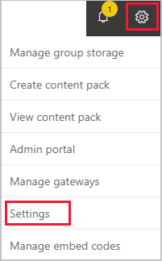
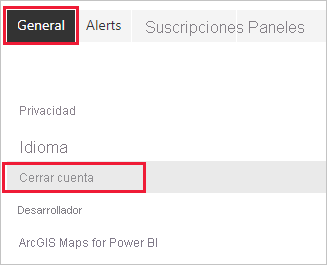

# Cerrar la cuenta de Power BI

Si ya no desea usar Power BI, puede cerrar su cuenta de esta solución.  Después de cerrar su cuenta, no puede iniciar sesión en Power BI. Además, tal como se indica en la directiva de retención de datos en el [Acuerdo de servicio de Power BI](https://azure.microsoft.com/support/legal/subscription-agreement/), Power BI elimina todos los datos de cliente que haya cargado o creado.

## Usuarios individuales de Power BI

Si se registró en Power BI como usuario individual, puede cerrar la cuenta en la pantalla **Configuración**.

1. En Power BI, seleccione el icono de engranaje en la esquina superior derecha y luego seleccione **Configuración**.

    

1. En la pestaña **General**, seleccione **Cerrar cuenta**.

    

1. Seleccione un motivo para cerrar la cuenta (1). También puede proporcionar más información (2). Luego, seleccione **Cerrar cuenta**.

    

1. Confirme que desea cerrar su cuenta.

    

    Debe aparecer una confirmación de que Power BI cerró la cuenta. Puede volver a abrir su cuenta desde aquí si es necesario.

    

## Usuarios administrados

Si su organización lo registró en Power BI, póngase en contacto con el administrador. Pídale que anule la asignación de la licencia de la cuenta.

¿Tiene más preguntas? [Pruebe a preguntar a la comunidad de Power BI](https://community.powerbi.com/)