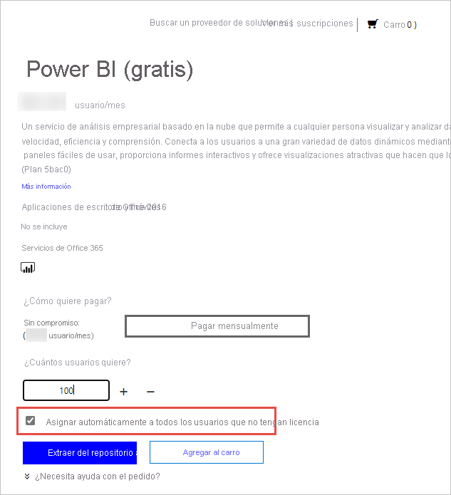

# Licencias del servicio Power BI para los usuarios de la organización

Lo que un usuario puede hacer en el servicio Power BI depende del tipo de licencia por usuario que tenga. El nivel de acceso que les proporciona la licencia depende de si el área de trabajo a la que se tiene acceso se asigna a una capacidad Power BI Premium. Todos los usuarios del servicio Power BI deben tener una licencia.

Hay dos maneras para que los usuarios obtengan una licencia. Con las funcionalidades de registro de autoservicio y su cuenta profesional o educativa, los usuarios pueden obtener su propia licencia gratuita o Pro. O bien, los administradores pueden obtener una suscripción de Power BI y asignar licencias a los usuarios.

Este artículo se centra en la compra de servicios y licencias por usuario desde una perspectiva de administrador. Para obtener más información sobre cómo los usuarios pueden obtener su propia licencia, consulte el artículo [Registro en Power BI como usuario individual](../fundamentals/service-self-service-signup-for-power-bi.md).

## ¿Quién puede comprar y asignar licencias?

Debe tener asignado un rol de administrador para poder comprar o asignar licencias para su organización. Los roles de administrador se asignan mediante el centro de administración de Azure Active Directory o de Microsoft 365. En la tabla siguiente se muestra qué rol es necesario para realizar tareas relacionadas con la adquisición y la concesión de licencias. Para obtener más información sobre los roles de administrador en Azure Active Directory, consulte [Visualización y asignación de roles de administrador en Azure Active Directory](/azure/active-directory/users-groups-roles/directory-manage-roles-portal). Si lo que quiere es obtener información sobre los roles de administrador en Microsoft 365, incluidos los procedimientos recomendados, vea el artículo [Acerca de los roles de administrador](/microsoft-365/admin/add-users/about-admin-roles?view=o365-worldwide).

| ¿Quién puede adquirir servicios y licencias? | ¿Quién puede administrar licencias de usuario? |
| --------------- | --------------- |
| Administrador de facturación | Administrador de licencias |
| Administrador global | Administrador de usuarios |
|  | Administrador global |

Estos roles administran la organización. Para obtener información sobre los roles de administrador del servicio Power BI, consulte [Descripción de los roles de administrador del servicio Power BI](service-admin-role.md).

## Obtención de Power BI para su organización

Para información sobre los precios, vea [Comparación de productos y precios](https://powerbi.microsoft.com/pricing/).

Un administrador global o un administrador de facturación puede suscribirse al servicio Power BI y comprar licencias para los usuarios de su organización. Si no está preparado para realizar la compra, seleccione la evaluación de Power BI Pro. Obtendrá 25 licencias que podrá usar durante un mes. Para obtener instrucciones paso a paso sobre cómo suscribirse, consulte cómo [obtener una suscripción de Power BI para su organización](service-admin-org-subscription.md).

## Acerca del registro de autoservicio

Los usuarios individuales pueden obtener sus propias licencias de Power BI registrándose con su cuenta profesional o educativa. Con una licencia gratuita, los usuarios pueden explorar Power BI para analizar y visualizar datos personales desde la sección Mi área de trabajo, pero no pueden compartirlos con otros usuarios. Se requiere una licencia de Power BI Pro para compartir contenido. Los usuarios pueden actualizar su tipo de licencia a Pro, o registrarse directamente en Pro, si su organización usa la nube comercial. La compra directa o la actualización a Pro no está disponible para organizaciones educativas ni para organizaciones implementadas en nubes de Azure Government, Azure Alemania o Azure China 21Vianet.

Si no quiere que los usuarios de la organización usen el registro de autoservicio, consulte el artículo [Activación o desactivación del registro de autoservicio](service-admin-disable-self-service.md) para obtener información sobre cómo desactivarlo.

Al desactivar el registro de autoservicio, los usuarios no pueden explorar Power BI para la visualización y el análisis de datos. Si bloquea el registro individual, puede que desee obtener licencias de Power BI (gratis) para su organización y asignarlas a todos los usuarios. Siga estos pasos para asignar automáticamente una licencia de Power BI (gratis) a todos los usuarios existentes:

1. Inicie sesión en el [centro de administración de Microsoft 365](https://admin.microsoft.com) con las credenciales de administrador global o administrador de facturación.
1. En el menú de la barra lateral izquierda, seleccione **Facturación** > **Servicios de compra**.
1. Busque o desplácese para buscar la oferta de Power BI (gratis). Seleccione la oferta y, a continuación, seleccione **Obtener ahora**.
1. Escriba el número de licencias necesarias para cubrir a todos los usuarios.
1. Seleccione **Automatically assign to all of your users with no licenses** (Asignar automáticamente a todos los usuarios sin licencia) y, después, eche un vistazo.

  

Si quiere ver qué usuarios de su organización puede que ya dispongan de una licencia, consulte el artículo sobre cómo [ver y administrar licencias de usuario](service-admin-manage-licenses.md).

## Tipos de licencia y funcionalidades

Hay dos tipos de licencias de Power BI por usuario: gratuita y Pro. El tipo de licencia que necesita un usuario depende de dónde almacene el contenido y de cómo interactuará con ese contenido. El lugar donde se puede almacenar el contenido viene determinado por el [tipo de suscripción](#subscription-types) de su organización.

El tipo de suscripción [Power BI Premium](service-admin-premium-purchase.md) permite a los usuarios con una licencia gratuita actuar en el contenido de las áreas de trabajo que se asignan a la capacidad Premium. Fuera de la capacidad Premium, un usuario con licencia gratuita solo puede usar el servicio Power BI para conectarse a los datos y crear informes y paneles en **Mi área de trabajo**. No puede compartir contenido con otros usuarios ni publicar contenido en otras áreas de trabajo. Para más información sobre los tipos de área de trabajo, consulte [Tipos de áreas de trabajo](../consumer/end-user-workspaces.md#types-of-workspaces).

Las suscripciones estándar de Power BI usan una capacidad compartida. Si el contenido se almacena en una capacidad compartida, los usuarios a los que se les asigna una licencia de Power BI Pro solo pueden colaborar con otros usuarios de Power BI Pro. Pueden consumir contenido compartido por otros usuarios, publicar contenido en áreas de trabajo de las aplicaciones, compartir paneles y suscribirse a paneles e informes.  Cuando las áreas de trabajo están en una capacidad Premium, los usuarios de Pro pueden distribuir contenido a usuarios que no tienen una licencia de Power BI Pro.

En la tabla siguiente se resumen las funcionalidades básicas de cada tipo de licencia. Para obtener un desglose detallado de la disponibilidad de características según el tipo de licencia, consulte el artículo [Características del servicio Power BI por tipo de licencia](../fundamentals/service-features-license-type.md).

| Tipo de licencia | Funcionalidades cuando el área de trabajo está en capacidad compartida | Funcionalidades adicionales cuando el área de trabajo está en una capacidad Premium |
| --------- | ----------- | ----------- |
| Power BI (gratis) | Acceso al contenido de Mi área de trabajo | Consumo de contenido compartido con ellos |
| Power BI Pro | Publicación de contenido en otras áreas de trabajo, uso compartido paneles, suscripción a paneles e informes y uso compartido de contenido con usuarios que tienen una licencia Pro | Distribución de contenido a usuarios con licencias gratuitas |

## Tipos de suscripción

Todas las suscripciones de licencias comerciales de Microsoft para usuarios se basan en identidades de Azure Active Directory. Para usar el servicio Power BI, debe iniciar sesión con una identidad que Azure Active Directory admita para obtener licencias comerciales. Puede agregar una suscripción de Power BI a cualquier suscripción de Microsoft que use Azure Active Directory para servicios de identidad. Algunas suscripciones, como Office 365 E5, incluyen una licencia de Power BI Pro, por lo que no se necesita ningún registro independiente para Power BI.

Hay dos tipos de suscripciones Power BI para las organizaciones: Estándar y Premium.

Con una suscripción estándar de autoservicio a Power BI Pro, los administradores asignan licencias por usuario. Hay una cuota mensual por usuario para licencias de Power BI Pro. Este tipo de licencia permite la colaboración, la publicación, el uso compartido y el análisis ad hoc. El contenido se guarda en una capacidad de almacenamiento compartido totalmente administrada por Microsoft.

Una suscripción de Power BI Premium asigna capacidad dedicada a una organización. Las licencias Premium proporcionan controles avanzados de administración e implementación, muy adecuados para BI empresarial, el análisis de macrodatos y la creación de informes locales y en la nube. Los administradores de capacidad de la organización se encargan de administrar los recursos dedicados de almacenamiento y de proceso. Este entorno dedicado tiene un costo mensual. Además de otras ventajas, los usuarios que no tienen licencias de Power BI Pro pueden acceder al contenido almacenado en una capacidad Premium y distribuirlo. Al menos un usuario debe tener una licencia de Power BI Pro asignada para usar Premium, y los creadores del contenido y los desarrolladores siguen necesitando una licencia de Power BI Pro.

Los dos tipos de suscripciones no son mutuamente excluyentes. Puede tener Power BI Premium y Power BI Pro. En esta configuración, el contenido almacenado en la capacidad Premium se puede compartir con todos los usuarios, y la capacidad compartida también está disponible. Para obtener información acerca de los límites de capacidad, consulte el artículo [Administración del almacenamiento de datos en las áreas de trabajo de Power BI](service-admin-manage-your-data-storage-in-power-bi.md).

Para comparar las características y los precios de los productos, vea [Precios de Power BI](https://powerbi.microsoft.com/pricing).

## Acceso de usuarios invitados

Es posible que quiera distribuir contenido a usuarios de fuera de la organización. Es posible compartir contenido con usuarios externos invitándolos a ver el contenido como invitados. Azure AD B2B (Azure Active Directory de negocio a negocio) permite compartir contenido con usuarios invitados externos. Para poder compartir contenido con usuarios externos, se deben cumplir los siguientes requisitos previos:

- La capacidad de compartir contenido con usuarios externos debe estar habilitada.

- El usuario invitado debe tener la licencia adecuada para ver el contenido compartido.

Para obtener más información sobre el acceso de usuarios invitados, consulte [Distribuir contenido de Power BI a usuarios externos invitados con Azure AD B2B](service-admin-azure-ad-b2b.md).

## Adquisición de licencias de Power BI Pro

Como administrador, puede adquirir licencias de Power BI Pro mediante Microsoft 365 o a través de un partner de Microsoft. Después de comprar las licencias, deberá asignarlas a usuarios individuales. Para obtener más información, vea [Adquirir y asignar licencias de Power BI Pro](service-admin-purchasing-power-bi-pro.md).

### Expiración de la licencia de Power BI Pro

Hay un período de gracia después de que expire una licencia de Power BI Pro. Las licencias que forman parte de una compra de licencia por volumen disponen de un período de gracia de 90 días. Si compró la licencia directamente, el período de gracia es de 30 días.

Power BI Pro tiene el mismo ciclo de vida de suscripción que Microsoft 365. Para más información, consulte [¿Qué pasa con mis datos y mi acceso cuando termina mi suscripción de Microsoft 365 para empresas?](/microsoft-365/commerce/subscriptions/what-if-my-subscription-expires)

## Pasos siguientes

- [Adquirir y asignar licencias de Power BI Pro](service-admin-purchasing-power-bi-pro.md)
- [Suscripciones de empresa y documentación de facturación](/microsoft-365/commerce/?view=o365-worldwide)
- [Find Power BI users that have signed in](service-admin-access-usage.md) (Búsqueda de usuarios de Power BI que hayan iniciado sesión)
- ¿Tiene más preguntas? [Pruebe a preguntar a la comunidad de Power BI](https://community.powerbi.com/)