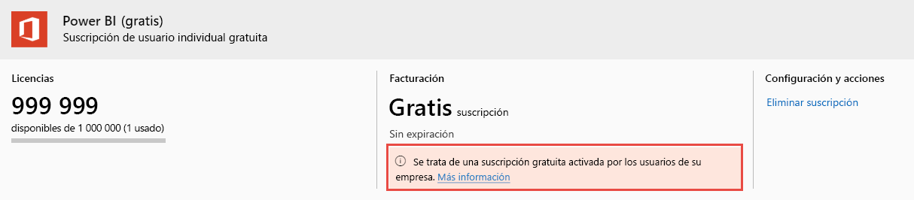

# Visualización y administración de licencias de usuario de Power BI

En este artículo se explica cómo los administradores pueden usar el Centro de administración de Microsoft 365 o Azure Portal para ver y administrar licencias de usuario para el servicio Power BI.

> [!NOTE]
>
>Es posible que un usuario tenga asignada una licencia de Power BI (gratis) y Power BI Pro al mismo tiempo. Esto puede ocurrir cuando un usuario se suscribe a una licencia gratuita y, después, se le asigna una licencia de Power BI Pro. En este caso, se aplica el nivel de licencia más alto.
>

## Visualizar las suscripciones

Para ver las suscripciones de Power BI de las que dispone su organización, siga estos pasos.

1. Inicie sesión en el [Centro de administración de Microsoft 365](https://admin.microsoft.com).
2. En el menú de navegación, seleccione **Facturación** > **Productos y servicios**.

Las suscripciones de Power BI activas se muestran junto con cualquier otra suscripción que tenga. Es posible que vea una suscripción inesperada para Power BI (gratis), como se muestra aquí.

  

Este tipo de suscripción se crea automáticamente cuando los usuarios aprovechan el registro de autoservicio. Para obtener más información, consulte [Power BI en su organización](/microsoft-365/admin/misc/power-bi-in-your-organization?view=o365-worldwide).

## Administración de licencias de usuario en Microsoft 365

Para usar el Centro de administración de Microsoft 365 para administrar licencias de usuario, consulte las [suscripciones de empresa y la documentación de facturación](/microsoft-365/commerce/?view=o365-worldwide).

## Administración de licencias de usuario en Azure Portal

Siga estos pasos para ver y asignar licencias de Power BI mediante Azure Portal.

1. Inicie sesión en [Azure Portal](https://portal.azure.com).

2. Busque y seleccione **Azure Active Directory**.

3. En **Administrar**, en el menú de recursos Azure Active Directory, seleccione **Licencias**.

4. Seleccione **Todos los productos** en el menú de recursos y, después, seleccione un tipo de licencia de Power BI para ver la lista de usuarios con licencia.

5. Para asignar una licencia, en la barra de comandos, seleccione **+ Asignar**. En la página **Asignar licencia**, elija un usuario y seleccione **Opciones de asignación** para activar una licencia de Power BI para la cuenta de usuario seleccionada.

6. Para eliminar una licencia, seleccione la casilla de verificación junto al nombre del usuario y, después, seleccione **Eliminar licencia**.

## Pasos siguientes

- [Comprar Power BI Pro](service-admin-purchasing-power-bi-pro.md)
- [Licencias para la organización](service-admin-licensing-organization.md)