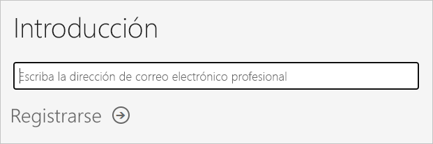
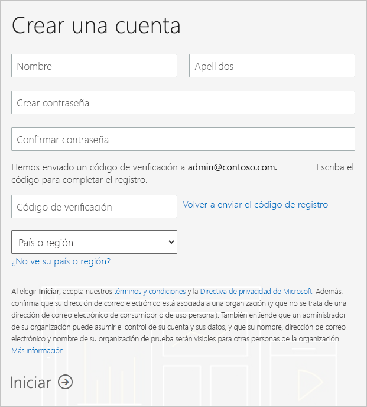
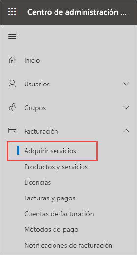
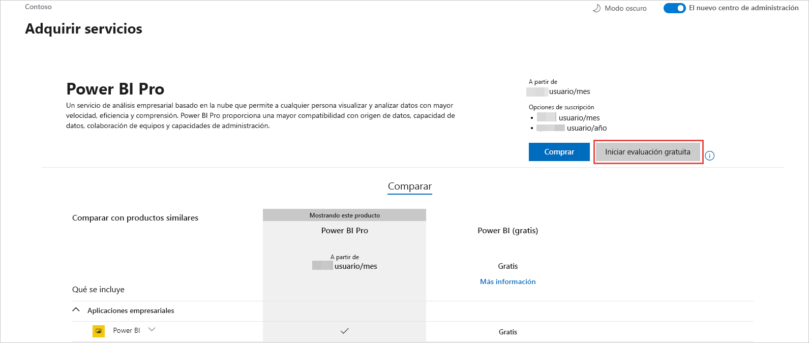

# Obtención de una suscripción de Power BI para la organización

Como administrador, puede registrarse en Power BI a través del [sitio web de Power BI](https://powerbi.microsoft.com). También puede hacerlo a través de la página de servicios de compra en el Centro de administración de Microsoft 365. Cuando un administrador se registre en Power BI, puede asignar licencias de usuario a usuarios que deben tener acceso.

Además, los usuarios individuales de la organización pueden registrarse Power BI a través del sitio web de Power BI. Cuando un usuario de la organización se suscribe a Power BI, a ese usuario se le asigna automáticamente una licencia de Power BI. Si quiere desactivar esta funcionalidad, siga los pasos descritos en [Activación o desactivación del registro y la compra de autoservicio](service-admin-disable-self-service.md).

## Registro a través de Power BI

Necesitará una cuenta profesional o educativa para registrarse y obtener una suscripción de Power BI. No se admiten direcciones de correo electrónico de proveedores de telecomunicaciones ni servicios de correo electrónico de consumidor.

Siga estos pasos para registrarse:

1. Vaya al [sitio web de Power BI](https://powerbi.microsoft.com). Seleccione **Probar gratis**.
2. Escriba su dirección de correo electrónico del trabajo y seleccione **Suscribirse**.

   

3. Verifique su identidad. Recibirá una llamada o un mensaje de texto con un código de verificación.
4. Seleccione **Sí** para confirmar que está usando una dirección de correo electrónico de su empresa.
5. Cree su cuenta. Enviamos un código de verificación a su dirección de correo electrónico para completar la suscripción.

   

## Registro a través de Microsoft 365

Si es administrador global de Microsoft 365 o administrador de facturación, puede obtener una suscripción Power BI para su organización. Vea [¿Quién puede adquirir y asignar licencias?](../service-admin-licensing-organization.md#who-can-purchase-and-assign-licenses) para obtener más información.

> [!NOTE]
>
> Una suscripción a Microsoft 365 E5 ya incluye licencias de Power BI Pro. Para obtener información sobre cómo administrar licencias, consulte [Visualización y administración de licencias de usuario](service-admin-manage-licenses.md).
>
>

Siga estos pasos para comprar licencias de Power BI Pro en el Centro de administración de Microsoft 365:

1. Inicie sesión en el [Centro de administración de Microsoft 365](https://admin.microsoft.com).

2. En el menú de navegación, seleccione **Facturación** > **Servicios de compra**.
  
   

3. Busque la suscripción que desea comprar. Encontrará **Power BI** en **Other categories that might interest you** (Otras categorías que pueden interesarle) cerca de la parte inferior de la página. Seleccione el vínculo para ver las suscripciones de Power BI disponibles para su organización.

4. Seleccione una oferta, como Power BI Pro.

5. En la página **Servicios de compra**, seleccione **Comprar**. Si no lo ha usado previamente, puede iniciar una suscripción de prueba gratuita de Power BI Pro. Incluye 25 licencias y expira en un mes.

   

6. Elija **Pagar mensualmente** o **Pagar un año completo**, según cómo desee pagar.

7. En **How many users do you want?** (¿Cuántos usuarios quiere?), escriba el número de licencias que quiere comprar y seleccione **Check out now** (Comprar ahora) para completar la transacción.

8. Para comprobar la compra, vaya a **Facturación** > **Productos y servicios** y busque **Power BI Pro**.

Para obtener más información sobre el modo en el que su organización puede adquirir el servicio Power BI, consulte [Power BI en su organización](https://docs.microsoft.com/microsoft-365/admin/misc/power-bi-in-your-organization?view=o365-worldwide).

## Pasos siguientes

- [Visualización y administración de licencias de usuario](service-admin-manage-licenses.md)
- [Activación o desactivación del registro y la compra de autoservicio](service-admin-disable-self-service.md)
- [Suscripciones de empresa y documentación de facturación](https://docs.microsoft.com/microsoft-365/commerce/?view=o365-worldwide)
