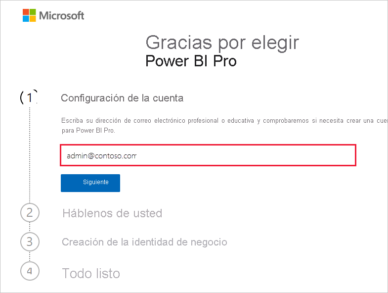
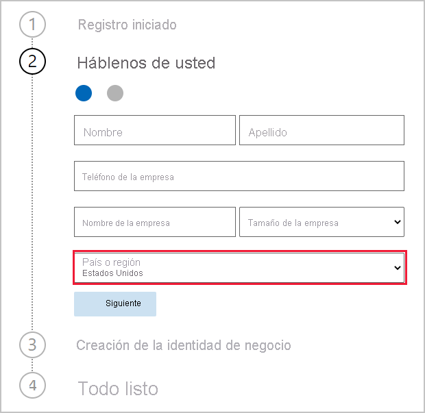
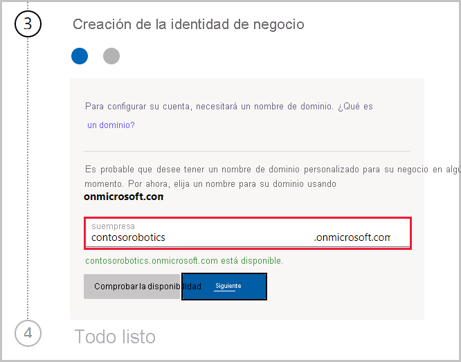

# Obtención de una suscripción del servicio Power BI para la organización

Los administradores se pueden suscribir al servicio Power BI a través de la página **Servicios de compra** del Centro de administración de Microsoft 365. Cuando un administrador se registre en Power BI, puede asignar licencias de usuario a usuarios que deben tener acceso.

Los usuarios de la organización pueden suscribirse a Power BI a través del sitio web de Power BI. Cuando un usuario de la organización se suscribe a Power BI, se le asigna automáticamente una licencia de Power BI. Si quiere desactivar este autoservicio, siga los pasos descritos en [Activación o desactivación del registro y la compra de autoservicio](service-admin-disable-self-service.md).

## Registro a través de Microsoft 365

Si es administrador global o administrador de facturación, puede obtener una suscripción a Power BI para su organización. Vea [¿Quién puede adquirir y asignar licencias?](service-admin-licensing-organization.md#who-can-purchase-and-assign-licenses) para obtener más información.

> [!NOTE]
>
> Una suscripción a Microsoft 365 E5 ya incluye licencias de Power BI Pro. Para obtener información sobre cómo administrar licencias, consulte [Visualización y administración de licencias de usuario](service-admin-manage-licenses.md).
>
>

Siga estos pasos para comprar licencias de Power BI Pro en el Centro de administración de Microsoft 365:

1. Inicie sesión en el [Centro de administración de Microsoft 365](https://admin.microsoft.com).

2. En el menú de navegación, seleccione **Facturación** > **Servicios de compra**.
  
   

3. Busque la suscripción que desea comprar. Encontrará **Power BI** en **Other categories that might interest you** (Otras categorías que pueden interesarle) cerca de la parte inferior de la página. Seleccione el vínculo para ver las suscripciones de Power BI disponibles para su organización.

4. Seleccione una oferta, como Power BI Pro.

5. En la página **Servicios de compra**, seleccione **Comprar**. Si no lo ha usado previamente, puede iniciar una suscripción de prueba gratuita de Power BI Pro. Incluye 25 licencias y expira en un mes.

   

6. Elija **Pagar mensualmente** o **Pagar un año completo**, según cómo desee pagar.

7. En **How many users do you want?** (¿Cuántos usuarios quiere?), escriba el número de licencias que quiere comprar y seleccione **Check out now** (Comprar ahora) para completar la transacción.

8. Para comprobar la compra, vaya a **Facturación** > **Productos y servicios** y busque **Power BI Pro**.

Para obtener más información sobre el modo en el que su organización puede controlar y adquirir el servicio Power BI, consulte [Power BI en su organización](/microsoft-365/admin/misc/power-bi-in-your-organization).

## Otras formas de obtener Power BI para su organización

Si aún no es un suscriptor de Microsoft 365, siga los pasos que se indican a continuación para obtener una evaluación de Power BI Pro para su organización. También puede [registrarse para obtener una nueva evaluación de Microsoft 365](service-admin-signing-up-for-power-bi-with-a-new-office-365-trial.md) y, después, agregar Power BI siguiendo los pasos de la sección anterior.

Necesitará una cuenta profesional o educativa para registrarse y obtener una suscripción de Power BI. No se admiten direcciones de correo electrónico de proveedores de telecomunicaciones ni servicios de correo electrónico de consumidor. Si no tiene una cuenta profesional o educativa, puede crear una durante el registro.

Siga estos pasos para registrarse:

1. Vaya a [Suscripción a Power BI Pro](https://signup.microsoft.com/create-account/signup?OfferId=d59682f3-3e3b-4686-9c00-7c7c1c736085&ali=1&products=d59682f3-3e3b-4686-9c00-7c7c1c736085). 

2. Escriba la dirección de correo electrónico profesional o educativa y seleccione **Siguiente**. No hay ningún problema si escribe una dirección de correo electrónico que no se considere una dirección de correo electrónico profesional o educativa. Automáticamente, se configurará una nueva cuenta cuando cree la identidad de negocio.

   

3. Se ejecuta una comprobación rápida para ver si es necesario crear una cuenta. Seleccione **Configurar cuenta** para continuar con el proceso de registro.

   > [!NOTE]
   >Si su dirección de correo electrónico ya está en uso con otro servicio de Microsoft, puede **iniciar sesión** o **crear una cuenta**. Si decide crear otra cuenta, siga estos pasos para configurarla.
>
>
 
4. Rellene el formulario para proporcionarnos información sobre usted. Asegúrese de elegir el país o la región correctos. El país que seleccione determina dónde se almacenan los datos, tal y como se explica en [Cómo determinar dónde se encuentra el inquilino de Power BI](service-admin-where-is-my-tenant-located.md#how-to-determine-where-your-power-bi-tenant-is-located).

   

5. Seleccione **Siguiente**. Tenemos que enviar un código de verificación para comprobar su identidad. Proporcione un número de teléfono al que podamos enviar un mensaje de texto o llamarle. Después, seleccione **Enviar código de verificación**.

6. Escriba el código de verificación y continúe hasta **Crear su identidad de negocio**.

   

    Escriba un nombre corto para su empresa, nos aseguraremos de que esté disponible. Usamos este nombre corto para crear el nombre de la organización en el centro de datos como subdominio de onmicrosoft.com. Puede agregar su propio dominio empresarial más adelante. No se preocupe si el nombre corto que quiere está en uso. Lo más probable es que alguien con un nombre de negocio similar elija el mismo nombre corto; simplemente pruebe una variación diferente. Seleccione **Siguiente**.
    
7. Cree el identificador de usuario y la contraseña para iniciar sesión en su cuenta. Seleccione **Registrarse**, y ya está listo.

La cuenta que ha creado es ahora el administrador global de un nuevo inquilino de evaluación de Power BI Pro. Puede iniciar sesión en el [Centro de administración de Microsoft 365](https://admin.microsoft.com) para agregar más usuarios, configurar un dominio personalizado, adquirir más servicios y administrar su suscripción de Power BI.

## Pasos siguientes

- [Visualización y administración de licencias de usuario](service-admin-manage-licenses.md)
- [Activación o desactivación del registro y la compra de autoservicio](service-admin-disable-self-service.md)
- [Suscripciones de empresa y documentación de facturación](/microsoft-365/commerce/)