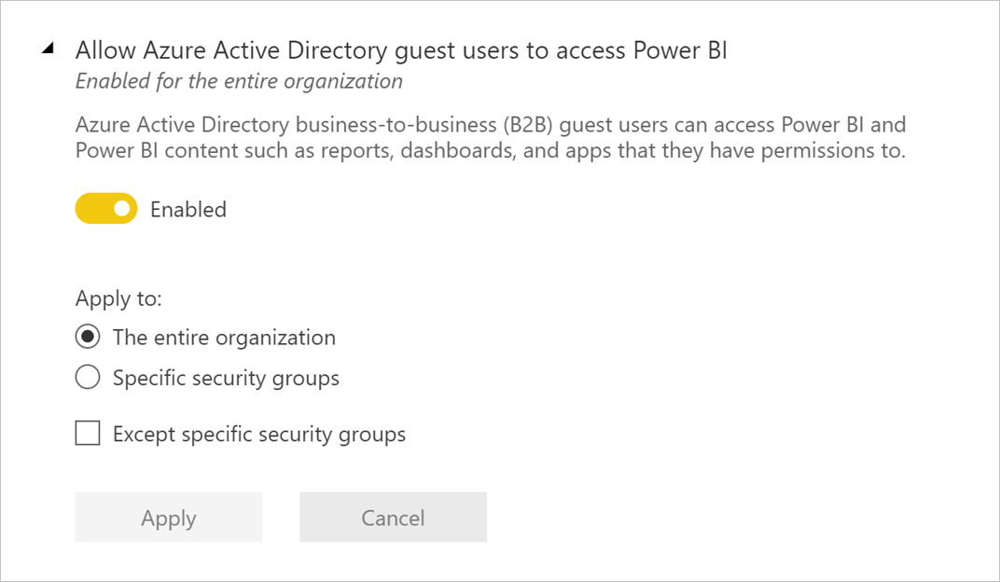
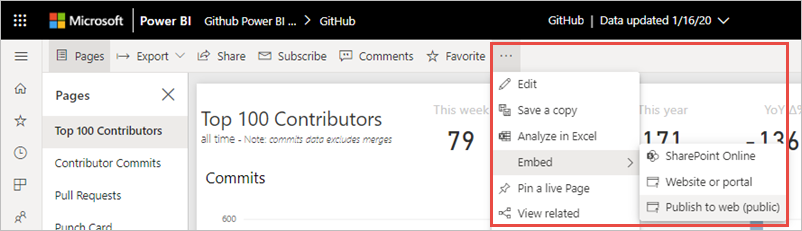

# Administración de Power BI en el portal de administración

El portal de administración permite administrar la configuración de Power BI de la organización. Incluye elementos, como métricas de uso, acceso al Centro de administración de Microsoft 365 y configuración de inquilinos.

Los administradores globales y los usuarios que tengan el rol de administrador del servicio Power BI pueden acceder al portal de administración completo. Si no está en uno de estos roles, solo verá **Configuración de la capacidad** en el portal. Para más información acerca del rol de administrador del servicio Power BI, consulte [Descripción del rol de administrador de Power BI](service-admin-role.md).

## Acceso al portal de administración

Debe ser administrador global o administrador del servicio Power BI para tener acceso al portal de administración de Power BI. Para más información acerca del rol de administrador del servicio Power BI, consulte [Descripción del rol de administrador de Power BI](service-admin-role.md). Para acceder al portal de administración de Power BI, haga lo siguiente:

1. Inicie sesión en [Power BI](https://app.powerbi.com) con las credenciales de la cuenta de administrador.

1. En el encabezado de página, seleccione **Configuración** > **Portal de administración**.

    

El portal de administración contiene varias secciones. En el resto de este artículo se proporciona información sobre cada una de ellas.

* [Métricas de uso](#usage-metrics)
* [Usuarios](#users)
* [Registros de auditoría](#audit-logs)
* [Configuración de inquilinos](#tenant-settings)
* [Configuración de capacidad](#capacity-settings)
* [Códigos para insertar](#embed-codes)
* [Objetos visuales de la organización](organizational-visuals.md#organizational-visuals)
* [Conexiones de Azure (versión preliminar)](#azure-connections-preview)
* [Áreas de trabajo](#workspaces)
* [Personalización de marca](#custom-branding)
* [Métricas de protección](#protection-metrics)
* [Contenido destacado](#featured-content)

## Métricas de uso

Las **métricas de uso** le permiten supervisar el uso de Power BI de su organización. También muestran qué usuarios y grupos de la organización son los más activos en Power BI.

> [!NOTE]
> La primera vez que accede al panel, o después de visitarlo de nuevo tras un largo período sin verlo, probablemente verá una pantalla de carga mientras se carga el panel.

Una vez cargado el panel, verá dos secciones de iconos. La primera sección incluye los datos de uso de usuarios individuales y la segunda muestra información similar, pero de los grupos de la organización.

Este es un desglose de lo que puede ver en cada icono:

* Recuento definido de todos los paneles, informes y conjuntos de datos en el área de trabajo de usuario.
  
    

* El panel más consumido por número de usuarios que pueden acceder a él. Por ejemplo: Tiene un panel que compartió con tres usuarios. También agregó el panel a un paquete de contenido al que se han conectado dos usuarios distintos. El recuento del panel sería 6 (1 + 3 + 2).
  
    

* El contenido más popular al que están conectados los usuarios. El contenido será cualquier cosa a la que puedan acceder los usuarios mediante el proceso de obtención de datos, como paquetes SaaS, paquetes de contenido organizativo, archivos o bases de datos.

  
    

* Una vista de los usuarios principales según el número de paneles que tienen, tanto paneles que crearon ellos mismos como paneles compartidos con ellos.
  
    

* Una vista de los usuarios principales según el número de informes que tienen.
  
    

La segunda sección muestra el mismo tipo de información, pero se basa en grupos. Esta sección le permite ver qué grupos de la organización son más activos y qué tipo de contenido consumen.

Con esta información, puede extraer información real sobre el modo en que los usuarios usan Power BI en toda la organización.

## Control de métricas de uso

Los informes de métricas de uso son una característica que el administrador de Power BI puede activar o desactivar. Los administradores tienen control granular sobre qué usuarios tienen acceso a las métricas de uso. De forma predeterminada, todos los usuarios de la organización tienen esta opción en modo **Activado**.

Los administradores también pueden determinar si los creadores de contenido pueden ver los datos de cada usuario en las métricas de uso. 

Consulte [Supervisar las métricas de uso de paneles e informes de Power BI](../collaborate-share/service-usage-metrics.md) para obtener más información acerca de los informes.

### Métricas de uso para creadores de contenido

1. En el portal de administración, seleccione **Configuración de inquilinos** > **Configuración de auditoría y uso** > **Métricas de uso para creadores de contenido**.

    

1. Habilite (o deshabilite) las métricas de uso > **Aplicar**.

    

### Datos por usuario en métricas de uso de creadores de contenido

Los datos por usuario están habilitados de forma predeterminada en las métricas de uso, mientras que el informe de métricas incluye información sobre la cuenta. Si no quiere incluir la información de la cuenta de algunos usuarios, o de ninguno de ellos, deshabilite la característica para los grupos de seguridad especificados o para toda la organización. En tal caso, la información de la cuenta aparece en el informe como *Sin nombre*.

### Eliminación de todo el contenido existente de las métricas de uso

Al deshabilitar las métricas de uso para toda la organización, los administradores pueden utilizar una de estas opciones, o ambas:

- **Elimine todo el contenido existente de las métricas de uso** para eliminar todos los iconos de informes y paneles existentes que se compilaron mediante los informes y conjuntos de datos de las métricas de uso. Esta opción permite eliminar todos los accesos a los datos de métricas de uso de todos los usuarios de la organización que ya los puedan estar usando.
- **Eliminar todos los datos por usuario existentes del contenido de las métricas de uso actuales** Esta opción elimina todo el acceso a los datos por usuario para todos los usuarios de la organización que ya lo estén utilizando. 

Tenga cuidado, ya que la eliminación del contenido de las métricas de uso y por usuario existentes es irreversible.

## Usuarios

Administra usuarios, grupos y administradores de Power BI en el Centro de administración de Microsoft 365. La pestaña **Usuarios** proporciona un vínculo al centro de administración.

## Registros de auditoría

Administrará registros de auditoría de Power BI en el Centro de seguridad y cumplimiento de Office 365. La pestaña **Registros de auditoría** proporciona un vínculo al Centro de seguridad y cumplimiento. Para más información, consulte [Seguimiento de actividades de usuario en Power BI](service-admin-auditing.md).

Para usar los registros de auditoría, asegúrese de que la opción [**Crear registros de auditoría para el cumplimiento y la auditoría de la actividad interna**](#create-audit-logs-for-internal-activity-auditing-and-compliance) está habilitada.

## Configuración de inquilinos

La **configuración de inquilinos** permite controlar de manera pormenorizada las características que están disponibles para su organización. Si le preocupa la información confidencial, algunas de nuestras características pueden no ser adecuadas para su organización, o puede que solo quiera que una determinada característica esté disponible para un grupo concreto.

> [!NOTE]
> La configuración de inquilinos que controla la disponibilidad de características en la interfaz de usuario de Power BI puede ayudar a establecer directivas de gobernanza, pero no es una medida de seguridad. Por ejemplo, el valor **Exportar datos** no restringe los permisos de un usuario de Power BI en un conjunto de datos. Los usuarios de Power BI con acceso de lectura a un conjunto de datos tienen permiso para consultarlo y es posible que puedan conservar los resultados sin usar la característica **Exportar datos** de la interfaz de usuario de Power BI.

En la imagen siguiente se muestran varias opciones de la pestaña **Configuración de inquilinos**.

> [!NOTE]
> Un cambio de configuración puede tardar hasta 15 minutos en aplicarse para todos los usuarios de la organización.

La configuración puede tener uno de estos tres estados:

* **Deshabilitado para toda la organización**: ninguna persona de la organización puede usar esta característica.

    

* **Habilitado para toda la organización**: todas las personas de la organización pueden usar esta característica.

    

* **Habilitado para un subconjunto de la organización**: En lugar de habilitar la característica para toda la organización, puede aplicar la configuración a **Grupos de seguridad específicos** a los que se les permitirá usar esta característica.

    También puede habilitar la característica para toda la organización, **Excepto grupos de seguridad específicos**.

    

    También puede combinar opciones para habilitar la característica solo para un grupo específico de usuarios y deshabilitarla para otro. El uso de este enfoque garantiza que determinados usuarios no tengan acceso a la característica, aunque pertenezcan al grupo permitido. Se aplica al usuario la configuración más restrictiva.

    

Las secciones siguientes proporcionan una visión general de los distintos tipos de configuración de inquilino.

## Configuración de ayuda y soporte técnico

### Publicar información "Obtener ayuda"

Los administradores pueden especificar direcciones URL internas para invalidar el destino de los vínculos en el menú Ayuda de Power BI y para las actualizaciones de licencias. Si se establecen direcciones URL personalizadas, los usuarios de la organización recurren a los recursos internos de ayuda y soporte técnico en lugar de a los destinos predeterminados. Los siguientes destinos de recursos se pueden personalizar:

* **Más información**. De forma predeterminada, este vínculo al menú Ayuda apunta a una [lista de todas nuestras rutas de aprendizaje y módulos de Power BI](https://docs.microsoft.com/learn/browse/?products=power-bi). Para dirigir este vínculo a recursos de aprendizaje interno, establezca una dirección URL personalizada para la **documentación de aprendizaje**.

* **Comunidad**. Para llevar a los usuarios a un foro interno desde el menú Ayuda, establezca una dirección URL personalizada al **Foro de discusión** en lugar de a la [Comunidad de Power BI](https://community.powerbi.com/).

* **Actualizaciones de licencias**. A los usuarios con una licencia de Power BI (gratuita) se les puede presentar la oportunidad de actualizar su cuenta a Power BI Pro durante el uso del servicio. Si especifica una dirección URL interna para **Solicitudes de licencia**, redirigirá a los usuarios a un flujo interno de solicitud y compra e impedirá la compra mediante autoservicio. Si quiere impedir que los usuarios compren licencias, pero está de acuerdo con dejar que los usuarios inicien una evaluación gratuita de Power BI Pro, consulte [Permitir que los usuarios prueben Power BI Pro](#allow-users-to-try-power-bi-pro) para separar las experiencias de compra y prueba.

* **Obtener ayuda**. Para llevar a los usuarios a un departamento de soporte técnico interno desde el menú Ayuda, establezca una dirección URL personalizada al **Departamento de soporte técnico** en lugar de al [Soporte técnico de Power BI](https://powerbi.microsoft.com/support/).

### Recepción de notificaciones por correo electrónico sobre interrupciones o incidentes en el servicio

Los grupos de seguridad habilitados para correo recibirán notificaciones por correo electrónico si este inquilino se ve afectado por una interrupción del servicio o un incidente. Más información sobre [Notificaciones de interrupción del servicio](service-interruption-notifications.md).

### Permitir que los usuarios prueben Power BI Pro

La opción **Allow users to try Power BI Pro** (Permitir que los usuarios prueben Power BI Pro) está habilitada de forma predeterminada, y aumenta el control sobre el modo en que los usuarios adquieren licencias de Power BI Pro. En escenarios en los que se ha bloqueado la compra mediante autoservicio, esta opción permite a los usuarios iniciar una prueba de Power BI Pro. La experiencia del usuario final depende del modo en que combine la configuración de licencia. En la tabla siguiente se muestra el modo en que la experiencia de actualización de Power BI (gratis) a Power BI Pro se ve afectada por distintas combinaciones de opciones:

| Opción de compra mediante autoservicio | Opción para permitir que los usuarios prueben Power BI Pro | Experiencia del usuario final |
| ------ | ------ | ----- |
| habilitado | Disabled | El usuario puede comprar una licencia Pro, pero no puede iniciar una evaluación de prueba. |
| habilitado | habilitado | El usuario puede iniciar una evaluación gratuita de la versión Pro y puede actualizarse a una licencia de pago. |
| Disabled | Disabled | El usuario ve un mensaje para ponerse en contacto con el administrador de TI para solicitar una licencia. |
| Disabled | habilitado | El usuario puede iniciar una evaluación gratuita de la versión Pro, pero debe ponerse en contacto con el administrador de TI para obtener una licencia de pago. |

> [!NOTE]
> Puede agregar una dirección URL interna para las solicitudes de licencias en la [opción de Ayuda y soporte técnico](#help-and-support-settings). Si establece la dirección URL, se invalida la experiencia de compra predeterminada. A los usuarios que pueden comprar una licencia en los escenarios descritos en la tabla anterior, se les redirige a la dirección URL interna.

Para más información, consulte [Activación o desactivación del registro y la compra de autoservicio](service-admin-disable-self-service.md).

## Configuración del área de trabajo

En **Configuración de inquilinos**, el portal de administración tiene tres secciones para controlar las áreas de trabajo:

- [Creación de las nuevas experiencias de áreas de trabajos](#create-the-new-workspaces).
- [Uso de conjuntos de datos entre áreas de trabajo](#use-datasets-across-workspaces).
- [Bloqueo de la creación de áreas de trabajo clásicas](#block-classic-workspace-creation).

### Creación de nuevas áreas de trabajo

Las áreas de trabajo son lugares en los que los usuarios pueden colaborar en paneles, informes y otro contenido. Los administradores usan la configuración **Creación de áreas de trabajo (nueva experiencia de áreas de trabajo)** para indicar qué usuarios de la organización pueden crear áreas de trabajo. Los administradores pueden permitir que todos o ninguno de los empleados de una organización creen experiencias de áreas de trabajo. También pueden restringir la creación de estas áreas a miembros de grupos de seguridad específicos. Obtenga más información sobre las [áreas de trabajo](../collaborate-share/service-new-workspaces.md).

:::image type="content" source="media/service-admin-portal/power-bi-admin-workspace-settings.png" alt-text="Creación de las nuevas experiencias de áreas de trabajos":::

Para las áreas de trabajo clásicas basadas en grupos de Microsoft 365, la administración sigue ocurriendo en el portal de administración y en Azure Active Directory.

> [!NOTE]
> La opción **Creación de áreas de trabajo (nueva experiencia de áreas de trabajo)** establece de forma predeterminada que solo los usuarios que pueden crear grupos de Microsoft 365 puedan crear las nuevas áreas de trabajo de Power BI. Asegúrese de establecer un valor en el portal de administración de Power BI para garantizar que los usuarios apropiados puedan crearlas.

**Lista de áreas de trabajo**

El portal de administración tiene otra sección de configuración sobre las áreas de trabajo del inquilino. En esa sección, puede ordenar y filtrar la lista de áreas de trabajo y mostrar los detalles de cada una de ellas. Consulte [Áreas de trabajo](#workspaces) en este artículo para más información.

**Publicación de paquetes de contenido y aplicaciones**

En el portal de administración, también controla qué usuarios tienen permisos para distribuir aplicaciones a la organización. Consulte [Publicación de paquetes de contenido y aplicaciones en toda la organización](#publish-content-packs-and-apps-to-the-entire-organization) en este artículo para obtener detalles.

### Uso de conjuntos de datos entre áreas de trabajo

Los administradores pueden controlar qué usuarios de la organización pueden usar conjuntos de datos en las áreas de trabajo. Cuando esta opción está habilitada, los usuarios todavía necesitan el permiso de compilación necesario para un conjunto de datos específico.

:::image type="content" source="media/service-admin-portal/power-bi-admin-datasets-workspaces.png" alt-text="Uso de conjuntos de datos entre áreas de trabajo":::

Para más información, consulte [Introducción a los conjuntos de datos de áreas de trabajo (versión preliminar)](../connect-data/service-datasets-across-workspaces.md).

### Bloqueo de la creación de áreas de trabajo clásicas

Los administradores pueden controlar si la organización puede crear áreas de trabajo clásicas. Cuando se habilita esta opción, los usuarios que crean un área de trabajo solo pueden crear las de la nueva experiencia de área de trabajo. 

Cuando está habilitado, los grupos de Office 365 recién creados no se mostrarán en la lista de áreas de trabajo de Power BI. Las áreas de trabajo clásicas existentes se siguen mostrando en la lista. Cuando el valor se deshabilita, todos los grupos de Office 365 a los que pertenece el usuario aparecen en la lista de áreas de trabajo. Obtenga más información sobre las [áreas de trabajo de la nueva experiencia de área de trabajo](../collaborate-share/service-new-workspaces.md).

## Configuración de exportación y uso compartido

### Permiso a usuarios invitados de Azure Active Directory para acceder a Power BI

La habilitación de esta configuración permite a los usuarios invitados de Azure Active Directory Business-to-Business (Azure AD B2B) tener acceso a Power BI. Al deshabilitar esta configuración, los usuarios invitados reciben un error al intentar acceder a Power BI. Cuando se deshabilita esta configuración para toda la organización, también se impide a los usuarios que inviten a otras personas a su organización. Use la opción de grupos de seguridad específicos para controlar qué usuarios invitados pueden acceder a Power BI.

### Invitación de usuarios externos a su organización 

La configuración de **Invitar a usuarios externos a la organización** ayuda a las organizaciones a elegir si se puede invitar a los nuevos usuarios externos a la organización mediante experiencias de uso compartido y permisos de Power BI. Cuando está deshabilitado, si un usuario externo aún no es un usuario invitado de la organización, no se puede agregar a la organización a través de Power BI. 

> [!IMPORTANT]
> Esta configuración se llamaba anteriormente "Compartir contenido con usuarios externos". El nombre revisado refleja con más precisión el resultado de la configuración.

Para invitar a usuarios externos a su organización, un usuario también necesita el rol de invitador de Azure Active Directory. Esta configuración solo controla la capacidad de invitar a través de Power BI. 

### Publicar en Web

Como administrador de un inquilino de Power BI, el valor **Publicar en la web** ofrece opciones para las que los usuarios pueden crear códigos para insertar a fin de publicar informes en la web. Esta funcionalidad hace que el informe y los datos que contiene estén disponibles para cualquier persona en la web. Obtenga más información sobre cómo [publicar en la web](../collaborate-share/service-publish-to-web.md).

> [!NOTE]
> Solo los administradores de Power BI pueden permitir la creación de códigos para insertar de publicación en la web. Las organizaciones pueden tener códigos para insertar existentes. Vea la sección [Códigos para insertar](service-admin-portal.md#embed-codes) del portal de administración para revisar los informes publicados actualmente.

En la imagen siguiente se muestra el menú **Más opciones (…)** de un informe cuando está habilitada la opción **Publicar en la web**.

El valor **Publicar en la web** del portal de administración proporciona opciones para las que los usuarios pueden crear códigos para insertar.

Los administradores pueden establecer **Publicar en la web** en **Habilitado** y **Elegir cómo funcionan los códigos para insertar** en **Solo permitir códigos existentes**. En ese caso, los usuarios pueden crear códigos para insertar, pero tienen que ponerse en contacto con el administrador de Power BI para que les permita hacerlo.

Los usuarios ven diferentes opciones en la interfaz de usuario en función del valor de la opción **Publicar en la web**.

|Característica |Habilitada para toda la organización |Deshabilitada para toda la organización |Grupos de seguridad específicos   |
|---------|---------|---------|---------|
|**Publicar en la web** en el menú **Más opciones (…)**|Habilitada para todos|No visible para todos|Solo visible para usuarios o grupos autorizados.|
|**Administrar códigos para insertar** en **Configuración**|Habilitada para todos|Habilitada para todos|Habilitada para todos  Opción * **Eliminar** solo para usuarios o grupos autorizados. * **Obtener código** habilitada para todos.|
|**Códigos de inserción** en el portal de administración|El estado refleja uno de los siguientes: * Activo * No admitido * Bloqueado|El estado muestra **Deshabilitado**.|El estado refleja uno de los siguientes: * Activo * No admitido * Bloqueado  Si el usuario no está autorizado según la configuración del inquilino, el estado muestra **Infracción**.|
|Informes publicados existentes|Todos habilitados|Todos deshabilitados|Los informes continúan generándose para todos.|

### Exportar datos

Los usuarios de la organización pueden exportar datos desde un icono o una visualización. Esto controla Analizar en Excel, la exportación a .csv, las descargas de conjuntos de datos (.pbix) y las características Live Connect del servicio Power BI. Obtenga más información sobre la [exportación de datos desde un icono o un objeto visual](../visuals/power-bi-visualization-export-data.md).

>[!NOTE]
> Antes de la introducción de la opción Exportar a Excel, esta opción también controlaba la exportación de datos a archivos de Excel. Para obtener más información, vea la [nota en Exportación a Excel](#export-to-excel).

En la imagen siguiente se muestra la opción para exportar datos desde un icono.

> [!NOTE]
> Si deshabilita la opción **Exportar datos** también impedirá que los usuarios usen la característica [Analizar en Excel](../collaborate-share/service-analyze-in-excel.md), así como la conexión dinámica al servicio Power BI.

### Exportar a Excel

Los usuarios de la organización pueden exportar los datos de una visualización a un archivo de Excel.

>[!IMPORTANT]
> Antes de la introducción de la opción Exportar a Excel, la exportación a un archivo de Excel se controlaba mediante la opción Exportar datos. Por tanto, en los inquilinos que existían antes de la introducción de la opción Exportar a Excel, la primera vez que los administradores de inquilinos examinan la opción Exportar a Excel, verán que tiene *Cambios sin aplicar*. Para que la nueva configuración surta efecto tendrán que aplicar estos cambios. De lo contrario, la exportación a un archivo de Excel se seguirá controlando mediante la opción Exportar datos.

### Exportación de informes como presentaciones de PowerPoint o documentos PDF

Los usuarios de la organización pueden exportar informes de Power BI como archivos de PowerPoint o documentos PDF. [Más información](../consumer/end-user-powerpoint.md)

En la imagen siguiente se muestra el menú **Archivo** para un informe cuando está habilitada la opción **Exportar informes como presentaciones de PowerPoint o documentos PDF**.

### Imprimir paneles e informes

Los usuarios de la organización pueden imprimir paneles e informes. [Más información](../consumer/end-user-print.md)

En la imagen siguiente se muestra la opción para imprimir un panel.

En la imagen siguiente se muestra el menú **Archivo** de un informe cuando está habilitada la opción **Imprimir paneles e informes**.

### Permitir a los usuarios externos editar y administrar el contenido de la organización

Los usuarios invitados de Azure AD B2B pueden editar y administrar el contenido de la organización. [Más información](service-admin-azure-ad-b2b.md)

La imagen siguiente muestra la opción Permitir a los usuarios externos editar y administrar el contenido de la organización.

En el portal de administración, también se controla qué usuarios tienen permisos para invitar a usuarios externos a la organización. Consulte [Compartir contenido con usuarios externos](#export-and-sharing-settings) en este artículo para obtener más información.

### Suscripciones de correo electrónico
Los usuarios de la organización pueden crear suscripciones de correo electrónico. Obtenga más información sobre las [suscripciones](../collaborate-share/service-publish-to-web.md).

### Contenido destacado

Permita que algunos o todos los autores de informes de la organización presenten su contenido en la sección Destacados de Inicio de Power BI. Los nuevos usuarios verán el contenido destacado en la parte superior de su página de inicio de Power BI. El contenido destacado se desplaza hacia abajo en la página Inicio a medida que los usuarios agregan **Favoritos**, **Frecuentes** y **Recientes**. 

Se recomienda empezar con un pequeño conjunto de promotores. Permitir que toda la organización destaque contenido en la página principal puede dificultar la tarea de realizar el seguimiento de todo el contenido promocionado. 

Después de habilitar el contenido destacado, también puede administrarlo en el portal de administración. Vea [Administración de contenido destacado](#manage-featured-content) en este artículo para obtener información sobre cómo controlar el contenido destacado en el dominio.

## Configuración de paquetes de contenido y de aplicaciones

### Publicación de paquetes de contenido y aplicaciones en toda la organización

Los administradores usan esta configuración para decidir qué usuarios pueden publicar paquetes de contenido y aplicaciones en toda la organización, en lugar de solo en grupos específicos. Obtenga más información sobre cómo [publicar aplicaciones](../collaborate-share/service-create-distribute-apps.md).

La siguiente imagen muestra la opción **Toda mi organización** al crear un paquete de contenido.

### Crear paquetes de contenido organizativos y aplicaciones de plantilla

Los usuarios de la organización pueden crear paquetes de contenido organizativos y aplicaciones de plantilla que utilizan conjuntos de datos integrados en un origen de datos de Power BI Desktop. Obtenga más información sobre las [aplicaciones de plantilla](../connect-data/service-template-apps-create.md).

### Insertar aplicaciones para los usuarios finales

Los creadores de informes pueden compartir aplicaciones directamente con los usuarios finales sin requerir la instalación desde [AppSource](https://appsource.microsoft.com). Obtenga más información sobre cómo [instalar aplicaciones automáticamente para los usuarios finales](../collaborate-share/service-create-distribute-apps.md#automatically-install-apps-for-end-users).

## Configuración de integración

### Usar la función Analizar en Excel en los conjuntos de datos locales

Los usuarios de la organización pueden utilizar Excel para ver e interactuar con conjuntos de datos locales de Power BI. [Más información](../collaborate-share/service-analyze-in-excel.md)

> [!NOTE]
> Si deshabilita la opción **Exportar datos** también impide que los usuarios usen la característica **Analizar en Excel**.

### Usar ArcGIS Maps for Power BI

Los usuarios de la organización pueden usar la visualización de ArcGIS Maps for Power BI proporcionada por Esri. [Más información](../visuals/power-bi-visualization-arcgis.md)

### Usar la búsqueda global para Power BI (versión preliminar)

Los usuarios de la organización pueden usar características de búsqueda externa que se basan en Azure Search.

## Configuración de tablas destacadas

En **Configuración de inquilinos**, la configuración de inquilino **Allow connections to featured tables** (Permitir conexiones a tablas destacadas) permite que los administradores de Power BI controlen qué usuarios de la organización pueden usar tablas destacadas en la galería de tipos de datos de Excel. 

:::image type="content" source="media/service-admin-portal/admin-allow-connections-featured-tables.png" alt-text="Todas las conexiones a tablas destacadas":::

Las conexiones a tablas destacadas también se deshabilitan si la configuración de inquilino **Exportar datos** está establecida en **Deshabilitada**.

Más información sobre las [tablas destacadas de Power BI en Excel](../collaborate-share/service-excel-featured-tables.md).

## Configuración de inquilino Compartir en Teams

La opción **Compartir en Teams** se encuentra en la sección **Configuración de inquilinos** del portal de administración de Power BI. Esta opción permite a las organizaciones ocultar los botones **Compartir en Teams** en el servicio Power BI. Cuando se deshabilita, los usuarios no ven los botones **Compartir en Teams** en la barra de acciones ni en los menús contextuales cuando ven informes y paneles en el servicio Power BI.

Obtenga más información sobre [compartir contenido de Power BI en Teams](../collaborate-share/service-share-report-teams.md).

## Configuración de objetos visuales de R

### Compartir objetos visuales de R e interactuar con ellos

Los usuarios de la organización pueden interactuar con objetos visuales creados mediante scripts de R y compartirlos. [Más información](../visuals/service-r-visuals.md)

> [!NOTE]
> Esta configuración se aplica a toda la organización y no se puede limitar a grupos específicos.

## Configuración de auditoría y uso

### Crear registros de auditoría con fines de auditoría y cumplimiento de la actividad interna

Los usuarios de la organización pueden utilizar la auditoría para supervisar las acciones realizadas en Power BI por otros usuarios de la organización. [Más información](service-admin-auditing.md)

Se debe habilitar esta configuración para que las entradas de registro de auditoría se puedan registrar. Puede haber una demora de hasta 48 horas entre la habilitación de la auditoría y el momento en el que se empiecen a mostrar los datos de auditoría. Si no ve los datos de inmediato, consulte los registros de auditoría más tarde. Puede haber una demora similar entre la obtención de permisos para ver los registros de auditoría y la posibilidad de acceder a estos.

> [!NOTE]
> Esta configuración se aplica a toda la organización y no se puede limitar a grupos específicos.

### Métricas de uso para creadores de contenido

Los usuarios de la organización pueden consultar las métricas de uso de los paneles y los informes que hayan creado. [Más información](../collaborate-share/service-usage-metrics.md)

### Datos por usuario en métricas de uso de creadores de contenido

Las métricas de uso de creadores de contenido revelan los nombres para mostrar y las direcciones de correo electrónico de los usuarios que acceden al contenido. [Más información](../collaborate-share/service-usage-metrics.md)

Los datos por usuario están habilitados de forma predeterminada en las métricas de uso, mientras que el informe de métricas incluye información sobre la cuenta del creador de contenido. Si no desea recopilar esta información para todos los usuarios, puede deshabilitar la característica para los grupos de seguridad en cuestión o para toda la organización. En tal caso, la información de la cuenta de los usuarios excluidos aparecerá en el informe como *Sin nombre*.

## Configuración del panel

### Clasificación de datos para paneles

Los usuarios de la organización pueden etiquetar paneles con clasificaciones que indiquen los niveles de seguridad del panel. [Más información](../create-reports/service-data-classification.md)

> [!NOTE]
> Esta configuración se aplica a toda la organización y no se puede limitar a grupos específicos.

## Configuración de desarrollador

### Insertar contenido en aplicaciones

Los usuarios de la organización pueden insertar informes y paneles de Power BI en las aplicaciones de software como servicio (SaaS). Si deshabilita esta configuración, impide que los usuarios puedan usar las API REST para insertar contenido de Power BI en la aplicación. [Más información](../developer/embedded/embedding.md)

### Concesión de permisos a las entidades de servicio para utilizar las API de Power BI

Las aplicaciones web registradas en Azure Active Directory (Azure AD) usarán una entidad de servicio asignada para acceder a API de Power BI sin un usuario con sesión iniciada. Para permitir que una aplicación use la autenticación de entidad de servicio, su entidad de servicio debe estar incluida en un grupo de seguridad permitido. [Más información](../developer/embedded/embed-service-principal.md)

> [!NOTE]
> Las entidades de servicio heredan de su grupo de seguridad los permisos correspondientes a todas las opciones de configuración del inquilino de Power BI. Para limitar los permisos, cree un grupo de seguridad dedicado para las entidades de servicio y agréguelo a la lista "Excepto grupos de seguridad específicos" correspondiente a la configuración habilitada y pertinente de Power BI.

## Configuración de flujo de datos

### Creación y uso de flujos de datos

Los usuarios de la organización pueden crear y usar flujos de datos. Para obtener información general sobre flujos de datos, consulte [Preparación de datos de autoservicio en Power BI](../transform-model/service-dataflows-overview.md). Para habilitar flujos de datos en una capacidad Premium, vea [Configuración de las cargas de trabajo](service-admin-premium-workloads.md).

> [!NOTE]
> Esta configuración se aplica a toda la organización y no se puede limitar a grupos específicos.

## Configuración de aplicaciones de plantilla

Tres valores de configuración controlan la capacidad de las aplicaciones de plantilla de publicar o instalar aplicaciones de plantilla.

### Publicar aplicaciones de plantilla

Los usuarios de la organización pueden crear áreas de trabajo de aplicaciones de plantilla. Controle qué usuarios pueden publicar aplicaciones de plantilla o distribuirlas a clientes fuera de la organización mediante [AppSource](https://appsource.microsoft.com) u otros métodos de distribución.

### Instalar aplicaciones de plantilla que aparecen en AppSource

Los usuarios de la organización pueden descargar e instalar aplicaciones de plantilla **solo** desde [AppSource](https://appsource.microsoft.com). Controle qué usuarios o grupos de seguridad específicos pueden instalar aplicaciones de plantilla desde AppSource.

### Instalar aplicaciones de plantilla que no aparecen en AppSource

Controle qué usuarios de la organización pueden descargar e instalar aplicaciones de plantilla **que no aparecen en [AppSource](https://appsource.microsoft.com)** .

## Configuración de la capacidad

### Power BI Premium

La pestaña **Power BI Premium** le permite administrar las funcionalidades de Power BI Premium (SKU EM o P) que se han adquirido para su organización. Todos los usuarios de su organización pueden ver la pestaña **Power BI Premium**, pero solo ven lo que contiene si están asignados como *administrador de funcionalidades* o como un usuario con permisos de asignación. Si un usuario no tiene ningún permiso, aparecerá el mensaje siguiente.

### Power BI Embedded

La pestaña **Power BI Embedded** le permite ver sus funcionalidades de Power BI Embedded (SKU A) que ha adquirido para su cliente. Dado que solo puede adquirir SKU A de Azure, puede [administrar las funcionalidades insertadas en Azure](../developer/embedded/azure-pbie-create-capacity.md) desde **Azure Portal**.

Para más información sobre cómo administrar la configuración de Power BI Embedded (SKU A), consulte [¿Qué es Power BI Embedded?](../developer/embedded/azure-pbie-what-is-power-bi-embedded.md).

## Códigos para insertar

Como administrador, puede ver los códigos para insertar que se generan para su inquilino para compartir informes de forma pública. También puede revocar o eliminar códigos. [Más información](../collaborate-share/service-publish-to-web.md)

## Objetos visuales de la organización

Toda la configuración de administrador de los objetos visuales de Power BI, incluida la configuración de inquilinos de objetos visuales de Power BI, se describe en [Administración de la configuración de administrador de objetos visuales de Power BI](organizational-visuals.md).

## Conexiones de Azure (versión preliminar)

### Almacenamiento de nivel de inquilino (versión preliminar)

De forma predeterminada, los datos usados con Power BI se almacenan en almacenamiento interno proporcionado por Power BI. Con la integración de flujos de datos y Azure Data Lake Storage Gen2 (ADLS Gen2), puede almacenar los flujos de datos en la cuenta de Azure Data Lake Storage Gen2 de su organización. Para obtener más información, vea [Integración de flujos de datos y Azure Data Lake (versión preliminar)](../transform-model/service-dataflows-azure-data-lake-integration.md).

### Permisos de almacenamiento de nivel de área de trabajo (versión preliminar)

De forma predeterminada, los administradores del área de trabajo no pueden conectar su propia cuenta de almacenamiento. Esta característica en versión preliminar permite activar una opción que permite a los administradores del área de trabajo conectar su propia cuenta de almacenamiento.

## Áreas de trabajo

Como administrador, puede ver las áreas de trabajo que existen en el inquilino en la pestaña **Áreas de trabajo**. En esta pestaña, puede realizar las siguientes acciones:

- Actualizar la lista de áreas de trabajo y sus detalles.
- Exportar los datos de las áreas de trabajo a un archivo .csv. 
- Ver los detalles de un área de trabajo, como su identificador, sus usuarios y sus roles, así como sus paneles, informes y conjuntos de datos.
- Editar la lista de personas que tienen acceso. Esto significa que puede eliminar el área de trabajo. Puede agregarse a un área de trabajo como administrador y, después, abrir el área de trabajo y eliminarla.
- Editar los campos de nombre y descripción.

Los administradores también pueden controlar la capacidad de los usuarios para crear áreas de trabajo de la nueva experiencia de área de trabajo, así como áreas de trabajo clásicas. Consulte [Configuración del área de trabajo](#workspace-settings) en este artículo para más información. 

Las columnas de la tabla de la pestaña **Áreas de trabajo** se corresponden con las propiedades que devuelve la [API REST de administración de Power BI](/rest/api/power-bi/admin) para las áreas de trabajo. Las áreas de trabajo personales son de tipo **PersonalGroup**, las clásicas son de tipo **Group** y las áreas de trabajo de la nueva experiencia de áreas de trabajo son de tipo **Workspace**. Para más información, consulte [Organización del trabajo en las nuevas áreas de trabajo](../collaborate-share/service-new-workspaces.md).

En la pestaña **Áreas de trabajo**, verá el *estado* para cada área de trabajo. En la tabla siguiente se proporcionan más detalles sobre el significado de estos estados.

|Estado  |Descripción  |
|---------|---------|
| **Activo** | Un área de trabajo normal. No indica nada sobre el uso o lo que hay en el interior, solo que el área de trabajo es "normal". |
| **Huérfana** | Un área de trabajo sin usuario administrador. |
| **Eliminado** | Un área de trabajo eliminada. Durante un máximo de 90 días, se conservan suficientes metadatos como para restaurar el área de trabajo, si se quiere. |
| **Quitando** | Un área de trabajo en proceso de eliminación, pero aún no ha desaparecido. Los usuarios pueden eliminar sus propias áreas de trabajo, que se sitúan en estado Quitando y, con el tiempo, en Eliminada. |

Los administradores también pueden administrar y recuperar áreas de trabajo mediante el portal de administración o cmdlets de PowerShell. 

## Personalización de marca

Como administrador, puede personalizar la apariencia de Power BI para toda la organización. Actualmente, hay tres opciones principales:

* **Carga del logotipo**: para obtener los mejores resultados, cargue un logotipo guardado en formato .png de 10 KB o menos y de al menos 200 x 30 píxeles.

* **Carga de la imagen de portada**: para obtener los mejores resultados, cargue una imagen de portada guardada en formato .jpg o .png de 1 MB o menos y de al menos 1920 x 160 píxeles.

* **Selección del color de tema**: puede seleccionar su tema según un número hexadecimal, RGB, valor o desde la paleta que se proporciona.

Para más información, consulte [Personalización de marca de la organización](https://aka.ms/orgBranding).

## Métricas de protección

Después de habilitar la protección de la información de Power BI, se muestran las métricas de protección de datos en el portal de administración. Este informe muestra el modo en que las etiquetas de confidencialidad ayudan a proteger el contenido.

## Administración de contenido destacado

Como administrador de inquilinos, puede administrar todos los informes, paneles y aplicaciones que se han promocionado en la sección Destacados de Inicio de Power BI en la organización.

- En el portal de administración, seleccione **Contenido destacado**.

Aquí puede ver una visión general de quién destaca el contenido, cuándo se ha destacado y todos sus metadatos pertinentes. Si algo parece sospechoso o quiere limpiar la sección Destacados, puede eliminar el contenido promocionado según sea necesario.

Vea [Contenido destacado](#featured-content) en este artículo para obtener información sobre cómo habilitar el contenido destacado.

## Pasos siguientes

[Administración de Power BI en su organización](service-admin-administering-power-bi-in-your-organization.md)  
[Descripción del rol de administrador de Power BI](service-admin-role.md)  
[Auditoría de Power BI en su organización](service-admin-auditing.md)  

¿Tiene más preguntas? [Pruebe a preguntar a la comunidad de Power BI](https://community.powerbi.com/)
