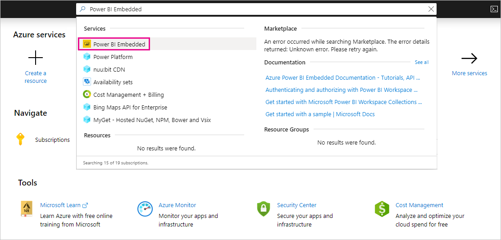
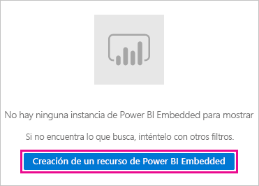
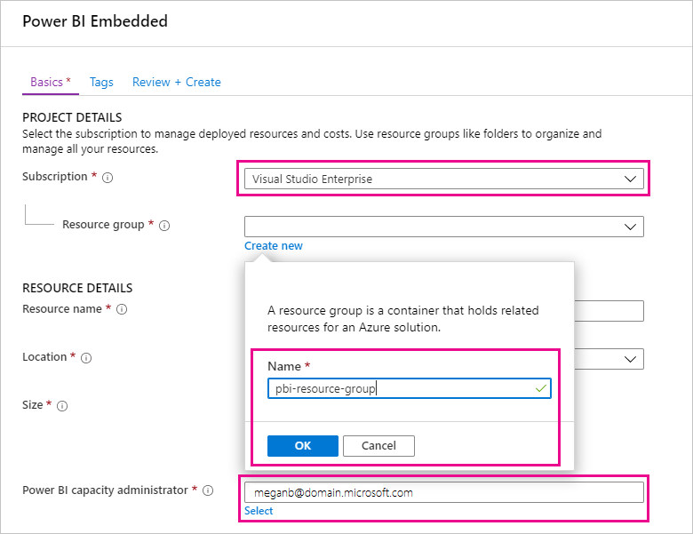
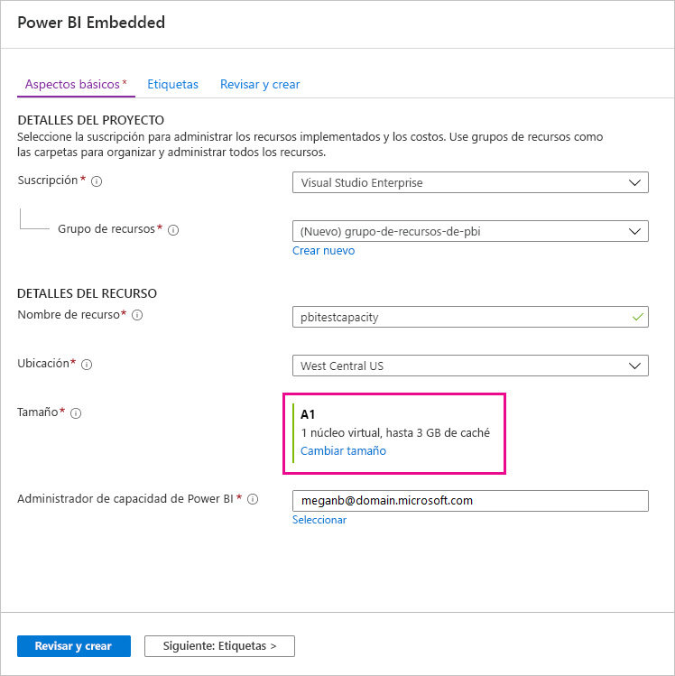
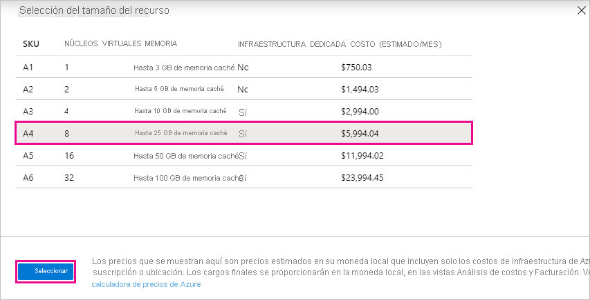
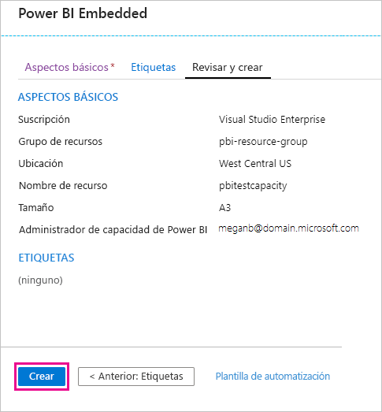
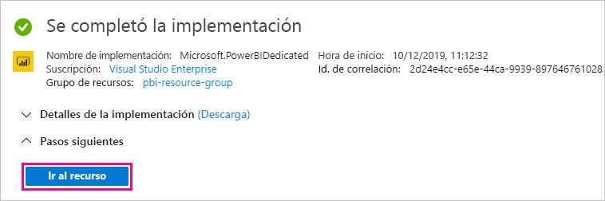
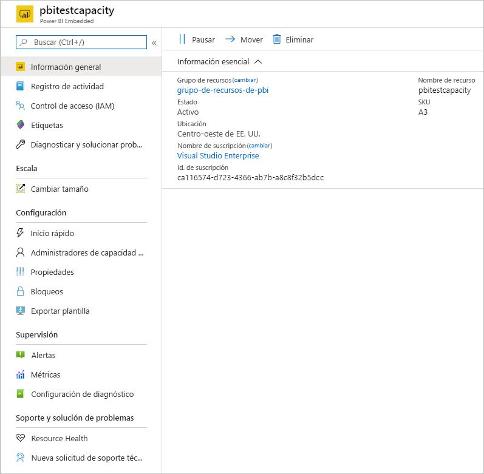

# Adquisición de Power BI Premium para pruebas

En este artículo se describe cómo adquirir las SKU A de Power BI Premium para escenarios de prueba y para casos en los que no tiene los permisos necesarios para comprar SKU P (rol de administrador global de Microsoft 365 o rol de administrador de facturación). Las SKU A no requieren ningún compromiso de tiempo y se facturan por hora. Las SKU A se compran en [Azure Portal](https://portal.azure.com).

Para obtener más información sobre Power BI Premium, consulte [¿Qué es Power BI Premium?](service-premium-what-is.md). Para obtener información actualizada sobre precios y planificación, consulte la [Página de precios de Power BI](https://powerbi.microsoft.com/pricing/) y la [Calculadora de Power BI Premium](https://powerbi.microsoft.com/calculator/). Los creadores de contenido siguen necesitando una [licencia de Power BI Pro](service-admin-purchasing-power-bi-pro.md), incluso si en la organización se usa Power BI Premium. Asegúrese de adquirir al menos una licencia de Power BI Pro para su organización. Con las SKU A, _todos los usuarios_ que consumen contenido también necesitan licencias Pro.

> [!NOTE]
> Si expira una suscripción Premium, dispone de 30 días de acceso completo a su capacidad. Transcurrido este tiempo, el contenido vuelve a ser una capacidad compartida. La capacidad compartida no admite los modelos de más de 1 GB.

## Compra de SKU A para pruebas y otros escenarios

Las SKU se ponen a disposición a través del servicio Azure Power BI Embedded. Puede usar las SKU A de las siguientes maneras:

- Para habilitar la inserción de Power BI en aplicaciones de terceros. Para obtener más información, vea [Power BI Embedded](../developer/embedded/azure-pbie-what-is-power-bi-embedded.md).

- Para probar la funcionalidad Premium antes de comprar una SKU P.

- Para crear entornos de desarrollo y pruebas junto con un entorno de producción en el que se usen SKU P.

- Para comprar Power BI Premium aunque no tenga un rol de administrador global de Microsoft 365 o de administrador de facturación.

> [!NOTE]
> Si compra una SKU A4 o superior, puede aprovechar todas las características Premium, excepto el uso compartido ilimitado de contenido. Con las SKU A, _todos los usuarios_ que consumen contenido necesitan licencias Pro.

Siga estos pasos para comprar SKU A en Azure Portal:

1. Inicie sesión en [Azure Portal](https://portal.azure.com) con una cuenta que tenga al menos permisos de administrador de capacidad en Power BI.

1. Busque _Power BI Embedded_ y seleccione el servicio en los resultados de la búsqueda.

    

1. Seleccione **Creación de un recurso de Power BI Embedded**.

    

1. En la pantalla de creación de **Power BI Embedded**, especifique la información siguiente:

    - La **Suscripción** en la que se va a crear el servicio Power BI Embedded.

    - La **Ubicación** física en la que se va a crear el grupo de recursos que contiene el servicio. Para obtener un mejor rendimiento, esta ubicación debe estar cerca de la del inquilino de Azure Active Directory para Power BI.

    - El **Grupo de recursos** existente que se va a usar, o cree uno como se muestra en el ejemplo.

    - El **Administrador de la capacidad de Power BI**. El administrador de la capacidad debe ser un usuario miembro o una entidad de servicio en el inquilino de Azure AD.

    

1. Si quiere usar todas las características de Power BI Premium (excepto el uso compartido ilimitado), necesita al menos una SKU A4. Seleccione **Cambiar el tamaño**.

    

1. Seleccione un tamaño de capacidad de A4, A5 o A6, que se corresponden a P1, P2 y P3.

    

1. Seleccione **Revisar y crear**, revise las opciones que ha elegido y, después, seleccione **Crear**.

    

1. La implementación puede tardar unos minutos en completarse. Cuando esté lista, seleccione **Ir al recurso**.

    

1. En la pantalla de administración, revise las opciones que tiene para administrar el servicio, incluida la pausa del servicio cuando no lo use.

    

Después de comprar la capacidad, obtenga información sobre cómo [administrar capacidades](service-admin-premium-manage.md#manage-capacity) y [asignar áreas de trabajo](service-admin-premium-manage.md#assign-a-workspace-to-a-capacity) a una capacidad.

## Pasos siguientes

[¿Qué es Power BI Premium?](service-premium-what-is.md)
[Adquisición de Power BI Premium](service-admin-premium-purchase.md)
[Configuración y administración de capacidades en Power BI Premium](service-admin-premium-manage.md)\
[Página de precios de Power BI](https://powerbi.microsoft.com/pricing/)\
[Calculadora de Power BI Premium](https://powerbi.microsoft.com/calculator/)\
[Preguntas más frecuentes sobre Power BI Premium](service-premium-faq.md)\
[Notas del producto de la planeación de una implementación de Power BI Enterprise](https://aka.ms/pbienterprisedeploy)

¿Tiene más preguntas? [Pruebe a preguntar a la comunidad de Power BI](https://community.powerbi.com/)
