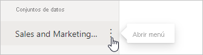
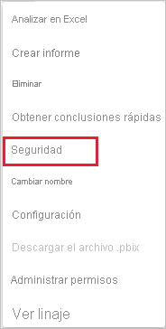

# Seguridad de nivel de fila (RLS) con Power BI

La seguridad de nivel de fila (RLS) con Power BI puede usarse para restringir el acceso a los datos a determinados usuarios. Los filtros restringen el acceso a los datos en el nivel de fila y se pueden definir en roles. En el servicio Power BI, los miembros de un área de trabajo tienen acceso a conjuntos de datos del área de trabajo. RLS no restringe este acceso a datos.

Puede configurar RLS para los modelos de datos que se han importado en Power BI con Power BI Desktop. También puede configurar RLS en conjuntos de datos que utilizan DirectQuery, como SQL Server. En el caso de las conexiones dinámicas de Analysis Services o Azure Analysis Services, puede configurar la seguridad de nivel de fila en el modelo, no en Power BI Desktop. La opción de seguridad no se mostrará para conjuntos de datos de conexión dinámica.

[!INCLUDE [include-short-name](../includes/rls-desktop-define-roles.md)]

De forma predeterminada, el filtrado de la seguridad de nivel de fila utiliza filtros unidireccionales, independientemente de si las relaciones se establecen de forma unidireccional o bidireccional. Para habilitar manualmente un filtro cruzado bidireccional con seguridad de nivel de fila, seleccione la relación y marque la casilla de verificación **Aplicar filtro de seguridad en ambas direcciones**. Active esta opción al implementar también la seguridad de nivel de fila dinámica en el nivel del servidor, donde la seguridad de nivel de fila se basa en el nombre de usuario o el identificador de inicio de sesión.

Para más información, consulte los artículos técnicos [Filtrado cruzado bidireccional con DirectQuery en Power BI Desktop](../transform-model/desktop-bidirectional-filtering.md) y [Protección del modelo semántico tabular de BI](https://download.microsoft.com/download/D/2/0/D20E1C5F-72EA-4505-9F26-FEF9550EFD44/Securing%20the%20Tabular%20BI%20Semantic%20Model.docx).

[!INCLUDE [include-short-name](../includes/rls-desktop-view-as-roles.md)]

## Administración de la seguridad en el modelo

Para administrar la seguridad en el modelo de datos, siga estos pasos:

1. En el servicio Power BI, seleccione el menú **Más opciones** para un conjunto de datos. Este menú aparece cuando se mantiene el puntero sobre el nombre de un conjunto de los mismos, tanto si se selecciona desde el menú de navegación como desde la página del área de trabajo.

    

    

1. Seleccione **Seguridad**.

   

Esto le llevará a la página RLS para agregar miembros a un rol creado en Power BI Desktop. Solo los propietarios del conjunto de datos verán la opción Seguridad. Si el conjunto de datos está en un grupo, solo los administradores del grupo verán la opción de seguridad.

Solo puede crear o modificar roles dentro de Power BI Desktop.

## Miembros

### Agregar miembros

Agregue un miembro al rol escribiendo la dirección de correo electrónico o el nombre del usuario o el grupo de seguridad. No se pueden agregar grupos creados en Power BI. Puede agregar miembros [externos a la organización](../guidance/whitepaper-azure-b2b-power-bi.md#data-security-for-external-partners).

También puede ver cuántos miembros forman parte del rol por el número entre paréntesis junto al nombre del rol o junto a Miembros.

### Quitar miembros

Puede quitar miembros seleccionando la X junto a su nombre. 

## Validación del rol en el servicio Power BI

Puede validar que el rol definido funciona correctamente probándolo.

1. Seleccione **Más opciones** (...) junto al rol.
2. Seleccione **Probar datos como rol**.

Verá los informes que están disponibles para este rol. Los paneles no se muestran en esta vista. En el encabezado de la página, se muestra el rol que se está aplicando.

Pruebe otros roles, o una combinación de roles, seleccionando **Ahora se muestra como**.

Puede optar por ver los datos como una persona específica o puede seleccionar una combinación de roles disponibles para validar que funcionan.

Para volver a la vista normal, seleccione **Volver a seguridad de nivel de fila**.

[!INCLUDE [include-short-name](../includes/rls-usernames.md)]

## Uso de RLS con áreas de trabajo en Power BI

Si publica un informe de Power BI Desktop en un área de trabajo dentro del servicio Power BI, los roles se aplican a los miembros de solo lectura. Debe indicar que los miembros solo pueden ver contenido de Power BI dentro de la configuración del área de trabajo.

> [!WARNING]
> Si ha configurado el área de trabajo para que los miembros tengan permisos de edición, los roles de RLS no se aplicarán a ellos. Los usuarios pueden ver todos los datos.

[!INCLUDE [include-short-name](../includes/rls-limitations.md)]

[!INCLUDE [include-short-name](../includes/rls-faq.md)]

## Pasos siguientes

- [Restricción del acceso a datos con seguridad de nivel de fila (RLS) en Power BI Desktop](../create-reports/desktop-rls.md)
- [Instrucciones de seguridad de nivel de fila (RLS) en Power BI Desktop](../guidance/rls-guidance.md)
- ¿Tiene alguna pregunta? [Pruebe a preguntar a la comunidad de Power BI](https://community.powerbi.com/)
- ¿Sugerencias? [Ideas para contribuir a mejorar Power BI](https://ideas.powerbi.com/)
