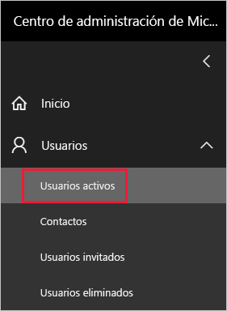
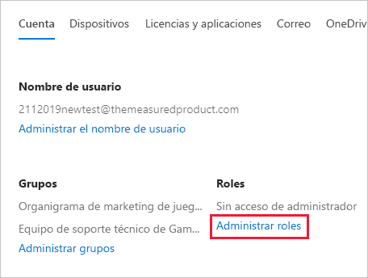
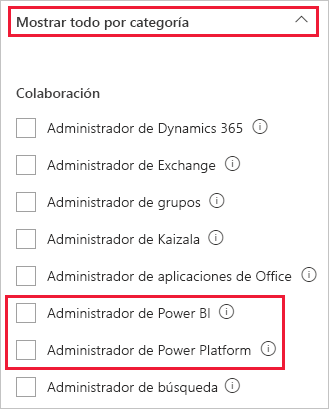

# <a name="understanding-power-bi-administrator-roles"></a>Descripción de los roles de administrador de Power BI

Para administrar Power BI para la organización, debe tener uno de los roles siguientes: administrador de Power BI, administrador de Power Platform o administrador global de Microsoft 365. Los administradores de administración de usuarios de Microsoft 365 asignan a los usuarios los roles Administrador de Power BI o Administrador de Power Platform en el Centro de administración de Microsoft 365, o bien mediante un script de PowerShell. Para más información, consulte [Asignar roles a cuentas de usuario con PowerShell](/office365/enterprise/powershell/assign-roles-to-user-accounts-with-office-365-powershell).

Los usuarios de los roles Administrador de Power BI o Administrador de Power Platform tienen control total sobre la configuración y las características administrativas de Power BI en toda la organización, excepto para las licencias. Una vez que se asigna un usuario al rol de usuario, podrá acceder al [portal de administración de Power BI](service-admin-portal.md). Allí, tendrá acceso a las métricas de uso de toda la organización y podrá controlar el uso de las características de Power BI. Estos roles de administrador son idóneos para los usuarios que necesitan acceder al portal de administración de Power BI, pero sin concederles acceso administrativo completo a Microsoft 365.

> [!NOTE]
> En la documentación de Power BI, "Administrador de Power BI" hace referencia a los usuarios en los roles de administrador de Power BI o Power Platform. En la documentación se deja claro cuando se requiere el rol de administrador global de Microsoft 365 para una tarea.

## <a name="limitations-and-considerations"></a>Limitaciones y consideraciones

Los roles de administrador de Power BI y Power Platform no proporcionan las funciones siguientes:

* Capacidad de modificar usuarios y licencias en el Centro de administración de Microsoft 365.

* Acceso a los registros de auditoría. Para obtener más información, vea [Seguimiento de actividades de usuario en Power BI](service-admin-auditing.md).

Para estas funciones se necesitan asignaciones de rol de administrador de Microsoft 365.

## <a name="assign-users-to-an-admin-role-in-the-microsoft-365-admin-center"></a>Asignación de usuarios a un rol de administrador en el Centro de administración de Microsoft 365

Para asignar un rol de administrador a los usuarios en el Centro de administración de Microsoft 365, siga estos pasos.

1. En el [Centro de administración de Microsoft 365](https://portal.office.com/adminportal/home#/homepage), seleccione **Usuarios** > **Usuarios activos**.

    

1. Seleccione el usuario al que desea asignar el rol.

1. En **Roles**, seleccione **Administrar roles**.

    

1. Expanda **Mostrar todos por categoría** y, después, seleccione **Administrador de Power BI** o **Administrador de Power Platform**.

    

1. Seleccione **Save changes** (Guardar los cambios).

## <a name="assign-users-to-the-admin-role-with-powershell"></a>Asignar a usuarios el rol de administrador con PowerShell

También puede asignar roles a los usuarios mediante PowerShell. Los usuarios se administran en Azure Active Directory (Azure AD). Si aún no tiene el módulo de PowerShell de Azure AD, [descargue e instale la última versión](https://www.powershellgallery.com/packages/AzureAD/).

1. Conéctese a Azure AD:
   ```
   PS C:\Windows\system32> Connect-AzureAD
   ```

1. Obtenga el valor **ObjectId** para el rol **Administrador de Power BI**. Puede ejecutar [Get AzureADDirectoryRole](/powershell/module/azuread/get-azureaddirectoryrole) para obtener el **ObjectId**

    ```
    PS C:\Windows\system32> Get-AzureADDirectoryRole

    ObjectId                             DisplayName                        Description
    --------                             -----------                        -----------
    00f79122-c45d-436d-8d4a-2c0c6ca246bf Power BI Service Administrator     Full access in the Power BI Service.
    250d1222-4bc0-4b4b-8466-5d5765d14af9 Helpdesk Administrator             Helpdesk Administrator has access to perform..
    3ddec257-efdc-423d-9d24-b7cf29e0c86b Directory Synchronization Accounts Directory Synchronization Accounts
    50daa576-896c-4bf3-a84e-1d9d1875c7a7 Company Administrator              Company Administrator role has full access t..
    6a452384-6eb9-4793-8782-f4e7313b4dfd Device Administrators              Device Administrators
    9900b7db-35d9-4e56-a8e3-c5026cac3a11 AdHoc License Administrator        Allows access manage AdHoc license.
    a3631cce-16ce-47a3-bbe1-79b9774a0570 Directory Readers                  Allows access to various read only tasks in ..
    f727e2f3-0829-41a7-8c5c-5af83c37f57b Email Verified User Creator        Allows creation of new email verified users.
    ```

    En este caso, el **ObjectId** del rol es 00f79122-c45d-436d-8d4a-2c0c6ca246bf.

1. A continuación, obtenga el **ObjectId** del usuario. Puede averiguarlo mediante la ejecución de [Get-AzureADUser](/powershell/module/azuread/get-azureaduser).

    ```
    PS C:\Windows\system32> Get-AzureADUser -ObjectId 'tim@contoso.com'

    ObjectId                             DisplayName UserPrincipalName      UserType
    --------                             ----------- -----------------      --------
    6a2bfca2-98ba-413a-be61-6e4bbb8b8a4c Tim         tim@contoso.com        Member
    ```

1. Para agregar el miembro al rol, ejecute [Add-AzureADDirectoryRoleMember](/powershell/module/azuread/add-azureaddirectoryrolemember).

    | Parámetro | Descripción |
    | --- | --- |
    | ObjectId |El ObjectId del rol. |
    | RefObjectId |El ObjectId de los miembros. |

    ```powershell
    Add-AzureADDirectoryRoleMember -ObjectId 00f79122-c45d-436d-8d4a-2c0c6ca246bf -RefObjectId 6a2bfca2-98ba-413a-be61-6e4bbb8b8a4c
    ```
Para obtener más información sobre el uso de PowerShell para asignar roles de administrador, vea [Roles de directorio de AzureAD](/powershell/module/azuread/#directory-roles).

## <a name="next-steps"></a>Pasos siguientes

[Administración de Power BI en su organización](service-admin-administering-power-bi-in-your-organization.md)  
[Portal de administración de Power BI](service-admin-portal.md)  

¿Tiene más preguntas? [Pruebe a preguntar a la comunidad de Power BI](https://community.powerbi.com/)
