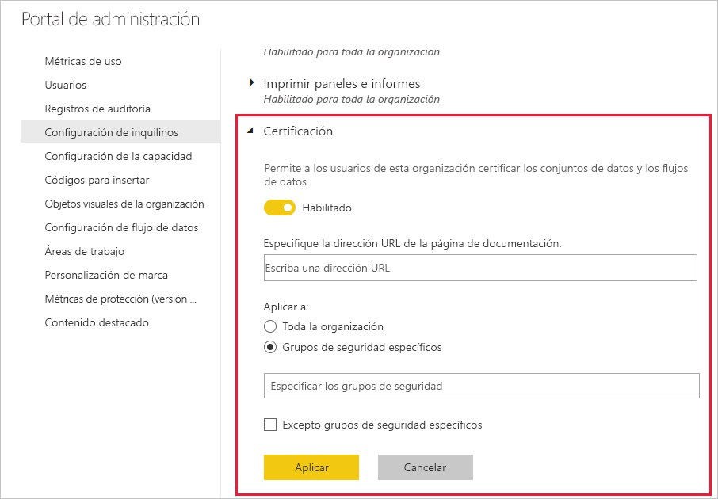

# Configuración de la certificación de conjuntos de datos y flujos de datos (versión preliminar)

La organización puede certificar los conjuntos de datos y flujos de datos que son un origen fidedigno de información importante.

Como administrador de Power BI, es el responsable de configurar el proceso de certificación para la organización. Esto significa lo siguiente:
* Habilitar la certificación en el inquilino.
* Definir una lista de grupos y usuarios que están autorizados a certificar conjuntos de datos y flujos de datos.
* Para los conjuntos de datos, proporcionar la dirección URL de la directiva de certificación de conjuntos de datos de la organización, si existe.

La certificación de conjuntos de datos y flujos de datos forma parte de la *aprobación* de conjuntos de datos y flujos de datos. Vea [aprobación de conjuntos de datos](../connect-data/service-datasets-promote.md) y [aprobación de flujos de datos](../transform-model/service-dataflows-promote-certify.md) para obtener más información.

## Configuración de la certificación

1. En el portal de administración, vaya a Configuración de inquilinos.
1. En la sección Configuración de exportación y uso compartido, expanda la sección Certificación.

   

1. Establezca el control de alternancia en **Habilitado**.
1. Para la certificación de conjuntos de datos, si la organización tiene una directiva de certificación publicada, puede proporcionar aquí su dirección URL. Se convertirá en el vínculo **Más información** de la sección de certificación del cuadro de diálogo de [configuración de aprobación de flujos datos](../connect-data/service-datasets-promote.md#request-dataset-certification). 
1. Especifique los usuarios y grupos que están autorizados para certificar conjuntos de datos y flujos de datos. Estos emisores de certificados autorizados podrán usar el botón Certificación de la sección de certificación del cuadro de diálogo de aprobación del [conjunto de datos](../connect-data/service-datasets-promote.md#request-dataset-certification) o del [flujo de datos](../transform-model/service-dataflows-promote-certify.md#certify-a-dataflow).
1. Haga clic en **Aplicar**.

## Pasos siguientes
* [Promoción de los conjuntos de datos](../connect-data/service-datasets-promote.md)
* [Certificación de los conjuntos de datos](../connect-data/service-datasets-certify.md)
* [Promoción de flujos de datos](../transform-model/service-dataflows-promote-certify.md#promote-a-dataflow)
* [Certificación de flujos de datos](../transform-model/service-dataflows-promote-certify.md#certify-a-dataflow)
* ¿Tiene alguna pregunta? [Pruebe a preguntar a la comunidad de Power BI](https://community.powerbi.com/)
