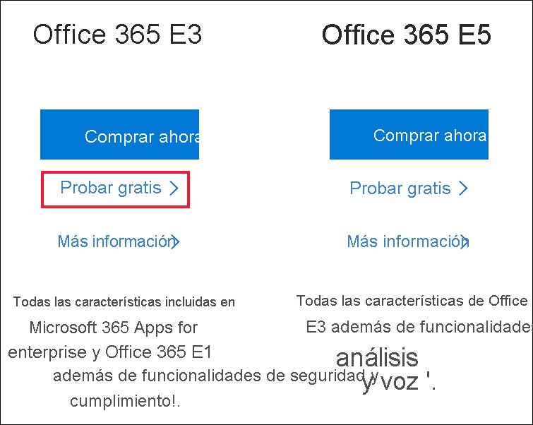
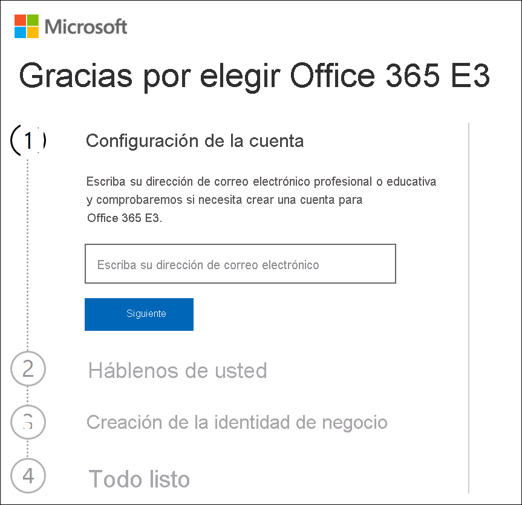
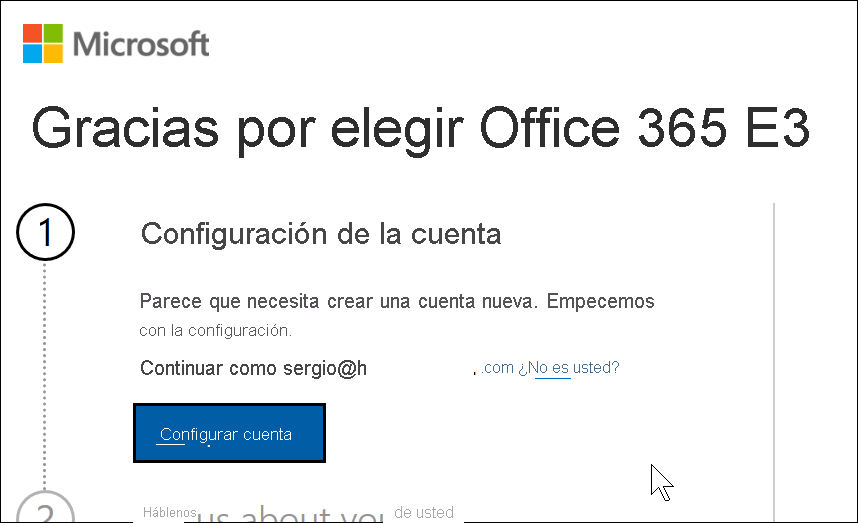
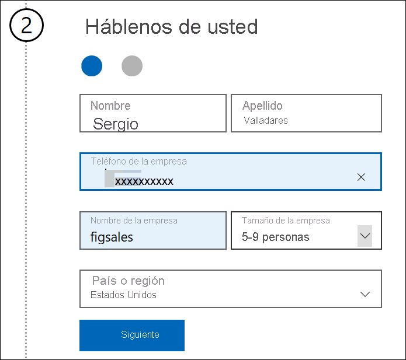
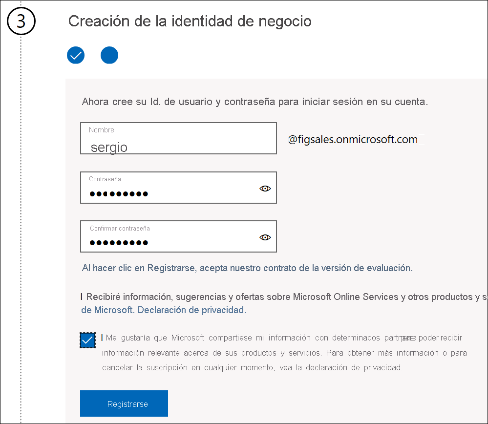
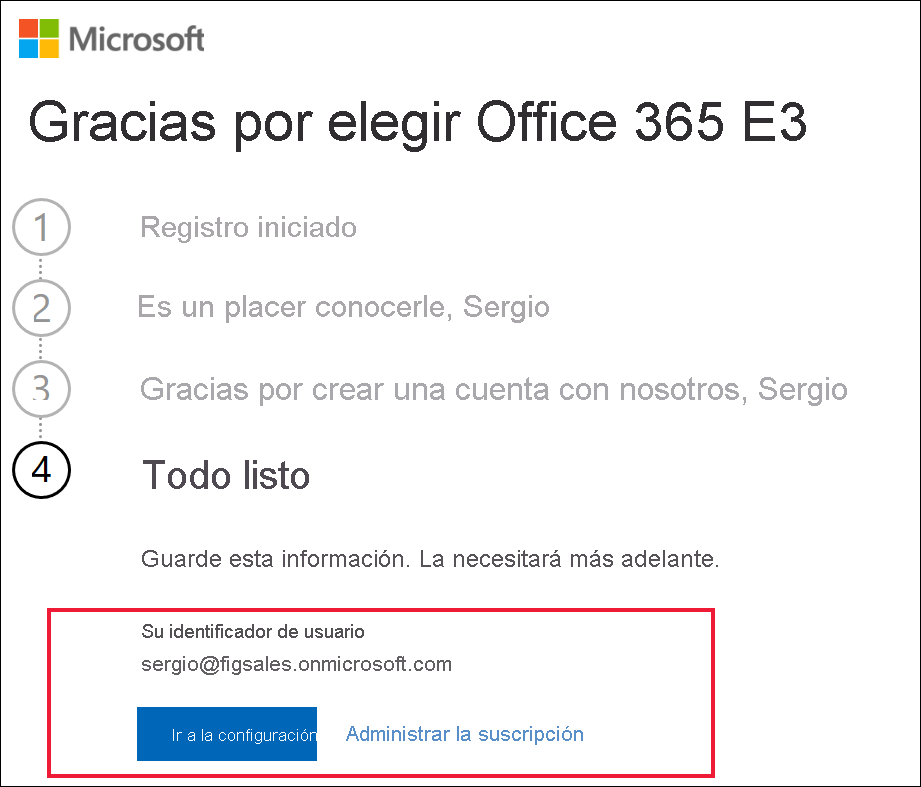

# Registro en Power BI con una nueva prueba de Microsoft 365

En este artículo se describe una manera alternativa de registrarse en el servicio Power BI si todavía no tiene una cuenta de correo electrónico profesional o educativa.

Si tiene problemas para registrarse en Power BI con su dirección de correo electrónico, primero debe asegurarse de que se trata de una [dirección de correo electrónico que se puede usar con Power BI](../fundamentals/service-self-service-signup-for-power-bi.md#supported-email-addresses). Si no es apropiada, regístrese para obtener una versión de prueba de Microsoft 365 y crear una cuenta profesional. Después, use esa nueva cuenta profesional para registrarse en el servicio Power BI. Podrá usar Power BI incluso después de que expire la versión de prueba de Microsoft 365.

## Registro para obtener una evaluación de Microsoft 365 de Office

Regístrese para obtener una versión de prueba de Microsoft 365 en el [sitio web de Microsoft 365](https://www.microsoft.com/microsoft-365/business/compare-more-office-365-for-business-plans). Si aún no tiene una cuenta, Microsoft le guiará a través de los pasos necesarios para crear una. Puesto que las cuentas de correo electrónico comerciales (como hotmail y gmail) no funcionarán con Microsoft 365, creará una cuenta que lo hará.  Esa cuenta de correo electrónico será similar a *zalan\@onmicrosoft.com*.

Si selecciona **Office 365 E5**, la evaluación incluirá Power BI Pro. La evaluación de Power BI Pro expirará al mismo tiempo que la evaluación de Office 365 E5, que actualmente es de 30 días. Si, en su lugar, selecciona **Office 365 E3**, podrá suscribirse a Power BI como usuario *gratuito* y actualizar a **Pro** para una evaluación de 60 días. 

1. Especifique su dirección de correo electrónico. Microsoft le indicará si la dirección de correo electrónico funcionará con Microsoft 365 o si tiene que crear otra dirección de correo electrónico.  

    Si necesita una nueva dirección de correo electrónico, Microsoft le guiará a través de los pasos. Primer paso, creación de una cuenta nueva. Seleccione **Configurar cuenta**.

    

2. Escriba los detalles de la nueva cuenta.

    

3. Cree su dirección de correo electrónico y contraseña. Cree un nombre de inicio de sesión similar a you@yourcompany.onmicrosoft.com. Este es la información de inicio de sesión que usará con la nueva cuenta profesional o educativa y con Power BI.

    

4. Eso es todo.  Ahora tiene una dirección de correo electrónico que puede usar para registrarse en Power BI. Consulte [Registro en Power BI como usuario individual](../fundamentals/service-self-service-signup-for-power-bi.md).

     

    Es posible que tenga que esperar hasta que se cree el inquilino.

## Consideraciones importantes

Si tiene problemas al iniciar sesión con la nueva cuenta, pruebe a usar una sesión privada del explorador.

Mediante este método de registro, se crea un nuevo inquilino de la organización, y se convertirá en el administrador del inquilino. Para obtener más información, vea [¿Qué es la administración de Power BI?](service-admin-administering-power-bi-in-your-organization.md). Puede agregar nuevos usuarios a su inquilino y compartirlo con ellos, como se describe en la [documentación para administradores de Microsoft 365](https://support.office.com/article/Add-users-individually-to-Office-365---Admin-Help-1970f7d6-03b5-442f-b385-5880b9c256ec).

## Pasos siguientes

[¿Qué es la administración de Power BI?](service-admin-administering-power-bi-in-your-organization.md)  
[Licencias de Power BI en la organización](service-admin-licensing-organization.md)  
[Registro en Power BI como usuario individual](../fundamentals/service-self-service-signup-for-power-bi.md)

¿Tiene más preguntas? [Pruebe a preguntar a la comunidad de Power BI](https://community.powerbi.com/)