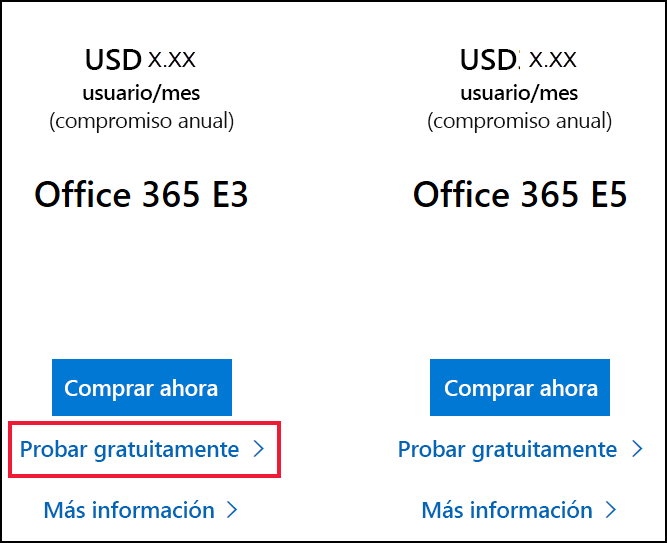
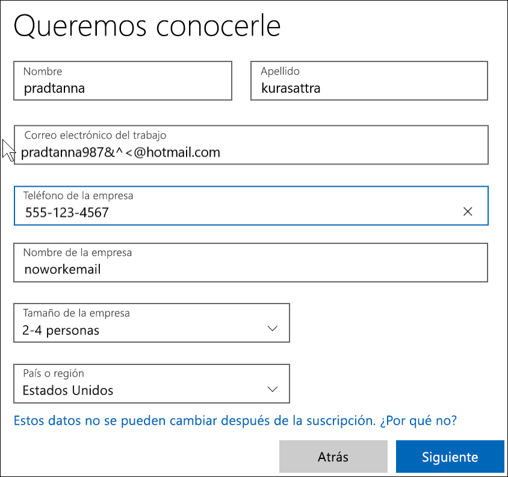

# Registro en Power BI con una nueva prueba de Microsoft 365

En este artículo se describe una manera alternativa de registrarse en Power BI si todavía no tiene una cuenta de correo electrónico profesional o educativa. 

Si tiene problemas para registrarse en Power BI con su dirección de correo electrónico, primero debe asegurarse de que se trata de una [dirección de correo electrónico que se puede usar con Power BI](../fundamentals/service-self-service-signup-for-power-bi.md#supported-email-addresses). Si no es apropiada, regístrese para obtener una versión de prueba de Microsoft 365 y crear una cuenta profesional. Después, use esa nueva cuenta profesional para registrarse en el servicio Power BI. Podrá usar Power BI incluso después de que expire la versión de prueba de Microsoft 365.

> [!NOTE]
> Office 365 ha pasado a llamarse recientemente Microsoft 365. Mientras no se actualicen todos nuestros artículos, podría seguir usándose la denominación Office 365.

1. Regístrese para obtener una versión de prueba de Microsoft 365 en el [sitio web de Microsoft 365](https://www.microsoft.com/en-us/microsoft-365/business/compare-more-office-365-for-business-plans).

    

    

    

    

    

    

1. Cree un nombre de inicio de sesión de trabajo similar a you@yourcompany.onmicrosoft.com. Será el nombre de inicio de sesión que usará con Power BI.

    

        

1. Es posible que tenga que esperar hasta que se cree el inquilino. 

Eso es todo.  Ahora tiene una dirección de correo electrónico que puede usar para registrarse en Power BI. Consulte [Registro en Power BI como usuario individual](../fundamentals/service-self-service-signup-for-power-bi.md).

## Consideraciones importantes
Si tiene problemas al iniciar sesión con la nueva cuenta, pruebe a usar una sesión privada del explorador.    

Mediante este método de registro, se crea un nuevo inquilino de la organización, y se convertirá en el administrador del inquilino. Para obtener más información, vea [¿Qué es la administración de Power BI?](service-admin-administering-power-bi-in-your-organization.md). Puede agregar nuevos usuarios a su inquilino y compartirlo con ellos, como se describe en la [documentación para administradores de Microsoft 365](https://support.office.com/en-sg/article/Add-users-individually-to-Office-365---Admin-Help-1970f7d6-03b5-442f-b385-5880b9c256ec).

## Pasos siguientes

[¿Qué es la administración de Power BI?](service-admin-administering-power-bi-in-your-organization.md)  
[Licencias de Power BI en la organización](service-admin-licensing-organization.md)  
[Registro en Power BI como usuario individual](../fundamentals/service-self-service-signup-for-power-bi.md)

¿Tiene más preguntas? [Pruebe a preguntar a la comunidad de Power BI](https://community.powerbi.com/)