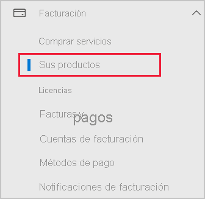

# Adición de Power BI a una suscripción de asociado de Microsoft 365

Microsoft 365 permite a las empresas revender Microsoft 365 empaquetado e integrado con sus propias soluciones, lo que proporciona a los clientes un único punto de contacto de compras, facturación y soporte técnico.

Si está interesado en agregar Power BI, a la suscripción de Microsoft 365, es recomendable que para ello se ponga en contacto con su asociado. Si el asociado no ofrece actualmente Power BI, puede seguir las opciones que se describen a continuación.

## Colaborar con su asociado para comprar Power BI

Si desea comprar una suscripción a Power BI Pro o Power BI Premium, consulte a su asociado para saber qué opciones hay:

* El asociado acuerda agregar Power BI a su cartera, para que pueda comprarle.

* El asociado puede realizar la transición a un modelo que le permita comprar Power BI directamente a Microsoft o a otro asociado que ofrezca Power BI.

## Compra en Microsoft o en otro canal

Dependiendo de la relación con su asociado, puede comprar Power BI directamente a Microsoft o a otro asociado. Puede comprobar si puede agregar suscripciones de Power BI en el centro de administración de Microsoft 365 (requiere la pertenencia al rol de administrador global o administrador de facturación).

1. Vaya al [Centro de administración de Microsoft 365](https://admin.microsoft.com/AdminPortal/Home#/homepage).

1. En el menú de la izquierda, abra **Facturación** y, después, seleccione **Sus productos**:

   

 1. Busque **Suscripciones** como se muestra en la imagen siguiente. Si ve **Suscripciones**, puede adquirir el servicio de Microsoft directamente o ponerse en contacto con otro asociado que ofrezca Power BI.

    

    Si no ve **Suscripciones**, no puede realizar la compra directamente a Microsoft ni a otro asociado.

Si el asociado no ofrece Power BI y no puede realizar la compra directamente a Microsoft o a otro asociado, considere la posibilidad de suscribirse en una evaluación gratuita.

## Registrarse para obtener una evaluación gratuita

Puede registrarse para obtener una evaluación gratuita de Power BI. Si no compra Power BI Pro al final del período de evaluación, todavía tiene una licencia gratuita que ofrece muchas de las características de Power BI. Para más información, consulte [Registro en Power BI como usuario individual](../fundamentals/service-self-service-signup-for-power-bi.md).

### Habilitar las suscripciones ad hoc

De forma predeterminada, se deshabilitan los registros individuales, también conocidos como suscripciones ad hoc. En este caso, verá el siguiente mensaje cuando intente iniciar sesión: *El departamento de TI ha desactivado la suscripción de Microsoft Power BI*.

Para habilitar las suscripciones de ad hoc, puede ponerse en contacto con un asociado y solicitar su activación. Si es un administrador del inquilino y sabe cómo usar los comandos de PowerShell de Azure Active Directory, puede habilitar personalmente las suscripciones ad hoc. Para obtener más información, siga los pasos descritos en [Habilitación o deshabilitación de la compra de autoservicio](service-admin-disable-self-service.md).

## Pasos siguientes

* [Licencias de Power BI en la organización](service-admin-licensing-organization.md)
* [Adquirir y asignar licencias de Power BI Pro](service-admin-purchasing-power-bi-pro.md)

¿Tiene más preguntas? [Pruebe a preguntar a la comunidad de Power BI](https://community.powerbi.com/)