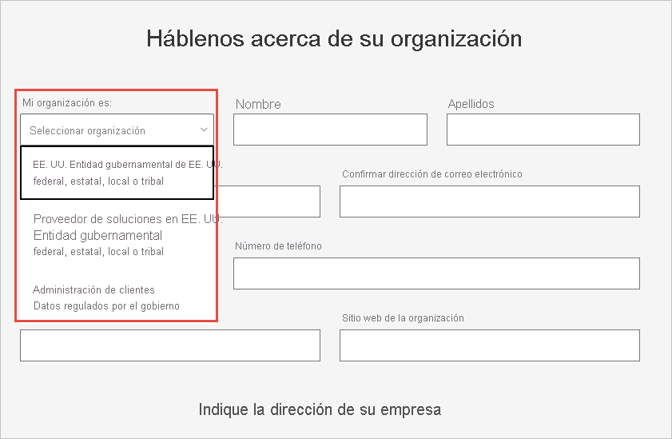

# Inscripción de una organización de la Administración Pública de Estados Unidos en el servicio Power BI

Hay una versión del servicio Power BI disponible como parte de los [planes de Microsoft 365 Administración Pública](https://www.microsoft.com/microsoft-365/government/compare-office-365-government-plans?rtc=1). Este artículo está diseñado para clientes de la Administración Pública de Estados Unidos, y el proceso de inscripción descrito aquí es diferente al que se sigue para la versión comercial del servicio Power BI.

Para obtener más información sobre el servicio Power BI para la Administración Pública de Estados Unidos, consulte el artículo [Power BI para clientes de la Administración Pública de Estados Unidos](service-govus-overview.md).

> [!NOTE]
> Este artículo está destinado a los administradores que tienen autoridad para registrar en Power BI su organización de la Administración Pública de Estados Unidos. Si es un usuario final, póngase en contacto con el administrador para obtener información sobre cómo obtener una suscripción a Power BI para la Administración Pública de Estados Unidos.
> 
> 

## Selección del proceso de registro correcto para su organización de la Administración Pública de Estados Unidos

Su organización de la Administración Pública de Estados Unidos podría ser un cliente nuevo de Government Cloud Community o podría tener ya una suscripción. En las secciones siguientes se detallan los pasos de inicio de sesión según su relación con Microsoft 365 Administración Pública y Power BI. Estos pasos son diferentes en función de su suscripción actual.

Después de registrarse en Power BI para la Administración Pública de Estados Unidos, trabaje con el equipo de cuentas para iniciar el [proceso de inclusión en listas de permitidos](#additional-signup-information) que se describe en este artículo. Este paso es necesario para habilitar completamente su organización en Government Community Cloud.

## Regístrese en un nuevo plan de Microsoft 365 Administración Pública

Si su organización es nueva en Government Cloud Community, siga estos pasos para obtener un plan de Microsoft 365 Administración Pública:

> [!NOTE]
> Estos pasos debe realizarlos el administrador global.
>

1. Vaya a [Planes de Microsoft 365 Administración Pública](https://products.office.com/government/office-365-web-services-for-government).
2. Seleccione **Comienza con una prueba gratuita**.
3. Rellene el formulario para proporcionarnos información sobre su organización. Use la lista desplegable para seleccionar el tipo de organización.

   

4. Envíe el formulario para iniciar el proceso de incorporación. Su partner o representante de Microsoft puede ayudarle si tiene preguntas.

Una vez completado este proceso, siga los pasos para los clientes existentes de Microsoft 365 Administración Pública para agregar una suscripción a Power BI.

## Incorporación de Power BI a un plan de Microsoft 365 Administración Pública

Si su organización ya tiene un plan de Microsoft 365 Administración Pública, siga estos pasos para agregar una suscripción a Power BI:

> [!NOTE]
> Estos pasos debe realizarlos el administrador global.
> 
> 

1. Inicie sesión en el centro de administración de Microsoft 365 con sus credenciales de administrador global o administrador de facturación.
2. Seleccione **Facturación** > **Servicios de compra**.
4. Busque la oferta de Power BI Pro para la Administración Pública y elija **Probar** o **Comprar ahora**.
5. Complete el pedido.
6. Asigne licencias a cuentas de usuario.

## Información adicional sobre la suscripción

Para poder usar los servicios Power BI para la Administración Pública de Estados Unidos, tiene que trabajar con su equipo de cuentas de Microsoft para agregar su organización a la lista de permitidos. El proceso de inclusión en la lista de permitidos lo usa el equipo de ingeniería de Power BI para mover a los clientes del entorno de nube comercial al entorno seguro de Government Community Cloud. Este paso garantiza que las características disponibles en la nube de la Administración Pública de Estados Unidos funcionarán según lo previsto. 

Para iniciar el proceso de inclusión en la lista de permitidos, póngase en contacto con su equipo de cuentas de Microsoft para obtener ayuda. Solo los administradores pueden solicitar incorporaciones a la lista de permitidos. El proceso tarda aproximadamente tres semanas. Durante este tiempo, el equipo de ingeniería de Power BI realiza los cambios adecuados para asegurarse de que el inquilino funcione correctamente en la nube de la Administración Pública de Estados Unidos.

## Pasos siguientes

* [Introducción a Power BI para la Administración Pública de Estados Unidos](service-govus-overview.md)
- [¿Cómo compro Microsoft 365 Government?](/office365/servicedescriptions/office-365-platform-service-description/office-365-us-government/microsoft-365-government-how-to-buy#how-do-i-buy-microsoft-365-government)