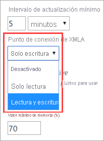
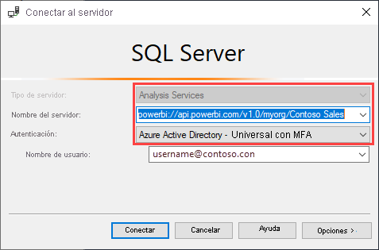
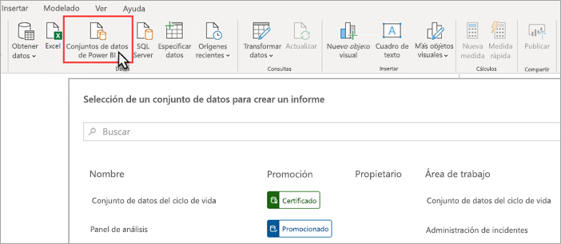
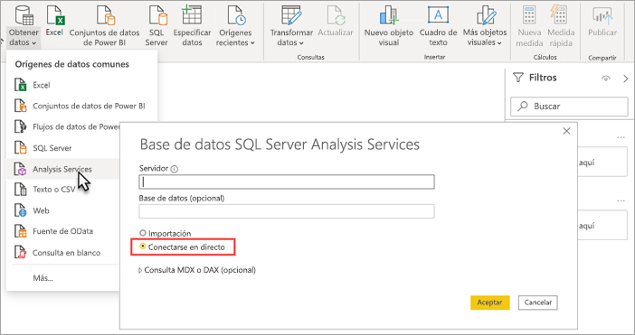

# Conectividad del conjunto de datos con el punto de conexión de XMLA

Las áreas de trabajo y los conjuntos de datos de Power BI Premium con el nivel de compatibilidad 1500 y superior admiten la conectividad de plataforma abierta de Microsoft y las aplicaciones y herramientas cliente de terceros mediante el uso de un *punto de conexión de XMLA*.

## ¿Qué es un punto de conexión de XMLA?

En Power BI Premium se usa el protocolo [XML for Analysis](/analysis-services/xmla/xml-for-analysis-xmla-reference?view=power-bi-premium-current&preserve-view=true) (XMLA) para las comunicaciones entre las aplicaciones cliente y el motor que administra las áreas de trabajo y los conjuntos de datos de Power BI. Estas comunicaciones se realizan a través de lo que normalmente se denominan puntos de conexión XMLA. XMLA es el mismo protocolo de comunicación que usa el motor de Microsoft Analysis Services, que internamente, ejecuta el modelado semántico, la gobernanza, el ciclo de vida y la administración de datos de Power BI. Los datos enviados a través del protocolo XMLA están totalmente cifrados.

De forma predeterminada, la conectividad *de solo lectura* que usa el punto de conexión está habilitada para la **carga de trabajo de los conjuntos de datos** de una capacidad. Al ser de solo lectura, las herramientas y aplicaciones de visualización de datos pueden consultar los datos del modelo de conjunto de datos, así como los metadatos, los eventos y el esquema. Las operaciones de *lectura y escritura* que usan el punto de conexión se pueden habilitar proporcionando administración de conjunto de datos, gobernanza, modelado semántico avanzado, depuración y supervisión adicionales. Con la lectura y escritura habilitada, los conjuntos de datos de Power BI Premium tienen más paridad con los procesos y las herramientas de modelado tabular de nivel empresarial de Azure Analysis Services y SQL Server Analysis Services.

> [!NOTE]
> Se recomienda usar la experiencia de área de trabajo moderna, especialmente al conectarse a los conjuntos de datos mediante el punto de conexión XMLA. Las operaciones como la creación o eliminación de conjuntos de datos no se admiten con las áreas de trabajo clásicas. Para actualizar áreas de trabajo clásicas a la experiencia moderna, consulte el artículo de [actualización de áreas de trabajo clásicas de Power BI](../collaborate-share/service-upgrade-workspaces.md).

## Herramientas de administración y modelado de datos

Estas son algunas de las herramientas más comunes que se usan con Azure Analysis Services y SQL Server Analysis Services, y que ahora son compatibles con los conjuntos de datos de Power BI Premium:

**Visual Studio con proyectos de Analysis Services** : también conocido como SQL Server Data Tools, o simplemente **SSDT**, es una herramienta de creación de modelos de nivel empresarial para los modelos tabulares de Analysis Services. Las extensiones de proyectos de Analysis Services se admiten en todas las ediciones de Visual Studio 2017 y posteriores, incluida la edición gratuita Community. Se necesita la versión 2.9.14 de la extensión, o una posterior, para implementar modelos tabulares en un área de trabajo prémium. Al implementar en un área de trabajo Premium, el modelo debe tener el nivel de compatibilidad de 1500 o superior. Se requiere lectura y escritura de XMLA en la carga de trabajo de los conjuntos de valores. Para obtener más información, consulte [Herramientas para Analysis Services](/analysis-services/tools-and-applications-used-in-analysis-services?view=power-bi-premium-current&preserve-view=true).

**SQL Server Management Studio (SSMS)**  : admite consultas DAX, MDX, y XMLA. Realice operaciones de actualización específicas y scripting de metadatos de conjuntos de datos mediante el [lenguaje de scripting de modelos tabulares (TMSL)](/analysis-services/tmsl/tabular-model-scripting-language-tmsl-reference). Se requiere solo lectura para las operaciones de consulta. Se requiere lectura y escritura para los metadatos de scripting. Requiere SSMS, versión 18.7.1, o una posterior. Descárguelo  [aquí](/sql/ssms/download-sql-server-management-studio-ssms).

**SQL Server Profiler** : instalada con SSMS, esta herramienta proporciona seguimiento y depuración de eventos de servidor. Aunque oficialmente está en desuso para SQL Server, Profiler se sigue incluyendo en SSMS y todavía se admite para Analysis Services y para Power BI Premium. Se requiere XMLA de solo lectura. Para obtener más información, consulte  [SQL Server Profiler para Analysis Services](/analysis-services/instances/use-sql-server-profiler-to-monitor-analysis-services?view=power-bi-premium-current&preserve-view=true).

**Asistente para la implementación de Analysis Services** : instalada con SSMS, esta herramienta proporciona la implementación de proyectos de modelos tabulares creados de Visual Studio para áreas de trabajo de Analysis Services y Power BI Premium. Se puede ejecutar de forma interactiva o desde la línea de comandos para la automatización. Se requiere lectura y escritura de XMLA. Para obtener más información, consulte el [Asistente para implementación de Analysis Services](/analysis-services/deployment/deploy-model-solutions-using-the-deployment-wizard?view=power-bi-premium-current&preserve-view=true).

**Cmdlets de PowerShell** : los cmdlets de Analysis Services se pueden usar para automatizar las tareas de administración del conjunto de datos, como las operaciones de actualización. Se requiere lectura y escritura de XMLA. Se requiere la versión **21.1.18221** o superior del [módulo SqlServer PowerShell](https://www.powershellgallery.com/packages/SqlServer/). Los cmdlets de Azure Analysis Services del Módulo Az.AnalysisServices no se admiten para Power BI Premium. Para obtener más información, vea [Referencia de Analysis Services PowerShell](/analysis-services/powershell/analysis-services-powershell-reference?view=power-bi-premium-current&preserve-view=true).

**Power BI Report Builder** : una herramienta para crear informes paginados. Cree una definición de informe que especifica qué datos recuperar, de dónde obtenerlos y cómo mostrarlos. Puede obtener una vista previa del informe en Report Builder y luego publicarlo en el servicio Power BI. Se requiere solo lectura de XMLA. Para más información, vea  [Power BI Report Builder](../paginated-reports/report-builder-power-bi.md).

**Editor tabular**: herramienta de código abierto para crear, mantener y administrar modelos tabulares con un editor intuitivo y ligero. Una vista jerárquica muestra todos los objetos del modelo tabular. Los objetos se organizan por carpetas para mostrar con compatibilidad para la edición de propiedades de selección múltiple y el resaltado de sintaxis de DAX. Se requiere solo lectura de XMLA para las operaciones de consulta. Se requiere lectura y escritura para las operaciones de metadatos. Para obtener más información, vea [tabulareditor.github.io](https://tabulareditor.github.io/).

**DAX Studio** : una herramienta de código abierto para la creación, el diagnóstico, el ajuste del rendimiento y el análisis de DAX. Entre las características se incluyen la exploración de objetos, el seguimiento integrado, los desgloses de la ejecución de consultas con estadísticas detalladas y resaltado y aplicación de formato de sintaxis de DAX. Se requiere solo lectura de XMLA para las operaciones de consulta. Para más información, vea  [daxstudio.org](https://daxstudio.org/).

**ALM Toolkit**: una herramienta de comparación de esquemas de código abierto para conjuntos de datos de Power BI, que se suele usar para escenarios de administración del ciclo de vida de las aplicaciones (ALM). Realice la implementación en todos los entornos y retenga los datos históricos de actualización incremental. Compare y combine archivos de metadatos, ramas y repositorios. Reutilice definiciones comunes entre conjuntos de datos. Se requiere solo lectura para las operaciones de consulta. Se requiere lectura y escritura para las operaciones de metadatos. Para obtener más información, vea  [alm-toolkit.com](http://alm-toolkit.com/).

**Microsoft Excel** : las tablas dinámicas de Excel son una de las herramientas más comunes que se usan para resumir, analizar, explorar y presentar datos de resumen de conjuntos de datos de Power BI. Se requiere solo lectura para las operaciones de consulta. Se requiere la versión Hacer clic y ejecutar de Office 16.0.11326.10000 o una versión posterior.

**Terceros** : se incluyen aplicaciones y herramientas de visualización de datos de cliente que se pueden conectar a Power BI Premium, así como consultar y consumir conjuntos de datos de este origen. La mayoría de las herramientas requiere las versiones más recientes de las bibliotecas de cliente MSOLAP, pero algunas pueden usar ADOMD. El punto de conexión de XMLA de solo lectura o de lectura y escritura depende de las operaciones.

### Bibliotecas de cliente

Las aplicaciones cliente no se comunican directamente con el punto de conexión de XMLA. En su lugar, usan *bibliotecas de cliente* como una capa de abstracción. Estas son las mismas bibliotecas de cliente que las aplicaciones usan para conectarse a Azure Analysis Services y SQL Server Analysis Services. Las aplicaciones de Microsoft como Excel, SQL Server Management Studio (SSMS) y extensión de proyectos de Analysis Services para Visual Studio instalan las tres bibliotecas de cliente y las actualizan junto con las actualizaciones de aplicaciones y extensiones normales. Los desarrolladores también pueden usar las bibliotecas de cliente para compilar aplicaciones personalizadas. En algunos casos, en especial con las aplicaciones de terceros, si no se instalan con la aplicación, es posible que tenga que instalar versiones más recientes de las bibliotecas de cliente. Las bibliotecas de cliente se actualizan mensualmente. Para más información, vea  [Bibliotecas de cliente para la conexión a Analysis Services](/azure/analysis-services/analysis-services-data-providers).

## Optimización de conjuntos de datos para operaciones de escritura mediante la habilitación de modelos grandes

Cuando se usa el punto de conexión de XMLA para la administración de conjuntos de datos con operaciones de escritura, se recomienda habilitar el conjunto de datos para modelos de gran tamaño. Esto reduce la sobrecarga de las operaciones de escritura, lo que puede hacer que sean considerablemente más rápidas. En el caso de los conjuntos de datos de más de 1 GB (después de la compresión), la diferencia puede ser significativa. Para obtener más información, consulte [Modelos grandes en Power BI Premium](service-premium-large-models.md).

## Habilitación de lectura y escritura de XMLA

De forma predeterminada, una funcionalidad Premium tiene el parámetro de la propiedad del punto de conexión de XMLA habilitado para solo lectura. Esto significa que las aplicaciones solo pueden consultar un conjunto de datos. Para que las aplicaciones puedan realizar operaciones de escritura, la propiedad del punto de conexión de XMLA debe estar habilitada para lectura y escritura. El parámetro de la propiedad del punto de conexión de XMLA para una capacidad se configura en la **carga de trabajo de los conjuntos de datos**. El parámetro de la propiedad del punto de conexión de XMLA se aplica a *todas las áreas de trabajo y conjuntos de datos* asignados a la capacidad.

### Para habilitar la lectura y escritura de una capacidad

1. En el portal de administración, seleccione **Configuración de la capacidad** > **Power BI Premium** > nombre de la capacidad.
2. Expanda **Cargas de trabajo**. En el parámetro **Punto de conexión de XMLA**, seleccione **Lectura y escritura**.

    

## Conexión a un área de trabajo Premium

Las áreas de trabajo asignadas a una capacidad tienen una cadena de conexión con un formato de dirección URL similar a  
`powerbi://api.powerbi.com/v1.0/[tenant name]/[workspace name]`.

Las aplicaciones que se conectan al área de trabajo usan la dirección URL, como si se tratase de un nombre de servidor de Analysis Services. Por ejemplo,  
`powerbi://api.powerbi.com/v1.0/contoso.com/Sales Workspace`.

Los usuarios con UPN en el mismo inquilino (no B2B) pueden reemplazar el nombre del inquilino por `myorg`. Por ejemplo,   
`powerbi://api.powerbi.com/v1.0/myorg/Sales Workspace`.

Los usuarios de B2B deben especificar el UPN de la organización en el nombre del inquilino. Por ejemplo,  
`powerbi://api.powerbi.com/v1.0/fabrikam.com/Sales Workspace`.

### Para obtener la dirección URL de la conexión del área de trabajo

En el área de trabajo **Configuración** > **Premium** > **Conexión del área de trabajo**, seleccione **Copiar**.

## Requisitos de la conexión

### Catálogo inicial

Con algunas herramientas, como SQL Server Profiler, es posible que tenga que especificar un *Catálogo inicial*. Especifique un conjunto de datos (base de datos) en el área de trabajo. En el cuadro de diálogo **Conectarse al servidor**, seleccione **Opciones** > **Propiedades de conexión** > **Conectar a base de datos** y escriba el nombre del conjunto de datos.

### Nombres del área de trabajo duplicada

Las [nuevas áreas de trabajo](../collaborate-share/service-new-workspaces.md) (creadas con la nueva experiencia de área de trabajo) en Power BI imponen la validación para impedir la creación o el cambio de nombre de las áreas de trabajo con nombres duplicados. Las áreas de trabajo que no se han migrado pueden producir nombres duplicados. Al conectarse a un área de trabajo con el mismo nombre que otra, es posible que obtenga el error siguiente:

**No se puede conectar con powerbi://api.powerbi.com/v1.0/[nombre del inquilino]/[nombre del área de trabajo].**

Para solucionar este error, además del nombre del área de trabajo, especifique el valor ObjectIDGuid, que se puede copiar desde el valor objectID del área de trabajo en la dirección URL. Anexe el valor de objectID a la dirección URL de conexión. Por ejemplo,  
"powerbi://api.powerbi.com/v1.0/myorg/Contoso Sales - 9d83d204-82a9-4b36-98f2-a40099093830".

### Nombre del conjunto de datos duplicado

Al conectarse a un conjunto de datos con el mismo nombre que otro en la misma área de trabajo, anexe el GUID del conjunto de datos al nombre del conjunto de datos. Puede obtener el nombre del conjunto de datos y el GUID cuando se conecta al área de trabajo en SSMS.

### Retraso en los conjuntos de datos mostrados

Al conectarse a un área de trabajo, los cambios de los conjuntos de datos nuevos, eliminados y cuyo nombre ha cambiado pueden tardar unos minutos en aparecer.

### Conjuntos de datos no admitidos

Los siguientes conjuntos de datos no son accesibles a través del punto de conexión XMLA. Estos conjuntos de datos no aparecerán en el área de trabajo en SSMS o en otras herramientas:

- Los conjuntos de datos basados en una conexión dinámica a un modelo de Azure Analysis Services o SQL Server Analysis Services. 
- Los conjuntos de datos basados en una conexión dinámica a un conjunto de datos de Power BI en otra área de trabajo. Para obtener más información, consulte [Introducción a los conjuntos de datos en áreas de trabajo](../connect-data/service-datasets-across-workspaces.md).
- Conjuntos de datos con datos de inserción mediante la API REST.
- Conjuntos de datos de libros de Excel.

## Seguridad

Además de que el administrador de capacidad habilite la lectura y escritura de la propiedad del punto de conexión XMLA, la opción de nivel de inquilino **Allow XMLA endpoints and Analyze in Excel with on-premises datasets** (Permitir puntos de conexión XMLA y Analizar en Excel con conjuntos de datos locales) debe estar habilitada en el portal de administración. Si es necesario generar archivos AIXL que se conecten al punto de conexión XMLA, también se debe habilitar la opción de nivel de inquilino **Permitir conexiones dinámicas**. Ambas opciones están habilitadas de forma predeterminada.

**Allow XMLA endpoints and Analyze in Excel with on-premises datasets** (Permitir puntos de conexión XMLA y Analizar en Excel con conjuntos de datos locales) es una opción de integración.

:::image type="content" source="media/service-premium-connect-tools/allow-xmla-endpoints.png" alt-text="Opción de integración que permite los puntos de conexión XMLA":::

**Permitir conexiones dinámicas** es una opción de exportación y uso compartido.

:::image type="content" source="media/service-premium-connect-tools/allow-live-connections.png" alt-text="Opción de exportación y uso compartido que permite las conexiones dinámicas":::

El acceso a través del punto de conexión de XMLA respetará la pertenencia a grupos de seguridad establecida en el nivel de área de trabajo o aplicación.

Los colaboradores del área de trabajo y superiores tienen acceso de escritura al conjunto de datos y, por tanto, son equivalentes a los administradores de bases de datos de Analysis Services. Pueden implementar nuevos conjuntos de datos desde Visual Studio y ejecutar scripts de TMSL en SSMS.

Power BI Premium en este momento no admite las operaciones que requieren permisos de administrador de servidor de Analysis Services (en lugar de administrador de base de datos), como seguimientos de nivel de servidor y suplantación de usuario mediante la propiedad de cadena de conexión [EffectiveUserName](/analysis-services/instances/connection-string-properties-analysis-services?view=power-bi-premium-current&preserve-view=true#bkmk_auth).

Otros usuarios que tienen [permiso de compilación](../connect-data/service-datasets-build-permissions.md) en un conjunto de datos son equivalentes a los lectores de bases de datos de Analysis Services. Pueden conectarse a los conjuntos de datos y examinarlos para su uso y visualización. Se respetan las reglas de seguridad de nivel de fila (RLS) y no pueden ver los metadatos del conjunto de datos interno.

### Roles de modelo

Con el punto de conexión de XMLA, se pueden definir roles para un conjunto de datos, así como la pertenencia a roles para usuarios de Azure Active Directory (AAD) y filtros de seguridad de nivel de fila (RLS). Los roles de modelo en Power BI se usan solo para RLS. Use el modelo de seguridad de Power BI para controlar los permisos más allá de RLS.

En el caso de los proyectos de modelos tabulares que se crean en Visual Studio, los roles se pueden definir mediante el administrador de roles en el diseñador de modelos. En el caso de los conjuntos de datos de Power BI, los roles se pueden definir mediante SSMS para crear objetos de roles y definir las propiedades de los roles. Aun así, en la mayoría de los casos, las definiciones de objetos de roles pueden incluirse en scripts mediante el uso de TMSL para crear o modificar el [objeto Roles](/analysis-services/tmsl/roles-object-tmsl?view=power-bi-premium-current&preserve-view=true). Los scripts de TMSL se pueden ejecutar en SSMS o con el cmdlet [Invoke-ASCmd](/powershell/module/sqlserver/invoke-ascmd?view=sqlserver-ps&preserve-view=true) de PowerShell.

Al trabajar con roles de conjunto de datos a través del punto de conexión de XMLA, se aplican las siguientes limitaciones:

- El único permiso para un *rol* que se puede establecer para conjuntos de datos de Power BI es el de lectura. Otros permisos se conceden mediante el modelo de seguridad de Power BI.
- El permiso de compilación para un conjunto de datos es necesario para el acceso de lectura a través del punto de conexión de XMLA, independientemente de la existencia de roles de conjunto de datos.
- Actualmente, las reglas de seguridad de nivel de objeto (OLS) no se admiten en Power BI.

Para más información, consulte [Roles (SSAS tabular)](/analysis-services/tabular-models/roles-ssas-tabular).

### Configuración de credenciales de origen de datos

Los metadatos especificados mediante el punto de conexión de XMLA pueden crear conexiones a orígenes de datos, pero no pueden establecer credenciales de origen de datos. En su lugar, las credenciales se pueden establecer en la página de configuración del conjunto de datos del servicio Power BI.

### Entidades de servicio

Las entidades de servicio son un registro de aplicación de Azure Active Directory que se crean en el inquilino para realizar operaciones desatendidas de nivel de recursos y servicios. Se trata de un tipo único de identidad de usuario con el nombre de la aplicación, el identificador de la aplicación, el identificador del inquilino y el secreto de cliente o el certificado como contraseña. Power BI Premium usa la misma funcionalidad de entidad de servicio que Power BI Embedded.

En Power BI Premium, las entidades de servicio también se pueden usar con el punto de conexión XMLA para automatizar tareas de administración de conjuntos de datos tales como aprovisionamiento de áreas de trabajo, implementación de modelos y actualización de conjuntos de datos, mediante:

- PowerShell
- Azure Automation
- Azure Logic Apps
- Aplicaciones cliente personalizadas

Para obtener más información, consulte [Automatización de tareas de área de trabajo y conjunto de datos de Premium con entidades de servicio](service-premium-service-principal.md).

## Implementación de proyectos de modelo desde Visual Studio (SSDT)

La implementación de un proyecto de modelo tabular en Visual Studio en un área de trabajo Power BI Premium es muy similar a la implementación en un servidor de Azure o SQL Server Analysis Services. Las únicas diferencias se encuentran en la propiedad del servidor de implementación especificada para el proyecto y en cómo se especifican las credenciales del origen de datos para que las operaciones de procesamiento puedan importar datos de orígenes de datos en el nuevo conjunto de datos del área de trabajo.

Para implementar un proyecto de modelo tabular creado en Visual Studio, primero debe establecer la dirección URL de la conexión del área de trabajo en la propiedad del **servidor de implementación** del proyecto. En Visual Studio, en **Explorador de soluciones**, haga clic con el botón derecho en el proyecto > **Propiedades**. En la propiedad **Servidor**, pegue la dirección URL de la conexión del área de trabajo.

Cuando se ha especificado la propiedad del servidor de implementación, se puede implementar el proyecto.

**Cuando se implementa la primera vez**, se crea un conjunto de datos en el área de trabajo utilizando los metadatos de model.bim. Como parte de la operación de implementación, una vez creado el conjunto de datos en el área de trabajo desde los metadatos del modelo, el procesamiento para cargar datos en el conjunto de datos a partir de orígenes de datos producirá un error.

Se produce un error de procesamiento porque a diferencia de la implementación en una instancia de Azure o SQL Server Analysis Server, donde se solicitan las credenciales del origen de datos como parte de la operación de implementación, al implementar en un área de trabajo Premium las credenciales del origen de datos no se pueden especificar como parte de la operación de implementación. En su lugar, una vez que la implementación de metadatos se ha realizado correctamente y se ha creado el conjunto de datos, las credenciales del origen de datos se especifican en el servicio Power BI en la configuración del conjunto de datos. En el área de trabajo, seleccione **Conjuntos de datos** > **Configuración** > **Credenciales del origen de datos** > **Editar credenciales**.

Cuando se especifican las credenciales del origen de datos, puede actualizar el conjunto de datos en el servicio Power BI, configurar la actualización de la programación o procesar (actualizar) desde SQL Server Management Studio para cargar datos en el conjunto de datos.

Se observa la propiedad **Opción de procesamiento** especificada en el proyecto de Visual Studio. Sin embargo, si un origen de datos aún no tiene credenciales especificadas en el servicio Power BI, aunque la implementación de los metadatos se realice correctamente, se producirá un error de procesamiento. Puede establecer la propiedad en **No procesar**, lo que impide que se intente procesar como parte de la implementación, pero es posible que desee volver a establecer la propiedad al valor **predeterminado** porque una vez especificadas las credenciales del origen de datos en la configuración del origen de datos para el nuevo conjunto de datos, el procesamiento como parte de las operaciones de implementación posteriores se realizará correctamente.

## Conectarse con SSMS

El uso de SSMS para conectarse a un área de trabajo es igual que conectarse a un servidor de Azure o SQL Server Analysis Services. La única diferencia es que se especifica la dirección URL del área de trabajo en el nombre del servidor y se debe usar la autenticación **Active Directory - Universal con MFA**.

### Conexión a un área de trabajo con SSMS

1. En SQL Server Management Studio, seleccione **Conectar** > **Conectar con el servidor**.

2. En **Tipo de servidor**, seleccione **Analysis Services**. En **Nombre del servidor**, escriba la dirección URL del área de trabajo. En **Autenticación**, seleccione **Active Directory - Universal con MFA** y, después, en **Nombre de usuario**, escriba el identificador de usuario de la organización.

    

Cuando se haya conectado, el área de trabajo se muestra como un servidor de Analysis Services, y los conjuntos de datos del área de trabajo se muestran como bases de datos.  

Para obtener más información sobre el uso de SSMS para generar scripts de metadatos, vea [Crear scripts de Analysis Services](/analysis-services/instances/create-analysis-services-scripts-in-management-studio?view=power-bi-premium-current&preserve-view=true) y [lenguaje de scripting de modelos tabulares (TMSL)](/analysis-services/tmsl/tabular-model-scripting-language-tmsl-reference?view=power-bi-premium-current&preserve-view=true).

## Actualización del conjunto de datos

El punto de conexión de XMLA habilita una amplia gama de escenarios para la funcionalidad de actualización específica mediante SSMS, la automatización con PowerShell, [Azure Automation](/azure/automation/automation-intro) y [Azure Functions](/azure/azure-functions/functions-overview) mediante TOM. Por ejemplo, puede actualizar ciertas particiones históricas de [actualizaciones incrementales](service-premium-incremental-refresh.md) sin tener que volver a cargar todos los datos históricos.

A diferencia de la configuración de la actualización en el servicio Power BI, las operaciones de actualización a través del punto de conexión de XMLA no se limitan a 48 actualizaciones al día, y no se impone el [tiempo de espera de actualización programado](../connect-data/refresh-troubleshooting-refresh-scenarios.md#scheduled-refresh-timeout).

## Vistas de administración dinámica (DMV)

Las [vistas de administración dinámica](/analysis-services/instances/use-dynamic-management-views-dmvs-to-monitor-analysis-services) de Analysis Services proporcionan visibilidad de metadatos del conjunto de datos, así como su linaje y uso de recursos. Las vistas de administración dinámica disponibles para realizar consultas en Power BI a través del punto de conexión de XMLA se limitan a, como máximo, las que requieren permisos de administrador de base de datos. No se puede tener acceso a algunas vistas de administración dinámica porque, por ejemplo, requieren permisos de administrador de servidor de Analysis Services.

## Conjuntos de datos creados de Power BI Desktop

### Metadatos mejorados

Las operaciones de escritura de XMLA en conjuntos de datos creados en Power BI Desktop y que se publican en un área de trabajo Premium requieren metadatos mejorados habilitados. Para obtener más información, consulte [Uso de metadatos de conjunto de datos mejorado](../connect-data/desktop-enhanced-dataset-metadata.md).

> [!CAUTION]
> En este momento, una operación de escritura en un conjunto de datos creado en Power BI Desktop impedirá que se descargue de nuevo como un archivo PBIX. Asegúrese de conservar el archivo PBIX original.

### Declaración de origen de datos

Al conectarse a orígenes de datos y consultar datos, Power BI Desktop utiliza expresiones de Power Query M como declaraciones de orígenes de datos en línea. Aunque se admite en áreas de trabajo de Power BI Premium, la declaración de origen de datos en línea de Power Query M no es compatible con Azure Analysis Services ni SQL Server Analysis Services. En su lugar, las herramientas de modelado de datos de Analysis Services como Visual Studio crean metadatos con declaraciones de orígenes de datos de tipo *estructurado* o *proveedor*. Con el punto de conexión de XMLA, Power BI Premium también admite orígenes de datos estructurados y de proveedor, pero no como parte de las declaraciones de orígenes de datos en línea de Power Query M en modelos de Power BI Desktop. Para obtener más información, consulte [Descripción de los proveedores](/azure/analysis-services/analysis-services-datasource#understanding-providers).

### Power BI Desktop en modo de conexión directa

Power BI Desktop puede conectarse a un conjunto de datos de Power BI Premium mediante una conexión dinámica. Cuando se usa una conexión dinámica, no es necesario replicar los datos localmente. Así, es más fácil que los usuarios consuman modelos semánticos. Los usuarios pueden conectarse de dos maneras:

La primera consiste en seleccionar los **conjuntos de datos de Power BI** y, después, elegir un conjunto de datos para crear un informe. Esto es lo que se **recomienda** a los usuarios para conectarse a los conjuntos de datos de forma dinámica. Este método mejora la detección, ya que muestra el nivel de aprobación de los conjuntos de datos. No es necesario que los usuarios busquen y realicen un seguimiento de las URL del área de trabajo. Para buscar un conjunto de datos, los usuarios solo tienen que escribir el nombre del conjunto de datos o desplazarse para encontrar el conjunto de datos que están buscando.

La segunda manera consiste en que los usuarios se conectan mediante **Obtener datos** > **Analysis Services**, especifican un nombre de área de trabajo de Power BI Premium como URL, seleccionan **Conectar en directo** y, después, seleccionan un conjunto de datos en Navigator. En este caso, Power BI Desktop usa el punto de conexión XMLA para conectarse dinámicamente al conjunto de datos como si fuera un modelo de datos de Analysis Services. 

Las organizaciones que tienen informes existentes conectados dinámicamente a los modelos de datos de Analysis Services que pretenden migrar a los conjuntos de datos de Power BI Premium solo tienen que cambiar la URL del nombre del servidor en **Transformar datos** > **Configuración del origen de datos**.

## Registros de auditoría

Cuando las aplicaciones se conectan a un área de trabajo, el acceso a través de puntos de conexión de XMLA se registra en los registros de auditoría de Power BI con las operaciones siguientes:

|Nombre descriptivo de la operación   |Nombre de operación   |
|---------|---------|
|Conexión a conjunto de datos de Power BI desde una aplicación externa      |  ConnectFromExternalApplication        |
|Solicitud de actualización de conjunto de datos de Power BI desde una aplicación externa      | RefreshDatasetFromExternalApplication        |
|Creación de conjunto de datos de Power BI desde una aplicación externa      |  CreateDatasetFromExternalApplication        |
|Edición de conjunto de datos de Power BI desde una aplicación externa     |  EditDatasetFromExternalApplication        |
|Eliminación de conjunto de datos de Power BI desde una aplicación externa      |  DeleteDatasetFromExternalApplication        |

Para obtener más información, vea  [Auditoría de Power BI](service-admin-auditing.md).

## Vea también

¿Tiene más preguntas? [Pruebe a preguntar a la comunidad de Power BI](https://community.powerbi.com/)
