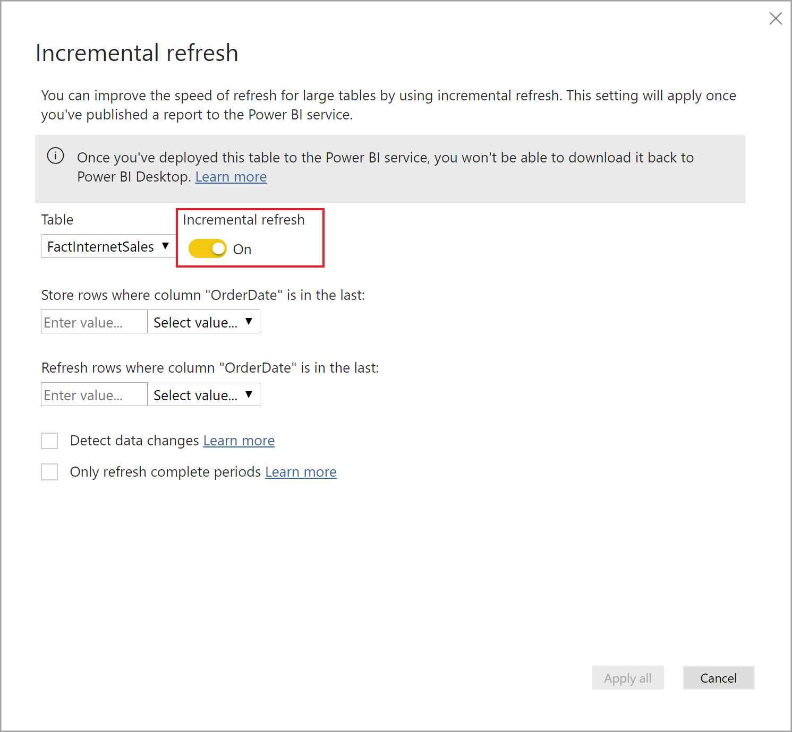

# <a name="incremental-refresh-in-power-bi"></a>Actualizaciones incrementales en Power BI

La actualización incremental permite usar conjuntos de datos muy grandes en Power BI, lo que reporta las siguientes ventajas:

> [!div class="checklist"]
> * **Las actualizaciones son más rápidas**: solo hay que actualizar los datos que se han modificado. Por ejemplo, se actualizan solo los últimos cinco días de un conjunto de datos de 10 años.
> * **Las actualizaciones son más confiables**: ya no es necesario mantener conexiones de larga duración a sistemas de origen volátiles.
> * **Se reduce el consumo de recursos**: al haber menos datos que actualizar, se reduce el consumo total de memoria y de otros recursos.

> [!NOTE]
> Ahora, las actualizaciones incrementales están disponibles para Power BI Pro, Premium y en las suscripciones y conjuntos de datos compartidos.

> [!NOTE]
> Power BI Premium publicó recientemente una nueva versión Premium, denominada **Premium Gen2**, que se encuentra actualmente en versión preliminar. Premium Gen2 simplifica la administración de las funcionalidades Premium y reduce la sobrecarga de administración. Premium Gen2 mejora significativamente la actualización programada, al habilitar el escalado automático para evitar conflictos de actualización. Para más información, vea [Power BI Premium Generation 2 (versión preliminar)](service-premium-what-is.md#power-bi-premium-generation-2-preview).


## <a name="configure-incremental-refresh"></a>Configuración de la actualización incremental

Las directivas de actualización incremental se definen en Power BI Desktop y se aplican cuando se publican en el servicio Power BI.

### <a name="filter-large-datasets-in-power-bi-desktop"></a>Filtrar conjuntos de datos grandes en Power BI Desktop

Es posible que los conjuntos de datos grandes (que pueden contener miles de millones de filas) no quepan en el modelo de Power BI Desktop, porque el archivo PBIX está limitado por los recursos de memoria disponibles en el equipo de escritorio. Por tanto, normalmente estos conjuntos de datos se filtran durante la importación. Este tipo de filtrado se aplica con independencia del uso de la actualización incremental. Para la actualización incremental, se filtra mediante los parámetros de fecha y hora de Power Query.

#### <a name="rangestart-and-rangeend-parameters"></a>Parámetros RangeStart y RangeEnd

Para la actualización incremental, los conjuntos de datos se filtran mediante los parámetros de fecha y hora de Power Query con los nombres reservados **RangeStart** y **RangeEnd** (que distinguen mayúsculas de minúsculas). Estos parámetros se usan para filtrar los datos importados en Power BI Desktop y también para particionar de forma dinámica los datos en intervalos una vez publicados en el servicio Power BI. El servicio sustituye los valores de parámetro para filtrar por cada partición. No hay necesidad de definirlos en la configuración del conjunto de datos del servicio. Una vez publicados, el servicio Power BI reemplaza automáticamente los valores de parámetro,

Para definir los parámetros con valores predeterminados, haga clic en **Administrar parámetros** en el editor de Power Query.


Con los parámetros definidos, después puede aplicar el filtro si selecciona la opción de menú **Filtro personalizado** para una columna.


Procure filtrar las filas en las que el valor de la columna sea *igual o posterior a* **RangeStart** y *anterior a* **RangeEnd**. Otras combinaciones de filtros pueden dar lugar a un doble recuento de filas.


> [!IMPORTANT]
> Compruebe que las consultas tienen un valor igual a (=) en **RangeStart** o **RangeEnd**, pero no en ambos. Si el valor igual a (=) existe en ambos parámetros, una fila podría satisfacer las condiciones de dos particiones, lo que podría provocar la duplicación de datos en el modelo. Por ejemplo,  
> \#"Filtered Rows" = Table.SelectRows(dbo_Fact, each [OrderDate] **>= RangeStart** and [OrderDate] **<= RangeEnd**) podrían dar lugar a datos duplicados.

> [!TIP]
> Aunque el tipo de datos de los parámetros debe ser fecha y hora, se pueden convertir para que coincidan con los requisitos del origen de datos. Por ejemplo, la siguiente función de Power Query convierte un valor de fecha y hora para que aparezca como una clave suplente de enteros con la forma *ddmmaaaa*, algo habitual en los almacenamientos de datos. Se puede llamar a la función durante el paso de filtrado.
>
> `(x as datetime) => Date.Year(x)*10000 + Date.Month(x)*100 + Date.Day(x)`

Seleccione **Cerrar y aplicar** en el editor de Power Query. Ahora deberíamos tener un subconjunto del conjunto de datos en Power BI Desktop.

#### <a name="filter-date-column-updates"></a>Filtrado de las actualizaciones de columna de fecha

El filtro de la columna de fecha se usa para particionar de forma dinámica los datos en intervalos en el servicio Power BI. La actualización incremental no está diseñada para admitir casos en los que la columna de fecha filtrada se actualiza en el sistema de origen. Una actualización se interpretará como una inserción y una eliminación, no como una actualización real. Si la eliminación se produce en el intervalo histórico y no en el intervalo incremental, no se seleccionará. Esto puede provocar errores de actualización de datos debido a conflictos de clave de partición.

#### <a name="query-folding"></a>Plegado de consultas

Es importante que los filtros de partición se inserten en el sistema de origen cuando las consultas se envían para las operaciones de actualización. La transferencia del filtrado significa que el origen de datos debe admitir el plegado de consultas. La mayoría de orígenes de datos compatibles con las consultas SQL admiten el plegado de consultas. Pero los orígenes de datos, como los archivos planos, los blobs y las fuentes web normalmente no lo hacen. En casos en los que el filtro no es compatible con el back-end de origen de datos, no se puede realizar la transferencia. En tales casos, el motor de mashup compensa y aplica el filtro localmente, lo cual puede requerir la recuperación del conjunto de datos completo desde el origen de datos. Esto puede provocar que una actualización incremental sea muy lenta y el proceso puede quedarse sin recursos en el servicio Power BI o en la puerta de enlace de datos local, si se utiliza.

Dados los diversos niveles de compatibilidad con el plegado de consultas para cada origen de datos, se recomienda comprobar que la lógica de filtro se incluye en las consultas de origen. Para facilitar esta tarea, Power BI Desktop intenta realizar esta comprobación de forma automática. Si no lo puede comprobar, se muestra una advertencia en el cuadro de diálogo de la actualización incremental al definir la directiva de actualización incremental. Los orígenes de datos basados en SQL como SQL, Oracle y Teradata pueden depender de esta advertencia. Es posible que otros orígenes de datos no puedan ejecutar la comprobación sin realizar el seguimiento de las consultas. Si Power BI Desktop no puede realizar la confirmación, se muestra la advertencia siguiente. Si ve esta advertencia y quiere comprobar que se está produciendo el plegado de consultas necesario, puede usar la característica Diagnóstico de consulta o realizar un seguimiento de las consultas que la base de datos de origen ha recibido.

 

### <a name="define-the-refresh-policy"></a>Definir la directiva de actualización

La actualización incremental está disponible en el menú contextual de las tablas, excepto en los modelos de conexión dinámica.


#### <a name="incremental-refresh-dialog"></a>Cuadro de diálogo Actualización incremental

Se abre el cuadro de diálogo Actualización incremental. Use el botón de alternancia para habilitar o deshabilitar el cuadro de diálogo.



> [!NOTE]
> Si la expresión de Power Query relativa a la tabla no hace referencia a los parámetros con nombres reservados, el botón de alternancia se deshabilita.

En el texto del encabezado se explica lo siguiente:

- Las directivas de actualización se definen en Power BI Desktop y se aplican por medio de operaciones de actualización en el servicio.

- Si descarga el archivo PBIX que contiene una directiva de actualización incremental desde el servicio Power BI, no se podrá abrir en Power BI Desktop. Aunque es posible que esto se admita en el futuro, recuerde que estos conjuntos de datos pueden crecer tanto que sea poco práctico descargarlos y abrirlos en un equipo de escritorio convencional.

#### <a name="refresh-ranges"></a>Frecuencias de actualización

En el ejemplo siguiente se define una directiva de actualización para almacenar los datos de cinco años naturales completos más los datos del año actual hasta la fecha de hoy y actualizar de forma incremental 10 días completos de datos. La primera operación de actualización carga los datos históricos. Las actualizaciones posteriores son incrementales y (si se han programado para ejecutarse a diario) realizan las operaciones siguientes:

- Se agrega un nuevo día de datos.

- Se actualizan 10 días completos hasta la fecha actual.

- Se quitan los años naturales con una antigüedad de más de cinco años con respecto a la fecha actual. Por ejemplo, si la fecha actual es el día 1 de enero de 2019, se quitará el año 2013.

La primera actualización en el servicio Power BI puede tardar más en importar los cinco años naturales enteros, pero las siguientes finalizarán en un tiempo mucho menor.


#### <a name="current-date"></a>Fecha actual

La *fecha actual* se basa en la fecha del sistema en el momento de la actualización. Si la actualización programada está habilitada para el conjunto de datos en el servicio Power BI, se tendrá en cuenta la zona horaria especificada al determinar la fecha actual. Tanto las actualizaciones programadas como las que se invocan manualmente mediante el servicio Power BI respetan la zona horaria si está disponible. Por ejemplo, en una actualización que se produce a las 8 P.M. con Hora del Pacífico (EE. UU. y Canadá) especificada como zona horaria, la fecha actual se determinará según la hora del Pacífico, y no GMT (que, de otro modo, sería al día siguiente). Las operaciones de actualización que no se invocan a través del servicio Power BI, como el [comando de actualización de TMSL](/analysis-services/tmsl/refresh-command-tmsl?view=power-bi-premium-current), no tendrán en cuenta la zona horaria de la actualización programada.


> [!NOTE]
> Es posible que todo lo que necesite sea la definición de estas frecuencias, en cuyo caso puede ir directamente al paso de publicación siguiente. Las listas desplegables adicionales se corresponden con características avanzadas.

### <a name="advanced-policy-options"></a>Opciones avanzadas de directiva

#### <a name="detect-data-changes"></a>Detectar cambios de datos

Una actualización incremental de 10 días es más eficaz que una actualización completa de cinco años. Pero es posible hacerlo incluso mejor. Si activa la casilla **Detectar cambios de datos**, puede seleccionar una columna de fecha y hora y usarla para identificar y actualizar solo los días donde los datos hayan cambiado. Aquí se da por hecho que esta columna existe en el sistema de origen, que se suele usar con fines de auditoría. **Esta columna no debe ser la misma que la usada para dividir los datos con los parámetros RangeStart/RangeEnd.** El valor máximo de esta columna se evalúa para cada uno de los períodos en la frecuencia incremental. Si no ha cambiado desde la última actualización, no es necesario actualizar período. En el ejemplo, esto podría reducir aún más los días actualizados de forma incremental de 10 a aproximadamente 2.


> [!TIP]
> El diseño actual requiere que la columna que detecta los cambios de datos sea persistente y esté almacenada en la memoria caché. Puede que quiera sopesar el uso de una de las siguientes técnicas para reducir la cardinalidad y el consumo de memoria.
>
> Durante la actualización solo debe persistir el valor máximo de esta columna, posiblemente usando una función de Power Query.
>
> Reduzca la precisión a un nivel que sea aceptable para sus requisitos de frecuencia de actualización.
>
> Defina una consulta personalizada para detectar los cambios en los datos mediante el punto de conexión de XMLA y evitar que el valor de la columna se conserve por completo. Vea las consultas personalizadas para detectar los cambios en los datos a continuación para obtener más información.

#### <a name="only-refresh-complete-periods"></a>Actualizar solo períodos completos

Supongamos que nuestra actualización está programada para ejecutarse todas las mañanas a las 4:00 A.M. Si aparecen datos en el sistema de origen durante esas 4 horas, probablemente no quiera tenerlos en cuenta. Algunas métricas empresariales (como, por ejemplo, los barriles por día en el sector petrolífero) no tienen sentido en días parciales.

Pensemos en otro ejemplo en el que hay que actualizar los datos de un sistema financiero donde los datos del mes anterior se aprueban el día 12 del mes en curso. Puede establecer la frecuencia incremental en 1 mes y programar la actualización para que se ejecute el día 12 del mes. Así, con esta opción activada, los datos de enero se actualizarían el 12 de febrero.


> [!NOTE]
> Las operaciones de actualización del servicio se ejecutan según la hora UTC. Esto puede determinar la fecha de vigencia y repercutir en los períodos completos. Tenemos previsto incluir la posibilidad de invalidar la fecha de vigencia en las operaciones de actualización.

## <a name="publish-to-the-service"></a>Publicar en el servicio

Ahora podemos actualizar el modelo. La primera actualización puede tardar más tiempo en importar los datos históricos, mientras que las siguientes serán bastante más rápidas, ya que serán actualizaciones incrementales.

## <a name="query-timeouts"></a>Tiempos de espera de las consultas

En este artículo de [solución problemas de actualización](../connect-data/refresh-troubleshooting-refresh-scenarios.md) se explica que las operaciones de actualización en el servicio Power BI están sujetas a tiempos de espera. Las consultas también pueden verse limitadas por el tiempo de espera predeterminado del origen de datos. La mayoría de los orígenes relacionales permiten invalidar los tiempos de espera en la expresión. Por ejemplo, en la siguiente expresión se usa la [función de acceso a datos de SQL Server](/powerquery-m/sql-database) para establecerla en 2 horas. Cada período definido por los intervalos de directiva envía una consulta que respeta el valor de tiempo de espera del comando.

```powerquery-m
let
    Source = Sql.Database("myserver.database.windows.net", "AdventureWorks", [CommandTimeout=#duration(0, 2, 0, 0)]),
    dbo_Fact = Source{[Schema="dbo",Item="FactInternetSales"]}[Data],
    #"Filtered Rows" = Table.SelectRows(dbo_Fact, each [OrderDate] >= RangeStart and [OrderDate] < RangeEnd)
in
    #"Filtered Rows"
```

## <a name="xmla-endpoint-benefits-for-incremental-refresh"></a>Ventajas del punto de conexión de XMLA para la actualización incremental

El [punto de conexión de XMLA](service-premium-connect-tools.md) para los conjuntos de datos de una capacidad Premium se puede habilitar para las operaciones de lectura y escritura, lo que puede proporcionar ventajas considerables para la actualización incremental. Las operaciones de actualización a través del punto de conexión de XMLA no se limitan a [48 actualizaciones al día](../connect-data/refresh-data.md#data-refresh) y no se impone el [tiempo de espera de actualización programado](../connect-data/refresh-troubleshooting-refresh-scenarios.md#scheduled-refresh-timeout), lo que puede resultar útil en escenarios de actualización incremental.

### <a name="refresh-management-with-sql-server-management-studio-ssms"></a>Actualización de la administración con SQL Server Management Studio (SSMS)

Con la lectura y escritura del punto de conexión de XMLA habilitadas, SSMS se puede usar para ver y administrar las particiones generadas por la aplicación de directivas de actualización incremental. Esto permite, por ejemplo, actualizar una partición histórica específica que no está en el intervalo incremental para realizar una actualización con fecha en el pasado sin tener que actualizar todos los datos históricos. También puede usar SSMS para cargar datos históricos para conjuntos de datos muy grandes mediante la incorporación o actualización incremental de particiones históricas en lotes.


#### <a name="override-incremental-refresh-behavior"></a>Reemplazo del comportamiento de actualización incremental

Con SSMS, también tiene más control sobre cómo invocar las actualizaciones incrementales desde el [lenguaje de scripting de modelos tabulares (TMSL)](/analysis-services/tmsl/tabular-model-scripting-language-tmsl-reference?view=power-bi-premium-current) y el [modelo de objetos tabulares (TOM)](/analysis-services/tom/introduction-to-the-tabular-object-model-tom-in-analysis-services-amo?view=power-bi-premium-current). Por ejemplo, en SSMS, en Explorador de objetos, haga clic con el botón derecho en una tabla y, a continuación, seleccione la opción de menú **Tabla de procesos**. A continuación, haga clic en el botón **script** para generar un comando de actualización de TMSL.


Los parámetros siguientes se pueden insertar en el comando de actualizar de TMSL para invalidar el comportamiento predeterminado de la actualización incremental.

- **applyRefreshPolicy**: si una tabla tiene definida una directiva de actualización incremental, applyRefreshPolicy determinará si la directiva se aplica o no. Si no se aplica la directiva, una operación de proceso completo dejará las definiciones de partición sin cambios y todas las particiones de la tabla se actualizarán por completo. El valor predeterminado es true.

- **effectiveDate**: si se está aplicando una directiva de actualización incremental, debe conocer la fecha actual para determinar los intervalos de periodos acumulados para el intervalo histórico y el intervalo incremental. El parámetro effectiveDate permite invalidar la fecha actual. Esto resulta útil para pruebas, demostraciones y escenarios empresariales en los que los datos se actualizan incrementalmente hasta una fecha anterior o posterior (por ejemplo, presupuestos en el futuro). El valor predeterminado es la fecha actual.

```json
{ 
  "refresh": {
    "type": "full",

    "applyRefreshPolicy": true,
    "effectiveDate": "12/31/2013",

    "objects": [
      {
        "database": "IR_AdventureWorks", 
        "table": "FactInternetSales" 
      }
    ]
  }
}
```

Para obtener más información sobre cómo invalidar el comportamiento predeterminado de la actualización incremental con TMSL, vea [comando Refresh](/analysis-services/tmsl/refresh-command-tmsl?view=power-bi-premium-current).

### <a name="custom-queries-for-detect-data-changes"></a>Personalización de consultas para detectar cambios de datos

Puede usar TMSL o TOM para invalidar el comportamiento de los cambios de datos detectados. Se puede usar no solo para evitar que se conserve la columna de última actualización en la memoria caché en memoria, sino que puede habilitar escenarios en los que los procesos de ETL preparan una tabla de configuración o instrucción con el fin de marcar solo las particiones que deben actualizarse. Esto puede crear un proceso de actualización incremental más eficaz donde solo se actualizan los períodos necesarios, independientemente del tiempo transcurrido desde las actualizaciones de datos.

La expresión pollingExpression está diseñada para ser una expresión M ligera o el nombre de otra consulta M. Debe devolver un valor escalar y se ejecutará para cada partición. Si el valor devuelto es diferente al de la última vez que se produjo una actualización incremental, la partición se marca para su procesamiento completo.

En el ejemplo siguiente se abarcan los 120 meses del intervalo histórico para los cambios con fecha en el pasado. Si se especifican 120 meses en lugar de 10 años, la compresión de los datos puede no ser tan eficaz, pero se evita tener que actualizar un año histórico completo (lo que sería más caro cuando fuera suficiente un mes para un cambio con fecha en el pasado).

```json
"refreshPolicy": {
    "policyType": "basic",
    "rollingWindowGranularity": "month",
    "rollingWindowPeriods": 120,
    "incrementalGranularity": "month",
    "incrementalPeriods": 120,
    "pollingExpression": "<M expression or name of custom polling query>",
    "sourceExpression": [
    "let ..."
    ]
}
```

## <a name="metadata-only-deployment"></a>Implementación de solo metadatos

Al publicar una versión nueva de un archivo PBIX desde Power BI Desktop en un área de trabajo de Power BI Premium, si ya existe un conjunto de datos con el mismo nombre, se le pedirá que reemplace el conjunto de datos existente.


En algunos casos, es posible que no desee reemplazar el conjunto de datos, especialmente con la actualización incremental. El conjunto de datos de Power BI Desktop podría ser mucho menor que el del servicio. Si el conjunto de datos del servicio tiene aplicada una directiva de actualización incremental, puede tener varios años de datos históricos que se perderán si el conjunto de datos se reemplaza. La actualización de todos los datos históricos podría tardar horas y provocar un tiempo de inactividad del sistema para los usuarios.

En su lugar, es mejor realizar una implementación solo de metadatos. Esto permite la implementación de nuevos objetos sin perder los datos históricos. Por ejemplo, si ha agregado algunas medidas, puede implementar solo las nuevas medidas sin necesidad de actualizar los datos, lo que ahorra mucho tiempo.

Cuando se configura para lectura y escritura, el punto de conexión de XMLA proporciona compatibilidad con las herramientas que hacen que esto suceda. Por ejemplo, ALM Toolkit es una herramienta de comparación de esquemas para los conjuntos de datos de Power BI y se puede usar para realizar la implementación solo de metadatos.

Descargue e instale la versión más reciente de ALM Toolkit desde el [repositorio de Git de Analysis Services](https://github.com/microsoft/Analysis-Services/releases). Los vínculos de documentación y la información sobre la compatibilidad están disponibles a través de la cinta de opciones de ayuda. Para realizar una implementación de solo metadatos, realice una comparación y seleccione la instancia de Power BI Desktop en ejecución como origen y el conjunto de datos existente en el servicio como destino. Tenga en cuenta las diferencias que se muestran y omita la actualización de la tabla con particiones de actualización incremental, o use el cuadro de diálogo Opciones para conservar las particiones para las actualizaciones de la tabla. Valide la selección para garantizar la integridad del modelo de destino y, a continuación, actualice.


## <a name="see-also"></a>Vea también

[Conectividad del conjunto de datos con el punto de conexión de XMLA](service-premium-connect-tools.md)   
[Solución de problemas de escenarios de actualización](../connect-data/refresh-troubleshooting-refresh-scenarios.md)


Power BI ha introducido Power BI Premium Gen2 como una oferta en versión preliminar, lo que mejora la experiencia con Power BI Premium mediante mejoras en los siguientes aspectos:
* Rendimiento
* Concesión de licencias por usuario
* Mayor escala
* Métricas mejoradas
* Escalado automático
* Menor sobrecarga de administración

Para más información sobre Power BI Premium Gen2, vea [Power BI Premium Generation 2 (versión preliminar)](service-premium-what-is.md#power-bi-premium-generation-2-preview).