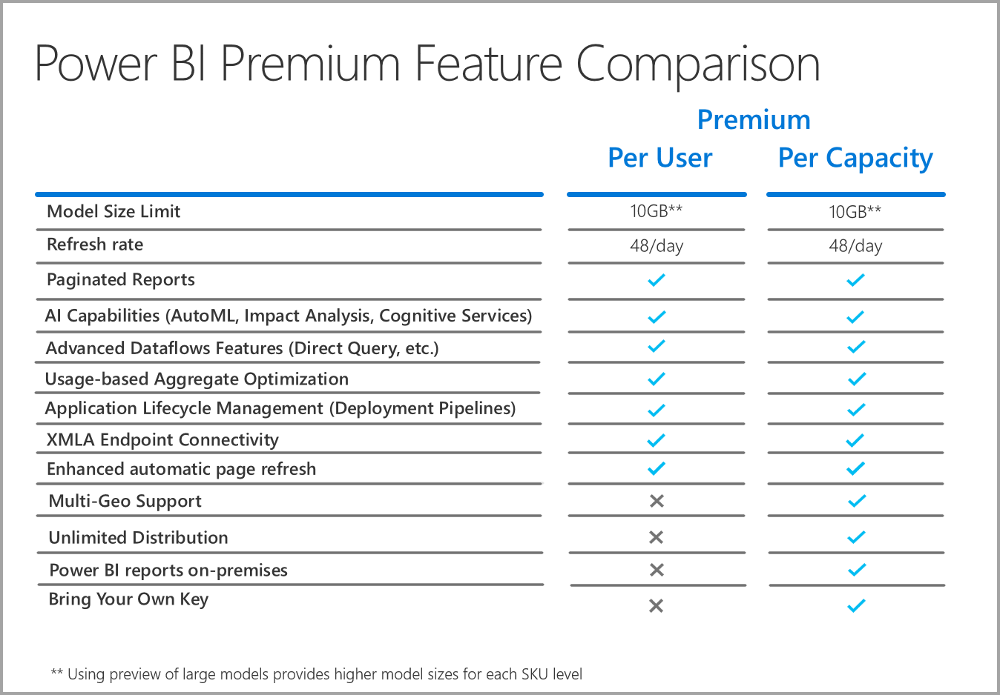

# Preguntas más frecuentes sobre Power BI Premium por usuario (versión preliminar)

Power BI **Premium por usuario** permite a las organizaciones conceder licencias para características Premium por usuario. Premium por usuario (PPU) incluye todas las funcionalidades de licencia de Power BI Pro y también agrega características como informes paginados, IA y otras funcionalidades que solo están disponibles para los suscriptores de Premium. 

En este artículo se proporcionan las respuestas a las preguntas comunes sobre la concesión de licencias Premium por usuario. Toda la información de este artículo está sujeta a cambios y mejoras, ya que Premium por usuario pasa del período de versión preliminar a publicarse con disponibilidad general (GA). 

En este artículo se agrupan las preguntas y respuestas en las siguientes categorías:
* Preguntas generales 
* Preguntas sobre administración 
* Preguntas sobre la experiencia del usuario final 

## Preguntas generales

1.  **¿Qué es Premium por usuario (PPU)?** 

    Premium por usuario (PPU) es una nueva forma de conceder licencias para características Premium por usuario. Incluye todas las funcionalidades de licencia de Power BI Pro, junto con características como informes paginados, IA y otras funcionalidades que solo están disponibles en la actualidad en el nivel Premium.

2.  **¿Cuándo estará disponible para la compra?**

    El desarrollo está en curso y no se prevé publicar PPU en disponibilidad general hasta 2021. Hasta entonces, la versión preliminar pública estará disponible para todas las organizaciones de forma gratuita.

3.  **¿Necesito una licencia de Power BI Pro y otra Premium por usuario?**

    No, con la licencia Premium por usuario, podrás utilizar todas las funcionalidades de Power BI Pro.

4.  **¿Cómo puedo obtener una evaluación gratuita?**

    Existe una experiencia de evaluación gratuita del producto y una experiencia de evaluación gratuita que está disponible en Microsoft 365. Cualquier usuario, suponiendo que la organización no tenga PPU restringido, puede acceder a la experiencia de evaluación gratuita del producto activando Premium por usuario para un área de trabajo. Las experiencias de evaluación de Microsoft 365 se pueden habilitar en el portal, de la misma forma que se inician hoy en día las evaluaciones gratuitas de Power BI Pro.  

5.  **¿Qué características están disponibles en Premium por usuario?**

    La cuadrícula de comparación de características es la siguiente:    

    

6.  **Mi organización ya tiene Power BI Premium. ¿Ahora necesito una licencia Premium por usuario para publicar contenido en mi capacidad?**
    
    Su organización puede optar por complementar su capacidad Premium con licencias Premium por usuario, pero no se requiere Premium por usuario para publicar contenido en las capacidades existentes.  

## Preguntas administrativas

1.  **¿Cómo puedo habilitar Premium por usuario (PPU) para mi inquilino?**
    
    Una vez que se aprovisiona una licencia para PPU para el inquilino, las características de PPU están disponibles en cualquier área de trabajo en la que se activen. Para la versión preliminar, solo tiene que habilitar las características Premium por usuario en la lista desplegable de capacidad seleccionando el elemento Premium por usuario, tal como se muestra en la siguiente imagen.

    

2.  **¿Funciona como una capacidad Premium? ¿Puede activar o desactivar las características?**

    No, no hay ninguna administración de memoria o CPU para PPU; en este ámbito, funciona igual a como lo hace hoy en día Power BI Pro. El administrador de inquilinos puede administrar la configuración de la característica de selección, pero no puede deshabilitar las cargas de trabajo, como los informes paginados, al igual que tampoco puede desactivar los paneles actualmente. 

3.  **¿Dónde puedo administrar la configuración de Premium por usuario que se expone?**

    Una nueva opción de menú de la configuración del inquilino para Premium por usuario permite a los administradores administrar esas opciones.

4.  **¿Puedo limitar qué usuarios pueden crear áreas de trabajo de PPU?**

    Sí, de la misma manera que actualmente puede limitar qué usuarios pueden crear áreas de trabajo.

5.  **¿Los administradores de inquilinos pueden ver qué áreas de trabajo están marcadas como Premium por usuario?**

    Sí, se indican en el elemento de menú de áreas de trabajo en la pantalla de administrador de inquilinos, donde se muestran qué áreas de trabajo están marcadas como Premium.

6.  **¿Puedo trasladar áreas de trabajo entre Premium por usuario y capacidades Premium?**

    Sí. Para la disponibilidad general (GA), deberá realizar una actualización completa de los conjuntos de datos o los flujos de datos que se encuentran en el área de trabajo una vez que la mueva de nuevo a la capacidad Premium. Este requisito impide el abuso de empresas que buscan soluciones temporales para el mecanismo de carga de la CPU de Premium Gen2.

7.  **¿Las API de capacidad están disponibles para Premium por usuario?**

    Hay disponible un conjunto limitado de API para permitir el movimiento de áreas de trabajo, pero no puede hacer cosas como desactivar las cargas de trabajo ni otras actividades de este tipo.  

## Preguntas sobre la experiencia del usuario final

1.  **Si he marcado un área de trabajo como Premium por usuario, ¿cómo lo sabrán otros usuarios?**
    
    Se ha introducido un nuevo icono para mostrar qué áreas de trabajo son Premium por usuario, tal como se muestra en la imagen siguiente:

        

2.  **¿Quién puede acceder al contenido en un área de trabajo o una aplicación Premium por usuario?**

    Cualquier usuario debe tener una licencia Premium por usuario para ver el contenido de un área de trabajo Premium por usuario. Esto incluye escenarios en los que los usuarios acceden al contenido mediante el punto de conexión XMLA, analizar en Excel, modelos compuestos, etc. Puede conceder acceso al área de trabajo a los usuarios que aún no tienen una licencia PPU, pero recibirán un mensaje que indica que no pueden acceder al contenido. Se les pedirá una licencia de evaluación si cumplen los requisitos. De lo contrario, es necesario que el administrador de inquilinos les asigne una licencia.

3.  **¿Qué contenido pueden ver los usuarios en función del tipo de licencia cuando este se comparte con ellos?**

    En el siguiente gráfico se describe quién puede ver qué tipo de contenido con PPU:

       

4.  **¿Puedo usar Premium por usuario para casos de uso insertados?**

    Premium por usuario funcionará de la misma manera en que los casos de uso insertados funcionan cuando se usa una licencia Pro. Puede insertar el contenido, y cada usuario necesitará una licencia PPU para verlo.

5.  **¿Qué ocurre con mi área de trabajo de PPU si la evaluación expira?**

    Los usuarios seguirán teniendo acceso al área de trabajo; sin embargo, el contenido que requiere ese tipo de licencia no estará disponible. Debe trasladar el área de trabajo a una capacidad Premium o simplemente desactivar el requisito. 
6.  **¿Cuánto almacenamiento total obtengo con Premium por usuario?**

    Todo el inquilino tendrá el mismo límite de 100 TB que tiene una capacidad Premium, en términos de almacenamiento.

7.  **¿La API de exportación estará disponible para Premium por usuario?**

    Está disponible actualmente para los informes paginados y está restringida a una sola llamada una vez cada 5 minutos.  Los informes de Power BI no se admiten en este momento.  

8.  **¿Cómo funcionarán las suscripciones de correo electrónico en PPU?**

    Cualquier persona con una licencia PPU o una licencia Pro puede recibir la suscripción y los datos adjuntos que incluye, siempre que dichos datos sean los mismos para todos los usuarios. Los usuarios de Pro no podrán ver el contenido en el portal del producto. Si se introducen funcionalidades de suscripción adicionales que permiten diferentes vistas de datos para distintos destinatarios, se requerirá una licencia PPU, o bien una capacidad Premium, para usar dichas funcionalidades.

9.  **¿Puedo superar las 48 actualizaciones en el portal mediante la API de actualización?**

    Las actualizaciones no se restringen en este momento.  

10. **¿Puedo usar la aplicación Power BI Premium Capacity Metrics para supervisar el uso de Premium por usuario?**

    La aplicación Power BI Premium Capacity Metrics no funciona con Premium Gen2 y, por lo tanto, no le permite ver ningún elemento de PPU.  

11. **¿Puedo hospedar un conjunto de datos de Power BI en un área de trabajo de PPU, crear un informe relacionado, publicarlo en un área de trabajo que no sea de PPU y permitir que los usuarios accedan a este informe sin necesidad de una licencia PPU?**

    No. Puesto que el conjunto de datos se encuentra en un área de trabajo de Premium por usuario, los usuarios sin licencia no podrán verlo, aunque puedan acceder al informe en el área de trabajo que no es de PPU.

12. **¿Puedo actualizar varios modelos de datos de 10 GB al mismo tiempo?**

    Está sujeto a las mismas limitaciones que se imponen para las actualizaciones paralelas en Premium Gen2.

13. **¿Puedo compartir contenido hospedado en Premium por usuario mediante la publicación en la Web?**

    La publicación en la web se comporta de la misma manera que con el contenido hospedado actualmente en la capacidad Premium.

14. **¿Puedo ejecutar un flujo de datos en un área de trabajo Premium por usuario, se puede importar en un conjunto de datos de Power BI de otra área de trabajo y los usuarios que consumen ese contenido no necesitan una licencia Premium por usuario?**

    Siempre que el autor del informe de Power BI tenga una licencia Premium por usuario, esto es posible durante el período de versión preliminar de PPU.

15. **¿Puedo usar las aplicaciones móviles de Power BI con Premium por usuario?**

    Sí, las aplicaciones móviles de Power BI se han actualizado para que funcionen con cualquier contenido publicado en una aplicación o un área de trabajo Premium por usuario.

**Pasos siguientes**

* [¿Qué es Power BI Premium?](service-premium-what-is.md)
* [Notas del producto de Microsoft Power BI Premium](https://aka.ms/pbipremiumwhitepaper)
* [Notas del producto de la planeación de una implementación de Power BI Enterprise](https://aka.ms/pbienterprisedeploy)
* [Extended Pro Trial activation](../fundamentals/service-self-service-signup-for-power-bi.md) (Activación de la extensión del período de prueba de Power BI Pro)
* [Preguntas frecuentes sobre Power BI Embedded](../developer/embedded/embedded-faq.md)

¿Tiene más preguntas? [Pruebe a preguntar a la comunidad de Power BI](https://community.powerbi.com/)
