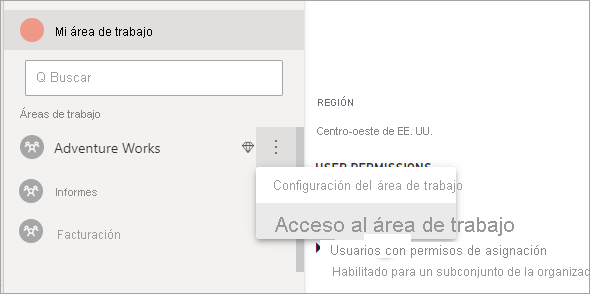

# <a name="automate-premium-workspace-and-dataset-tasks-with-service-principals"></a>Automatización de tareas de área de trabajo y conjunto de datos de Premium con entidades de servicio

Las entidades de servicio son un *registro de aplicación* de Azure Active Directory que se crean en el inquilino para realizar operaciones desatendidas de nivel de recursos y servicios. Se trata de un tipo único de identidad de usuario con el nombre de la aplicación, el identificador de la aplicación, el identificador del inquilino y el *secreto de cliente* o el certificado como contraseña.

Power BI Premium usa la misma funcionalidad de entidad de servicio que Power BI Embedded. Para más información, consulte [Inserción de contenido de Power BI con entidad de servicio y secreto de aplicación](../developer/embedded/embed-service-principal.md).

En **Power BI Premium**, las entidades de servicio también se pueden usar con el [punto de conexión XMLA](service-premium-connect-tools.md) para automatizar tareas de administración de conjuntos de datos tales como aprovisionamiento de áreas de trabajo, implementación de modelos y actualización de conjuntos de datos, mediante:

- PowerShell
- Azure Automation
- Azure Logic Apps
- Aplicaciones cliente personalizadas

Solo las [nuevas áreas de trabajo](../collaborate-share/service-new-workspaces.md) admiten conexiones de punto de conexión XMLA mediante entidades de servicio. No se admiten las áreas de trabajo clásicas. Una entidad de servicio tiene los permisos necesarios para realizar tareas en las áreas de trabajo a las que se asignan. Los permisos se asignan mediante el acceso al área de trabajo, de forma muy similar a las cuentas UPN normales.

Para realizar operaciones de escritura, la **carga de trabajo de los conjuntos de datos** de la capacidad debe tener el [punto de conexión XMLA habilitado para lectura y escritura](service-premium-connect-tools.md#enable-xmla-read-write). Los conjuntos de datos publicados desde Power BI Desktop deben tener habilitada la característica [Enhanced metadata format](../connect-data/desktop-enhanced-dataset-metadata.md) (Formato de metadatos mejorado).

## <a name="create-a-service-principal"></a>Creación de una entidad de servicio

Las entidades de servicio se crean como registro de aplicación en Azure Portal o mediante PowerShell. Al crear la entidad de servicio, asegúrese de copiar y guardar por separado el nombre de la aplicación, el identificador de la aplicación (cliente), el identificador de directorio (inquilino) y el secreto de cliente. Para conocer los pasos para crear una entidad de servicio, consulte:

[Creación de una entidad de servicio: Azure Portal](/azure/active-directory/develop/howto-create-service-principal-portal)   
[Creación de una entidad de servicio: PowerShell](/azure/active-directory/develop/howto-authenticate-service-principal-powershell)

## <a name="create-an-azure-ad-security-group"></a>Creación de un grupo de seguridad de Azure AD

De forma predeterminada, las entidades de servicio tienen acceso a cualquier configuración de inquilino para la que estén habilitadas. En función de la configuración de administración, el acceso puede incluir grupos de seguridad específicos o toda la organización.

Para restringir el acceso de la entidad de servicio a una configuración de inquilino específica, puede permitir acceso a grupos de seguridad específicos. También puede crear un grupo de seguridad dedicado para entidades de servicio y excluirlo de la configuración de inquilino que desee. Para conocer los pasos para crear un grupo de seguridad y agregar una entidad de servicio, consulte [Creación de un grupo básico e incorporación de miembros con Azure Active Directory](/azure/active-directory/fundamentals/active-directory-groups-create-azure-portal).

## <a name="enable-service-principals"></a>Habilitación de entidades de servicio

Para poder usar entidades de servicio en Power BI, un administrador debe habilitar primero el acceso a la entidad de servicio en el portal de administración de Power BI.

En **Portal de administración** > **Configuración de inquilinos** de Power BI, expanda **Concesión de permisos a las entidades de servicio para utilizar las API de Power BI** y haga clic en **Habilitado**. Para aplicar permisos a un grupo de seguridad, agregue el nombre de grupo a **Grupos de seguridad específicos**.


## <a name="workspace-access"></a>Acceso al área de trabajo

Para que la entidad de servicio tenga los permisos necesarios para realizar operaciones de área de trabajo y de conjunto de trabajo de Premium, debe agregar la entidad de servicio como administrador o miembro del área de trabajo. Aquí se describe el uso del acceso al área de trabajo en el servicio Power BI, pero también puede consultar el artículo sobre la [adición de API de REST de usuario de grupo](/rest/api/power-bi/groups/addgroupuser).

1. En el servicio Power BI, en un área de trabajo, seleccione **Más** > **Acceso al área de trabajo**.

    

2. Busque por nombre de aplicación, agregue la entidad de servicio como **administrador** o **miembro** al área de trabajo.

    

## <a name="connection-strings-for-the-xmla-endpoint"></a>Cadenas de conexión para el punto de conexión XMLA

Cuando haya creado una entidad de servicio, habilitado las entidades de servicio para el inquilino y agregado la entidad de servicio al acceso al área de trabajo, puede usarla como identidad de usuario en cadenas de conexión con el punto de conexión XMLA. La diferencia es que para los parámetros de identificador de usuario y contraseña se especifica el identificador de aplicación, el identificador de inquilino y el secreto de aplicación.

`Data Source=powerbi://api.powerbi.com/v1.0/myorg/<workspace name>; Initial Catalog=<dataset name>;User ID=app:<appId>@<tenantId>;Password=<app_secret>;`

### <a name="powershell"></a>PowerShell

#### <a name="using-sqlserver-module"></a>Uso del módulo SQLServer

En el ejemplo siguiente, se usan AppId, TenantId y AppSecret para autenticar una operación de actualización del conjunto de datos:

```powershell
Param (
        [Parameter(Mandatory=$true)] [String] $AppId,
        [Parameter(Mandatory=$true)] [String] $TenantId,
        [Parameter(Mandatory=$true)] [String] $AppSecret
       )
$PWord = ConvertTo-SecureString -String $AppSecret -AsPlainText -Force

$Credential = New-Object -TypeName "System.Management.Automation.PSCredential" -ArgumentList $AppId, $PWord

Invoke-ProcessTable -Server "powerbi://api.powerbi.com/v1.0/myorg/myworkspace" -TableName "mytable" -DatabaseName "mydataset" -RefreshType "Full" -ServicePrincipal -ApplicationId $AppId -TenantId $TenantId -Credential $Credential
```

### <a name="amo-and-adomd"></a>AMO y ADOMD

Al conectarse con aplicaciones cliente y aplicaciones web, los paquetes instalables de la versión 15.1.42.26 (junio de 2020) y versiones posteriores de las [bibliotecas cliente de AMO y ADOMD](/azure/analysis-services/analysis-services-data-providers) de NuGet admiten entidades de servicio en las cadenas de conexión con el uso de la siguiente sintaxis: `app:AppID` y la contraseña o `cert:thumbprint`.

En el ejemplo siguiente, se usan un `appID` y una `password` para realizar una operación de actualización de la base de datos modelo:

```csharp
string appId = "xxx";
string authKey = "yyy";
string connString = $"Provider=MSOLAP;Data source=powerbi://api.powerbi.com/v1.0/<tenant>/<workspacename>;Initial catalog=<datasetname>;User ID=app:{appId};Password={authKey};";
Server server = new Server();
server.Connect(connString);
Database db = server.Databases.FindByName("adventureworks");
Table tbl = db.Model.Tables.Find("DimDate");
tbl.RequestRefresh(RefreshType.Full);
db.Model.SaveChanges();
```

## <a name="next-steps"></a>Pasos siguientes

[Conectividad del conjunto de datos con el punto de conexión de XMLA](service-premium-connect-tools.md)  
[Azure Automation](/azure/automation)  
[Azure Logic Apps](/azure/logic-apps/)  
[API REST de Power BI](/rest/api/power-bi/)