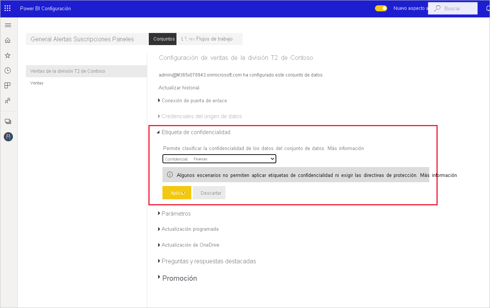

# Aplicación de etiquetas de confidencialidad en Power BI

Las etiquetas de confidencialidad de Microsoft Information Protection para informes, paneles, conjuntos de datos y flujos de datos pueden proteger el contenido confidencial contra pérdidas y el acceso no autorizado a los datos. El etiquetado correcto de los datos con etiquetas de confidencialidad garantiza que solo las personas autorizadas puedan acceder a los datos. En este artículo se muestra cómo aplicar etiquetas de confidencialidad al contenido.

Para poder aplicar etiquetas de confidencialidad en Power BI:
* Debe tener una licencia de Power BI Pro y permisos de edición en el contenido que quiera etiquetar.
* Debe pertenecer a un grupo de seguridad que tenga permisos para aplicar etiquetas de confidencialidad, tal y como se describe en el artículo titulado [Habilitación de etiquetas de confidencialidad en Power BI](./service-security-enable-data-sensitivity-labels.md).
* Se deben haber cumplido todos los [requisitos de licencia y otros](./service-security-enable-data-sensitivity-labels.md#licensing-and-requirements).

Para obtener más información sobre las etiquetas de confidencialidad en Power BI, consulte [Etiquetas de confidencialidad en Power BI](service-security-sensitivity-label-overview.md).

## Aplicación de etiquetas de confidencialidad

Cuando la protección de datos está habilitada en el inquilino, las etiquetas de confidencialidad aparecen en la columna Confidencialidad de la vista de lista de paneles, informes, conjuntos de datos y flujos de datos.

**Para aplicar o cambiar una etiqueta de confidencialidad en un informe o un panel**
1. Haga clic en **Más opciones (...)** .
1. Haga clic en **Configuración**.
1. En el panel de configuración, elija la etiqueta de confidencialidad adecuada.
1. Guarde la configuración

En la imagen siguiente se muestran estos pasos en un informe

**Para aplicar o cambiar una etiqueta de confidencialidad en un conjunto de datos o un flujo de datos**

1. Haga clic en **Más opciones (...)** .
1. Haga clic en **Configuración**.
1. En el panel de configuración, elija la etiqueta de confidencialidad adecuada.
1. Aplique la configuración.

En las dos imágenes siguientes se muestran estos pasos en un conjunto de datos.

Elija **Más opciones (...)** y, después, **Configuración**.

En la página de configuración, abra la sección Etiqueta de confidencialidad, elija la etiqueta de confidencialidad que quiera y haga clic en **Aplicar**.

## Eliminación de etiquetas de confidencialidad
Para quitar una etiqueta de confidencialidad de un informe, panel, conjunto de datos o flujo de datos, siga el [mismo procedimiento que se usa para aplicar las etiquetas](#applying-sensitivity-labels), pero elija **(Ninguna)** cuando se le pida que clasifique la confidencialidad de los datos. 

## Consideraciones y limitaciones

Consulte [Etiquetas de confidencialidad en Power BI](service-security-sensitivity-label-overview.md#limitations) para ver la lista de las limitaciones de la etiqueta de confidencialidad en Power BI.

## Pasos siguientes

En este artículo se describe cómo aplicar etiquetas de confidencialidad en Power BI. En los artículos siguientes se proporcionan más detalles acerca de la protección de datos en Power BI. 

* [Información general sobre las etiquetas de confidencialidad en Power BI](./service-security-sensitivity-label-overview.md)
* [Habilitación de etiquetas de confidencialidad en Power BI](./service-security-enable-data-sensitivity-labels.md)
* [Uso de controles de Microsoft Cloud App Security en Power BI](./service-security-using-microsoft-cloud-app-security-controls.md)