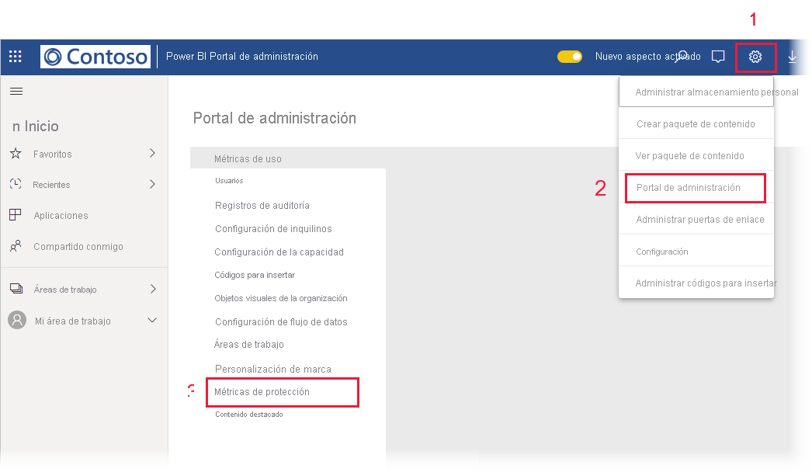

# Informe de métricas de protección de datos

## ¿Qué es el informe de métricas de protección de datos?
El informe de métricas de protección de datos es un informe dedicado que los [administradores de Power BI](./service-admin-role.md) pueden usar para supervisar el uso y la adopción de etiquetas de confidencialidad en su inquilino y realizar un seguimiento.

 
El informe incluye lo siguiente:
* Gráfico de columnas 100 % apiladas en el que se muestra el uso diario de las etiquetas de confidencialidad en el inquilino para los últimos 7, 30 o 90 días. Este gráfico facilita el seguimiento del uso relativo de los distintos tipos de etiqueta a lo largo del tiempo.
* Gráficos de anillos en los que se muestra el estado actual del uso de las etiquetas de confidencialidad en el inquilino para los paneles, los informes, los conjuntos de datos y los flujos de datos.
* Vínculo al portal de Cloud App Security en el que hay alertas relativas a Power BI, los usuarios en riesgo, los registros de actividad y otra información. Para obtener más información, vea [Uso de controles de Microsoft Cloud App Security en Power BI](./service-security-using-microsoft-cloud-app-security-controls.md).

El informe se actualiza cada 24 horas.

## Visualización del informe de métricas de protección de datos

Para abrir y ver el informe, debe tener un [rol de administrador de Power BI](./service-admin-role.md).
Para ver el informe, vaya a **Configuración > Portal de administración** y elija **Métricas de protección**.

 
 
La primera vez que abra el informe de métricas de protección de datos puede tardar unos segundos en cargarse. En el entorno privado, en "Mi área de trabajo", se creará un informe y un conjunto de datos denominado **Métricas de protección de datos (generado automáticamente)** . No se recomienda verlo aquí; este no es el informe que incluye todas las características. En su lugar, consulte el informe en el portal de administración, como se ha descrito antes.

> [!CAUTION]
> No cambie el informe ni el conjunto de datos, ya que de vez en cuando se implementan nuevas versiones del informe y los cambios que haya realizado en el original se sobrescribirán si lo actualiza a la nueva versión.

## Actualizaciones de informes

Periódicamente se publican versiones mejoradas del informe de métricas de protección de datos. Al abrir el informe, si hay una versión nueva disponible, se le preguntará si quiere abrirla. Si responde "Sí", se cargará la nueva versión del informe y se sobrescribirá la anterior. Se perderán todos los cambios que haya realizado en el informe o el conjunto de datos anterior. Puede optar por no abrir la nueva versión, pero, en ese caso, no se beneficiará de las mejoras que ofrezca. 
## Notas y consideraciones
* Para que el informe de métricas de protección de datos se genere de forma correcta, [Information Protection](./service-security-enable-data-sensitivity-labels.md) debe estar habilitado en el inquilino y [se deben haber aplicado etiquetas de confidencialidad](./service-security-apply-data-sensitivity-labels.md). 
* Para acceder a la información de Cloud App Security, la organización debe tener la [licencia de Cloud App Security](./service-security-using-microsoft-cloud-app-security-controls.md#cloud-app-security-licensing) adecuada.
* Si decide compartir información del informe de métricas de protección de datos con un usuario que no sea un administrador de Power BI, recuerde que este informe contiene información confidencial sobre la organización.
* El informe de métricas de protección de datos es un tipo especial de informe y no se muestra en las listas "Compartido conmigo", "Recientes" ni "Favoritos".
* El informe de métricas de protección de datos no está disponible para [usuarios externos (usuarios invitados de Azure Active Directory B2B)](./service-admin-azure-ad-b2b.md).
## Pasos siguientes
* [Etiquetas de confidencialidad en Power BI](./service-security-sensitivity-label-overview.md)
* [Uso de controles de Microsoft Cloud App Security en Power BI](service-security-using-microsoft-cloud-app-security-controls.md)
* [Descripción del rol Administrador del servicio Power BI](service-admin-role.md)
* [Habilitación de etiquetas de confidencialidad en Power BI](service-security-enable-data-sensitivity-labels.md)