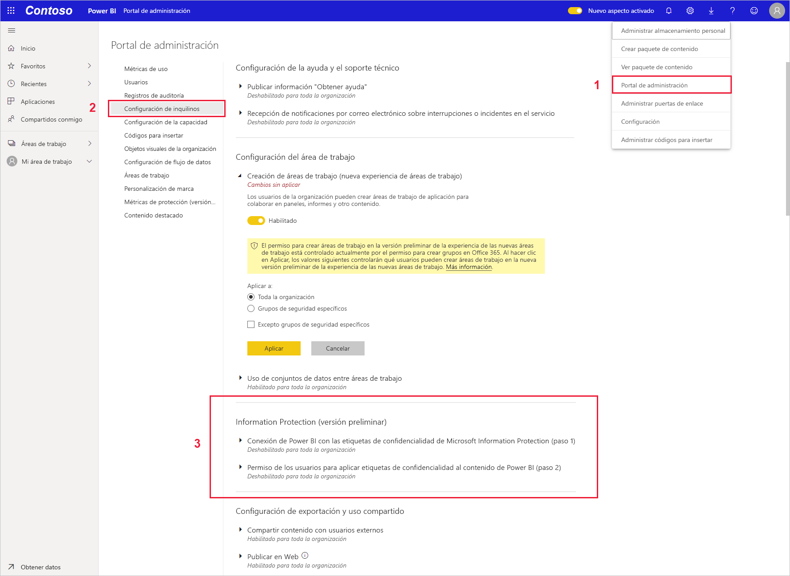
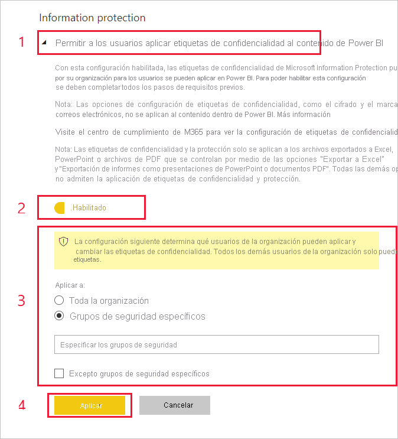

# Habilitación de las etiquetas de confidencialidad de datos en Power BI

Para poder usar las [etiquetas de confidencialidad de datos de Microsoft Information Protection](https://docs.microsoft.com/microsoft-365/compliance/sensitivity-labels) en Power BI, deben estar habilitadas en el inquilino. En este artículo se muestra a los administradores de inquilinos de Power BI cómo hacerlo. Para obtener información general sobre las etiquetas de confidencialidad de datos en Power BI, vea [Protección de datos en Power BI](service-security-data-protection-overview.md). Para obtener información sobre cómo aplicar etiquetas de confidencialidad en Power BI, vea [Aplicación de etiquetas de confidencialidad](../collaborate-share/service-security-apply-data-sensitivity-labels.md) 

Cuando las etiquetas de confidencialidad están habilitadas:

* Usuarios y grupos de seguridad concretos de la organización pueden clasificar y [aplicar etiquetas de confidencialidad](../collaborate-share/service-security-apply-data-sensitivity-labels.md) a sus paneles, informes, conjuntos de datos y flujos de datos de Power BI.
* Todos los miembros de la organización pueden ver esas etiquetas.

La habilitación de las etiquetas de confidencialidad de datos requiere una licencia de Azure Information Protection. Vea [Licencias](service-security-data-protection-overview.md#licensing) para obtener más detalles.

## Habilitación de las etiquetas de confidencialidad de datos

Vaya al **Portal de administración** de Power BI, abra el panel **Configuración de inquilinos** y busque la sección **Protección de la información**.

En la sección **Information Protection**, realice los pasos siguientes:
1. Abra **Permitir a los usuarios aplicar etiquetas de confidencialidad al contenido de Power BI**.
1. Habilite el control de alternancia.
1. Defina quién puede aplicar y cambiar las etiquetas de confidencialidad en los recursos de Power BI. De forma predeterminada, todos los usuarios de su organización podrán aplicar etiquetas de confidencialidad. Sin embargo, puede optar por habilitar la configuración de las etiquetas de confidencialidad solo para usuarios o grupos de seguridad específicos. Con toda la organización o bien con grupos de seguridad específicos seleccionados, puede excluir subconjuntos específicos de usuarios o grupos de seguridad.
   
   * Cuando las etiquetas de confidencialidad están habilitadas para toda la organización, las excepciones suelen ser grupos de seguridad.
   * Cuando las etiquetas de confidencialidad están habilitadas solo para usuarios o grupos de seguridad específicos, las excepciones suelen ser usuarios específicos.  
    Este enfoque permite impedir que determinados usuarios apliquen etiquetas de confidencialidad en Power BI, aunque pertenezcan a un grupo que tenga permisos para hacerlo.

1. Presione **Aplicar**.

> [!IMPORTANT]
> Solo los usuarios de Power BI Pro que tengan permisos para *crear* y *editar* en el recurso y que formen parte del grupo de seguridad pertinente que se estableció en esta sección, podrán establecer y editar las etiquetas de confidencialidad. Los usuarios que no forman parte de este grupo no podrán establecer ni editar las etiquetas.  

## Solución de problemas

Power BI usa las etiquetas de confidencialidad de Microsoft Information Protection. Por lo tanto, si encuentra un mensaje de error al intentar habilitar las etiquetas de confidencialidad, puede deberse a uno de los siguientes motivos:

* No tiene una [licencia](service-security-data-protection-overview.md#licensing) de Azure Information Protection.
* Las etiquetas de confidencialidad no se han migrado a la versión de Microsoft Information Protection compatible con Power BI. Más información sobre la [migración de etiquetas de confidencialidad](https://docs.microsoft.com/azure/information-protection/configure-policy-migrate-labels).
* No se ha definido ninguna etiqueta de confidencialidad de Microsoft Information Protection en la organización. Tenga en cuenta que para poder usar una etiqueta, debe formar parte de una directiva publicada. [Más información sobre las etiquetas de confidencialidad](https://docs.microsoft.com/Office365/SecurityCompliance/sensitivity-labels) o visite el [Centro de seguridad y cumplimiento de Microsoft](https://sip.protection.office.com/sensitivity?flight=EnableMIPLabels) para obtener información sobre cómo definir etiquetas y publicar directivas para su organización.

## Consideraciones y limitaciones

En la lista siguiente se proporcionan algunas limitaciones de las etiquetas de confidencialidad en Power BI:

**General**
* Las etiquetas de confidencialidad solo se pueden aplicar en paneles, informes, conjuntos de datos y flujos de datos. En la actualidad no hay etiquetas de confidencialidad disponibles para [informes paginados](../paginated-reports/report-builder-power-bi.md) y libros.
* Las etiquetas de confidencialidad de los recursos de Power BI son visibles en la lista de áreas de trabajo y en las vistas de linaje, favoritos, recientes y aplicaciones; no son visibles actualmente en la vista "compartido conmigo". Tenga en cuenta, sin embargo, que una etiqueta aplicada a un recurso de Power BI, incluso si no está visible, siempre se conservará en los datos exportados a archivos de Excel, PowerPoint y PDF.
* Las etiquetas de confidencialidad solo se admiten para los inquilinos en la nube global (pública). No se admiten las etiquetas de confidencialidad para los inquilinos de otras nubes.
* No se admiten las etiquetas de confidencialidad para las aplicaciones de plantilla. Las etiquetas de confidencialidad establecidas por el creador de la aplicación de plantilla se quitan cuando se extrae la aplicación y se instala. Asimismo, al actualizar la aplicación, las etiquetas de confidencialidad agregadas a los artefactos de una aplicación de plantilla instalada por el consumidor de la aplicación se pierden (se restablecen vacías).
* Power BI no admite etiquetas de confidencialidad de los tipos de protección [No reenviar](https://docs.microsoft.com/microsoft-365/compliance/encryption-sensitivity-labels?view=o365-worldwide#let-users-assign-permissions), [definido por el usuario](https://docs.microsoft.com/microsoft-365/compliance/encryption-sensitivity-labels?view=o365-worldwide#let-users-assign-permissions) e [HYOK](https://docs.microsoft.com/azure/information-protection/configure-adrms-restrictions). Los tipos de protección No reenviar y definido por el usuario hacen referencia a las etiquetas definidas en el [Centro de seguridad de Microsoft 365](https://security.microsoft.com/) o el [Centro de cumplimiento de Microsoft 365](https://compliance.microsoft.com/).
* No se recomienda permitir que los usuarios apliquen etiquetas primarias en Power BI. Si se aplica una etiqueta primaria al contenido, se producirá un error al exportar los datos de ese contenido a un archivo (Excel, PowerPoint y PDF). Vea [Subetiquetas (etiquetas de agrupación)](https://docs.microsoft.com/microsoft-365/compliance/sensitivity-labels?view=o365-worldwide#sublabels-grouping-labels).

**Exportarar**
* Los controles de etiqueta y protección solo se aplican cuando los datos se exportan a archivos de Excel, PowerPoint y PDF. La etiqueta y la protección no se aplican cuando los datos se exportan a archivos .csv o .pbix, Analizar en Excel o cualquier otra ruta de exportación.
* La aplicación de una etiqueta de confidencialidad y de protección a un archivo exportado no le agrega marcas de contenido. Pero si la etiqueta está configurada para aplicar marcas de contenido, el cliente de etiquetado unificado de Azure Information Protection las aplica de forma automática cuando el archivo se abre en las aplicaciones de escritorio de Office. Las marcas de contenido no se aplican de forma automática cuando se usa el etiquetado integrado para aplicaciones web, para dispositivos móviles o de escritorio. Vea [Cuando las aplicaciones de Office aplican marcas de contenido y cifrado](https://docs.microsoft.com/microsoft-365/compliance/sensitivity-labels-office-apps?view=o365-worldwide#when-office-apps-apply-content-marking-and-encryption) para obtener más detalles.
* Un usuario que exporta un archivo de Power BI tiene permisos para acceder al archivo y editarlo según la configuración de la etiqueta de confidencialidad. El usuario que exporta los datos no obtiene permisos de propietario en el archivo.
* Se producirá un error en la exportación si no se puede aplicar una etiqueta al exportar los datos a un archivo. Para comprobar si se ha producido un error en la exportación porque no se ha podido aplicar la etiqueta, haga clic en el nombre del panel o informe en el centro de la barra de título y compruebe si en el cuadro desplegable de información que se abre se indica "No se puede cargar la etiqueta de confidencialidad". Esto puede suceder si el administrador de seguridad no ha publicado o ha eliminado la etiqueta aplicada, o bien es el resultado de un problema temporal del sistema.

## Pasos siguientes

En este artículo se describe cómo habilitar las etiquetas de confidencialidad de datos en Power BI. En los artículos siguientes se proporcionan más detalles acerca de la protección de datos en Power BI. 

* [Introducción a la protección de datos en Power BI](service-security-data-protection-overview.md)
* [Aplicación de etiquetas de confidencialidad de datos en Power BI](../collaborate-share/service-security-apply-data-sensitivity-labels.md)
* [Uso de controles de Microsoft Cloud App Security en Power BI](service-security-using-microsoft-cloud-app-security-controls.md)
* [Informe de métricas de protección de datos](service-security-data-protection-metrics-report.md)