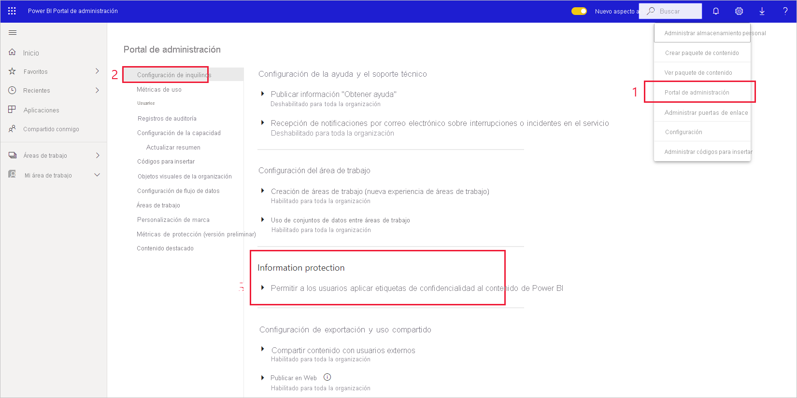

# Habilitación de etiquetas de confidencialidad en Power BI

Para poder usar las [etiquetas de confidencialidad de Microsoft Information Protection](https://docs.microsoft.com/microsoft-365/compliance/sensitivity-labels) en Power BI, deben estar habilitadas en el inquilino. En este artículo se muestra a los administradores de inquilinos de Power BI cómo hacerlo. Para obtener información general sobre las etiquetas de confidencialidad en Power BI, consulte [Etiquetas de confidencialidad en Power BI](service-security-sensitivity-label-overview.md). Para obtener información sobre cómo aplicar etiquetas de confidencialidad en Power BI, vea [Aplicación de etiquetas de confidencialidad](./service-security-apply-data-sensitivity-labels.md) 

Cuando las etiquetas de confidencialidad están habilitadas:

* Usuarios y grupos de seguridad concretos de la organización pueden clasificar y [aplicar etiquetas de confidencialidad](./service-security-apply-data-sensitivity-labels.md) a sus paneles, informes, conjuntos de datos y flujos de datos de Power BI.
* Todos los miembros de la organización pueden ver esas etiquetas.

La habilitación de etiquetas de confidencialidad requiere una licencia de Azure Information Protection. Vea [Licencias](service-security-sensitivity-label-overview.md#licensing) para obtener más detalles.

## Habilitación de etiquetas de confidencialidad

Vaya al **Portal de administración** de Power BI, abra el panel **Configuración de inquilinos** y busque la sección **Protección de la información**.

En la sección **Information Protection**, realice los pasos siguientes:
1. Abra **Permitir a los usuarios aplicar etiquetas de confidencialidad al contenido de Power BI**.
1. Habilite el control de alternancia.
1. Defina quién puede aplicar y cambiar las etiquetas de confidencialidad en los recursos de Power BI. De forma predeterminada, todos los usuarios de su organización podrán aplicar etiquetas de confidencialidad. Sin embargo, puede optar por habilitar la configuración de las etiquetas de confidencialidad solo para usuarios o grupos de seguridad específicos. Con toda la organización o bien con grupos de seguridad específicos seleccionados, puede excluir subconjuntos específicos de usuarios o grupos de seguridad.
   
   * Cuando las etiquetas de confidencialidad están habilitadas para toda la organización, las excepciones suelen ser grupos de seguridad.
   * Cuando las etiquetas de confidencialidad están habilitadas solo para usuarios o grupos de seguridad específicos, las excepciones suelen ser usuarios específicos.  
    Este enfoque permite impedir que determinados usuarios apliquen etiquetas de confidencialidad en Power BI, aunque pertenezcan a un grupo que tenga permisos para hacerlo.

1. Presione **Aplicar**.

> [!IMPORTANT]
> Solo los usuarios de Power BI Pro que tengan permisos para *crear* y *editar* en el recurso y que formen parte del grupo de seguridad pertinente que se estableció en esta sección, podrán establecer y editar las etiquetas de confidencialidad. Los usuarios que no forman parte de este grupo no podrán establecer ni editar las etiquetas.  

## Solución de problemas

Power BI usa las etiquetas de confidencialidad de Microsoft Information Protection. Por lo tanto, si encuentra un mensaje de error al intentar habilitar las etiquetas de confidencialidad, puede deberse a uno de los siguientes motivos:

* No tiene una [licencia](service-security-sensitivity-label-overview.md#licensing) de Azure Information Protection.
* Las etiquetas de confidencialidad no se han migrado a la versión de Microsoft Information Protection compatible con Power BI. Más información sobre la [migración de etiquetas de confidencialidad](https://docs.microsoft.com/azure/information-protection/configure-policy-migrate-labels).
* No se ha definido ninguna etiqueta de confidencialidad de Microsoft Information Protection en la organización. Tenga en cuenta que para poder usar una etiqueta, debe formar parte de una directiva publicada. [Más información sobre las etiquetas de confidencialidad](https://docs.microsoft.com/Office365/SecurityCompliance/sensitivity-labels) o visite el [Centro de seguridad y cumplimiento de Microsoft](https://sip.protection.office.com/sensitivity?flight=EnableMIPLabels) para obtener información sobre cómo definir etiquetas y publicar directivas para su organización.

## Consideraciones y limitaciones

Consulte [Etiquetas de confidencialidad en Power BI](service-security-sensitivity-label-overview.md#limitations) para ver la lista de las limitaciones de la etiqueta de confidencialidad en Power BI.

## Pasos siguientes

En este artículo se describe cómo habilitar las etiquetas de confidencialidad en Power BI. En los artículos siguientes se proporcionan más detalles acerca de la protección de datos en Power BI. 

* [Información general sobre las etiquetas de confidencialidad en Power BI](service-security-sensitivity-label-overview.md)
* [Aplicación de etiquetas de confidencialidad en Power BI](../collaborate-share/service-security-apply-data-sensitivity-labels.md)
* [Uso de controles de Microsoft Cloud App Security en Power BI](service-security-using-microsoft-cloud-app-security-controls.md)
* [Informe de métricas de protección](service-security-data-protection-metrics-report.md)