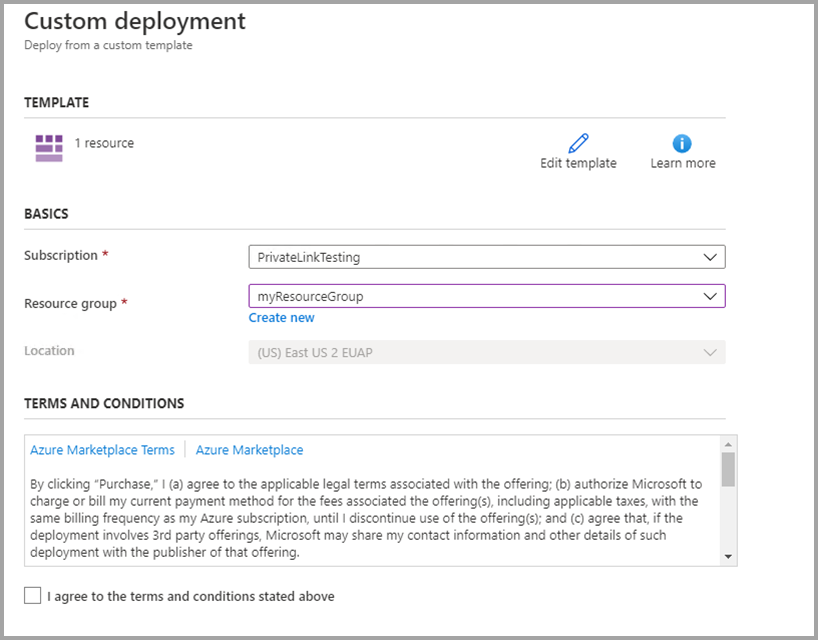
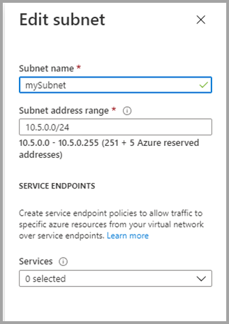

# <a name="private-links-for-accessing-power-bi"></a>Vínculos privados para acceder a Power BI

La categoría Redes de Azure ofrece la característica Azure Private Link, que permite que Power BI proporcione un acceso seguro mediante los puntos de conexión privados de Redes de Azure. Con los Vínculos privados de Azure y los Puntos de conexión privados, el tráfico de datos se envía de forma privada mediante la infraestructura de red troncal de Microsoft y, por lo tanto, los datos no atraviesan Internet. 

Los vínculos privados garantizan que los usuarios de Power BI usen la red privada troncal de Microsoft cuando van a los recursos en el servicio Power BI.

Puede obtener más información sobre [Vínculos privados de Azure](https://azure.microsoft.com/services/private-link/).

## <a name="understanding-private-links"></a>Descripción de los vínculos privados

Los vínculos privados garantizan que el tráfico que va *a* los artefactos de Power BI de la organización (tales como informes o áreas de trabajo) sigan siempre la ruta de acceso de red del vínculo privado configurada de la organización. El tráfico de usuario a los artefactos de Power BI debe proceder del vínculo privado establecido y se puede configurar Power BI para denegar todas las solicitudes que no provengan de la ruta de acceso de red configurada. 

Los vínculos privados *no* garantizan que el tráfico procedente de Power BI a los orígenes de datos externos, ya sea en la nube o en el entorno local, esté protegido. En su lugar, debe configurar reglas de firewall y redes virtuales que protejan aún más los orígenes de datos. 

### <a name="power-bi-and-private-links-integration"></a>Integración de vínculos privados y Power BI

El Punto de conexión privado de Azure para Power BI es una interfaz de red que se conecta de forma privada y segura al servicio Power BI, con tecnología de Azure Private Link.   

La integración de Puntos de conexión privados permite implementar servicios de plataforma como servicio (PaaS) y acceder a ellos de forma privada desde las redes virtuales y locales del cliente, mientras que el servicio sigue ejecutándose fuera de la red del cliente. Los Puntos de conexión privados son una tecnología única y direccional que permite a los clientes iniciar conexiones a un servicio determinado, pero no permite al servicio iniciar una conexión en la red del cliente. Este patrón de integración del Punto de conexión privado proporciona aislamiento de administración, ya que el servicio puede funcionar independientemente de la configuración de la directiva de red del cliente. En el caso de los servicios multiinquilino, este modelo de Punto de conexión privado proporciona identificadores de vínculo para impedir el acceso a los recursos de otros clientes hospedados en el mismo servicio. Cuando se usan Puntos de conexión privados, solo se puede acceder a un conjunto limitado de otros recursos del servicio de PaaS desde servicios mediante la integración.  

El servicio Power BI implementa Puntos de conexión privados y no Puntos de conexión de servicio.  

El uso de Vínculos privados con Power BI proporciona las ventajas siguientes:

1. Los Vínculos privados garantizan que el tráfico fluya a través de la red troncal de Azure hasta un punto de conexión privado de los recursos basados en la nube de Azure. 

2. El aislamiento del tráfico de red desde la infraestructura que no está basada en Azure, como el acceso local, requeriría que los clientes dispusieran de ExpressRoute o una Red privada virtual (VPN) configurada.  

## <a name="using-secure-private-links-to-access-power-bi"></a>Uso de vínculos privados seguros para acceder a Power BI

En Power BI, puede configurar y usar un punto de conexión que permita a su organización acceder a Power BI de forma privada. Para configurar vínculos privados, debe ser un administrador de Power BI, así como tener permisos en Azure para crear y configurar recursos como máquinas virtuales (VM) y redes virtuales (VNET). 

Los pasos que debe seguir para acceder de forma segura a Power BI desde vínculos privados son los siguientes:

1. [Habilitar los vínculos privados para Power BI](#enable-private-links-for-power-bi)
2. [Crear un recurso de Power BI en Azure Portal](#create-a-power-bi-resource-in-the-azure-portal)
3. [Crear una red virtual](#create-a-virtual-network)
4. [Creación de una máquina virtual (VM)](#create-a-virtual-machine-vm)
5. [Creación de un punto de conexión privado](#create-a-private-endpoint)
6. [Conéctese a una máquina virtual mediante Escritorio remoto (RDP)](#connect-to-a-vm-using-remote-desktop-rdp)
7. [Acceder a Power BI de forma privada desde la máquina virtual](#access-power-bi-privately-from-the-vm)
8. [Deshabilitar el acceso público a Power BI](#disable-public-access-for-power-bi)

En las siguientes secciones se proporciona información adicional sobre cada paso.

## <a name="enable-private-links-for-power-bi"></a>Habilitación de vínculos privados para Power BI

Para empezar, inicie sesión en Power BI en app.powerbi.com como administrador y navegue hasta el portal de administración. Seleccione **Configuración de inquilinos** y desplácese hasta **Redes avanzadas**; después, alterne el botón de radio para activar **Azure Private Link**, tal como se muestra en la siguiente imagen. 

Se tarda aproximadamente 15 minutos en configurar un vínculo privado para el inquilino, incluida la configuración de un FQDN independiente para el inquilino para que pueda comunicarse de forma privada con los servicios de Power BI.


Una vez completado este paso, puede avanzar al siguiente.

## <a name="create-a-power-bi-resource-in-the-azure-portal"></a>Creación de un recurso de Power BI en Azure Portal

Inicie sesión en [Azure Portal](https://portal.azure.com) y cree un recurso de Power BI mediante una **plantilla de Azure**. Reemplace los parámetros de la plantilla de ARM del ejemplo, como se muestra en la tabla siguiente, para crear un recurso de Power BI.


|**Parámetro**  |**Valor**  |
|---------|---------|
|```<resource-name>```    | myPowerBIResource         |
|```<tenant-object-id>```     | 52d40f65-ad6d-48c3-906f-1ccf598612d4         |

Creación de la plantilla de Resource Manager 

```
{
  "$schema": "http://schema.management.azure.com/schemas/2015-01-01/deploymentTemplate.json#",
  "contentVersion": "1.0.0.0",
  "parameters": {},
  "resources": [
      {
          "type":"Microsoft.PowerBI/privateLinkServicesForPowerBI",
          "apiVersion": "2020-06-01",
          "name" : "<resource-name>",
          "location": "global",
          "properties" : 
          {
               "tenantId": "<tenant-object-id>"
          }
      }
  ]
}
```

En el cuadro de diálogo que aparece, active la casilla para aceptar los términos y condiciones y, después, seleccione **Adquirir**.




## <a name="create-a-virtual-network"></a>Creación de una red virtual

El siguiente paso consiste en crear una red virtual y una subred. Reemplace los parámetros de ejemplo de la tabla siguiente por los suyos para crear una red virtual y una subred.

| Parámetro |   Value| 
|---------|---------|
| ```<resource-group-name>```   | myResourceGroup |
| ```<virtual-network-name>```  | myVirtualNetwork |
| ```<region-name>```   | Centro de EE. UU.  |
| ```<IPv4-address-space>```    | 10.5.0.0/16 |
| ```<subnet-name>```   | mySubnet |
| ```<subnet-address-range>```  | 10.5.0.0/24 |

1. En la parte superior izquierda de la pantalla, seleccione **Crear un recurso > Redes > Red virtual** o busque **Red virtual** en el cuadro de búsqueda.
2. En **Crear red virtual**, escriba o seleccione la siguiente información en la pestaña **Conceptos básicos**:

    |Configuración | Value |
    |-------------------|---------|
    |**Detalles del proyecto**|
    |Suscripción | Selección de una suscripción a Azure |
    |Grupo de recursos |   Seleccione **Crear nuevo**, escriba ```<resource-group-name>```, seleccione **Aceptar** o seleccione un ```<resource-group-name>``` existente basado en parámetros. |
    |**Detalles de instancia** |
    | Nombre  | Escriba ```<virtual-network-name>```. |
    |Region | Seleccione ```<region-name>```. |
    
    La siguiente imagen muestra la pestaña **Conceptos básicos**.
    
    


3. Después, seleccione la pestaña **Direcciones IP** o el botón **Siguiente: Direcciones IP** situado en la parte inferior del formulario. En la pestaña Direcciones IP, especifique la siguiente información:

    |Configuración | Value |
    |-------------------|---------|
    |Espacio de direcciones IPv4 |Escriba ```<IPv4-address-space>```. |
    
    
    

4. En **Nombre de subred**, seleccione la palabra *predeterminado* y, en **Editar subred**, escriba la siguiente información:

    |Configuración | Value |
    |-------------------|---------|
    | Nombre de subred |Escriba ```<subnet-name>```. |
    | Intervalo de direcciones de subred | Escriba ```<subnet-address-range>```. |
    
    
    

5. Después, seleccione **Guardar** y, luego, la pestaña **Revisar y crear** o el botón **Revisar y crear**. 

6. Seleccione **Crear**.

Una vez que haya completado estos pasos, puede crear una máquina virtual (VM), tal y como se describe en la sección siguiente.

## <a name="create-a-virtual-machine-vm"></a>Creación de una máquina virtual (VM)

El siguiente paso consiste en crear una red virtual y una subred para hospedar la máquina virtual (VM).

1. En la parte superior izquierda de Azure Portal, seleccione **Crear un recurso > Proceso > Máquina virtual**.

2. En **Crear una máquina virtual: Conceptos básicos**, escriba o seleccione la siguiente información:

    |Configuración | Value |
    |-------------------|---------|
    |**Detalles del proyecto**||
    |Suscripción | Selección de una suscripción a Azure |
    |Grupo de recursos |   Seleccione el grupo **myResourceGroup** que ha creado en la sección anterior. |
    |**Detalles de instancia** ||
    |Nombre | Escriba **myVm**. |
    |Region | Seleccione **Centro de EE. UU.** . |
    |Opciones de disponibilidad| Deje el valor predeterminado **No se requiere redundancia de la infraestructura**. |
    |Imagen | Seleccione **Windows 10 Pro**. |
    |Tamaño | Deje el valor predeterminado **Estándar DS1 v2**. |
    |CUENTA DE ADMINISTRADOR ||
    |Nombre de usuario |Escriba un nombre de usuario de su elección. |
    |Contraseña | Escriba una contraseña de su elección. La contraseña debe tener un mínimo de 12 caracteres y cumplir los [requisitos de complejidad definidos](/azure/virtual-machines/windows/faq#what-are-the-password-requirements-when-creating-a-vm). |
    |Confirm Password | Vuelva a escribir la contraseña. |
    |REGLAS DE PUERTO DE ENTRADA ||
    |Puertos de entrada públicos | Deje el valor predeterminado **Ninguno**. |
    |AHORRE DINERO ||
    |¿Ya tiene una licencia de Windows? |  Deje el valor predeterminado **No**. |

3. Después, seleccione **Next: Discos**.
4. En **Creación de una máquina virtual: Discos**, deje los valores predeterminados y seleccione **Siguiente: Redes**.
5. En **Crear una máquina virtual: Redes**, escriba o seleccione esta información:

    |Configuración | Value |
    |-------------------|---------|
    |Virtual network|   Deje el valor predeterminado **MyVirtualNetwork**.|
    |Espacio de direcciones| Deje el valor predeterminado **10.5.0.0/24**.|
    |Subnet |Deje el valor predeterminado **mySubnet (10.5.0.0/24)** .|
    |Dirección IP pública| Deje el valor predeterminado **(nuevo) myVm-ip**.|
    |Puertos de entrada públicos|  Seleccione **Permitir los puertos seleccionados**.|
    |Selección de puertos de entrada|  Seleccione **RDP**.|

6. Seleccione **Revisar + crear**. Se le remitirá a la página **Revisar y crear**, donde Azure validará la configuración.
7. Cuando reciba el mensaje **Validación superada**, seleccione **Crear**.


## <a name="create-a-private-endpoint"></a>Creación de un punto de conexión privado

El siguiente paso, que se describe en esta sección, es crear un punto de conexión privado para Power BI.

1. En la parte superior izquierda de la pantalla de Azure Portal, seleccione **Crear un recurso > Redes > Centro de Private Link (versión preliminar)** .
2. En **Centro de Private Link: Información general**, en la opción **Crear una conexión privada a un servicio**, seleccione **Crear un punto de conexión privado**.
3. En **Crear un punto de conexión privado (versión preliminar): Conceptos básicos**, escriba o seleccione los detalles siguientes:

    |Configuración | Value |
    |-------------------|---------|
    |**Detalles del proyecto** ||
    |Suscripción|  Selección de una suscripción a Azure|
    |Grupo de recursos|    Seleccione **myResourceGroup**. Lo ha creado en la sección anterior.|
    |**Detalles de instancia** ||
    |Nombre|  Escriba *myPrivateEndpoint*. Si el nombre ya existe, cree uno único.|
    |Region|    Seleccione **Centro de EE. UU.** .|
    
    En la imagen siguiente se muestra la ventana **Crear un punto de conexión privado: Conceptos básicos**.
    
    

4. Una vez completada la información, seleccione **Siguiente: Recurso** y, en la página **Crear un punto de conexión privado: Recurso**, escriba o seleccione la siguiente información:

    |Configuración | Value |
    |-------------------|---------|
    |Método de conexión| Seleccione "Conectarse a un recurso de Azure en mi directorio".|
    |Suscripción|  Seleccione su suscripción.|
    |Tipo de recurso| Seleccione **Microsoft.PowerBI/privateLinkServicesForPowerBI**. |
    |Recurso|  myPowerBIResource|
    |Recurso secundario de destino|   Inquilino|
    
    En la imagen siguiente se muestra la ventana **Crear un punto de conexión privado: Recurso**.
    
    

5. Una vez completada la información correctamente, seleccione **Siguiente: Configuración** y, en **Crear un punto de conexión privado (versión preliminar): Configuración**, escriba o seleccione la siguiente información:

    |Configuración | Value |
    |-------------------|---------|
    |**REDES** ||
    |Virtual network|   Seleccione *myVirtualNetwork* |
    |Subnet |Seleccione *mySubnet*. |
    |**INTEGRACIÓN DE DNS PRIVADO** ||
    |Integración con una zona DNS privada|   Seleccione **Sí**. |
    |Zona DNS privada   |Seleccionar <br> *(New)privatelink.analysis.windows.net* <br> *(New)privatelink.pbidedicated.windows.net* <br> *(New)privatelink.tip1.powerquery.microsoft.com* |
    
    En la imagen siguiente se muestra la ventana **Crear un punto de conexión privado: Configuración**.
    
    
    
    Después, seleccione **Revisar y crear**, y se mostrará la página **Revisar y crear**, donde Azure validará la configuración. Cuando reciba el mensaje **Validación superada**, seleccione **Crear**.

## <a name="connect-to-a-vm-using-remote-desktop-rdp"></a>Conéctese a una máquina virtual mediante Escritorio remoto (RDP)

Una vez que haya creado la máquina virtual, llamada **myVM**, conéctese a ella desde Internet mediante estos pasos:

1. En la barra de búsqueda del portal, escriba *myVm*.
2. Seleccione el botón **Conectar**. Después de seleccionar el botón **Conectar**, se abre **Conectarse a una máquina virtual**.
3. Seleccione **Descargar archivo RDP**. Azure crea un archivo de Protocolo de Escritorio remoto ( .rdp) y lo descarga en su equipo.
4. Abra el archivo .rdp descargado.
5. Cuando se le pida, seleccione **Conectar**.
6. Escriba el nombre de usuario y la contraseña que ha especificado al crear la máquina virtual en el paso anterior.
7. Seleccione **Aceptar**.
8. Puede recibir una advertencia de certificado durante el proceso de inicio de sesión. Si recibe una advertencia de certificado, seleccione **Sí** o **Continuar**.

## <a name="access-power-bi-privately-from-the-vm"></a>Acceso a Power BI de forma privada desde la máquina virtual

El paso siguiente consiste en acceder a Power BI de forma privada desde la máquina virtual que ha creado anteriormente; para ello, siga estos pasos: 

1. En el Escritorio remoto de myVm, abra PowerShell.
2. Escriba nslookup 52d40f65ad6d48c3906f1ccf598612d4-api.privatelink.analysis.windows.net.
3. Recibirá un mensaje similar a este:

    ```
    Server:  UnKnown
    Address:  168.63.129.16
    
    Non-authoritative answer:
    Name:    52d40f65ad6d48c3906f1ccf598612d4-api.privatelink.analysis.windows.net
    Address:  10.5.0.4
    ```

4. Abra el explorador y vaya a app.powerbi.com para acceder a Power BI de forma privada.

## <a name="disable-public-access-for-power-bi"></a>Deshabilitación del acceso público a Power BI

Por último, debe deshabilitar el acceso público a Power BI. 

Inicie sesión en app.powerbi.com como administrador y navegue hasta el **portal de administración**. Seleccione **Configuración de inquilinos** y desplácese hasta la sección **Redes avanzadas**. Active el botón de radio de la sección **Bloqueo del acceso a través de una red de Internet pública**, tal y como se muestra en la siguiente imagen. El sistema tarda aproximadamente 15 minutos en deshabilitar el acceso de la organización a Power BI desde la red pública de Internet.

Y eso es todo. Después de completar estos pasos, su organización solo puede acceder a Power BI desde vínculos privados, y no desde la red pública de Internet. 

## <a name="considerations-and-limitations"></a>Consideraciones y limitaciones

Hay algunas consideraciones que se deben tener en cuenta al trabajar con vínculos privados en Power BI:

* El uso de imágenes o temas externos no está disponible cuando se utiliza un entorno de vínculos privados.
* Si el acceso a Internet está deshabilitado, y el conjunto de datos o el flujo de datos se está conectando a un conjunto de datos o flujo de datos de Power BI como un origen de datos, se producirá un error en la conexión.
* Las métricas de uso *no* funcionan cuando se habilita Private Link.
* La opción Publicar en Web no se admite y, por tanto, aparece atenuada al habilitar **Bloqueo del acceso a través de una red de Internet pública** en Power BI.


## <a name="next-steps"></a>Pasos siguientes

- [Administración de Power BI en su organización](service-admin-administering-power-bi-in-your-organization.md)  
- [Descripción del rol de administrador de Power BI](service-admin-role.md)  
- [Auditoría de Power BI en su organización](service-admin-auditing.md)  

¿Tiene más preguntas? [Pruebe a preguntar a la comunidad de Power BI](https://community.powerbi.com/)
