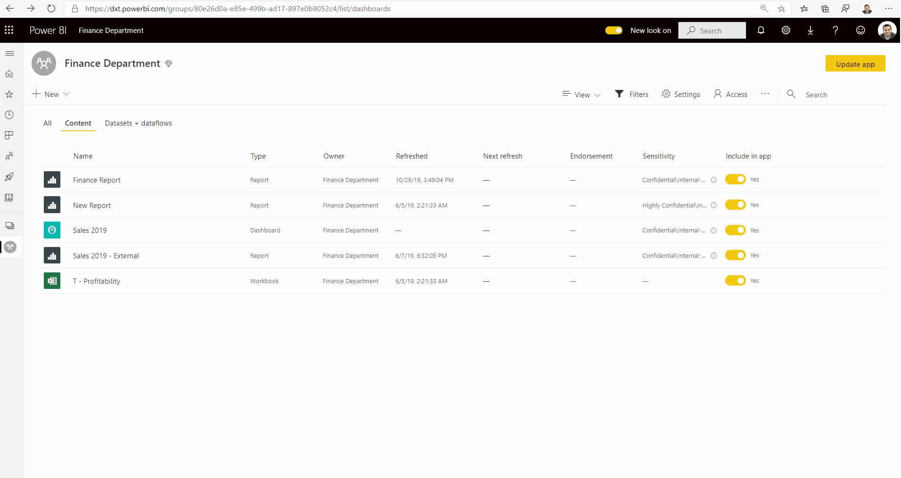
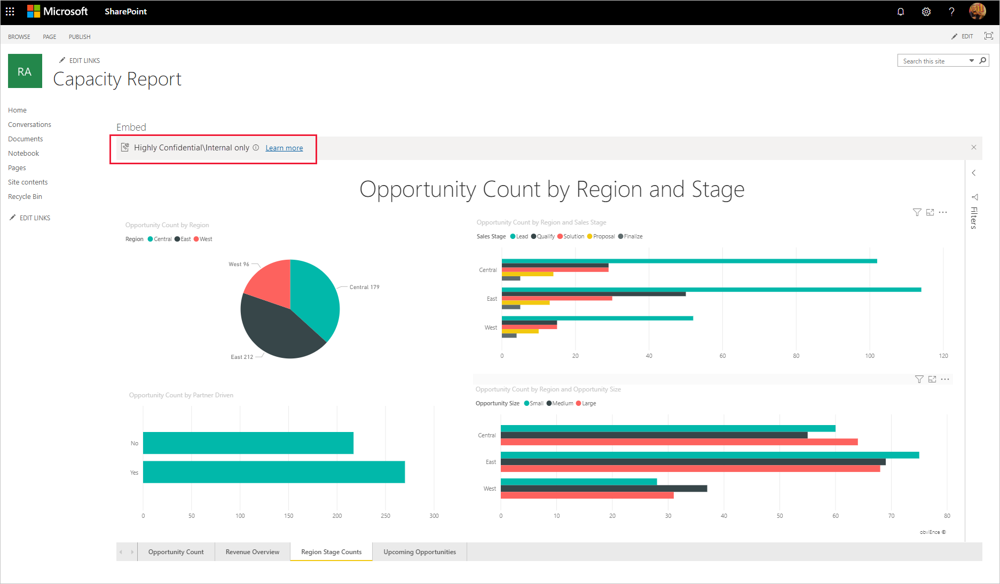
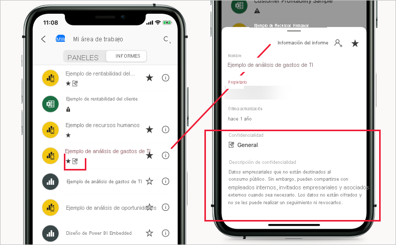

# Etiquetas de confidencialidad en Power BI

En este artículo se describe la funcionalidad de las etiquetas de confidencialidad de Microsoft Information Protection en Power BI.

Para obtener información sobre cómo habilitar las etiquetas de confidencialidad en el inquilino, incluidos los requisitos de licencia y los requisitos previos, consulte [Habilitación de las etiquetas de confidencialidad de datos en Power BI](service-security-enable-data-sensitivity-labels.md).

Para más información sobre cómo aplicar etiquetas de confidencialidad a informes, paneles, conjuntos de datos y flujos de datos de Power BI, consulte [Aplicación de etiquetas de confidencialidad en Power BI](./service-security-apply-data-sensitivity-labels.md).

## Introducción

Las etiquetas de confidencialidad de Microsoft Information Protection ofrecen una manera sencilla para que los usuarios clasifiquen contenido crítico en Power BI sin poner en peligro la productividad ni la capacidad de colaboración.

Las etiquetas de confidencialidad se pueden aplicar en conjuntos de datos, informes, paneles y flujos de datos. Cuando los datos etiquetados salen de Power BI, ya sea mediante la exportación a archivos de Excel, PowerPoint o PDF, o mediante otros escenarios de exportación compatibles como Analizar en Excel o tablas dinámicas de conexión dinámica en Excel, Power BI aplica automáticamente la etiqueta al archivo exportado y lo protege de acuerdo con la configuración de cifrado de archivos de la etiqueta. De este modo, los datos confidenciales permanecen protegidos independientemente de dónde se encuentren.

Las etiquetas de confidencialidad aplicadas en informes, paneles, conjuntos de datos y flujos de datos son visibles en muchos lugares del servicio Power BI. Las etiquetas de confidencialidad de los informes y paneles también se pueden ver en las aplicaciones móviles de Power BI para iOS y Android y en los objetos visuales insertados.

Un [informe de métricas de protección](service-security-data-protection-metrics-report.md) disponible en el portal de administración de Power BI permite a los administradores de Power BI tener visibilidad completa de los datos confidenciales en el inquilino de Power BI. Además, los registros de auditoría de Power BI incluyen información de la etiqueta de confidencialidad sobre actividades tales como aplicar, quitar y cambiar etiquetas, además de actividades como ver informes, paneles, etc., Esto brinda a los administradores de seguridad y Power BI visibilidad sobre el consumo de datos confidenciales a efectos de supervisar e investigar alertas de seguridad.

## Consideraciones importantes

Las etiquetas de confidencialidad **no** afectan al acceso al contenido dentro de Power BI: se administra únicamente mediante los permisos de Power BI. Mientras las etiquetas son visibles, no se aplican las opciones de cifrado asociadas (configuradas en el [Centro de seguridad de Microsoft 365](https://security.microsoft.com/) o el [Centro de cumplimiento de Microsoft 365](https://compliance.microsoft.com/)). Se aplican solo a los datos que salen de Power BI a través de la exportación a archivos de Excel, PowerPoint o PDF, o mediante alguna de las otras rutas de exportación admitidas.

Las etiquetas de confidencialidad y el cifrado de archivos **no** se aplican en rutas de exportación no admitidas. El administrador de inquilinos de Power BI puede bloquear la exportación desde rutas de exportación no admitidas:

>[!NOTE]
> A los usuarios a los que se concede acceso a un informe se les concede acceso a todo el conjunto de datos subyacente, a menos que la [seguridad de nivel de fila (RLS)](./service-admin-rls.md) limite su acceso. Los autores de informes pueden clasificar y etiquetar informes con etiquetas de confidencialidad. Si la etiqueta de confidencialidad tiene una configuración de protección, Power BI aplicará esta configuración de protección al exportar los datos de informe a archivos de Excel, PowerPoint o PDF. Solo los usuarios autorizados pueden abrir archivos protegidos.

## Rutas de exportación admitidas
Actualmente se admite la aplicación de etiquetas de confidencialidad y su protección asociada a los datos que salen de Power BI en las siguientes rutas de exportación:
* Exportar a archivos de Excel, PowerPoint y PDF.
* Analizar en Excel desde el servicio Power BI, que desencadena la descarga de un archivo de Excel con una conexión dinámica a un conjunto de datos de Power BI.
* Tabla dinámica de Excel con una conexión dinámica a un conjunto de datos de Power BI, para los usuarios con M365 E3 y versiones posteriores. 

## Cómo funcionan las etiquetas de confidencialidad en Power BI

Aplicar una etiqueta de confidencialidad a un panel, informe, conjunto de datos o flujo de datos de Power BI es similar a aplicar una etiqueta a ese recurso con las ventajas siguientes:
* **Personalizable**: puede crear categorías para diferentes niveles de contenido confidencial en su organización, como personal, público, general, confidencial y extremadamente confidencial.
* **Texto no cifrado**: como la etiqueta está en texto sin cifrar, es fácil que los usuarios sepan cómo tratar el contenido de acuerdo con las instrucciones de la etiqueta de confidencialidad.
* **Persistente**: después de aplicar una etiqueta de confidencialidad al contenido, le acompaña cuando se exporta a archivos de Excel, PowerPoint y PDF, y se convierte en la base de la aplicación de directivas.

Aquí se muestra un ejemplo rápido de cómo funciona una etiqueta de confidencialidad en Power BI. En la imagen siguiente se muestra cómo se aplica una etiqueta de confidencialidad a un informe en el servicio Power BI, cómo se exportan los datos del informe a un archivo de Excel y, por último, cómo se conservan la etiqueta de confidencialidad y sus protecciones en el archivo exportado.

Las etiquetas de confidencialidad que se aplican al contenido se conservan y se mueven con el contenido, ya que se usan y comparten en Power BI. Puede usar este etiquetado para generar informes de uso y ver los datos de actividad del contenido confidencial.

## Herencia de la etiqueta de confidencialidad al crear contenido

Cuando se crean informes y paneles en el servicio Power BI, heredan automáticamente la etiqueta de confidencialidad aplicada previamente en el conjunto de datos o el informe primario. Por ejemplo, un nuevo informe creado sobre un conjunto de datos que tenga una etiqueta de confidencialidad "Extremadamente confidencial" también recibirá automáticamente la etiqueta "Extremadamente confidencial".

En la imagen siguiente se muestra cómo se aplica automáticamente la etiqueta de confidencialidad de un conjunto de datos a un nuevo informe que se basa en el conjunto de datos.

>[!NOTE]
>Si, por alguna razón, no se puede aplicar la etiqueta de confidencialidad al nuevo informe o panel, Power BI **no** bloqueará la creación del nuevo elemento.

## Etiquetas de confidencialidad y protección en los datos exportados

Cuando los datos se exportan desde Power BI a archivos de Excel, PowerPoint o PDF, Power BI aplica automáticamente una etiqueta de confidencialidad al archivo exportado y lo protege según la configuración de cifrado de archivos de la etiqueta. De este modo, los datos confidenciales permanecen protegidos independientemente de dónde se encuentren.

Un usuario que exporta un archivo de Power BI tiene permisos para acceder al archivo y editarlo según la configuración de la etiqueta de confidencialidad; no obtienen permiso del propietario en el archivo.

La protección y las etiquetas de confidencialidad no se aplican cuando los datos se exportan a archivos .csv o .pbix, o a cualquier otra ruta de exportación.

La aplicación de una etiqueta de confidencialidad y protección a un archivo exportado no le agrega marcas de contenido. Pero si la etiqueta está configurada para aplicar marcas de contenido, el cliente de etiquetado unificado de Azure Information Protection aplica las marcas automáticamente cuando el archivo se abre en las aplicaciones de escritorio de Office. Las marcas de contenido no se aplican de forma automática cuando se usa el etiquetado integrado para aplicaciones web, para dispositivos móviles o de escritorio. Vea [Cuando las aplicaciones de Office aplican marcas de contenido y cifrado](/microsoft-365/compliance/sensitivity-labels-office-apps?view=o365-worldwide#when-office-apps-apply-content-marking-and-encryption) para obtener más detalles.

Se produce un error en la exportación si no se puede aplicar una etiqueta al exportar los datos a un archivo. Para comprobar si se ha producido un error en la exportación porque no se ha podido aplicar la etiqueta, haga clic en el nombre del panel o informe en el centro de la barra de título y compruebe si en el cuadro desplegable de información que se abre se indica "No se puede cargar la etiqueta de confidencialidad". Esto puede suceder como resultado de un problema temporal del sistema o si el administrador de seguridad no ha publicado ni ha eliminado la etiqueta aplicada.

## Herencia de las etiquetas de confidencialidad en Analizar en Excel

Al crear una tabla dinámica en Excel con una conexión dinámica a un conjunto de datos de Power BI (esto puede hacerlo desde Power BI mediante [Analizar en Excel](../collaborate-share/service-analyze-in-excel.md) o desde [Excel](https://support.microsoft.com/office/create-a-pivottable-from-power-bi-datasets-31444a04-9c38-4dd7-9a45-22848c666884?ui=en-US&rs=en-US&ad=US)), la etiqueta de confidencialidad del conjunto de datos se hereda y se aplica al archivo de Excel, junto con cualquier protección asociada. Si la etiqueta del conjunto de datos cambia posteriormente a una más restrictiva, la etiqueta aplicada al archivo de Excel vinculado se actualizará automáticamente tras la actualización de los datos.

 
La etiqueta de confidencialidad del conjunto de datos no sobrescribe automáticamente las etiquetas de confidencialidad de Excel que se establecieron manualmente. En su lugar, un mensaje emergente le informa de que el conjunto de datos tiene una etiqueta de confidencialidad y recomienda aplicarla.

>[!NOTE]
>Si la etiqueta de confidencialidad del conjunto de datos es menos restrictiva que la etiqueta de confidencialidad del archivo de Excel, las etiquetas ni se heredan ni se actualizan. Un archivo de Excel nunca hereda una etiqueta de confidencialidad menos restrictiva.

## Persistencia de la etiqueta de confidencialidad en informes y paneles insertados

Puede insertar informes, paneles y objetos visuales de Power BI en aplicaciones empresariales tales como Microsoft Teams y SharePoint, o en el sitio web de una organización. Al insertar un objeto visual, informe o panel que tenga aplicada una etiqueta de confidencialidad, esta etiqueta se verá en la vista insertada, y la etiqueta y su protección se conservarán cuando los datos se exporten a Excel.

Se admiten los escenarios insertados siguientes:
* [Insertar para la organización](../developer/embedded/embed-sample-for-your-organization.md)
* Aplicaciones de Microsoft 365 (por ejemplo, [Teams](../collaborate-share/service-embed-report-microsoft-teams.md) y [SharePoint](../collaborate-share/service-embed-report-spo.md))
* [Inserción de dirección URL segura](../collaborate-share/service-embed-secure.md) (inserción desde el servicio Power BI) 

## Etiquetas de confidencialidad en las aplicaciones móviles de Power BI

Las etiquetas de confidencialidad se pueden ver en los informes y paneles de las aplicaciones móviles de Power BI. Un icono junto al nombre del informe o panel indica que tiene una etiqueta de confidencialidad, y el tipo de etiqueta y su descripción se pueden encontrar en el cuadro de información del informe o del panel.

## Nubes admitidas
Las etiquetas de confidencialidad solo se admiten para inquilinos de nubes (públicas) globales, no para los de nubes nacionales.

## Licencia y requisitos

Consulte [Licencia y requisitos](service-security-enable-data-sensitivity-labels.md#licensing-and-requirements).

## Creación y administración de etiquetas de confidencialidad

Las etiquetas de confidencialidad se crean y administran en el [Centro de seguridad de Microsoft 365](https://security.microsoft.com/) o el [Centro de cumplimiento de Microsoft 365](https://compliance.microsoft.com/).

Para acceder a las etiquetas de confidencialidad en cualquiera de estos centros, vaya a **Clasificación > Etiquetas de confidencialidad**. Estas etiquetas de confidencialidad se pueden usar en varios servicios de Microsoft, como Azure Information Protection, las aplicaciones de Office y los servicios de Office 365.

>[!Important]
> Si en la organización se usan etiquetas de confidencialidad de Azure Information Protection, tendrá que [migrarlas](/azure/information-protection/configure-policy-migrate-labels) a uno de los servicios enumerados antes para que se puedan usar en Power BI.

## Limitaciones

En la lista siguiente se proporcionan algunas limitaciones de las etiquetas de confidencialidad en Power BI:

* Las etiquetas de confidencialidad solo se pueden aplicar en paneles, informes, conjuntos de datos y flujos de datos. En la actualidad no hay etiquetas de confidencialidad disponibles para [informes paginados](../paginated-reports/report-builder-power-bi.md) y libros.
* Las etiquetas de confidencialidad de los recursos de Power BI son visibles en la lista de áreas de trabajo y en las vistas de linaje, favoritos, recientes y aplicaciones; no son visibles actualmente en la vista "compartido conmigo". Tenga en cuenta, sin embargo, que una etiqueta aplicada a un recurso de Power BI, incluso si no está visible, siempre se conservará en los datos exportados a archivos de Excel, PowerPoint y PDF.
* No se admiten las etiquetas de confidencialidad para las aplicaciones de plantilla. Las etiquetas de confidencialidad establecidas por el creador de la aplicación de plantilla se quitan cuando se extrae la aplicación y se instala. Asimismo, al actualizar la aplicación, las etiquetas de confidencialidad agregadas a los artefactos de una aplicación de plantilla instalada por el consumidor de la aplicación se pierden (se restablecen vacías).
* Power BI no admite etiquetas de confidencialidad de los tipos de protección [No reenviar](/microsoft-365/compliance/encryption-sensitivity-labels?view=o365-worldwide#let-users-assign-permissions), [definido por el usuario](/microsoft-365/compliance/encryption-sensitivity-labels?view=o365-worldwide#let-users-assign-permissions) e [HYOK](/azure/information-protection/configure-adrms-restrictions). Los tipos de protección No reenviar y definido por el usuario hacen referencia a las etiquetas definidas en el [Centro de seguridad de Microsoft 365](https://security.microsoft.com/) o el [Centro de cumplimiento de Microsoft 365](https://compliance.microsoft.com/).
* No se recomienda permitir que los usuarios apliquen etiquetas primarias en Power BI (se considera que una etiqueta es una etiqueta primaria solo si tiene subetiquetas). Si se aplica una etiqueta principal al contenido, se producirá un error al exportar los datos de ese contenido a un archivo (Excel, PowerPoint y PDF). Vea [Subetiquetas (etiquetas de agrupación)](/microsoft-365/compliance/sensitivity-labels?view=o365-worldwide#sublabels-grouping-labels).

## Pasos siguientes

En este artículo se proporciona una introducción a la protección de datos en Power BI. En los artículos siguientes se proporcionan más detalles acerca de la protección de datos en Power BI. 

* [Habilitación de etiquetas de confidencialidad en Power BI](service-security-enable-data-sensitivity-labels.md)
* [Aplicación de etiquetas de confidencialidad en Power BI](service-security-apply-data-sensitivity-labels.md)
* [Uso de controles de Microsoft Cloud App Security en Power BI](service-security-using-microsoft-cloud-app-security-controls.md)
* [Informe de métricas de protección](service-security-data-protection-metrics-report.md)