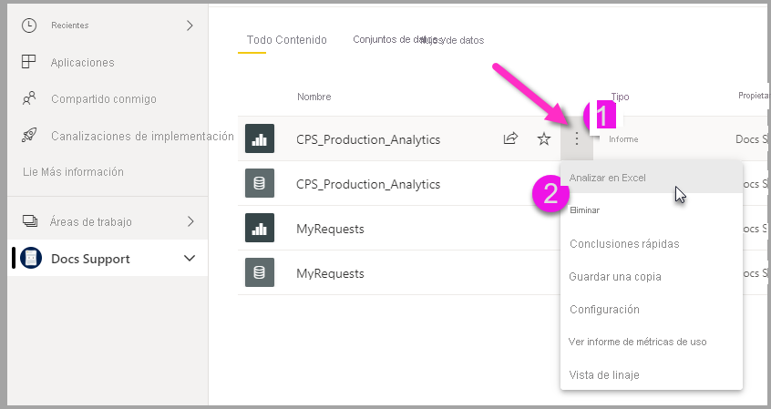

# Analizar en Excel
Con **Analizar en Excel**, puede traer conjuntos de datos de Power BI a Excel y luego verlos e interactuar con ellos a través de tablas dinámicas, gráficos, segmentaciones y otras características de Excel. Para usar **Analizar en Excel**, primero debe descargar la característica desde Power BI, instalarla y, luego, seleccionar uno o varios conjuntos de datos para usarlos en Excel. 

En este artículo se muestra cómo instalar y usar Analizar en Excel, se describen sus limitaciones y se proporcionan algunos pasos siguientes. Aprenderá lo siguiente:

* [Instalar Analizar en Excel](#install-analyze-in-excel)
* [Conectarse a datos de Power BI](#connect-to-power-bi-data)
* [Usar Excel para analizar los datos](#use-excel-to-analyze-the-data)
* [Guardar y compartir un libro](#saving-and-sharing-your-new-workbook)
* [Requisitos](#requirements)

Empecemos con el proceso de instalación.

## Instalar Analizar en Excel

Debe instalar **Analizar en Excel** desde los vínculos proporcionados en el servicio Power BI. Power BI detecta la versión de Excel que tiene en el equipo y descarga automáticamente la versión adecuada (de 32 bits o 64 bits). El servicio Power BI se ejecuta en un explorador. Puede iniciar sesión en Power BI con el vínculo siguiente:

* [Iniciar sesión en Power BI](https://app.powerbi.com)

Una vez que inicie sesión y el servicio Power BI se ejecute en el explorador, seleccione el elemento **Más opciones** (los puntos suspensivos) que aparecen en la esquina superior derecha y seleccione **Descargar > Actualizaciones de Analizar en Excel**. Este elemento de menú se aplica a las instalaciones nuevas de actualizaciones de Analizar en Excel.

También puede navegar en el servicio Power BI a un conjunto de datos que quiera analizar y seleccionar el elemento **Más opciones** para un conjunto de datos, un informe u otro elemento de Power BI. En el menú que aparece, seleccione la opción **Analizar en Excel**, tal como se muestra en la imagen siguiente.

En cualquier caso, Power BI detecta si tiene instalado Analizar en Excel y, si no es así, se le pedirá que lo descargue. 

Cuando selecciona Descargar, Power BI detecta la versión de Excel que tiene instalada y descarga la versión correspondiente del instalador de Analizar en Excel. Verá un estado de descarga en la parte inferior del explorador o en cualquier lugar en el que el explorador muestre el progreso de la descarga. 

Una vez finalizada la descarga, ejecute el instalador (.msi) para instalar Analizar en Excel. El nombre del proceso de instalación no es Analizar en Excel, sino que será **Proveedor OLE DB de Microsoft Analysis Services**, tal como se muestra en la imagen siguiente, o un nombre similar.

Una vez que se complete el proceso, estará listo para seleccionar un informe en el servicio Power BI (u otro elemento de datos de Power BI, como un conjunto de datos) y, luego, analizarlo en Excel.

## Conectarse a datos de Power BI

En el servicio Power BI, vaya al conjunto de datos o al informe que quiere analizar en Excel y seleccione el menú **Más opciones** (los puntos suspensivos) para buscar la opción de menú **Analizar en Excel**. En la imagen siguiente se muestra la selección de un informe.

Hay algunos pasos para colocar un conjunto de datos del servicio Power BI en Excel:

1. Seleccione el menú **Más opciones**.
2. Seleccione **Analizar en Excel** en los elementos de menú que aparecen.

    El servicio Power BI luego crea un archivo del conjunto de datos que está diseñado (y estructurado) para su uso con **Analizar en Excel** que tiene la extensión de archivo .ODC. Se crea el archivo y automáticamente se inicia un proceso de descarga en el explorador.
    
    
    
    El nombre de archivo coincide con el conjunto de datos (o informe u otro origen de datos) del que se deriva. Por lo tanto, si el informe tenía el nombre *Latest-Sales*, el archivo descargado se llamará **Latest-Sales.ODC**.

3. Abra el archivo .ODC.

El archivo ya está asociado con **Analizar en Excel** por lo que, cuando seleccione o abra ese archivo .ODC, se iniciará Excel y el archivo .ODC se empezará a cargar automáticamente. Sin embargo, es probable que vea una advertencia sobre una amenaza de origen de datos externo:

Seleccione **Habilitar** para cargar el archivo .ODC para **Analizar en Excel** y Excel cargará el archivo. 

## Usar Excel para analizar los datos

Una vez que seleccione **Habilitar** en el aviso de seguridad para permitir cargar el archivo .ODC, Excel le presentará una **tabla dinámica** vacía y una lista de **campos** del conjunto de datos de Power BI para su análisis.

El archivo .ODC tiene una cadena de conexión de MSOLAP que conecta con su conjunto de datos en Power BI. Al analizar o trabajar con los datos, Excel consulta ese conjunto de datos en Power BI y devuelve los resultados a Excel. Si ese conjunto de datos se conecta a un origen de datos activo mediante DirectQuery, Power BI consulta el origen de datos y devuelve el resultado a Excel.

Una vez establecida la conexión con los datos de Power BI, puede crear tablas dinámicas, gráficos y analizar ese conjunto de datos tal como lo haría con un conjunto de datos local en Excel.

**Analizar en Excel** es especialmente útil para los conjuntos de datos e informes que se conectan a los orígenes de datos siguientes:

* Base de datos *tabular de Analysis Services* o base de datos *multidimensional*
* Archivos de Power BI Desktop o libros de Excel con modelos de datos que tienen medidas de modelo creadas con expresiones de análisis de datos (DAX).

> [!IMPORTANT]
> El uso de **Analizar en Excel** expone todos los datos de nivel de detalle a cualquier usuario con permiso para el conjunto de datos.

Hay algunos aspectos que se deben tener en cuenta al empezar a usar Analizar en Excel, lo que podría requerir conciliar uno o dos pasos adicionales. Estas posibilidades se describen en las secciones siguientes. 

### Iniciar sesión en Power BI
Aunque ya haya iniciado sesión en Power BI en el explorador, la primera vez que abra un nuevo archivo .ODC en Excel se le podría solicitar que inicie sesión en Power BI con su cuenta de Power BI. Esto autentica la conexión de Excel a Power BI.

### Usuarios con varias cuentas de Power BI
Algunos usuarios tienen varias cuentas de Power BI. Si es así, es posible que haya iniciado sesión en Power BI con una cuenta, pero que sea otra cuenta la que tenga acceso al conjunto de datos que se está usando en Analizar en Excel. En ese caso, es posible que obtenga un error **Prohibido** o de inicio de sesión al intentar acceder a un conjunto de datos usado en un libro de Analizar en Excel.

Si eso sucede, tendrá la oportunidad de iniciar sesión de nuevo, momento en el cual puede hacerlo con la cuenta de Power BI que tiene acceso a dicho conjunto de datos. También puede seleccionar su nombre en la cinta de opciones superior de Excel, que identifica con qué cuenta inició sesión actualmente. Cierre la sesión y vuelva a iniciarla con la otra cuenta.

## Guardar y compartir un libro

Puede **guardar** el libro de Excel que crea con el conjunto de Power BI como lo haría con cualquier otro libro. Sin embargo, no puede volver a publicar o importar el libro en Power BI porque solo puede publicar o importar libros en Power BI que tengan datos en tablas, o que tengan un modelo de datos. Dado que el nuevo libro simplemente tiene una conexión con el conjunto de datos en Power BI, publicarlo o importarlo en Power BI sería repetir una y otra vez lo mismo.

Una vez guardado el libro, puede compartirlo con otros usuarios de Power BI en su organización. 

Cuando un usuario con el que ha compartido el libro lo abre, verá las tablas dinámicas y los datos tal como estaban cuando se guardó el libro por última vez, lo que no significa que sea la versión más reciente de los datos. Para obtener los datos más recientes, los usuarios deben utilizar el botón **Actualizar** situado en la cinta de opciones **Datos**. Y dado que el libro se conecta a un conjunto de datos en Power BI, los usuarios que intenten actualizarlo deberán iniciar sesión en Power BI e instalar las actualizaciones de Excel la primera vez que lo hagan con este método.

Dado que los usuarios tienen que actualizar el conjunto de datos y no se permite la actualización de conexiones externas en Excel Online, se recomienda que los usuarios abran el libro en la versión de escritorio de Excel de su equipo.

> [!NOTE]
> Los administradores de los inquilinos de Power BI pueden usar el *Portal de administración de Power BI* para deshabilitar el uso de **Analizar en Excel** con conjuntos de datos locales ubicados en bases de datos de Analysis Services (AS). Cuando esta opción está deshabilitada, **Analizar en Excel** está deshabilitado para las bases de datos de AS, pero disponible para su uso con otros conjuntos de datos.

## Otras formas de acceder a los conjuntos de datos de Power BI desde Excel
Los usuarios con SKU de Office específicas también pueden conectarse a los conjuntos de datos de Power BI desde Excel a través de la característica **Obtener datos** de Excel. Si la SKU no es compatible con esta característica, la opción de menú **Obtener datos** no aparece.

En el menú de la cinta de opciones **Datos**, seleccione **Obtener datos > Desde conjunto de datos de Power BI**, tal como se muestra en la imagen siguiente.

Aparece un panel en el que puede examinar los conjuntos de datos a los que tiene acceso, ver si los conjuntos de datos están certificados o promocionados y determinar si se han aplicado etiquetas de protección de datos a esos conjuntos de datos. 

Para más información sobre cómo obtener datos en Excel de esta manera, consulte [Crear una tabla dinámica a partir de conjuntos de valores de Power BI](https://support.office.com/article/31444a04-9c38-4dd7-9a45-22848c666884) en la documentación de Excel.

También puede acceder a las **tablas destacadas** de Excel en la galería **Tipos de datos**. Para más información sobre las tablas destacadas y cómo obtener acceso a ellas, consulte [Acceso a tablas destacadas de Power BI en Excel (versión preliminar)](service-excel-featured-tables.md).

## Requisitos
Hay algunos requisitos para usar **Analizar en Excel**:

* **Analizar en Excel** es compatible con Microsoft Excel 2010 SP1 y versiones posteriores.

* Las tablas dinámicas de Excel no admiten la agregación de campos numéricos mediante arrastrar y colocar. El conjunto de datos en Power BI *debe tener medidas definidas previamente*. Obtenga información sobre cómo [crear medidas](../transform-model/desktop-measures.md).
* Algunas organizaciones podrían tener reglas de directiva de grupo que impiden la instalación de las actualizaciones necesarias de **Analizar en Excel** en Excel. Si no puede instalar las actualizaciones, consulte con su administrador.
* **Analizar en Excel** requiere que el conjunto de datos se encuentre en Power BI Premium o que el usuario tenga una licencia de Power BI Pro. Para más información sobre las diferencias de funcionalidad entre los distintos tipos de licencias, eche un vistazo a la sección _Comparación de características de Power BI_ de [Precios de Power BI](https://powerbi.microsoft.com/pricing/).
* Los usuarios pueden conectarse a conjuntos de datos a través de Analizar en Excel si disponen de permiso en el conjunto de datos subyacente.  Un usuario puede disponer de ese permiso de varias maneras; por ejemplo, si tiene el rol Miembro en el área de trabajo que contiene el conjunto de datos, si tiene un informe o panel compartido con él que usa el conjunto de datos o si tiene permiso de compilación en el conjunto de datos ya sea en el área de trabajo o en una aplicación que contiene ese conjunto de datos. Obtenga más información sobre el [permiso de compilación](../connect-data/service-datasets-build-permissions.md) en conjuntos de datos.
* Los usuarios invitados no pueden usar **Analizar en Excel** para los conjuntos de datos enviados desde (que se originen en) otro inquilino. 
* **Analizar en Excel** es una característica del servicio Power BI que no está disponible en Power BI Report Server ni en Power BI Embedded. 
* **Analizar en Excel** solo se admite en equipos donde se ejecuta Microsoft Windows.

En el caso de los usuarios que tengan que desinstalar la característica **Analizar en Excel**, puede hacerlo con la opción de sistema **Agregar o quitar programas**.

## Solución de problemas
Puede haber ocasiones en las que al usar Analizar en Excel obtenga un resultado inesperado o que la característica no funcione según lo esperado. [En esta página se ofrecen soluciones a problemas comunes al utilizar Analizar en Excel](desktop-troubleshooting-analyze-in-excel.md).

## Pasos siguientes

Puede que también esté interesado en los siguientes artículos:

* [Uso de la obtención de detalles de varios informes en Power BI Desktop](../create-reports/desktop-cross-report-drill-through.md)
* [Uso de segmentaciones de datos en Power BI Desktop](../visuals/power-bi-visualization-slicers.md)
* [Solución de problemas de Analizar en Excel](desktop-troubleshooting-analyze-in-excel.md)
* [Acceso a tablas destacadas de Power BI en Excel (versión preliminar)](service-excel-featured-tables.md).

