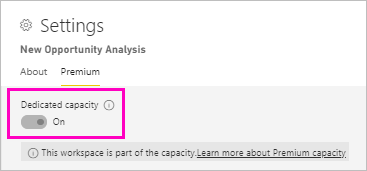
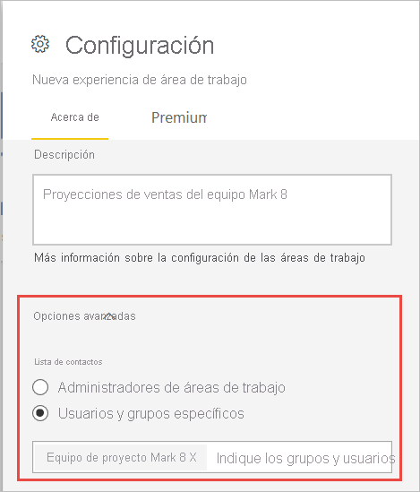
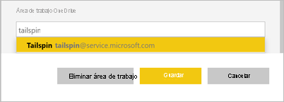

# Creación de las nuevas áreas de trabajo en Power BI

En este artículo se explica cómo crear una de las *nuevas áreas de trabajo* en lugar de un *área de trabajo* clásica. Ambos tipos de áreas de trabajo son lugares para colaborar con compañeros. En ellas, puede crear colecciones de paneles, informes e informes paginados. Si lo desea, también puede agrupar esa colección en una *aplicación* y distribuirla a un público más amplio.

A continuación, se describen las diferencias entre las nuevas áreas de trabajo y las antiguas. En las nuevas áreas de trabajo puede hacer lo siguiente:

- Asignar roles de área de trabajo a usuarios y grupos de usuarios.
- Crear un área de trabajo en Power BI sin crear un grupo de Microsoft 365.
- Usar roles de área de trabajo más pormenorizados para una administración de permisos más flexible.

:::image type="content" source="media/service-create-the-new-workspaces/power-bi-workspace-sales-marketing.png" alt-text="Área de trabajo de ejemplo de Ventas y marketing":::

Para más información, consulte el artículo sobre las [nuevas áreas de trabajo](service-new-workspaces.md).

¿Está listo para migrar el área de trabajo clásica? Consulte [Actualización de las áreas de trabajo clásicas a las áreas de trabajo nuevas en Power BI](service-upgrade-workspaces.md) para más información.

> [!NOTE]
> A fin de aplicar la seguridad de nivel de fila (RLS) para los usuarios de Power BI Pro que exploran el contenido de un área de trabajo, asigne a los usuarios el rol Visor.

## Creación de una de las nuevas áreas de trabajo

1. Comience por crear el área de trabajo. Seleccione **Áreas de trabajo** > **Crear un área de trabajo**.
   
     

2. Va a crear automáticamente un área de trabajo actualizada, a menos que opte por la opción **Revertir al área de trabajo clásica**.
   
     
     
     Si selecciona **Revertir al área de trabajo clásica**, se crea un [área de trabajo clásica](service-create-workspaces.md) basada en un grupo de Microsoft 365.

2. Asigne un nombre único al área de trabajo. Si el nombre no está disponible, puede editarlo para tener un nombre único.
   
     La aplicación que cree a partir del área de trabajo tendrá el mismo nombre e icono que el área de trabajo.
   
1. Estos son algunos elementos opcionales que puede establecer para el área de trabajo:

    Cargue una **imagen de área de trabajo**. Los archivos pueden tener el formato .png o .jpg. El tamaño del archivo debe ser inferior a 45 KB.
    
    [Agregue una **lista de contactos**](#create-a-contact-list). De forma predeterminada, los administradores del área de trabajo son los contactos. 
    
    [Especifique un **área de trabajo OneDrive**](#set-a-workspace-onedrive) para usar una ubicación de almacenamiento de archivos de grupo de Microsoft 365. 

    Para asignar al área de trabajo una **capacidad dedicada**, en la pestaña **Premium** seleccione **Capacidad dedicada**.
     
    

1. Seleccione **Guardar**.

    Power BI crea el área de trabajo y la abre. Esta aparece en la lista de áreas de trabajo de las que es miembro. 

## Creación de una lista de contactos

Especifique qué usuarios reciben una notificación sobre los problemas que se producen en el área de trabajo. De forma predeterminada, reciben notificaciones todos los usuarios o grupos especificados como administradores del área de trabajo, pero puede agregar otros a la *lista de contactos*. Los usuarios o grupos que aparecen en la lista de contactos se mostrarán en la interfaz de usuario (IU) para ayudar a los usuarios a obtener ayuda relacionada con el área de trabajo.

1. Acceda a la nueva opción **Lista de contactos** de dos maneras:

    En el panel **Crear un área de trabajo** cuando la crea la primera vez.

    En el panel de navegación, seleccione la flecha que aparece junto a **Áreas de trabajo**, seleccione **Más opciones** (...) junto al nombre del área de trabajo y haga clic en **Configuración del área de trabajo**. Se abre el panel **Configuración**.

    

2. En **Avanzadas** > **Lista de contactos**, acepte el valor predeterminado, **Administradores de áreas de trabajo** o agregue su propia lista de **Usuarios o grupos específicos**. 

    

3. Seleccione **Guardar**.

## Establecimiento de un área de trabajo OneDrive

La característica de área de trabajo OneDrive permite configurar un grupo de Microsoft 365 cuyo almacenamiento de archivos de la biblioteca de documentos de SharePoint esté disponible para los usuarios del área de trabajo. Primero se crea el grupo fuera de Power BI. 

Power BI no sincroniza los permisos de los usuarios o grupos que están configurados para tener acceso al área de trabajo con la pertenencia al grupo de Microsoft 365. El procedimiento recomendado es proporcionar al grupo de Microsoft 365, cuyo almacenamiento de archivos se define en esta configuración, el mismo [acceso al área de trabajo](#give-access-to-your-workspace). Luego, administre el acceso al área de trabajo mediante la pertenencia del grupo de Microsoft 365. 

1. Acceda a la nueva opción **Grupo de trabajo: OneDrive** de dos maneras:

    En el panel **Crear un área de trabajo** cuando la crea la primera vez.

    En el panel de navegación, seleccione la flecha que aparece junto a **Áreas de trabajo**, seleccione **Más opciones** (...) junto al nombre del área de trabajo y haga clic en **Configuración del área de trabajo**. Se abre el panel **Configuración**.

    

2. En **Avanzadas** > **Área de trabajo: OneDrive**, escriba el nombre del grupo de Microsoft 365 que creó anteriormente. Escriba solo el nombre, no la dirección URL. Power BI selecciona automáticamente OneDrive para el grupo.

    

3. Seleccione **Guardar**.

### Acceso a la ubicación de OneDrive del área de trabajo

Una vez configurada la ubicación de OneDrive, obtendrá acceso a ella de la misma manera que a otros orígenes de datos del servicio Power BI.

1. En el panel de navegación, seleccione **Obtener datos** y, luego, en el cuadro **Archivos**, seleccione **Obtener**.

    

1.  La entrada **OneDrive para la Empresa** es su propia instancia de OneDrive para la Empresa. La segunda instancia de OneDrive es la que ha agregado.

    

### Conexión a aplicaciones en las nuevas áreas de trabajo

Las nuevas experiencias de área de trabajo crean y consumen *aplicaciones* en lugar de paquetes de contenido. Las aplicaciones son colecciones de paneles, informes y conjuntos de datos que se conectan a servicios de terceros y datos de la organización. Las aplicaciones facilitan la obtención de datos de servicios como Microsoft Dynamics CRM, Salesforce y Google Analytics.

En la nueva experiencia de área de trabajo, no se pueden crear ni consumir paquetes de contenido de la organización. Pida a los equipos internos que proporcionen aplicaciones para los paquetes de contenido que use actualmente. 

## Concesión de acceso al área de trabajo

Cualquier persona que tenga un rol de administrador en un área de trabajo puede conceder a otros usuarios acceso al área de trabajo.

1. Dado que es administrador, en la página de lista de contenido del área de trabajo, verá **Acceso**.

    

1. Agregue grupos de seguridad, listas de distribución, grupos de Microsoft 365 o usuarios a estas áreas de trabajo como espectadores, miembros, colaboradores o administradores. Consulte [Roles en las nuevas áreas de trabajo](service-new-workspaces.md#roles-in-the-new-workspaces) para obtener una explicación de los distintos roles.

    

9. Seleccione **Agregar** > **Cerrar**.

## Distribución de una aplicación

Si quiere distribuir contenido oficial a un público amplio dentro de la organización, puede publicar una *aplicación* desde el área de trabajo.  Cuando el contenido esté listo, elija en qué paneles e informes quiere publicarlo y publíquelo como una aplicación. Puede crear una aplicación desde cada área de trabajo.

Lea sobre la [publicación de una aplicación desde las nuevas áreas de trabajo](service-create-distribute-apps.md).

## Configuración de seguridad

El parámetro **Allow contributors to update the app for this workspace** (Permitir que los colaboradores actualicen la aplicación para esta área de trabajo) permite a los administradores del área de trabajo delegar en los usuarios con el rol de colaborador la capacidad de actualizar la aplicación para el área de trabajo. De forma predeterminada, solo los administradores y miembros del área de trabajo pueden publicar y actualizar la aplicación para el área de trabajo. 

Cuando está habilitado, los colaboradores pueden:
* Actualizar metadatos de la aplicación, como el nombre, el icono, la descripción, el sitio de soporte técnico y el color
* Agregar o quitar elementos incluidos en la aplicación, como la adición de informes o conjuntos de valores
* Cambiar la navegación de la aplicación o el elemento predeterminado en el que se abre la aplicación

Sin embargo, los colaboradores no pueden:
* Publicar la aplicación por primera vez
* Cambiar quién tiene permiso para la aplicación

## Pasos siguientes
* Lea sobre la [organización del trabajo en la nueva experiencia de área de trabajo en Power BI](service-new-workspaces.md).
* [Creación de áreas de trabajo clásicas](service-create-workspaces.md)
* [Publicación de una aplicación desde las nuevas áreas de trabajo de Power BI](service-create-distribute-apps.md)
* ¿Tiene alguna pregunta? [Pruebe a preguntar a la comunidad de Power BI](https://community.powerbi.com/)
