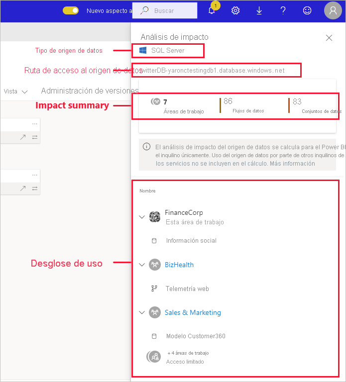
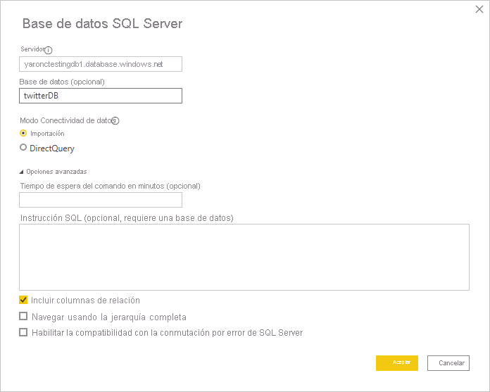
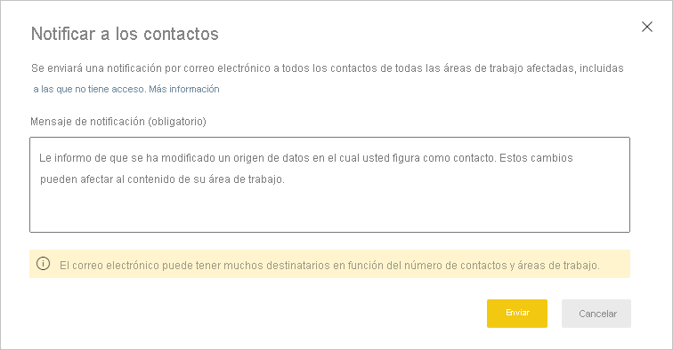

# Análisis del impacto de los orígenes de datos

El análisis del impacto de los orígenes de datos le ayuda a ver dónde se usan estos en toda la organización. Esto puede ser útil cuando un origen de datos se desconecta de manera temporal o permanente, y quiere hacerse una idea sobre quién se ve afectado. Muestra la cantidad de áreas de trabajo, flujos de datos y conjuntos de datos que usan dicho origen de datos y proporciona una navegación sencilla a las áreas de trabajo donde se encuentran los flujos de datos y conjuntos de datos afectados para que pueda investigar más.

El análisis del impacto de los orígenes de datos también puede ayudarle a detectar datos duplicados en el inquilino, por ejemplo cuando varios usuarios crean modelos similares sobre el mismo origen de datos. Al facilitar la detección de esos flujos de datos y conjuntos de datos redundantes, el análisis del impacto de los orígenes de datos admite el objetivo de tener "un único origen de verdad".

## Realización del análisis del impacto de los orígenes de datos

Para realizar el análisis del impacto de los orígenes de datos:

1. Vaya al área de trabajo que contiene el origen de datos que le interesa y abra la [vista de linaje](service-data-lineage.md).
1. Busque la tarjeta del origen de datos y haga clic en el icono de análisis de impacto.

    
 
Se abre el panel lateral Análisis de impacto.

 
* **Tipo de origen de datos**: indica el tipo del origen de datos.
* **Ruta de acceso al origen de datos**: ruta de acceso al origen de datos tal y como se define en Power BI Desktop. Por ejemplo, en la imagen anterior, la ruta de acceso al origen de datos de base de datos de SQL Server es la cadena de conexión "twitterDB-yaronctestingdb1.database.windows.net", tal y como se define en Power BI Desktop (se muestra a continuación). Está formada por el nombre de la base de datos "twitterDB" y el del servidor "yaronctestingdb1.database.windows.net".

    
 
* **Resumen de impacto**: muestra el número de áreas de trabajo, flujos de trabajo y conjuntos de datos que se pueden ver afectados. Este recuento incluye las áreas de trabajo a las que no tiene acceso.
* **Desglose de uso**: muestra los nombres de los flujos de trabajo y conjuntos de datos afectados para cada área de trabajo. Para explorar aún más el impacto sobre un área de trabajo determinada, haga clic en el nombre del área de trabajo para abrirla. Una vez que esté en el área de trabajo afectada, use el [análisis del impacto de los orígenes de datos](service-dataset-impact-analysis.md) para ver los detalles de uso de los informes y paneles conectados.

## Notificación a los contactos

Si ha realizado un cambio en un origen de datos o piensa realizarlo, es posible que quiera ponerse en contacto con los usuarios adecuados para notificárselo. Al notificar a los contactos, se envía un correo electrónico a las [listas de contactos](service-create-the-new-workspaces.md#create-a-contact-list) de todas las áreas de trabajo afectadas (en el caso de las áreas de trabajo clásicas, el correo electrónico se envía a los administradores del área de trabajo). En el correo electrónico aparece su nombre, para que los contactos puedan encontrarlo y responder en un nuevo hilo de correo. 

1. Haga clic en **Notificar a los contactos** en el panel lateral Análisis de impacto. Aparecerá el cuadro de diálogo Notificar a los contactos.

   

1. En el cuadro de texto, proporcione algunos detalles sobre el cambio.
1. Cuando el mensaje esté listo, haga clic en **Enviar**.

## Privacidad

En el panel lateral de análisis del impacto, solo verá nombres reales para las áreas de trabajo, los conjuntos de datos y los flujos de datos a los que tenga acceso. Los elementos a los que no tiene acceso se muestran como Acceso limitado. Esto se debe a que algunos nombres de elementos pueden contener información personal.
Entre los recuentos del resumen del impacto se incluyen todos los flujos de trabajo y conjuntos de datos afectados, incluidos los de las áreas de trabajo a las que no tiene acceso.

## Limitaciones

El análisis del impacto de los orígenes de datos todavía no se admite para los informes paginados, por lo que no verá si un origen de datos tiene un impacto directo en estos tipos de informes en el inquilino.

## Pasos siguientes

* [Análisis de impacto para conjuntos de datos](service-dataset-impact-analysis.md)
* [Linaje de datos](service-data-lineage.md)