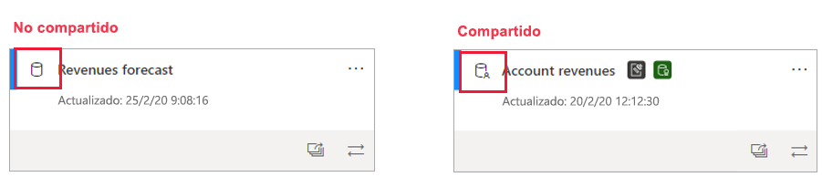
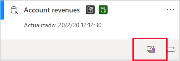
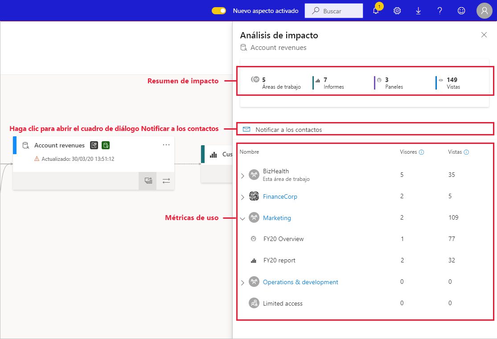
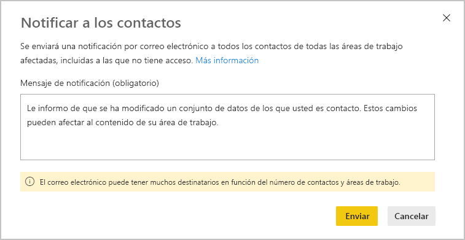

# Análisis de impacto para conjuntos de datos

Cuando se realizan cambios en un conjunto de datos o se considera la posibilidad de realizarlos, es importante poder evaluar el impacto posterior que tendrán en los informes y paneles que dependan de ese conjunto de datos. El **análisis de impacto para conjuntos de datos** proporciona información que puede ayudarle a realizar esta valoración.
* Muestra el número de áreas de trabajo, informes y paneles que se pueden ver afectados por el cambio y proporciona una navegación sencilla a las áreas de trabajo donde se encuentran los informes y paneles afectados para que pueda investigar más.
* Muestra cuántos visitantes únicos y el número de vistas en los elementos potencialmente afectados. Esto le ayudará a determinar el impacto global del cambio en el elemento posterior. Por ejemplo, es probable que sea más importante investigar el efecto de un cambio en un informe con 20 000 visitantes únicos que uno que tenga solo tres.
* Proporciona una forma sencilla de notificar a las personas relevantes sobre un cambio que haya realizado o que piense realizar.

El análisis de impacto para conjuntos de datos se inicia fácilmente desde la [vista de linaje de datos](service-data-lineage.md).

## Identificación de conjuntos de datos compartidos

Puede realizar el análisis de impacto para conjuntos de datos en conjuntos de datos compartidos y no compartidos. Pero resulta especialmente útil para los conjuntos de datos que se comparten entre áreas de trabajo, donde es mucho más complicado obtener una visión clara de las dependencias posteriores que con los conjuntos de datos no compartidos, cuyas dependencias se encuentran en la misma área de trabajo que el propio conjunto de datos.

En la vista de linaje, puede saber la diferencia entre los conjuntos de datos compartidos y los no compartidos mediante el icono que aparece en la esquina superior izquierda de la tarjeta del conjunto de datos.

## Realización del análisis de impacto para conjuntos de datos

Puede realizar el análisis de impacto en cualquier conjunto de datos del área de trabajo, ya sea compartido o no. El análisis de impacto no se puede realizar en los conjuntos de datos externos que se muestran en la vista de linaje pero que en realidad se encuentran en otra área de trabajo. Para realizar el análisis de impacto en un conjunto de datos externo, debe navegar hasta el área de trabajo de origen.

Para realizar el análisis de impacto para conjuntos de datos, haga clic en el botón Análisis de impacto en la tarjeta del conjunto de datos.

Se abre el panel lateral Análisis de impacto.

* En el **resumen de impacto** se muestra el número de áreas de trabajo, informes y paneles potencialmente afectados, así como el número total de vistas de todos los informes y paneles posteriores que están conectados al conjunto de datos.
* El vínculo **Notificar a los contactos** abre un cuadro de diálogo en el que puede crear y enviar un mensaje sobre cualquier cambio del conjunto de datos que realice en las listas de contactos de las áreas de trabajo afectadas. 
* En el **desglose de uso** se muestra, para cada área de trabajo, el número total de vistas para los informes y paneles potencialmente afectados que contiene, y para cada informe y panel, el número total de visitantes y vistas, donde
   * Visitantes: el número de usuarios distintos que han visto un informe o un panel.
   * Views: el número de vistas de un informe o un panel.

Las métricas de uso están relacionadas con los últimos 30 días, excepto el día actual. El recuento incluye el uso procedente de aplicaciones relacionadas. Las métricas le ayudan a comprender el uso del conjunto de datos en el inquilino, así como a evaluar el impacto que puede tener cualquier cambio en el conjunto de datos.

## Notificación a los contactos

Si ha realizado un cambio en un conjunto de datos o piensa realizarlo, es posible que quiera ponerse en contacto con los usuarios pertinentes para notificárselo. Al notificar a los contactos, se envía un correo electrónico a las [listas de contactos](../service-create-the-new-workspaces.md#workspace-contact-list) de todas las áreas de trabajo afectadas. En el correo electrónico aparece su nombre, para que los contactos puedan encontrarlo y responder en un nuevo hilo de correo. 

1. Haga clic en **Notificar a los contactos** en el panel lateral Análisis de impacto. Aparecerá el cuadro de diálogo Notificar a los contactos.

   

1. En el cuadro de texto, proporcione algunos detalles sobre el cambio.
1. Cuando el mensaje esté listo, haga clic en **Enviar**.

> [!NOTE]
> Notificar a los contactos no está disponible si el conjunto de datos en el que se realiza el análisis de impacto se encuentra en un área de trabajo clásica.

## Privacidad

Para realizar el análisis de impacto en un conjunto de datos, debe tener permisos de escritura en él. En el panel lateral Análisis de impacto, solo verá nombres reales para áreas de trabajo, informes y paneles a los que tenga acceso. Los elementos a los que no tiene acceso se muestran como **Acceso limitado**. Esto se debe a que algunos nombres de elementos pueden contener información personal.

Aunque no tenga acceso a algunas áreas de trabajo, seguirá viendo métricas de uso resumidas para ellas, y los mensajes de notificación a los contactos llegarán a las listas de contactos de esas áreas de trabajo.

## Análisis de impacto desde Power BI Desktop

Cuando realiza un cambio en un conjunto de datos en Power BI Desktop y, después, vuelve a publicarlo en el servicio Power BI, en un mensaje se muestra el número de áreas de trabajo, informes y paneles potencialmente afectados por el cambio y se le pide que confirme que quiere reemplazar el conjunto de datos publicado actual por el que ha modificado. El mensaje también proporciona un vínculo al análisis de impacto completo del conjunto de datos en el servicio Power BI, donde puede ver más información y adoptar medidas para mitigar los riesgos del cambio.

> [!NOTE]
> La información que se muestra en el mensaje solo indica el impacto potencial, no necesariamente que se haya interrumpido nada. A menudo, los cambios en el conjunto de datos no tienen ningún efecto adverso en sus informes y paneles posteriores; pero recibirá este mensaje en el que se aclara el posible impacto.
>
>En el mensaje, solo se muestra el número de áreas de trabajo si hay más de una que contiene informes y paneles afectados.

## Limitaciones

* Actualmente, las métricas de uso no se admiten en áreas de trabajo clásicas y personales.

## Pasos siguientes

* [Introducción a los conjuntos de datos de áreas de trabajo (versión preliminar)](../service-datasets-across-workspaces.md)
* [Linaje de datos](service-data-lineage.md)
