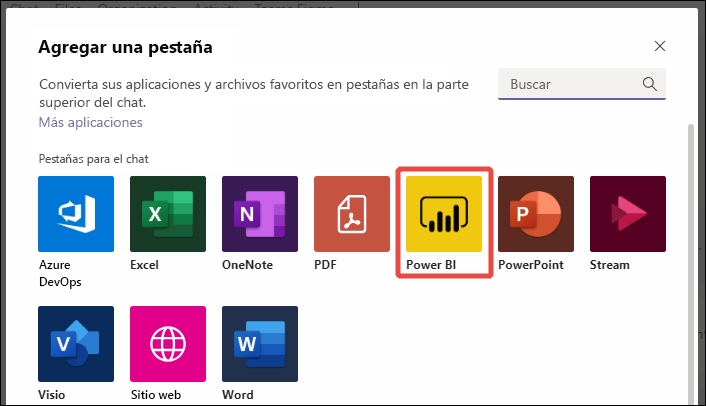
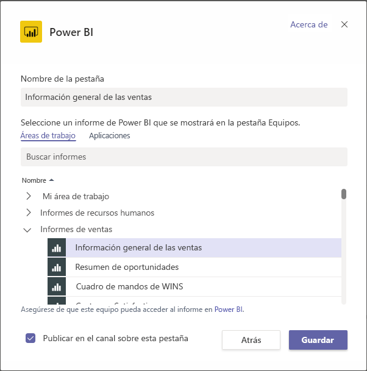
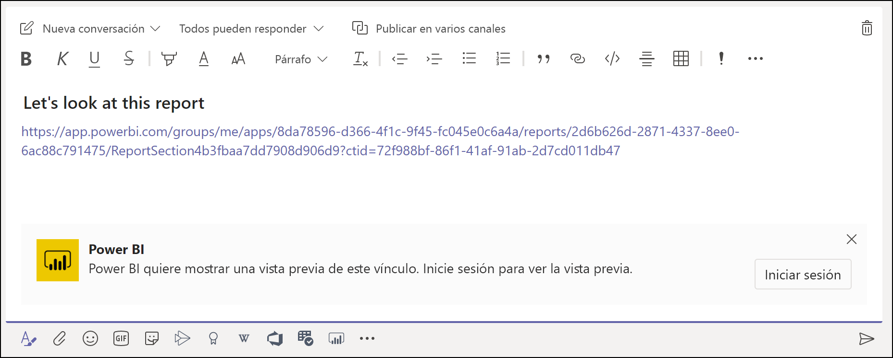
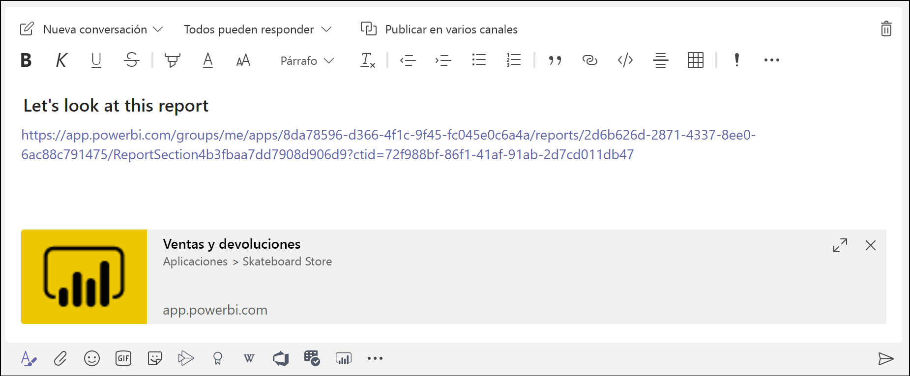
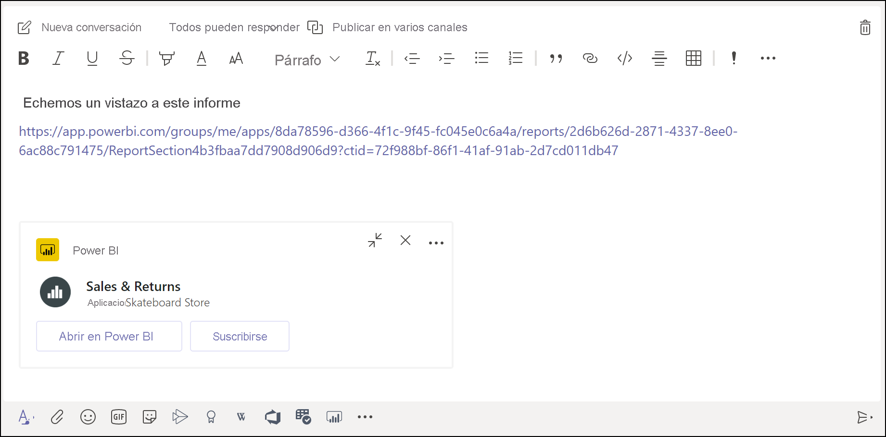
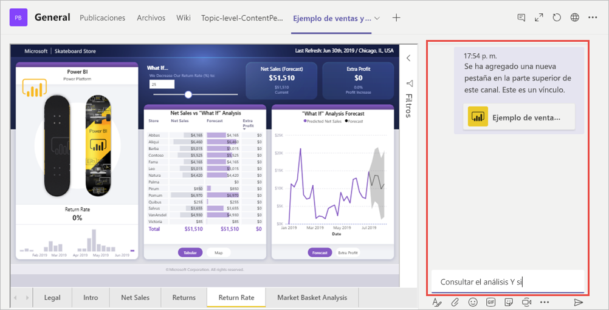

# Inserción de informes en Microsoft Teams con la pestaña Power BI

Con la pestaña Power BI actualizada de Microsoft Teams, puede insertar fácilmente informes interactivos en canales y chats de Microsoft Teams. Use la pestaña Power BI de Microsoft Teams para que sus compañeros encuentren fácilmente los datos que el equipo usa, así como para analizar los datos de los canales del equipo.  Cuando pegue un vínculo a los informes, a los paneles y a las aplicaciones en el cuadro de mensaje de Microsoft Teams, la vista previa del vínculo mostrará información sobre ellos. El usuario comprenderá más fácilmente a qué elemento le llevan los vínculos.

## Requisitos

Para que la **pestaña Power BI de Microsoft Teams** funcione, asegúrese de lo siguiente:

- Los usuarios tienen una licencia de Power BI Pro o el informe está incluido en una [capacidad de Power BI Premium (SKU EM o P)](../admin/service-premium-what-is.md) con una licencia de Power BI.
- Microsoft Teams tiene la pestaña Power BI.
- Los usuarios han iniciado sesión en el servicio Power BI para activar la licencia de Power BI y consumir el informe.
- Para agregar un informe en Microsoft Teams con la pestaña Power BI, debe tener como mínimo un rol de visor en el área de trabajo que hospeda el informe. Consulte [Roles en las nuevas áreas de trabajo](service-new-workspaces.md#roles-in-the-new-workspaces) para obtener información sobre los distintos roles.
- Para ver el informe en la pestaña Power BI de Microsoft Teams, los usuarios deben tener permiso para ver el informe.

Además, para que las **vistas previas de vínculos** funcionen, asegúrese de lo siguiente:
- Los usuarios cumplen los requisitos para usar la pestaña Power BI de Microsoft Teams.
- Los usuarios han iniciado sesión en el servicio Power BI. 

## Insertar un informe

Siga estos pasos para insertar el informe en un canal o un chat de Microsoft Teams.

1. Abra un canal o un chat en Microsoft Teams y seleccione el icono **+** .

    

2. Seleccione la pestaña Power BI.

    

3. Use las opciones suministradas para elegir un informe, ya sea de un área de trabajo, uno compartido con usted o una aplicación de Power BI.

    

4. El nombre de la pestaña se actualiza automáticamente para que coincida con el nombre del informe, pero puede cambiarlo. 

5. Presione **Save**(Guardar).

## Informes admitidos para su inserción en la pestaña Power BI
Puede insertar los siguientes tipos de informes en la pestaña Power BI:

- Informes paginados e interactivos.
- Informes de Mi área de trabajo, de una nueva experiencia de área de trabajo y de áreas de trabajo clásicas.
- Informes de aplicaciones de Power BI.

## Obtención de una vista previa de vínculo

Siga estos pasos para obtener una vista previa de vínculo para el contenido en el servicio Power BI.

1. Copie un vínculo a un informe, un panel o una aplicación en el servicio Power BI. Por ejemplo, copie el vínculo de la barra de direcciones del explorador.

2. Pegue el vínculo en el cuadro de mensaje de Microsoft Teams. Si se le pide, inicie sesión en el servicio de vista previa de vínculo. Es posible que tenga que esperar unos segundos para que se cargue la vista previa del vínculo.

    

3. Una vez que se ha iniciado sesión correctamente, se muestra la vista previa de vínculo básica.

    

4. Seleccione el icono de expandir para mostrar la tarjeta de vista previa enriquecida.

    

5. La tarjeta de vista previa de vínculo enriquecida incluye el vínculo y los botones de acción pertinentes.

    

6. Envíe el mensaje.

## Concesión de acceso a los informes

El hecho de insertar un informe en Microsoft Teams o enviar un vínculo a un elemento no concede permiso a los usuarios para ver el informe de forma automática: hay que [permitir que los usuarios vean los informes en Power BI](service-share-dashboards.md). Para que esto sea más fácil, puede usar un grupo de Microsoft 365 para el equipo.

> [!IMPORTANT]
> Asegúrese de revisar quién puede ver el informe en el servicio Power BI y de conceder acceso a los usuarios que no están en la lista.

Una forma de garantizar que todos los miembros del equipo tengan acceso a los informes consiste en incluir los informes en una misma área de trabajo en Power BI y dar acceso a ese grupo de Microsoft 365 del equipo al área de trabajo en cuestión.

## Vistas previas de vínculo 

Se proporcionan vistas previas de vínculo para los siguientes elementos de Power BI:
- Informes
- Paneles
- Aplicaciones

El servicio de vista previa de vínculo requiere que los usuarios inicien sesión. Para cerrar la sesión, haga clic en el icono de Power BI en la parte inferior del cuadro de mensaje y, luego, seleccione Cerrar sesión.

## Iniciar una conversación

Cuando se agrega una pestaña de informe de Power BI a Teams, este crea de forma automática una conversación de pestañas para el informe. 

- Seleccione **Mostrar la ficha Conversación** en la esquina superior derecha.

    

    El primer comentario es un vínculo al informe. Todos los usuarios de ese canal de Teams pueden ver y analizar el informe en la conversación.

    

## Limitaciones y problemas conocidos

- Power BI no admite los mismos idiomas localizados que Microsoft Teams. En consecuencia, es posible que no vea una localización correcta en el informe insertado.
- En la pestaña Power BI de Microsoft Teams no se pueden insertar paneles de Power BI.
- Los usuarios que no tengan una licencia de Power BI o permiso en el informe verán el mensaje "El contenido no está disponible".
- Si usa Internet Explorer 10, pueden surgir problemas. <!--You can look at the [browsers support for Power BI](../consumer/end-user-browsers.md) and for [Microsoft 365](https://products.office.com/office-system-requirements#Browsers-section). -->
- La pestaña Power BI de Microsoft Teams no admite [filtros de URL](service-url-filters.md).
- En nubes nacionales, la nueva pestaña Power BI no está disponible. Puede que haya disponible una versión anterior que no es compatible con la nueva experiencia de área de trabajo o los informes de aplicaciones de Power BI. 
- Una vez que se guarde la pestaña, no se podrá cambiar su nombre en la configuración. Para cambiarlo, use la opción Cambiar nombre.
- No se admite el inicio de sesión único para el servicio de vista previa de vínculo.
- Las vistas previas de vínculo no funcionan en los canales privados o de chat.

## Pasos siguientes
- [Compartir un panel con compañeros y otros usuarios](service-share-dashboards.md)  
- [Creación y distribución de una aplicación en Power BI](service-create-distribute-apps.md)  
- [¿Qué es Power BI Premium?](../admin/service-premium-what-is.md)

¿Tiene más preguntas? [Pruebe a preguntar a la comunidad de Power BI](https://community.powerbi.com/)
