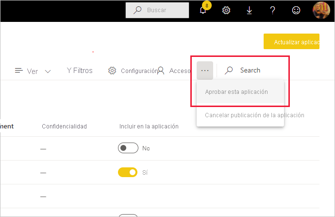

# Aprobación del contenido

Power BI proporciona dos maneras de aprobar el contenido valioso y de alta calidad para aumentar su visibilidad: la **promoción** y la **certificación**.

* **Promoción**: es una manera de resaltar el contenido que cree valioso y que merece la pena que otros usuarios lo utilicen. Se fomenta la diseminación y el uso colaborativo de contenido en una organización.

    Cualquier propietario de contenido, así como los miembros con permisos de escritura en el área de trabajo donde se encuentra el contenido, pueden promoverlo cuando crean que tiene la calidad suficiente como para compartirlo.

* **Certificación**: significa que el contenido cumple los estándares de calidad de la organización y se puede considerar como contenido fiable y autoritativo que está listo para su uso en toda la organización.

    Solo los revisores autorizados pueden certificar contenido. Los propietarios de contenido que quieran ver su contenido certificado y que no estén autorizados para hacerlo deben seguir las directrices de su organización acerca de la obtención de la certificación del contenido.

Actualmente es posible aprobar lo siguiente:
* Conjuntos de datos
* Flujos de datos (versión preliminar)
* Informes (versión preliminar)
* Aplicaciones (versión preliminar)

En este artículo se describe cómo [promover contenido](#promote-content), cómo [certificar contenido](#certify-content) si es un revisor autorizado y cómo [solicitar la certificación](#request-content-certification) en caso contrario.

Vea [Aprobación: promoción y certificación del contenido de Power BI](service-endorsement-overview.md) para obtener más información sobre la aprobación.

## Promoción de contenido

Para promover contenido, debe tener permisos de escritura en el área de trabajo donde se encuentra el contenido que quiera promover.

>[!NOTE]
>Debajo se muestra el cuadro de diálogo de aprobación para conjuntos de datos con fines ilustrativos. Los cuadros de diálogo para los demás tipos de contenido son casi idénticos, con las mismas opciones de botón de radio. 

1. Vaya a la [configuración](#how-to-get-to-content-settings) del contenido que quiera promover.

1. Expanda la sección de aprobación y seleccione **Promocionados**. Si va a promover un conjunto de datos, proporcione una breve descripción del mismo.

    

1. Seleccione **Aplicar**.

## Certificación de contenido

La certificación de contenido es una gran responsabilidad y solo los usuarios autorizados pueden realizar esta acción. Otros usuarios pueden [solicitar la certificación de contenido](#request-content-certification). En esta sección se describe cómo certificar contenido.

>[!NOTE]
>Debajo se muestra el cuadro de diálogo de aprobación para conjuntos de datos con fines ilustrativos. Los cuadros de diálogo para los demás tipos de contenido son casi idénticos, con las mismas opciones de botón de radio. 

1. Obtenga permisos de escritura en el área de trabajo donde se encuentra el contenido que quiere certificar. Puede solicitar estos permisos al propietario del contenido o a cualquier usuario que tenga permisos de administrador en el área de trabajo.

1. Revise atentamente el contenido y determine si cumple los estándares de certificación de su organización.

1. Si decide certificar el contenido, vaya al área de trabajo donde se encuentra y, después, abra la [configuración](#how-to-get-to-content-settings) del contenido que quiere certificar.

1. Expanda la sección de aprobación y seleccione **Certificado**. 

    

1. Seleccione **Aplicar**.

## Solicitud de certificación de contenido

Si quiere certificar el contenido pero no está autorizado para hacerlo, siga los pasos que hay a continuación.

>[!NOTE]
>Debajo se muestra el cuadro de diálogo de aprobación para conjuntos de datos con fines ilustrativos. Los cuadros de diálogo para los demás tipos de contenido son casi idénticos, con las mismas opciones de botón de radio. 

1. Vaya al área de trabajo en la que se encuentra el contenido que quiere certificar y, después, abra la [configuración](#how-to-get-to-content-settings) de ese contenido.

1. Expanda la sección de aprobación. El botón **Certificado** está atenuado porque no está autorizado a certificar contenido. Haga clic en el vínculo sobre cómo obtener la certificación del contenido.

    
    
    >[!NOTE]
    >Si ha hecho clic en el vínculo anterior pero se le ha redirigido de nuevo a esta nota, significa que el administrador de Power BI no ha hecho ninguna información disponible. En este caso, póngase en contacto directamente con el administrador de Power BI.

## Procedimientos para ir a la configuración del contenido

Al cuadro de diálogo de aprobación se accede a través de la configuración del contenido que quiere aprobar. Siga las instrucciones que se indican a continuación para ir a la configuración de cada tipo de contenido.

* **Conjuntos de datos**: en la vista de lista, mantenga el mouse sobre el conjunto de datos que quiere aprobar, haga clic en **Más opciones (...)** y, después, elija **Configuración** en el menú que aparece.
* **Flujos de datos** (versión preliminar): en la vista de lista, mantenga el mouse sobre el flujo de datos que quiere aprobar, haga clic en **Más opciones (...)** y, después, elija **Configuración** en el menú que aparece.

* **Informes** (versión preliminar): en la vista de lista, mantenga el mouse sobre el informe que quiere aprobar, haga clic en **Más opciones (...)** y, después, elija **Configuración** en el menú que aparece. Como alternativa, si el informe está abierto, elija **Archivo > Configuración**.

* **Aplicaciones** (versión preliminar): vaya al área de trabajo de la aplicación, haga clic en **Más opciones (...)** en la barra de menús y elija **Aprobar esta aplicación**.

    

## Pasos siguientes

* [Más información sobre la aprobación de contenido](service-endorsement-overview.md)
* [Habilitar la certificación de contenido](../admin/service-admin-setup-certification.md) (administradores de Power BI)
* ¿Tiene alguna pregunta? [Pruebe a preguntar a la comunidad de Power BI](https://community.powerbi.com/)
