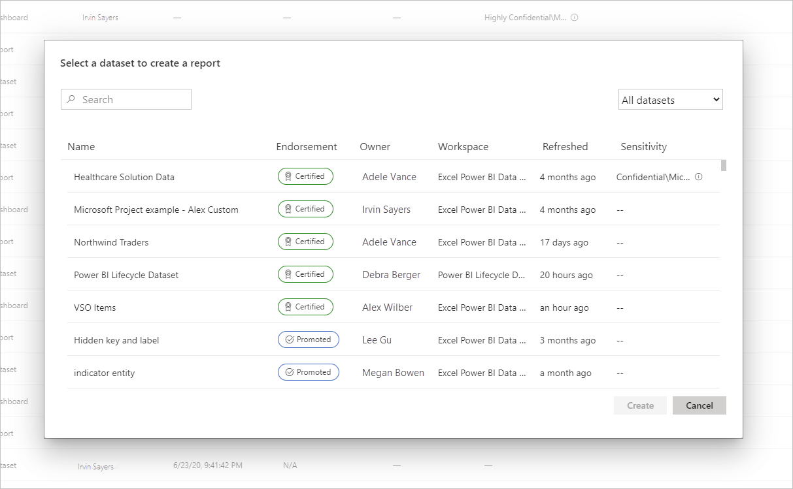
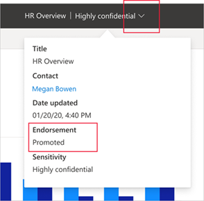

# Aprobación: promoción y certificación del contenido de Power BI

## Información general sobre la aprobación

A menudo, las organizaciones tienen una gran cantidad de contenido de Power BI disponible para que los usuarios de Power BI lo compartan y vuelvan a utilizarlo, por lo que la identificación de contenido fiable y autoritativo puede resultar difícil. La aprobación es una manera de facilitar a los usuarios la búsqueda del contenido de alta calidad que necesitan. El contenido aprobado se etiqueta de forma clara, tanto en Power BI como en otros lugares en los que los usuarios buscan contenido de Power BI (por ejemplo, Excel). También se le da prioridad en algunas búsquedas y se puede ordenar en algunas listas.

Hay dos tipos de aprobación: **promoción** y **certificación**.

* **Promoción**: permite a los usuarios resaltar el contenido que piensan que es valioso, que puede merecer la pena y que esté listo para otros usuarios. Se fomenta la diseminación colaborativa de contenido en la organización.

    Cualquier propietario de contenido, o cualquier miembro con permisos de escritura en el área de trabajo donde se encuentra el contenido, puede promoverlo simplemente cuando crea que tiene la calidad suficiente como para compartirlo.

* **Certificación**: significa que el contenido cumple los estándares de calidad de la organización y se puede considerar como contenido fiable y autoritativo que está listo para su uso en toda la organización.

    Solo un grupo de revisores seleccionados, que define el administrador de Power BI, está autorizado para certificar el contenido. Los propietarios de contenido que quieran ver su contenido certificado y que no estén autorizados para hacerlo deben seguir las directrices de su organización acerca de la obtención de la certificación del contenido.

    **La certificación solo está disponible si un administrador de Power BI la ha habilitado y configurado para su organización**.

La imagen siguiente muestra cómo se identifica claramente el contenido aprobado (promocionado y certificado) al buscar un conjunto de datos sobre el que se va a crear un informe.

## Tipos de contenido que se pueden aprobar
Actualmente, Power BI admite la aprobación de lo siguiente:
* Conjuntos de datos
* Flujos de datos (versión preliminar)
* Informes (versión preliminar)
* Aplicaciones (versión preliminar)

## Identificación del contenido aprobado

El contenido aprobado se etiqueta con distintivos e iconos en listas, tarjetas y otros lugares, en Power BI y en lugares como Excel, en los que es posible encontrar contenido de Power BI. Los distintivos e iconos siguientes identifican el contenido aprobado.

|Distintivo|Icono|
|---------|---------|
|||
|||
|||

Además, si se encuentra en un informe o una aplicación, puede ver el estado de aprobación a través del encabezado.
* La certificación se indica en el encabezado y en el menú desplegable de este encabezado, donde también puede ver quién ha hecho la certificación.

    

* La promoción se indica solo en el menú desplegable del encabezado.
 
    

## Decisión de si se va a aprobar una aplicación o un informe

La aprobación está pensada con el fin de usarse para los elementos de contenido (aplicaciones, informes, conjuntos de datos y flujos de datos) que se quiere que los usuarios busquen, utilicen y, tal vez, vuelvan a compartir.

Al compartir datos con un público amplio, un procedimiento recomendado de Power BI consiste en compartir estos datos a través de una aplicación. Si sigue este procedimiento recomendado, querrá que los usuarios puedan encontrar la aplicación de forma sencilla. En estos casos, debe aprobar la aplicación. 

Sin embargo, si todavía le resulta útil compartir informes directamente, apruebe el propio informe. 

Tanto si comparte un informe o una aplicación, si los conjuntos de datos subyacentes están limpios y listos para compartirse, es una buena idea aprobar también los conjuntos de datos. Lo mismo se aplica a los flujos de datos.  

## Pasos siguientes

* [Promover o certificar contenido de Power BI](service-endorse-content.md)
* [Habilitar la certificación para la organización](../admin/service-admin-setup-certification.md) (administradores de Power BI)
* ¿Tiene alguna pregunta? [Pruebe a preguntar a la comunidad de Power BI](https://community.powerbi.com/)