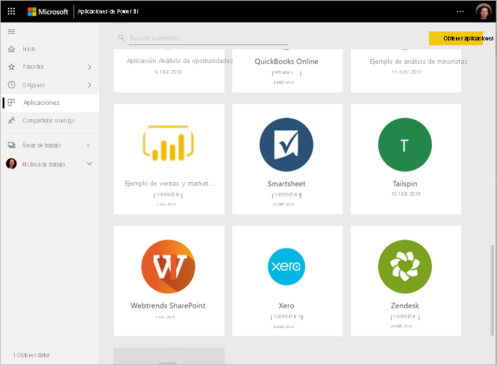

# Formas de colaborar y compartir en Power BI

Ha creado paneles e informes, y es posible que colabore en ellos con sus compañeros. O tal vez esté listo para distribuirlos entre un público más amplio. ¿Cuál es la mejor manera de colaborar y compartirlos? En este artículo, se comparan las diferentes opciones.

*Aplicaciones en el servicio Power BI*

**Colaborar**

- Colaborar con sus compañeros en *áreas de trabajo* para crear informes y paneles significativos.
- Colaborar en *Microsoft Teams*.

**Distribuir o compartir paneles e informes**

- *Compartir paneles o informes* desde Mi área de trabajo u otra área de trabajo.
- Anotar y compartir desde aplicaciones móviles de *Power BI*.
- Agrupar paneles e informes de áreas de trabajo en *aplicaciones* y distribuirlas entre un grupo más grande o en toda la organización.
- Insertar de informes en *portales seguros* o *sitios web públicos*.
- Imprimir informes.
- Crear una *aplicación de plantilla* que se puede distribuir a usuarios externos de Power BI mediante Microsoft AppSource.
 
**Compartir datos**

- Crear *conjuntos de datos compartidos* que sus compañeros de trabajo pueden usar como base para sus propios informes, en sus propias áreas de trabajo.
- Crear *flujos de datos* como una manera de compartir un origen de datos común.

Con independencia de la opción que se elija, para compartir el contenido se necesita una [licencia de Power BI Pro](../fundamentals/service-features-license-type.md) o que el contenido esté en una [capacidad Premium](../admin/service-premium-what-is.md). Los requisitos de licencia para los compañeros que ven su contenido varían en función de la opción que elija. En las secciones siguientes puede encontrar más detalles. 

## Colaboración en un área de trabajo

Cuando los equipos trabajan juntos, necesitan tener acceso a los mismos documentos para poder colaborar con facilidad. En las áreas de trabajo de Power BI, los equipos comparten la propiedad y administración de paneles, informes, conjuntos de datos y libros. A veces, los usuarios de Power BI organizan sus áreas de trabajo según las estructuras de la organización, o las crean para proyectos específicos. Además, otras organizaciones usan varias áreas de trabajo para almacenar diferentes versiones de los informes o paneles que usan. 

Las áreas de trabajo proporcionan roles que determinan los permisos que tienen sus compañeros de trabajo. Use esos roles para determinar quién puede administrar el área de trabajo, editar o distribuir contenido, o simplemente ver el contenido. Obtenga más información sobre los [roles en las áreas de trabajo nuevas](service-new-workspaces.md#roles-in-the-new-workspaces).

Las áreas de trabajo son mejores para la colaboración que Mi área de trabajo, ya que permiten compartir la propiedad del contenido. Usted y todo su equipo pueden realizar actualizaciones o asignar acceso a otros usuarios fácilmente. Es mejor que Mi área de trabajo lo usen usuarios para contenido personal o de uso único.

Ahora, imagine que ha terminado un panel que tiene que compartir con sus compañeros. ¿Cuál es la mejor manera para concederles acceso a él? La respuesta depende de una serie de factores. 

- Si sus compañeros necesitan mantener actualizado el panel o necesitan acceso a todo el contenido del área de trabajo, agréguelos al área de trabajo como miembros o colaboradores. 
- Si los compañeros solo necesitan ver el contenido en el área de trabajo, agréguelos como visores.
- Si los compañeros solo necesitan ver ese panel y no todo el contenido del área de trabajo, puede compartir el panel con ellos directamente.
- Si el panel forma parte de un conjunto de paneles e informes que necesita distribuir a muchos compañeros, probablemente la mejor opción sea publicar una *aplicación*.

Obtenga información sobre cómo [crear las nuevas áreas de trabajo](service-create-the-new-workspaces.md). 

## Colaboración en Microsoft Teams

Aumente la colaboración controlada por datos de la organización mediante la inserción de los informes e informes paginados de Power BI en Microsoft Teams. El servicio Power BI tiene un botón **Compartir en Teams** para los informes. Puede agregar pestañas de Power BI independientes para cada informe individual y asignar a cada pestaña el nombre del informe o cualquier otro. 

Cuando se agrega una pestaña de informe de Power BI a Microsoft Teams, este crea de forma automática una pestaña de conversación para el informe. Todos los usuarios de ese canal de Microsoft Teams pueden ver y analizar el informe en la conversación. 

:::image type="content" source="media/service-how-to-collaborate-distribute-dashboards-reports/power-bi-teams-conversation-tab.png" alt-text="Pestaña conversación de Microsoft Teams":::

Obtenga más información sobre la [colaboración en Microsoft Teams con Power BI](service-embed-report-microsoft-teams.md).

## Compartir los paneles e informes

Supongamos que ha finalizado un informe en Power BI Desktop y desea que otras personas tengan acceso a él. Una manera de hacerlo posible es *compartirlo* en el servicio Power BI. Lo publica en su propia área de trabajo o en otra área de trabajo. Quizá lo complemente con un panel y, con eso, lo tiene todo listo.

Necesita una licencia de Power BI Pro para compartir el contenido. Aquellos con quienes lo comparta, también requieren esa licencia, o bien que el contenido esté en un área de trabajo de una [capacidad Premium](../admin/service-premium-what-is.md). Cuando comparte un panel o un informe con otras personas, los destinatarios pueden verlo e interactuar con él. Si les concede permiso, pueden editarlo, realizar una copia de él y compartirlo con sus compañeros de trabajo. Ven los mismos datos que ve usted en el panel o el informe. Tienen acceso a todos los datos del conjunto de datos subyacente, a menos que se aplique [seguridad de nivel de fila (RLS)](../admin/service-admin-rls.md).

También puede compartir con usuarios que no pertenezcan a su organización. Pueden ver el panel o el informe e interactuar con él, pero no pueden compartirlo. 

Obtenga más información sobre cómo [compartir paneles e informes](service-share-dashboards.md) desde el servicio Power BI. O lea sobre cómo agregar un filtro a un vínculo y [compartir una vista filtrada del informe](service-share-reports.md).

## Anotación y uso compartido de un panel desde aplicaciones móviles de Power BI

En las aplicaciones móviles de Power BI para dispositivos iOS y Android, puede anotar un icono, un informe o un objeto visual, y después compartirlo con otros usuarios por correo electrónico.

Está compartiendo una instantánea del icono, el informe o el objeto visual. Los destinatarios la verán exactamente igual que como era cuando envió el correo. El correo electrónico también contiene un vínculo al panel o el informe. Si tienen una licencia de Power BI Pro, o el contenido está en una [capacidad Premium](../admin/service-premium-what-is.md) y ha compartido el contenido con ellos, pueden abrirlo. Puede enviar instantáneas de iconos a cualquier persona, no solo a compañeros del mismo dominio de correo electrónico.

Obtenga más información sobre cómo [anotar y compartir iconos, informes y objetos visuales](../consumer/mobile/mobile-annotate-and-share-a-tile-from-the-mobile-apps.md) desde aplicaciones móviles de iOS y Android.

También puede [compartir una instantánea de un icono](../consumer/mobile/mobile-windows-10-phone-app-get-started.md) desde la aplicación de Power BI para dispositivos Windows 10, pero no realizar anotaciones en ella.

## Distribución de información en una aplicación

Supongamos que desea distribuir el panel a un público amplio en la organización. Junto con sus compañeros ha creado un *área de trabajo* y luego ha creado y refinado en ella paneles, informes y conjuntos de datos. Ahora seleccione los paneles e informes y publíquelos como una *aplicación*, para un grupo o para toda la organización.

Es muy fácil buscar e instalar aplicaciones en el servicio Power BI ([https://app.powerbi.com](https://app.powerbi.com)). Puede enviar a los usuarios de la empresa un vínculo directo a la aplicación, o bien pueden buscarla en AppSource. Si el administrador de Power BI le concede permisos, puede instalar una aplicación automáticamente en las cuentas de Power BI de sus compañeros de trabajo. Obtenga información sobre cómo [publicar una aplicación](service-create-distribute-apps.md).

Después de instalar una aplicación, pueden verla en sus exploradores o dispositivos móviles.

Para que los usuarios vean la aplicación, deben tener también una licencia de Power BI Pro o la aplicación debe estar almacenada en una capacidad de Power BI Premium. Para más información, lea [What is Power BI Premium?](../admin/service-premium-what-is.md) (¿Qué es Power BI Premium?)

También puede publicar aplicaciones para personas que no pertenecen a su organización. Pueden ver el contenido de la aplicación e interactuar con él, pero no compartirlo con otros usuarios. Ahora puede crear *aplicaciones de plantilla* e implementarlas en cualquier cliente de Power BI.

## Inserción de informes en portales seguros o sitios web públicos

### Inserción en portales seguros

Puede insertar informes de Power BI en portales o sitios web en los que los usuarios esperan encontrarlos.  
Las opciones **Insertar en SharePoint Online** e **Insertar** del servicio Power BI permiten insertar informes para los usuarios internos de forma segura. En cualquier opción que elija, Power BI aplica todos los permisos y la seguridad de los datos antes de que los usuarios puedan ver el contenido. La persona que consulta el informe necesita la licencia pertinente.  

- **Insertar en SharePoint Online** funciona con el elemento web de Power BI para SharePoint Online. Proporciona una experiencia de inicio de sesión único con control sobre cómo se inserta el informe. Obtenga más información sobre la [inserción en SharePoint Online](service-embed-report-spo.md).
- **Insertar** funciona en cualquier portal o sitio web que sea compatible con la inserción de contenido mediante una dirección URL o un iFrame. Obtenga más información sobre la opción [Insertar](service-embed-secure.md).

### Publicación en sitios web públicos

Con la opción **Publicar en Web**, puede publicar informes de Power BI en todo Internet mediante la inserción de visualizaciones en entradas de blog, sitios web, redes sociales y otras comunicaciones en línea. Todos los usuarios de Internet pueden ver los informes y no se puede controlar quién puede ver lo que ha publicado. No necesitan una licencia de Power BI. La publicación en la Web está disponible solo para los informes que puede editar. No se pueden publicar informes en la Web si están compartidos con usted o si se encuentran en una aplicación. Obtenga información sobre cómo [publicar en la Web](service-publish-to-web.md)

>[!Warning]
>Use [Publicar en la Web](service-publish-to-web.md) solo para compartir el contenido públicamente, no para uso compartido interno.

## Imprimir o guardar como PDF u otro formato de archivo estático

En el servicio Power BI, puede imprimir, guardar como PDF o guardar como otro formato de archivo estático cualquiera de estos elementos:

- Un panel completo
- Un icono del panel
- Una página del informe
- Un informe paginado
- Una visualización del servicio Power BI 

Solo puede imprimir las páginas de informes de Power BI de una en una. No se puede imprimir todo el informe a la vez. Obtenga información sobre cómo [imprimir o guardar un informe o un panel como un archivo estático](../consumer/end-user-print.md).

Los informes paginados, por otro lado, están diseñados para imprimirse. Lea una [comparación de informes de Power BI e informes paginados](../paginated-reports/paginated-reports-report-builder-power-bi.md#compare-power-bi-reports-and-paginated-reports) para obtener más información. 

## Creación e implementación de aplicaciones de plantilla

Las *aplicaciones de plantilla* han sido diseñadas para su distribución pública, a menudo en Microsoft AppSource. Usted crea una aplicación y, con poca o ninguna codificación, puede implementarla en cualquier cliente de Power BI. Los clientes se conectan a sus propios datos y crean instancias de sus propias cuentas. Más información sobre las [Aplicaciones de plantilla de Power BI](../connect-data/service-template-apps-overview.md).

## Compartir un conjunto de datos

Siendo realistas, algunas personas están más especializadas en la creación de modelos de datos de alta calidad y bien diseñados en sus informes. Tal vez sea usted esa persona. Toda la organización puede beneficiarse del uso de dichos modelos de datos bien diseñados. Los *conjuntos de datos compartidos* cumplen ese rol. Cuando se crea un informe con un modelo de datos que debería usar todo el mundo, puede guardar dicho informe en el servicio Power BI y dar permiso para usarlo a las personas adecuadas. A continuación, estas personas pueden crear sus informes a partir del conjunto de datos. De este modo, todos los usuarios basan sus informes en los mismos datos y ven la misma "versión de la verdad".

Más información sobre la [creación y uso de conjuntos de datos compartidos](../connect-data/service-datasets-across-workspaces.md).

## Creación de flujos de datos

Los *flujos de datos* son una forma de autoservicio para unificar los datos de orígenes dispares y prepararlos para el modelado. Los analistas crean flujos de datos para ingerir, transformar, integrar y enriquecer los macrodatos. Crean y administran flujos de trabajo en áreas de trabajo en el servicio Power BI. Obtenga más información sobre la [preparación de datos de autoservicio con flujos de datos](../transform-model/service-dataflows-overview.md).

## Consideraciones y limitaciones

- No puede compartir informes desde Power BI Report Server. En su lugar, puede crear suscripciones [para usted mismo o para otros usuarios](/sql/reporting-services/working-with-subscriptions-web-portal).

## Pasos siguientes

- [Compartir paneles e informes con compañeros y otros usuarios](service-share-dashboards.md)
- [Creación y publicación de una aplicación en Power BI](service-create-distribute-apps.md)
- [Inserción de informes en un sitio web o portal seguros](service-embed-secure.md)

¿Quiere hacer algún comentario? Vaya al [sitio de la comunidad de Power BI](https://community.powerbi.com/) para efectuar sus sugerencias.

¿Tiene más preguntas? [Pruebe la comunidad de Power BI](https://community.powerbi.com/)
