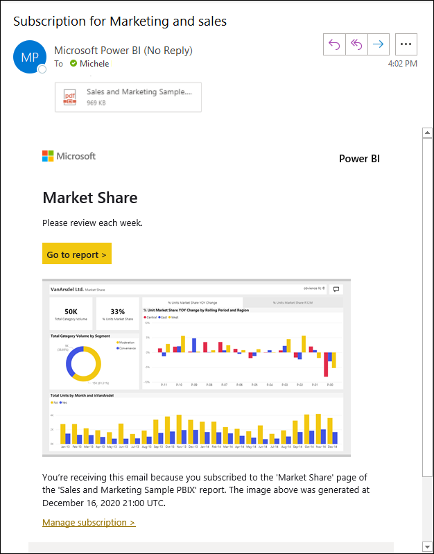

# Suscripción personal y de otros usuarios a informes y paneles en el servicio Power BI

Tanto usted como sus compañeros de trabajo pueden suscribirse a las páginas del informe, paneles e informes paginados que más le interesen. Las suscripciones de correo electrónico de Power BI le permiten:

- Decidir la frecuencia con la que quiere recibir los mensajes de correo electrónico: diaria, semanal, horaria, mensual o una vez al día después de la actualización de los datos iniciales.
- Elegir la hora a la que quiere recibir el correo electrónico, si elige diariamente, semanalmente, cada hora o mensualmente.
- Configurar 24 suscripciones diferentes por informe o panel de Power BI.  No hay ningún límite en cuanto al número de suscripciones que se pueden configurar para los informes paginados.
- Enviar un correo con una imagen del informe y un vínculo al informe en el servicio.  En los dispositivos móviles con aplicaciones de Power BI instaladas, al hacer clic en este vínculo, se inicia la aplicación de Power BI, en lugar de abrir el informe o el panel en el sitio web de Power BI.
- Incluir datos adjuntos del informe completo.
- Enviar un correo electrónico a los usuarios fuera del inquilino, si el contenido de Power BI se hospeda en una capacidad Premium.  Los administradores pueden controlar el acceso a quién puede enviar suscripciones de correo electrónico a usuarios externos mediante la configuración de control de uso compartido externo existente en el centro de administración de Power BI.

## Requisitos

La **creación** de una suscripción puede hacerse por:

- Usuarios con una licencia de Power BI Pro
- Los usuarios que ven contenido en un área de trabajo o aplicación Premium también pueden suscribirse al contenido que se encuentra allí, incluso sin una licencia Power BI Pro.

No necesita permisos de edición para el contenido (panel o informe) para crear una suscripción personal, pero debe tener permisos de edición para crear una para otro usuario.

## Suscripción a un panel, una página del informe o un informe paginado

El proceso de suscripción a un panel, un informe o un informe paginado es similar. El mismo botón permite suscribirse a los paneles e informes del servicio Power BI.

La suscripción a informes paginados varía un poco. Para obtener más información, consulte [Suscripción personal y de otros usuarios a un informe paginado en el servicio Power BI](../consumer/paginated-reports-subscriptions.md).

.

1. Abra el panel o el informe.
2. En la barra de menús superior, seleccione **Suscribirse** o el icono de sobre :::image type="icon" source="media/service-report-subscribe/power-bi-icon-envelope.png" border="false":::.

    

1. Use el control deslizante amarillo para activar y desactivar la suscripción. Establecer el control deslizante en **Desactivado** no elimina la suscripción. Para eliminarla, seleccione el icono de papelera.

2. La dirección de correo electrónico ya está en la bandeja **Suscribirse**. También puede agregar otras direcciones de correo electrónico en el mismo dominio a la suscripción. Si el informe o el panel está hospedado en una [capacidad Premium](../admin/service-premium-what-is.md), puede suscribir otras direcciones de correo electrónico y alias de grupo individuales, con independencia de que estén en el dominio. Si el informe o el panel no está hospedado en una capacidad Premium, puede suscribir a otros usuarios, pero también deben tener licencias de Power BI Pro. Para obtener más detalles, vea [Consideraciones y solución de problemas](#considerations-and-troubleshooting).

3. Rellene el **Asunto** del correo electrónico y los detalles del **Mensaje**.

4. Seleccione una **Frecuencia** para la suscripción:  **Diaria**, **Horaria**, **Semanal**, **Mensual** o **Tras la actualización de los datos (una vez al día)** . Para recibir el correo electrónico de la suscripción solo en días específicos, seleccione **Horaria** o **Semanal**, y elija los días en que quiera recibirla. Por ejemplo, si quiere recibir el correo de suscripción solo los días laborables, seleccione **Semanal** y desactive las casillas de **Sáb.** y **Dom.** . Si selecciona **Mensual**, escriba los días del mes en los que quiere recibir el correo de suscripción.

5. Si elige **Diaria**, **Horaria**, **Mensual** o **Semanal**, también puede elegir una **Hora programada** para la suscripción. Puede hacer que se ejecute a la hora, o bien pasados 15, 30 o 45 minutos. Seleccione por la mañana (a. m.) o por la tarde/noche (p. m.). También puede especificar la zona horaria. Si elige **Horaria**, seleccione la **Hora programada** a la que quiera que se inicie la suscripción, y se ejecutará cada hora a partir de entonces.

6. De forma predeterminada, la fecha de inicio para la suscripción es la fecha en la que la ha creado. Tiene la opción de seleccionar una fecha de finalización. Si no establece una fecha de finalización, automáticamente será un año después de la fecha de inicio. Puede cambiarla a cualquier fecha en el futuro (hasta el año 9999) en cualquier momento antes de que finalice la suscripción. Cuando una suscripción alcanza una fecha de finalización, se detiene hasta que vuelva a habilitarla. Recibirá notificaciones antes de la fecha de finalización programada para preguntarle si quiere ampliarla.

    En la captura de pantalla siguiente, tenga en cuenta que, cuando se suscribe a un informe, realmente se está suscribiendo a una de sus _páginas_. Para suscribirse a más de una página de un informe, puede seleccionar **Datos adjuntos de informe completo como** o configurar una suscripción nueva seleccionando **Agregar otra suscripción**.

    

1. (Opcional) Seleccione si quiere incluir un vínculo de vuelta al contenido en Power BI y si quiere proporcionar a los usuarios acceso al contenido al que les suscribe.  Si decide incluir un vínculo, para obtener la mejor experiencia, asegúrese de que todos los usuarios tengan acceso al informe.

1. (Opcional) Seleccione si quiere agregar el _informe completo_ como datos adjuntos en lugar de solo una página de informe. Elija PDF o PowerPoint. Los datos adjuntos no pueden tener más de 20 páginas y menos de 25 MB. Los datos adjuntos respetan todas las etiquetas de privacidad del informe.

1. Seleccione **Guardar y cerrar**. Los que se hayan suscrito reciben un correo electrónico y una instantánea de la página de panel o informe para la frecuencia y la hora que se hayan seleccionado. En total, puede crear hasta 24 suscripciones por informe o panel, y pueden proporcionar destinatarios, horas y frecuencias únicos para cada suscripción. Todas las suscripciones establecidas en **Tras la actualización de los datos** para el informe o panel solo enviarán un correo electrónico después de la primera actualización programada.

    > [!NOTE]
    > Si modifica la suscripción después de guardarla y cerrarla, se habilita la selección para ofrecer acceso a los usuarios al contenido al que se va a suscribir, con independencia de las selecciones anteriores.
    >

    > [!TIP]
    > ¿Quiere enviar el correo electrónico desde una suscripción al instante o a petición en cualquier momento? Seleccione **Ejecutar ahora** para las suscripciones del panel o informe que quiera enviar. Verá una notificación en la que se indica que hay un correo electrónico en camino para todos los usuarios de esa suscripción concreta. Esta acción no cuenta para el límite de 24 ejecuciones de suscripción programadas al día por informe o panel. Esto NO desencadena una actualización de datos del conjunto de datos subyacente.
    >

## Administrar sus suscripciones

Solo la persona que haya creado la suscripción podrá administrarla. Hay dos rutas de acceso a la pantalla en la que se administran las suscripciones. La primera es seleccionar **Administrar todas las suscripciones** en el cuadro de diálogo **Subscribirse a correos electrónicos** (vea el paso 4 anterior). La segunda es seleccionar el icono de engranaje  de Power BI en la barra de menús superior y elegir **Configuración**.

Las suscripciones que se muestran dependen del área de trabajo que está activa en ese momento. Para ver a la vez todas las suscripciones de todas las áreas de trabajo, asegúrese de que **Mi área de trabajo** está activa. Para entender las áreas de trabajo, vea [Áreas de trabajo de Power BI](service-create-workspaces.md).

Una suscripción finaliza en cualquiera de estos casos:

- La licencia de Pro expira.
- El propietario elimina el panel o el informe.
- Se elimina la cuenta de usuario usada para crear la suscripción.

Los administradores de Power BI pueden usar los registros de auditoría de Power BI para ver detalles sobre las suscripciones. Estos detalles incluyen:

- Creado por
- Fecha de creación
- Contenido suscrito a
- Recipients
- Frecuencia
- Modificado por
- Fecha de modificación

## Consideraciones y solución de problemas

### General

- Al igual que otros productos de BI, el momento en el que se establece la suscripción es cuando esta comienza el procesamiento.  Una vez completado el procesamiento del informe, la suscripción se pone en cola y se envía a los destinatarios de correo electrónico.  Nos esforzamos por procesar y ofrecer todas las suscripciones lo antes posible. Aunque, a veces, en períodos de demanda máxima, se puede ver un retraso más largo debido al número de suscripciones que Power BI puede enviar a la vez. La mayoría de los clientes no debe ver un retraso de más de 15 minutos en el procesamiento y envío de informes. El proceso puede tardar hasta 30 minutos en determinadas horas e inquilinos con un uso significativo.  Nunca esperamos que ningún retraso en la entrega sea superior a 60 minutos desde el momento en que se programa la suscripción.  Si experimenta un retraso así, asegúrese primero de que la dirección `no-reply-powerbi@microsoft.com` está en la lista de remitentes seguros y de que el proveedor de correo electrónico no la tiene bloqueada.  Si el correo electrónico no está bloqueado, póngase en contacto con el soporte técnico de Power BI para obtener ayuda.
- En la actualidad, al suscribir a otros usuarios, no se admiten las suscripciones de correo electrónico relativas a informes o paneles que usen conjuntos de datos con conexión dinámica, excepto para los informes paginados. Puede suscribir a otros usuarios a un informe paginado mediante el contexto de seguridad. Obtenga más información sobre la [suscripción a informes paginados](../consumer/paginated-reports-subscriptions.md).
- Power BI detiene de forma automática la actualización en los conjuntos de datos asociados con los paneles e informes que no se han visitado en más de dos meses. Pero si agrega una suscripción a un panel o informe, no se detiene incluso si no recibe visitas.
- Si no recibe los mensajes de correo electrónico de suscripción:

    - Asegúrese de que el Nombre principal de usuario (UPN) puede recibir mensajes de correo electrónico.
    - Aunque tenga una licencia de Power BI Pro, es posible que no tenga una licencia de Microsoft Exchange. Si ese no es el caso, es posible que la cuenta de Azure Active Directory no tenga especificado un correo electrónico o una dirección de correo electrónico alternativa. En este caso, aunque la suscripción parezca salir, nunca recibirá una copia.  Si el administrador de Power BI asigna una dirección de correo electrónico, Power BI sincronizará la actualización la próxima vez que inicie sesión y usará esa dirección de correo electrónico para la suscripción.

- Si el panel o el informe están en la capacidad Premium, puede usar el alias de correo electrónico del grupo para las suscripciones en lugar de suscribir las direcciones de correo electrónico de sus compañeros de trabajo de una en una. Los alias se basan en el directorio actual de Active Directory.
- Si el contenido no se encuentra en una capacidad Premium, solo los usuarios de Power BI Pro pueden recibir suscripciones por correo electrónico.
- Las suscripciones no admiten marcadores actualmente.
- La opción de proporcionar acceso al informe o panel siempre aparece como habilitada al editar una suscripción existente.  Si desactiva esta opción y guarda la suscripción, se guardará ese estado. Pero al volver a editar el informe, se activará de forma predeterminada.
- Si tiene una dirección de correo electrónico alternativa pero no una principal, Power BI la usará para entregar la suscripción.
- Si suscribe usuarios externos a un informe o panel, estos recibirán una notificación de uso compartido inmediatamente después de seleccionar **Guardar y cerrar** en el panel de suscripción. Esta notificación se envía solo a usuarios externos, no a usuarios internos, ya que estos necesitan un vínculo de invitación para ver el informe o el panel. 
- Existe un límite en cuanto al número de suscriptores de un informe o panel. Después de superar los 200 suscriptores, es posible que encuentre problemas con la entrega. Para reducir el número de suscriptores, use alias de correo electrónico en su lugar. Cada alias de correo electrónico se cuenta como un suscriptor.

### Paneles

- Es posible que los paneles con más de 25 iconos anclados, o bien con 4 páginas de informes activos ancladas, no se representen totalmente en los correos electrónicos de la suscripción enviados a los usuarios. Las suscripciones a los paneles a través de estos números de iconos no están bloqueadas. Sin embargo, si se tienen incidencias se consideran no compatibles. Considere la posibilidad de modificarlas según corresponda para que estén comprendidas entre un rango admitido.
- En raras ocasiones, puede que las suscripciones de correo tarden más de quince minutos en entregarse a los destinatarios. Si esto ocurre, se recomienda ejecutar la actualización de datos y la suscripción de correo electrónico a otras horas para garantizar la entrega puntual. Si la incidencia persiste, póngase en contacto con el soporte técnico de Power BI.
- En las suscripciones de correo de panel, si se ha aplicado la seguridad de nivel de fila (RLS) a algún icono, ese icono no se muestra.
- Para las suscripciones de paneles en concreto, todavía no se admiten ciertos tipos de iconos. Entre estos se incluyen: streaming de iconos, iconos de vídeo e iconos de contenido web personalizado.
- Si comparte un panel con un compañero fuera del inquilino, no puede crear una suscripción para ese compañero *a menos que* el panel se encuentre en una aplicación o un área de trabajo Premium. Por tanto, si es `aaron@contoso.com`, podrá compartir con `anyone@fabrikam.com`, pero todavía no podrá suscribir a `anyone@fabrikam.com`, y ese usuario no podrá suscribirse al contenido compartido.

### Informes

- En las suscripciones de correo electrónico a informes paginados y de Power BI, si el conjunto de datos usa seguridad de nivel de fila (RLS), puede crear suscripciones para sí mismo. También puede suscribir a otros usuarios a un informe con RLS. Esas suscripciones se generan mediante el contexto de seguridad.
- Las suscripciones a una página del informe están asociadas con el nombre de la página del informe. Si se suscribe a una página del informe y después cambia el nombre, tendrá que volver a crear la suscripción.
- Su organización puede configurar ciertos parámetros en Azure Active Directory que limitan la capacidad de usar las suscripciones de correo electrónico en Power BI. Estas limitaciones incluyen, entre otras, la autenticación multifactor o restricciones de intervalo de IP al acceder a los recursos.
- Las suscripciones de correo electrónico no admiten la mayoría de los [objetos visuales personalizados](../developer/visuals/power-bi-custom-visuals.md). La única excepción son esos objetos visuales personalizados que se han [certificado](../developer/visuals/power-bi-custom-visuals-certified.md).
- En la actualidad, las suscripciones de correo electrónico no admiten los objetos visuales personalizados con la tecnología de R.
- Las suscripciones de correo electrónico se envían con los estados de segmentación y filtros predeterminados del informe. En el correo electrónico no se muestran los cambios en los valores predeterminados que realice tras suscribirse. Los informes paginados admiten esta función y le permiten establecer valores de parámetro específicos por suscripción.
- Supongamos que tiene un informe con una conexión dinámica a Analysis Services y tiene la suscripción establecida para ejecutarse después de la actualización de datos. Se ejecutará la primera vez que el servicio Power BI detecte un cambio en el modelo local al sondear la instancia de Analysis Services.  Power BI revisa cada hora si hay un cambio en el modelo de datos de Analysis Services para determinar cuándo se debe enviar la suscripción.
- La característica de datos adjuntos de informe completo está disponible en aquellos informes que cumplan estas tres condiciones:

    - El informe está en un área de trabajo actualizada con [Power BI Premium o Premium por usuario](../admin/service-premium-what-is.md). 
    - El archivo de datos adjuntos tiene un tamaño inferior a 25 MB.
    - El informe tiene menos de 20 páginas. 
    
    Si el informe no cumple estas tres condiciones, no será posible crear suscripciones con informes completos como datos adjuntos. Cualquier suscripción existente con informes completos como datos adjuntos se deshabilitará, y el usuario recibirá un correo electrónico donde se explica el error.
    
## Pasos siguientes

- [Informes paginados en el servicio Power BI: Suscripción personal y de otros usuarios](../consumer/paginated-reports-subscriptions.md)
- ¿Tiene más preguntas? [Pruebe a preguntar a la comunidad de Power BI](https://community.powerbi.com/)
- Lea la [entrada del blog de Power BI sobre las suscripciones de correo electrónico para paneles](https://powerbi.microsoft.com/blog/introducing-dashboard-email-subscriptions-a-360-degree-view-of-your-business-in-your-inbox-every-day/).
