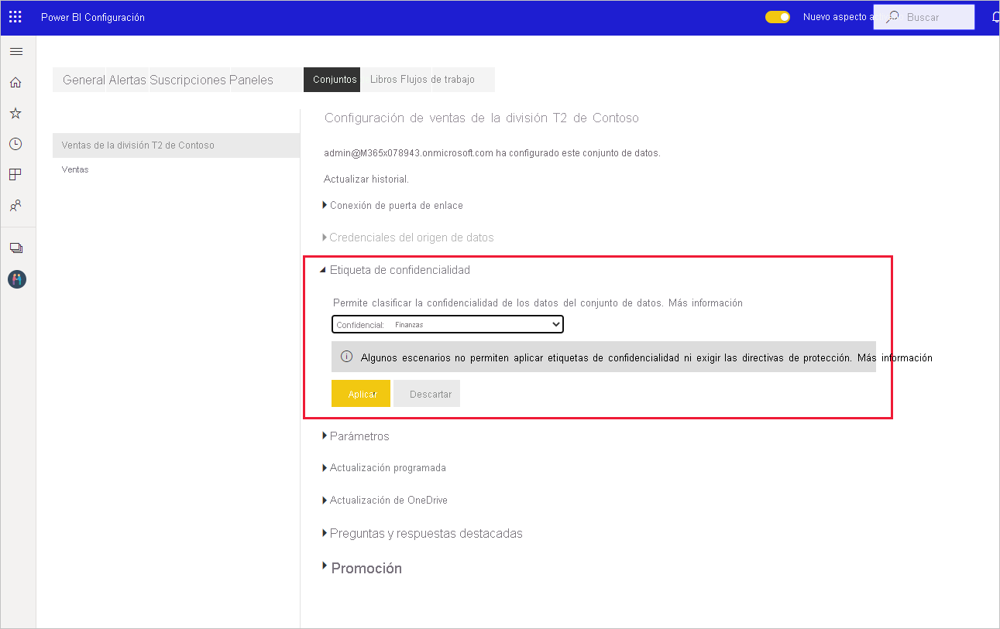
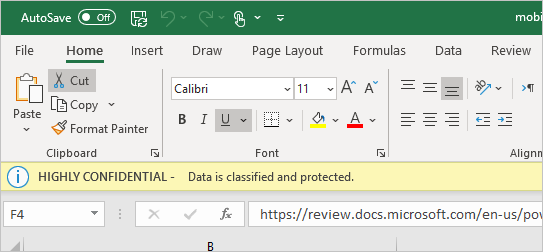

# Aplicación de etiquetas de confidencialidad de datos en Power BI

Las etiquetas de confidencialidad de Microsoft Information Protection para informes, paneles, conjuntos de datos y flujos de datos pueden proteger el contenido confidencial contra pérdidas y el acceso no autorizado a los datos. El etiquetado correcto de los datos con etiquetas de confidencialidad de datos garantiza que solo las personas autorizadas puedan acceder a los datos. En este artículo se muestra cómo aplicar etiquetas de confidencialidad al contenido.

Para poder aplicar etiquetas de confidencialidad en Power BI:
* Debe tener una licencia de Power BI Pro y permisos de edición en el contenido que quiera etiquetar.
* Debe pertenecer a un grupo de seguridad que tenga permisos para aplicar etiquetas de confidencialidad de datos, como se describe en el artículo titulado [Habilitación de las etiquetas de confidencialidad de datos en Power BI](../admin/service-security-enable-data-sensitivity-labels.md#enable-data-sensitivity-labels).
* Se deben haber cumplidos todos los [requisitos previos](../admin/service-security-data-protection-overview.md#requirements-for-using-sensitivity-labels-in-power-bi) y [requisitos de licencias](../admin/service-security-data-protection-overview.md#licensing).

Para obtener más información sobre las etiquetas de confidencialidad de datos en Power BI, vea [Introducción a la protección de datos en Power BI](../admin/service-security-data-protection-overview.md).

## Aplicación de etiquetas de confidencialidad

Cuando la protección de datos está habilitada en el inquilino, las etiquetas de confidencialidad aparecen en la columna Confidencialidad de la vista de lista de paneles, informes, conjuntos de datos y flujos de datos.

**Para aplicar o cambiar una etiqueta de confidencialidad en un informe o un panel**
1. Haga clic en **Más opciones (...)** .
1. Haga clic en **Configuración**.
1. En el panel de configuración, elija la etiqueta de confidencialidad adecuada.
1. Guarde la configuración

En la imagen siguiente se muestran estos pasos en un informe

**Para aplicar o cambiar una etiqueta de confidencialidad en un conjunto de datos o un flujo de datos**

1. Haga clic en **Más opciones (...)** .
1. Haga clic en **Configuración**.
1. En el panel de configuración, elija la etiqueta de confidencialidad adecuada.
1. Aplique la configuración.

En las dos imágenes siguientes se muestran estos pasos en un conjunto de datos.

Elija **Más opciones (...)** y, después, **Configuración**.

En la página de configuración, abra la sección Etiqueta de confidencialidad, elija la etiqueta de confidencialidad que quiera y haga clic en **Aplicar**.

## Eliminación de etiquetas de confidencialidad
Para quitar una etiqueta de confidencialidad de un informe, panel, conjunto de datos o flujo de datos, siga el [mismo procedimiento que se usa para aplicar las etiquetas](#applying-sensitivity-labels), pero elija **(Ninguna)** cuando se le pida que clasifique la confidencialidad de los datos. 

## Protección de datos en archivos exportados

La protección de datos asociada a las etiquetas de confidencialidad solo se aplica a los datos cuando se exportan archivos de Excel, PowerPoint y PDF. No se admite para Analizar en Excel, exportar a .csv, las descargas de conjuntos de datos (.pbix), Live Connect del servicio Power BI y ningún otro formato de exportación. Las opciones de exportación de datos se controlan mediante la [configuración de exportación](../service-admin-portal.md#export-and-sharing-settings) de la administración de inquilinos de Power BI.

Al [exportar datos desde un informe](https://docs.microsoft.com/power-bi/consumer/end-user-export) con una etiqueta de confidencialidad a un archivo de Excel, PowerPoint o PDF, el archivo generado hereda la etiqueta de confidencialidad. La etiqueta de confidencialidad estará visible en el archivo y el acceso al archivo estará restringido a aquellos que tengan permisos suficientes.

## Consideraciones y limitaciones

En la lista siguiente se proporcionan algunas limitaciones de las etiquetas de confidencialidad en Power BI:

**General**
* Las etiquetas de confidencialidad solo se pueden aplicar en paneles, informes, conjuntos de datos y flujos de datos. En la actualidad no hay etiquetas de confidencialidad disponibles para [informes paginados](../paginated-reports/report-builder-power-bi.md) y libros.
* Las etiquetas de confidencialidad de los recursos de Power BI son visibles en la lista de áreas de trabajo y en las vistas de linaje, favoritos, recientes y aplicaciones; no son visibles actualmente en la vista "compartido conmigo". Tenga en cuenta, sin embargo, que una etiqueta aplicada a un recurso de Power BI, incluso si no está visible, siempre se conservará en los datos exportados a archivos de Excel, PowerPoint y PDF.
* Las etiquetas de confidencialidad solo se admiten para los inquilinos en la nube global (pública). No se admiten las etiquetas de confidencialidad para los inquilinos de otras nubes.
* No se admiten las etiquetas de confidencialidad para las aplicaciones de plantilla. Las etiquetas de confidencialidad establecidas por el creador de la aplicación de plantilla se quitan cuando se extrae la aplicación y se instala. Asimismo, al actualizar la aplicación, las etiquetas de confidencialidad agregadas a los artefactos de una aplicación de plantilla instalada por el consumidor de la aplicación se pierden (se restablecen vacías).
* Power BI no admite etiquetas de confidencialidad de los tipos de protección [No reenviar](https://docs.microsoft.com/microsoft-365/compliance/encryption-sensitivity-labels?view=o365-worldwide#let-users-assign-permissions), [definido por el usuario](https://docs.microsoft.com/microsoft-365/compliance/encryption-sensitivity-labels?view=o365-worldwide#let-users-assign-permissions) e [HYOK](https://docs.microsoft.com/azure/information-protection/configure-adrms-restrictions). Los tipos de protección No reenviar y definido por el usuario hacen referencia a las etiquetas definidas en el [Centro de seguridad de Microsoft 365](https://security.microsoft.com/) o el [Centro de cumplimiento de Microsoft 365](https://compliance.microsoft.com/).

**Exportarar**
* Los controles de etiqueta y protección solo se aplican cuando los datos se exportan a archivos de Excel, PowerPoint y PDF. La etiqueta y la protección no se aplican cuando los datos se exportan a archivos .csv o .pbix, Analizar en Excel o cualquier otra ruta de exportación.
* La aplicación de una etiqueta de confidencialidad y de protección a un archivo exportado no le agrega marcas de contenido. Pero si la etiqueta está configurada para aplicar marcas de contenido, el cliente de etiquetado unificado de Azure Information Protection las aplica de forma automática cuando el archivo se abre en las aplicaciones de escritorio de Office. Las marcas de contenido no se aplican de forma automática cuando se usa el etiquetado integrado para aplicaciones web, para dispositivos móviles o de escritorio. Vea [Cuando las aplicaciones de Office aplican marcas de contenido y cifrado](https://docs.microsoft.com/microsoft-365/compliance/sensitivity-labels-office-apps?view=o365-worldwide#when-office-apps-apply-content-marking-and-encryption) para obtener más detalles.
* Un usuario que exporta un archivo de Power BI tiene permisos para acceder al archivo y editarlo según la configuración de la etiqueta de confidencialidad. El usuario que exporta los datos no obtiene permisos de propietario en el archivo.
* Se producirá un error en la exportación si no se puede aplicar una etiqueta al exportar los datos a un archivo. Para comprobar si se ha producido un error en la exportación porque no se ha podido aplicar la etiqueta, haga clic en el nombre del panel o informe en el centro de la barra de título y compruebe si en el cuadro desplegable de información que se abre se indica "No se puede cargar la etiqueta de confidencialidad". Esto puede suceder si el administrador de seguridad no ha publicado o ha eliminado la etiqueta aplicada, o bien es el resultado de un problema temporal del sistema.

## Pasos siguientes

En este artículo se describe cómo aplicar las etiquetas de confidencialidad de datos en Power BI. En los artículos siguientes se proporcionan más detalles acerca de la protección de datos en Power BI. 

* [Introducción a la protección de datos en Power BI](../admin/service-security-data-protection-overview.md)
* [Habilitación de etiquetas de confidencialidad de datos en Power BI](../admin/service-security-enable-data-sensitivity-labels.md)
* [Uso de controles de Microsoft Cloud App Security en Power BI](../admin/service-security-using-microsoft-cloud-app-security-controls.md)