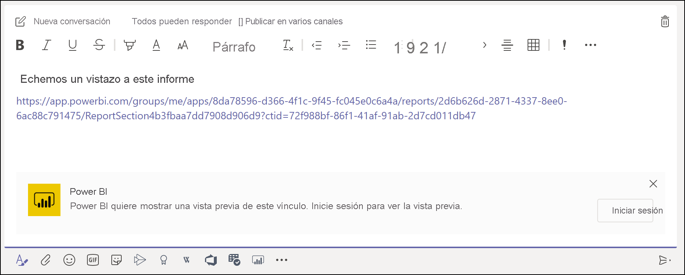
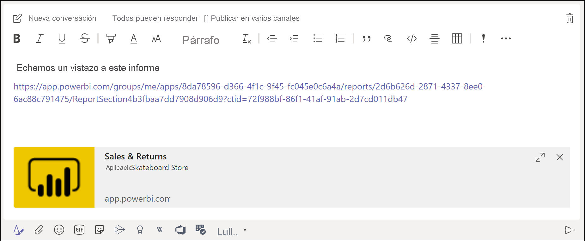
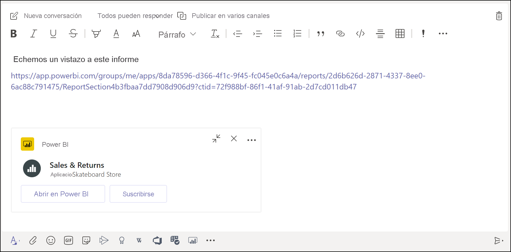

# Obtención de una vista previa del vínculo de Power BI en Microsoft Teams

Cuando pegue un vínculo a los informes, a los paneles y a las aplicaciones en el cuadro de mensaje de Microsoft Teams, la vista previa del vínculo mostrará información sobre este. Se proporcionan vistas previas de vínculo para los siguientes elementos de Power BI:

- Informes
- Paneles
- Aplicaciones

El servicio de vista previa de vínculo requiere que los usuarios inicien sesión. Para cerrar la sesión, seleccione el icono de **Power BI** en la parte inferior del cuadro de mensaje. Después, seleccione **Cerrar sesión**.

Vea [Colaboración en Microsoft Teams con Power BI](service-collaborate-microsoft-teams.md) para obtener información sobre el funcionamiento conjunto de Power BI y Microsoft Teams, incluidos los requisitos que debe cumplir.

## Obtención de una vista previa de vínculo

Siga estos pasos para obtener una vista previa de vínculo para el contenido en el servicio Power BI.

1. Copie un vínculo a un informe, un panel o una aplicación en el servicio Power BI. Por ejemplo, copie el vínculo de la barra de direcciones del explorador.

1. Pegue el vínculo en el cuadro de mensaje de Microsoft Teams. Si se le pide, inicie sesión en el servicio de vista previa de vínculo. Es posible que tenga que esperar unos segundos para que se cargue la vista previa del vínculo.

    

1. Una vez que se ha iniciado sesión correctamente, se muestra la vista previa de vínculo básica.

    

1. Seleccione el icono **Expandir** para mostrar la tarjeta de vista previa enriquecida.

    

1. La tarjeta de vista previa de vínculo enriquecida incluye el vínculo y los botones de acción pertinentes.

    

1. Envíe el mensaje.

## Limitaciones y problemas conocidos

- No se admite el inicio de sesión único para el servicio de vista previa de vínculo.
- Las vistas previas de vínculo no funcionan en los canales privados o de chat.
- Vea la sección [Limitaciones y problemas conocidos](service-collaborate-microsoft-teams.md#known-issues-and-limitations) del artículo "Colaboración en Microsoft Teams" para obtener información sobre otros problemas.

## Pasos siguientes

- [Colaboración en Microsoft Teams con Power BI](service-collaborate-microsoft-teams.md)

¿Tiene más preguntas? [Pruebe a preguntar a la comunidad de Power BI](https://community.powerbi.com/).
