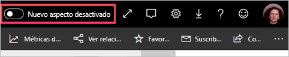
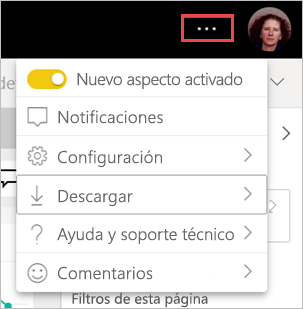

# Activación del "nuevo aspecto" de las áreas de trabajo (versión preliminar)

Las áreas de trabajo tienen un nuevo aspecto que coincide con el [nuevo aspecto](../consumer/service-new-look.md) del servicio Power BI. Cualquiera que use el servicio Power BI (app.powerbi.com) puede activarlo. Al activar el **nuevo aspecto** en la barra de encabezado negra, el nuevo aspecto se activará para los informes y las áreas de trabajo. Todas las áreas de trabajo, tanto clásicas como nuevas, pueden beneficiarse del nuevo aspecto.

¿Busca información sobre el nuevo aspecto de **Power BI Desktop**? Consulte [Uso de la cinta actualizada en Power BI Desktop](../create-reports/desktop-ribbon.md).

## Características del nuevo aspecto

:::image type="content" source="media/service-workspaces-new-look/power-bi-workspace-new-look-numbered.png" alt-text="Nuevo aspecto de las áreas de trabajo, con números de llamada para explicaciones":::

|Número  |Cómo funciona |
|---------|---------|
|    | **Obtener datos**: es más fácil agregar contenido al área de trabajo. Seleccione el botón **+ Nuevo** para conectarse a datos, abrir archivos y crear informes, paneles y mucho más.  |
|   | **Modificador de vista**: vea las conexiones entre los flujos de datos, los conjuntos de datos, los informes y los paneles, así como sus conexiones con otros orígenes de datos, y cambie entre las vista **Lista** y **Linaje de datos**. |
|  | **Buscar dentro de un área de trabajo**: busque todo el contenido de un área de trabajo en el cuadro de búsqueda nuevo.  |
|   | **Lista y pestañas**: todo el contenido de un área de trabajo está en una lista plana de paneles, informes, conjuntos de objetos, etc., como SharePoint. Ahora ya no se abre un área de trabajo en una pestaña **Paneles** que puede estar vacía, por lo que ya no tendrá dudas sobre dónde se encuentra su contenido. Este es el nuevo orden de tabulación:  **Todos**: muestra todo el contenido (paneles, informes, libros, informes paginados, conjuntos de datos y flujos de trabajo) en el área de trabajo.  **Content**: recopila todo el contenido creado para el consumo (paneles, informes, libros e informes paginados) en el área de trabajo.  **Conjuntos de datos y flujos de datos**: recopila todos los conjuntos de datos y flujos de datos en el área de trabajo para facilitar la administración de los datos. |
|  | **Filtros**: en el caso de las áreas de trabajo con cientos de artefactos, puede filtrar el contenido en el panel Filtros. Una vez aplicado un filtro, lo verá en la parte superior de la lista de contenido. |

**Acciones rápidas**: al mantener el puntero sobre el contenido de la lista, verá las acciones más comunes para ese elemento, además de otras disponibles en el menú **Más opciones** (...).

:::image type="content" source="media/service-workspaces-new-look/power-bi-workspace-new-look-quick-actions.png" alt-text="Acciones rápidas en el área de trabajo nueva":::

## Participación en el nuevo aspecto

Cualquier usuario del servicio Power BI puede participar en el nuevo aspecto. Basta con cambiar el control deslizante de **Nuevo aspecto desactivado** a **Nuevo aspecto activado**.

Si tiene que volver al aspecto anterior, solo tiene que cambiar el control deslizante a **Desactivado** desde . Si no lo ve, seleccione el menú de puntos suspensivos en la esquina superior derecha.

## Pasos siguientes

- [Uso de la cinta actualizada en Power BI Desktop](../create-reports/desktop-ribbon.md)
- [Nuevo aspecto del servicio Power BI](../consumer/service-new-look.md)
- ¿Tiene alguna pregunta? [Pruebe la comunidad de Power BI](https://community.powerbi.com/)
