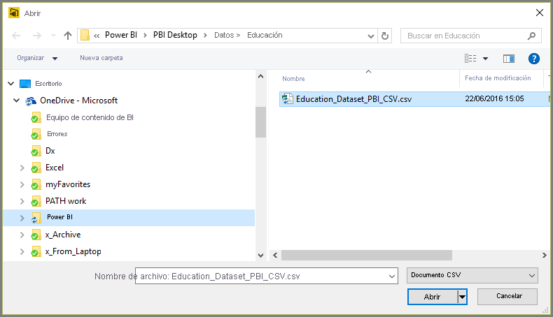

# Conectarse a archivos CSV en Power BI Desktop
Conectarse a un archivo de valores separados por comas (*CSV*) de Power BI Desktop es muy similar a conectarse a un libro de Excel. Ambos métodos son fáciles y en este artículo se indican los pasos para conectarse a cualquier archivo CSV al que tenga acceso.

Para comenzar, en Power BI Desktop, seleccione **Obtener datos > CSV** en la cinta **Inicio** .

Seleccione el archivo CSV en el cuadro de diálogo **Abrir** que aparece.

Al seleccionar **Abrir**, Power BI Desktop obtiene acceso al archivo y determina algunos atributos del archivo, como el origen del archivo, el tipo de delimitador y el número de filas que se debe usar para detectar los tipos de datos en el archivo.

Estos atributos y opciones de archivo se muestran en las selecciones desplegables en la parte superior de la ventana de diálogo **Importar CSV**, que se muestra a continuación. Puede cambiar cualquiera de estas configuraciones detectadas de forma manual. Para ello, seleccione otra opción de cualquiera de los selectores desplegables.

Cuando esté satisfecho con las selecciones, puede seleccionar **Cargar** para importar el archivo en Power BI Desktop, o bien puede seleccionar **Editar** para abrir el **Editor de consultas** y darle forma y transformar aún más los datos antes de importarlos.

Después de cargar los datos en Power BI Desktop, puede ver la tabla y sus columnas (que se presentan como campos en Power BI Desktop) en el panel **Campos**, en la parte derecha de la vista Informes en Power BI Desktop.

Eso es todo lo que tiene que hacer: los datos del archivo CSV están ahora en Power BI Desktop.

Puede usar esos datos en Power BI Desktop para crear objetos visuales, informes, o para interactuar con cualquier otro dato con el que quiera conectarse e importar, como libros de Excel, bases de datos o cualquier otro origen de datos.

> [!IMPORTANT]
> Al importar un archivo CSV, Power BI Desktop genera *columnas=x* (donde *x* es el número de columnas del archivo CSV durante la importación inicial) como parte de un paso en el Editor de Power Query. Si posteriormente agrega más columnas y se ha configurado el origen de datos para actualizarse, no se actualizarán las columnas que superen el número de columnas inicial *x*. 

## Pasos siguientes
Hay todo tipo de datos a los que puede conectarse con Power BI Desktop. Para obtener más información sobre orígenes de datos, consulte los siguientes recursos:

* [¿Qué es Power BI Desktop?](../fundamentals/desktop-what-is-desktop.md)
* [Orígenes de datos en Power BI Desktop](desktop-data-sources.md)
* [Combinar datos y darles forma con Power BI Desktop](desktop-shape-and-combine-data.md)
* [Connect to Excel workbooks in Power BI Desktop (Conectarse a libros de Excel en Power BI Desktop)](desktop-connect-excel.md)   
* [Especificar datos directamente en Power BI Desktop](desktop-enter-data-directly-into-desktop.md)   
