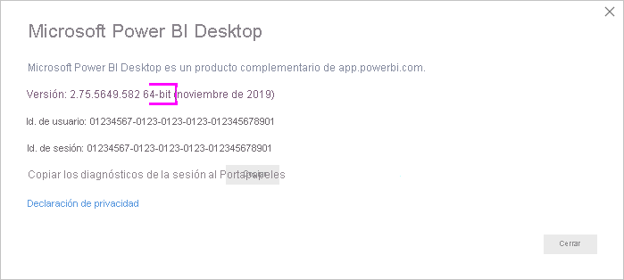

# Conectarse a una base de datos de Oracle
Para conectarse a una base de datos de Oracle con Power BI Desktop, en el equipo donde se ejecute Power BI Desktop debe estar instalado el software cliente de Oracle correcto. El software cliente de Oracle que use depende de la versión que Power BI Desktop que haya instalado: 32 bits o 64 bits.

Versiones de Oracle compatibles: 
- Oracle 9 y versiones posteriores
- Software cliente de Oracle 8.1.7 y versiones posteriores

> [!NOTE]
> Si va a configurar una base de datos de Oracle para Power BI Desktop, puerta de enlace de datos local o Power BI Report Server, consulte la información del artículo [Tipo de conexión de Oracle](https://docs.microsoft.com/sql/reporting-services/report-data/oracle-connection-type-ssrs?view=sql-server-ver15). 

## Determinación de versión instalada de Power BI Desktop
Para determinar la versión de Power BI Desktop instalada, seleccione **Archivo** > **Ayuda** > **Acerca de** y, luego, revise la línea **Versión**. En la siguiente imagen, hay instalada una versión de 64 bits de Power BI Desktop:

## Instalación del cliente de Oracle
- Para la versión de 32 bits de Power BI Desktop, [descargue e instale el cliente de Oracle de 32 bits](https://www.oracle.com/technetwork/topics/dotnet/utilsoft-086879.html).

- Para la versión de 64 bits de Power BI Desktop, [descargue e instale el cliente de Oracle de 64 bits](https://www.oracle.com/database/technologies/odac-downloads.html).

> [!NOTE]
> Durante la configuración del cliente de Oracle, asegúrese de habilitar *Configurar los proveedores de ODP.NET y/o Oracle para ASP.NET en el nivel de equipo* mediante la casilla correspondiente en el asistente para la instalación. Algunas versiones del asistente para clientes de Oracle activan la casilla de forma predeterminada y otras no. Asegúrese de que la casilla está activada para que Power BI pueda conectarse a la base de datos de Oracle.

## Conectarse a una base de datos de Oracle
Después de instalar el controlador cliente de Oracle que corresponda, puede conectarse a una base de datos de Oracle. Siga estos pasos para establecer la conexión:

1. Desde la pestaña **Inicio**, seleccione **Obtener datos**. 

2. En la ventana **Obtener datos** que aparece, seleccione **Más** (si es necesario), seleccione **Base de datos** > **Base de datos de Oracle** y después **Conectar**.
   
   
2. En el cuadro de diálogo **Base de datos de Oracle** que aparece, proporcione el nombre del **servidor** y seleccione **Aceptar**. Si se requiere un SID, especifíquelo con el formato siguiente: *NombreDeServidor/SID*, donde *SID* es el nombre único de la base de datos. Si el formato *NombreDeServidor/SID* no funciona, use *NombreDeServidor/NombreDeServicio*, donde *NombreDeServicio* es el alias que se usa para conectarse.

   

   > [!TIP]
   > Si en este paso tiene problemas para conectarse, pruebe a usar el formato siguiente en el campo **Servidor**: *(DESCRIPTION=(ADDRESS=(PROTOCOL=TCP)(HOST=nombre_host)(PORT=número_puerto))(CONNECT_DATA=(SERVICE_NAME=nombre_servicio)))*
   
3. Si quiere importar datos con una consulta de base de datos nativa, incluya la consulta en el cuadro **Instrucción SQL**, que aparece al expandir la sección **Opciones avanzadas** del cuadro de diálogo **Base de datos de Oracle**.
   
   
4. Una vez que haya escrito la información de la base de datos de Oracle en el cuadro de diálogo **Base de datos de Oracle** (incluida toda información opcional, como un SID o una consulta de base de datos nativa), seleccione **Aceptar** para conectarse.
5. Si la base de datos de Oracle necesita credenciales del usuario de la base de datos, ingréselas en el cuadro de diálogo cuando se le solicite hacerlo.

## Solución de problemas

Si ha descargado Power BI Desktop desde Microsoft Store, es posible que no pueda conectarse a bases de datos de Oracle debido a un problema con el controlador de Oracle. Si se produce este problema, el mensaje de error que se devuelve es: *Referencia a objeto no establecida*. Para solucionar el problema, siga uno de estos pasos:

* Descargue Power BI Desktop desde el [Centro de descarga](https://www.microsoft.com/download/details.aspx?id=58494) en lugar de Microsoft Store.

* Si quiere usar la versión disponible en Microsoft Store: en el equipo local, copie el archivo oraons.dll de _12.X.X\client_X_ en _12.X.X\client_X\bin_, donde _X_ representa los números de versión y directorio.

Si ve el mensaje de error *Referencia de objeto no establecida* en Power BI Gateway al conectarse a una base de datos de Oracle, siga las instrucciones de [Administración del origen de datos: Oracle](service-gateway-onprem-manage-oracle.md).

Si usa Power BI Report Server, consulte las instrucciones del artículo [Tipo de conexión de Oracle](https://docs.microsoft.com/sql/reporting-services/report-data/oracle-connection-type-ssrs?view=sql-server-ver15).
