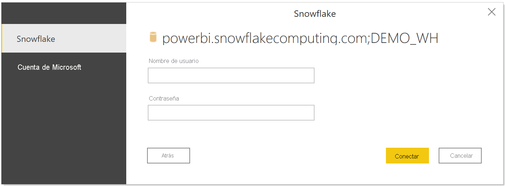
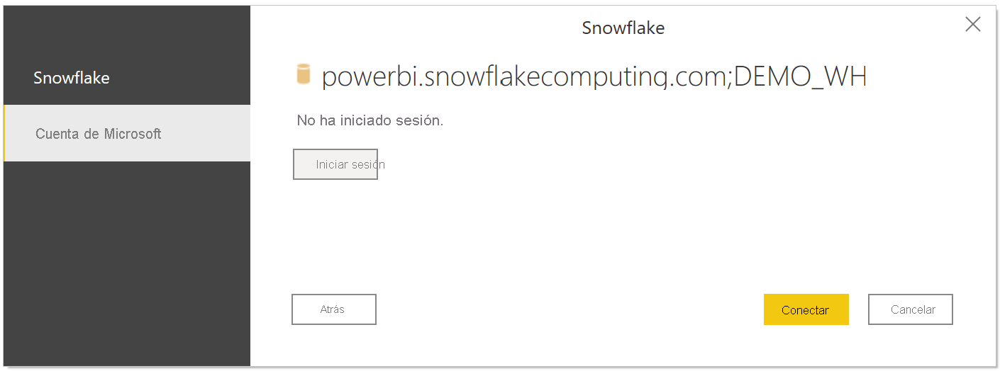

# Conexión a un almacén de Snowflake Computing en Power BI Desktop
En Power BI Desktop, puede conectarse a un almacén de **Snowflake** Computing y usar los datos subyacentes como cualquier otro origen de datos en Power BI Desktop. 

## Conectar a un almacén de Snowflake Computing
Seleccione **Obtener datos** en la cinta **Inicio** para conectarse a un almacén de **Snowflake** Computing en Power BI Desktop. Seleccione **Base de datos** en las categorías de la izquierda para que se muestre **Snowflake**.

En la ventana **Snowflake** que aparece, escriba o pegue en el cuadro el nombre de su almacén de Snowflake Computing y seleccione **Aceptar**. Tenga en cuenta que puede elegir **Importar** datos directamente a Power BI o puede usar **DirectQuery**. Puede obtener más información acerca de cómo [usar DirectQuery](desktop-use-directquery.md). Tenga en cuenta que el SSO de AAD solo es compatible con DirectQuery.

Cuando se le pida, escriba su nombre de usuario y contraseña.

> [!NOTE]
> Una vez que haya escrito su nombre de usuario y contraseña para un servidor **Snowflake** determinado, Power BI Desktop usa esas mismas credenciales en los intentos de conexión posteriores. Si quiere modificar dichas credenciales, vaya a **Archivo > Opciones y configuración > Configuración de origen de datos**.
> 
> 

Si quiere usar la opción de cuenta de Microsoft, se debe configurar la integración de AAD de Snowflake en el lado de Snowflake. Para ello, lea la sección Introducción de la [documentación de Snowflake sobre el tema](https://docs.snowflake.net/manuals/user-guide/oauth-powerbi.html#power-bi-sso-to-snowflake).

Una vez que se haya conectado correctamente, aparece la ventana **Navegador**, en la que se muestran los datos disponibles en el servidor, desde donde puede seleccionar uno o varios elementos para importar y usar en **Power BI Desktop**.

Puede **Cargar** la tabla seleccionada, que muestra la tabla completa en **Power BI Desktop**, o bien puede **Editar** la consulta, que abre **Editor de consultas** para que pueda filtrar y refinar el conjunto de datos que desea utilizar y, a continuación, cargar ese conjunto de datos refinado en **Power BI Desktop**.

## Pasos siguientes
Hay todo tipo de datos a los que puede conectarse con Power BI Desktop. Para obtener más información sobre orígenes de datos, consulte los siguientes recursos:

* [¿Qué es Power BI Desktop?](../fundamentals/desktop-what-is-desktop.md)
* [Orígenes de datos en Power BI Desktop](desktop-data-sources.md)
* [Combinar datos y darles forma con Power BI Desktop](desktop-shape-and-combine-data.md)
* [Connect to Excel workbooks in Power BI Desktop (Conectarse a libros de Excel en Power BI Desktop)](desktop-connect-excel.md)   
* [Especificar datos directamente en Power BI Desktop](desktop-enter-data-directly-into-desktop.md)   
