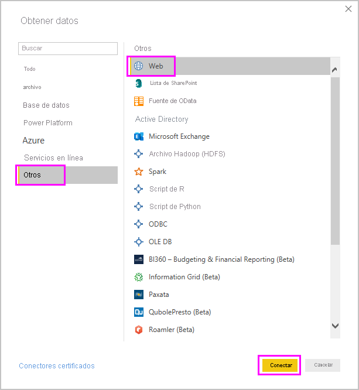

# <a name="get-webpage-data-by-providing-examples"></a>Obtención de datos de páginas web con ejemplos

Obtener datos de una página web permite a los usuarios extraer datos fácilmente de las páginas web e importarlos en *Power BI Desktop*. Sin embargo, los datos de las páginas web a menudo no se encuentran en tablas ordenadas que resulten fáciles de extraer. La obtención de datos de estas páginas puede ser complicado, incluso aunque los datos estén estructurados y sean coherentes.

Hay una solución. Con la característica *Obtener datos de páginas web con ejemplos*, básicamente puede mostrar a Power BI Desktop qué datos quiere extraer proporcionando uno o varios ejemplos en el cuadro de diálogo del conector. Power BI Desktop recopila otros datos de la página que coincidan con los ejemplos. Con esta solución, puede extraer todos los tipos de datos de las páginas web, incluidos los que están contenidos en tablas *y* otros que no lo están.


Los precios de los gráficos son solo para fines ilustrativos.

## <a name="using-get-data-from-web-by-example"></a>Uso de Obtener datos de páginas web con ejemplos

En el menú de la cinta **Inicio**, seleccione **Obtener datos**. En el cuadro de diálogo que aparece, seleccione **Otros** en las categorías del panel izquierdo y, después, **Web**. Seleccione **Conectar** para continuar.



En **Desde la web**, escriba la dirección URL de la página web de la que le gustaría extraer los datos. En este artículo, se usará la página web de Microsoft Store y se mostrará cómo funciona este conector.

Si desea continuar, puede usar la [dirección URL de Microsoft Store](https://www.microsoft.com/store/top-paid/games/xbox?category=classics) que se usa en este artículo:

```http
https://www.microsoft.com/store/top-paid/games/xbox?category=classics
```


Al seleccionar **Aceptar**, se le remitirá al cuadro de diálogo **Navegador**, donde se presentan las tablas detectadas automáticamente de la página web. En el caso que se muestra en la imagen siguiente, no se ha encontrado ninguna tabla. Seleccione **Agregar tabla mediante ejemplos** para proporcionar ejemplos.


La opción **Agregar tabla mediante ejemplos** presenta una ventana interactiva en la que se puede obtener una vista previa del contenido de la página web. Escriba valores de ejemplo de los datos que quiera extraer.

En este ejemplo, se podrá extraer el *nombre* y el *precio* de cada uno de los juegos de la página. Se puede hacer especificando un par de ejemplos de la página para cada columna. A medida que escribe los ejemplos, *Power Query* extrae los datos que se ajustan al patrón de entradas de ejemplo mediante algoritmos de extracción de datos inteligentes.


> [!NOTE]
> Las sugerencias de valor solo incluyen valores menores o iguales a 128 caracteres de longitud.

Cuando los datos extraídos de la página web sean los adecuados para usted, seleccione **Aceptar** para ir al editor de Power Query. Puede aplicar más transformaciones o dar forma a los datos, por ejemplo combinarlos con otros datos de nuestros orígenes.


Desde ahí, puede crear objetos visuales o usar los datos de la página web para crear los informes de Power BI Desktop.

## <a name="next-steps"></a>Pasos siguientes

Hay todo tipo de datos a los que puede conectarse con Power BI Desktop. Para obtener más información sobre orígenes de datos, consulte los siguientes recursos:

* [Incorporación de una columna a partir de un ejemplo en Power BI Desktop](../create-reports/desktop-add-column-from-example.md)
* [Conexión a páginas web desde Power BI Desktop](desktop-connect-to-web.md)
* [Orígenes de datos en Power BI Desktop](desktop-data-sources.md)
* [Combinar datos y darles forma en Power BI Desktop](desktop-shape-and-combine-data.md)
* [Connect to Excel workbooks in Power BI Desktop (Conectarse a libros de Excel en Power BI Desktop)](desktop-connect-excel.md)
* [Conectarse a archivos CSV en Power BI Desktop](desktop-connect-csv.md)
* [Especificar datos directamente en Power BI Desktop](desktop-enter-data-directly-into-desktop.md)
