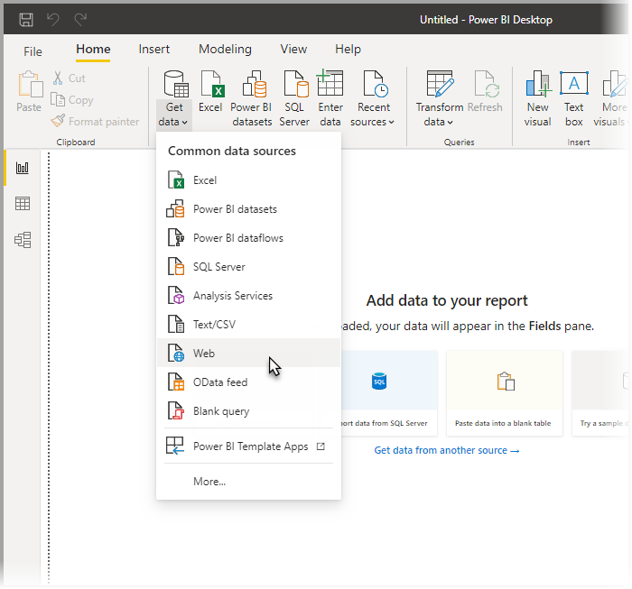
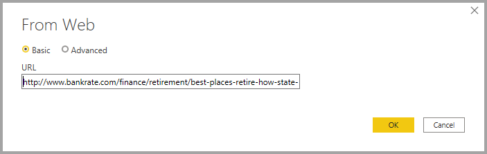
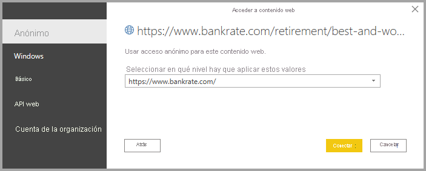

# Conexión a páginas web desde Power BI Desktop

Puede conectarse a una página web e importar los datos a Power BI Desktop, para su uso en los objetos visuales y en los modelos de datos.

En Power BI Desktop, seleccione **Obtener datos > Web** en la cinta **Inicio** .

Aparece un cuadro de diálogo en el que se le pide la dirección URL de la página web desde la que quiere importar los datos.

Una vez que haya escrito (o pegado) la dirección URL, seleccione **Aceptar**. Power BI Desktop le pide que especifique cómo desea acceder al contenido web.

Power BI Desktop se conecta a la página web y luego muestra los datos disponibles de la página en la ventana **Navegador**. Al seleccionar uno de los elementos de datos disponibles, como una tabla de la página completa, la ventana **Navegador** muestra una vista previa de esos datos en el lado derecho de la ventana.

Puede elegir el botón **Transformar datos**, que inicia el **Editor de consultas**, donde puede dar forma a los datos de esa página web y transformarlos antes de importarla en Power BI Desktop. O puede seleccionar el botón **Cargar** e importar todos los elementos de datos que ha seleccionado en el panel izquierdo.

Al seleccionar **Cargar**, Power BI Desktop importa los elementos seleccionados y hace que estén disponibles en el panel **Campos**, que se encuentra en el lado derecho de la vista Informes en Power BI Desktop.

Esto es todo lo que tiene que hacer para conectarse a una página web y traer los datos a Power BI Desktop.

Desde allí, puede arrastrar esos campos al lienzo del informe y crear todas las visualizaciones que quiera. También puede usar los datos de esa página web tal y como lo haría con cualquier otro dato: puede darles forma, puede crear relaciones entre este y otros orígenes de datos en el modelo y, en cualquier caso, puede crear el informe de Power BI que quiera.

Para ver cómo conectarse a una página web más en profundidad y acción, eche un vistazo a la [Guía de introducción de Power BI Desktop](../fundamentals/desktop-getting-started.md).

## Comprobación de revocación de certificados

Power BI aplica seguridad en las conexiones web para proteger los datos. En algunos escenarios, como la captura de solicitudes web con Fiddler, puede que las conexiones web no funcionen correctamente. Para habilitar tales escenarios, puede desactivar la opción **Habilitar comprobación de revocación de certificados** en Power BI Desktop y, a continuación, reiniciar Power BI Desktop. 

Para cambiar esta opción, seleccione **Archivo > Opciones** y, a continuación, seleccione **Seguridad** en el panel izquierdo. En la imagen siguiente se muestra la casilla. Al desactivar la casilla, las conexiones web serán menos seguras. 

## Pasos siguientes
Hay todo tipo de datos a los que puede conectarse con Power BI Desktop. Para obtener más información sobre orígenes de datos, consulte los siguientes recursos:

* [Orígenes de datos en Power BI Desktop](desktop-data-sources.md)
* [Combinar datos y darles forma con Power BI Desktop](desktop-shape-and-combine-data.md)
* [Connect to Excel workbooks in Power BI Desktop (Conectarse a libros de Excel en Power BI Desktop)](desktop-connect-excel.md)   
* [Conectarse a archivos CSV en Power BI Desktop](desktop-connect-csv.md)   
* [Especificar datos directamente en Power BI Desktop](desktop-enter-data-directly-into-desktop.md)   
