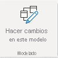
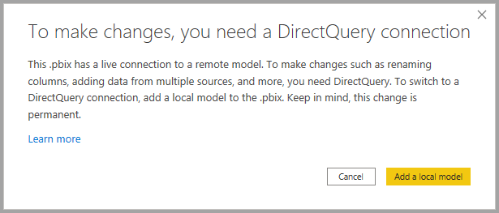
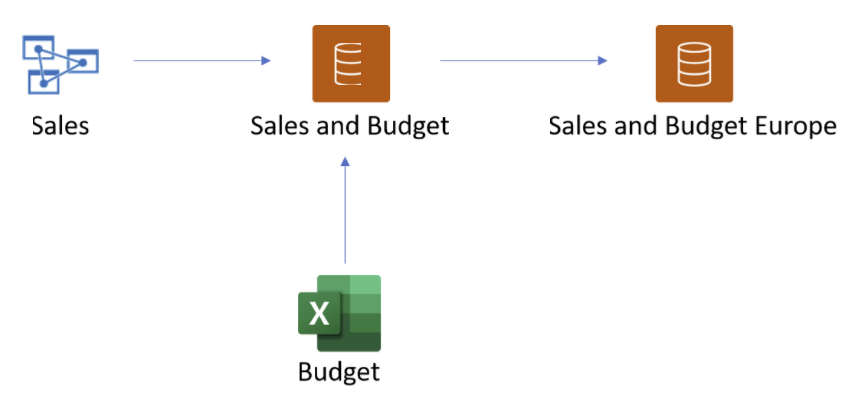
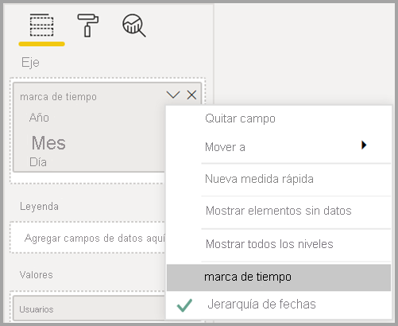

# Uso de DirectQuery para conjuntos de datos de Power BI y Azure Analysis Services (versión preliminar)

Con **DirectQuery para los conjuntos de datos de Power BI y Azure Analysis Services (AAS)** , puede usar DirectQuery para conectarse a los conjuntos de datos de Power BI o AAS y, si lo desea, combinarlo con otros datos importados y otra instancia de DirectQuery. Esta característica resultará especialmente útil para autores de informes que quieran combinar los datos de su modelo semántico empresarial con otros datos que posean, como una hoja de cálculo de Excel, o que quieran personalizar o enriquecer los metadatos de su modelo semántico empresarial.

## Habilitación de la característica en versión preliminar

Como la funcionalidad está actualmente en versión preliminar, primero debe habilitarla primero. Para hacerlo, en Power BI Desktop, vaya a **Archivo > Opciones y configuración > Opciones** y, en la sección **Características en vista previa**, active la casilla **DirectQuery para conjuntos de datos de Power BI y Analysis Services** para habilitar esta característica en vista previa (GB). Para que el cambio se aplique, puede que tenga que reiniciar Power BI Desktop.

## Uso de DirectQuery para conexiones dinámicas

El uso de DirectQuery para los conjuntos de datos de Power BI y Azure Analysis Services requiere que el informe tenga un modelo local. Puede empezar a partir de una conexión dinámica y agregar o actualizar a un modelo local, o bien empezar con una conexión de DirectQuery o datos importados, lo que crea automáticamente un modelo local en el informe.

Para ver las conexiones que se usan en el modelo, compruebe la barra de estado que se encuentra en la esquina inferior derecha de Power BI Desktop. Si solo está conectado a un origen de Azure Analysis Services, verá un mensaje similar a la imagen siguiente:

Si está conectado a un conjunto de datos de Power BI, verá un mensaje en el que se le indicará el conjunto de Power BI al que está conectado:

Si quiere personalizar los metadatos de los campos del conjunto de datos con conexión dinámica, seleccione **Hacer cambios en este modelo** en la barra de estado. Como alternativa, puede hacer clic en el botón **Hacer cambios en este modelo** que está en la cinta de opciones, tal como se muestra en la imagen siguiente. En **Vista de informe**, el botón **Hacer cambios en este modelo** en la pestaña **Modelado**. En Vista de modelo, el botón está en la pestaña **Inicio**.

Al seleccionar el botón, se muestra un cuadro de diálogo para confirmar la incorporación de un modelo local. Seleccione **Agregar un modelo local** para permitir la creación de columnas nuevas o modificar los metadatos para los campos los conjuntos de Power BI o Azure Analysis Services. En la imagen siguiente se muestra el cuadro de diálogo que aparece. 

Cuando establece una conexión dinámica a un origen de Analysis Services, no hay ningún modelo local. Si desea usar DirectQuery para orígenes con conexión dinámica, como conjuntos de datos de Power BI y Azure Analysis Services, debe agregar un modelo local al informe. Al publicar un informe con un modelo local en el servicio Power BI, también se publica un conjunto de datos para ese modelo local.

## Encadenamiento

Los conjuntos de datos, y los conjuntos de datos y los modelos en que se basan, conforman una *cadena*. Este proceso, denominado **encadenamiento**, le permite publica un informe y un conjunto de datos en función de otros conjuntos de Power BI, una característica que antes no era posible.

Por ejemplo, imagine que un colega suyo publica un conjunto de datos de Power BI denominado *Ventas y presupuesto* basado en un modelo de Azure Analysis Services denominado *Ventas*, y lo combina con una hoja de Excel denominada *Presupuesto*.

Cuando publica un informe (y conjunto de datos) nuevo denominado *Ventas y presupuesto Europa* que se basa en el conjunto de datos *Ventas y presupuesto* de Power BI que publicó su colega, y le hace algunas modificaciones o extensiones adicionales, efectivamente agrega un informe y un conjunto de datos a una cadena de longitud tres, que empezó con el modelo *Ventas* de Azure Analysis Services y finaliza con el conjunto de datos *Ventas y presupuesto Europa* de Power BI. En la imagen siguiente se muestra este proceso de encadenamiento.

La cadena de la imagen anterior tiene una longitud de tres, que es la máxima longitud permitida durante este período de versión preliminar. No se permite ir más allá de una cadena con longitud de tres, lo que generaría un error.

## Advertencia de seguridad

El uso de la característica **DirectQuery para conjuntos de datos de Power BI y Azure Analysis Services (AAS)** le mostrará un cuadro de diálogo con una advertencia de seguridad, como se ve en la imagen siguiente.

Los datos se pueden insertar de un origen de datos a otro, que es la misma advertencia de seguridad que aparece al combinar DirectQuery e importar orígenes en un modelo de datos. Para más información sobre este comportamiento, consulte este artículo sobre [cómo usar modelos compuestos en Power BI Desktop](../transform-model/desktop-composite-models.md).

## Características y escenarios que se deben probar

En la lista siguiente se brindan sugerencias sobre cómo puede explorar la característica **DirectQuery para conjuntos de datos de Power BI y Azure Analysis Services (AAS)** para que pueda hacer lo siguiente:

- Conectarse a datos de varios orígenes: importaciones (como archivos), conjuntos de datos de Power BI, Analysis Services.
- Crear relaciones entre distintos orígenes de datos.
- Escribir medidas que usen campos de distintos orígenes de datos.
- Crear columnas nuevas para tablas de conjuntos de datos de Power BI y Azure Analysis Services.
- Crear objetos visuales que usen columnas de distintos orígenes de datos.

## Consideraciones y limitaciones

Hay algunas **consideraciones** que debe tener en cuenta al usar **DirectQuery para conjuntos de datos de Power BI y Azure Analysis Services (AAS)** :

- Si actualiza los orígenes de datos y hay errores en nombres de campos o tablas en conflicto, Power BI resuelve estos errores de manera automática.

- Para generar informes en el servicio Power BI de un modelo compuesto basado en otro conjunto de datos, se deben establecer todas las credenciales. En la página de actualización de la configuración de credenciales, en el caso de los orígenes de Azure Analysis Services, aparecerá el error siguiente aunque las credenciales estén establecidas:
    
    
- Como esto resulta confuso e incorrecto, nos ocuparemos de ello pronto.

- Las reglas de RLS se aplicarán en el origen en el que se definen, pero no se aplicarán a ningún otro conjunto de datos del modelo. La RLS definida en el informe no se aplicará a los orígenes remotos y la RLS establecida en orígenes remotos no se aplicará a otros orígenes de datos.

- En esta versión preliminar, las carpetas de visualización, los KPI, las tablas de fecha, la seguridad de nivel de fila y las traducciones no se importarán desde el origen. De todos modos puede crear carpetas de visualización en el modelo local.

- Puede que vea un comportamiento inesperado al usar una jerarquía de fechas. Para resolver este problema, use en su lugar una columna de fechas. Después de agregar una jerarquía de fechas a un objeto visual, puede cambiar a una columna de fechas si hace clic en la flecha hacia abajo que está en el nombre del campo y, luego, hace clic en el nombre de ese campo en lugar de usar *Date Hierarchy* (Jerarquía de fechas):

    

    Para más información sobre el uso de las columnas de fechas en comparación con las jerarquías de fechas, visite este artículo.

- Puede que vea mensajes de error nada útiles al usar las características de IA con un modelo que tiene una conexión de DirectQuery con Azure Analysis Services. 

- Si usa ALLSELECTED con un origen de DirectQuery se generarán resultados incompletos.

- Filtros y relaciones:
    - Un filtro aplicado de un origen de datos a una tabla desde otro origen de DirectQuery solo se puede establecer en una sola columna.

    - No se recomienda ni se permite filtrar de manera cruzada dos tablas en un origen de DirectQuery mediante su filtrado con una tabla fuera del origen.

    - Un filtro solo puede tocar una vez una tabla. No se permite aplicar dos veces el mismo filtro a una tabla, a través de una o varias tablas fuera del origen de DirectQuery.

- Durante la versión preliminar, la longitud máxima de una cadena de modelos es tres. No se permite ir más allá de una cadena con longitud de tres, lo que generaría un error. 

- Con herramientas de terceros, se puede establecer una marca para *impedir el encadenamiento* en un modelo a fin de evitar que se cree o se extienda una cadena. Para establecerla, busque la propiedad *DiscourageCompositeModels* en un modelo. 

También hay algunas **limitaciones** que debe tener en cuenta:

- Los parámetros de los nombres de servidor y base de datos están deshabilitados actualmente. 

- No se admite la definición de RLS en las tablas de un origen remoto.

- En la actualidad, no se permite usar SQL Server Analysis Services (SSAS) como origen de DirectQuery. 

- En la actualidad, no se permite usar DirectQuery en conjuntos de datos de "Mi área de trabajo". 

- En la actualidad, no se permite eliminar conexiones a orígenes remotos que usan DirectQuery.

- Actualmente, no se permite usar Power BI Embedded con conjuntos de datos que incluyan una conexión de DirectQuery a un modelo de conjuntos de Power BI o de Azure Analysis Services.

- Las cadenas de formato en las columnas y las medidas de un origen remoto no se importan al modelo compuesto.

- No se admiten grupos de cálculo en orígenes remotos, con resultados de consulta no definidos.

- Algunas consultas pueden devolver resultados incorrectos cuando hay una relación entre las tablas calculadas y las tablas de un origen remoto. No se admite la creación de tablas calculadas a través de un conjunto de datos remoto, aunque esto no está bloqueado actualmente en la interaz.

- En este momento, no se admite la ordenación por columna.

- La actualización automática de páginas (APR) solo se permite en ciertos escenarios, en función del tipo de origen de datos. Para más información, consulte [Actualización automática de páginas en Power BI](../create-reports/desktop-automatic-page-refresh.md).

## Pasos siguientes

Para más información acerca de DirectQuery, revise los siguientes recursos:

- [Usar DirectQuery en Power BI Desktop](desktop-use-directquery.md)
- [Modelos de DirectQuery en Power BI Desktop](desktop-directquery-about.md)
- [Instrucciones del modelo de DirectQuery en Power BI Desktop](../guidance/directquery-model-guidance.md)
- ¿Tiene alguna pregunta? [Pruebe a preguntar a la comunidad de Power BI](https://community.powerbi.com/)
