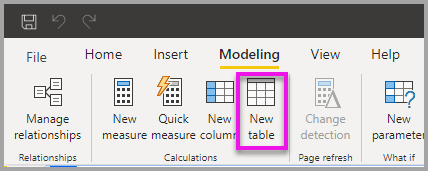
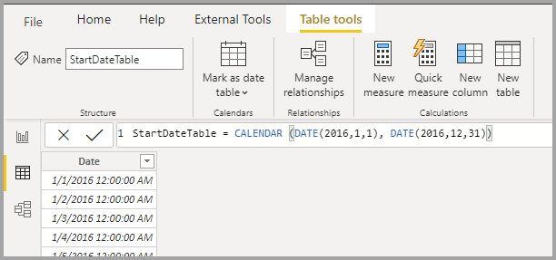

# <a name="dynamic-m-query-parameters-in-power-bi-desktop-preview"></a>Parámetros de consulta M dinámicos en Power BI Desktop (versión preliminar)

Con los **parámetros de consulta M dinámicos** , los autores de modelos pueden permitir a los **visores de informes** usar filtros o segmentaciones para establecer los valores de un [parámetro de consulta M](/power-query/power-query-query-parameters), lo que puede ser especialmente útil para las optimizaciones del rendimiento de las consultas. Con los parámetros de consulta M dinámicos, los autores de modelos tienen control adicional sobre cómo se incorporan las selecciones de filtro en las consultas de origen de DirectQuery. 

Cuando los autores del modelo entienden la semántica prevista de sus filtros, a menudo saben cómo escribir consultas eficaces en su origen de datos y, por tanto, pueden garantizar que las selecciones de filtro se incorporen en las consultas de origen en el punto adecuado para lograr los resultados deseados con un mejor rendimiento.

## <a name="enabling-dynamic-m-query-parameters"></a>Habilitación de parámetros de consulta M dinámicos

Los **parámetros de consulta M dinámicos** están actualmente en versión preliminar y deben estar habilitados para su uso. Seleccione **Archivo > Opciones y configuración > Opciones** y seleccione **Características de versión preliminar** en el panel izquierdo. Ahí, asegúrese de que la casilla **Parámetros de consulta M dinámicos** está activada. Para que el cambio se aplique, debe reiniciar Power BI Desktop.


Como requisito previo para esta característica, debe haber creado un [parámetro de consulta M](/power-query/power-query-query-parameters) válido al que se haga referencia en una o varias tablas de Direct Query. Vamos a examinar un ejemplo acerca del paso de un **valor único** a un parámetro dinámicamente:

1. En Power BI Desktop, inicie **Power Query** desde la pestaña **Datos** y seleccione **Nuevos parámetros** en el botón **Administrar parámetros** de la cinta de opciones.

    

2. A continuación, rellene la siguiente información sobre el parámetro.

    

3. Vuelva a hacer clic en **Nuevo** si tiene más parámetros que agregar.

    

4. Una vez que haya creado los parámetros, puede hacer referencia a ellos en la consulta M. Para modificar la consulta M, abra el editor avanzado mientras tiene seleccionada la consulta que desea modificar:

    

5. A continuación, haga referencia a los parámetros de la consulta M, resaltados en amarillo en la siguiente imagen. 

    

6. Ahora que ha creado los parámetros y ha hecho referencia a ellos en la consulta M, tendrá que crear una tabla con una columna que proporcione los posibles valores disponibles para ese parámetro. Esto permitirá que los parámetros se establezcan dinámicamente en función de la selección del filtro. En este ejemplo, queremos que los parámetros *StartTime* y *EndTime* sean dinámicos. Dado que estos parámetros requieren un parámetro de fecha y hora, deseo generar entradas de fecha que se pueden usar para establecer la fecha del parámetro. Para empezar, creamos una nueva tabla:

    

7. Esta es la primera tabla que creé para los valores del parámetro *StartTime* :

    ```StartDateTable = CALENDAR (DATE(2016,1,1), DATE(2016,12,31))```

    

8. Esta es la segunda tabla que creé para los valores del parámetro EndTime:

    ```EndDateTable = CALENDAR (DATE(2016,1,1), DATE(2016,12,31))```

    

    > [!NOTE]
    > Se recomienda usar un nombre de columna diferente que no esté en una tabla real. Si tienen el mismo nombre, el valor seleccionado se aplicará como filtro a la consulta real.

9. Ahora que se han creado las tablas con el campo *Date* , podemos enlazar cada campo a un parámetro. Enlazar el campo a un parámetro significa esencialmente que a medida que cambia el valor seleccionado para el campo, el valor se pasará al parámetro y se actualizará la consulta donde se hace referencia al parámetro. Para enlazar el campo, vaya a la pestaña **Modelado** , seleccione el campo recién creado y, a continuación, vaya a las Propiedades **avanzadas** :

    > [!NOTE]
    > El tipo de datos de la columna debe coincidir con el tipo de parámetro de M.

    

10. Seleccione la lista desplegable en **Bind to parameter** (Enlazar al parámetro) y seleccione el parámetro que desea enlazar al campo:

    

    Dado que este ejemplo es para un valor de selección única (estableciendo el parámetro en un valor único), querrá mantener **Selección múltiple** en **No** , que es el valor predeterminado:

    

    Si los casos de uso requieren selección múltiple (paso de varios valores a un solo parámetro), debe cambiar el modificador a **Sí** y asegurarse de que la consulta M está configurada correctamente para aceptar varios valores en la consulta M. Este es un ejemplo de *RepoNameParameter* , que permite varios valores:

    

11. Puede repetir estos pasos si tiene otros campos para enlazar a otros parámetros:

    

12. Por último, puede hacer referencia a este campo en una segmentación o como un filtro:

    

Si la columna asignada se establece en **No** para la selección múltiple, debe usar un modo de selección única en la segmentación o requerir una selección única en la tarjeta de filtro.

## <a name="potential-security-risk"></a>Riesgo potencial de seguridad

Cuando permite que los lectores de informes establezcan dinámicamente los valores de los parámetros de consulta M, es posible que puedan tener acceso a datos adicionales o desencadenar modificaciones en el sistema de origen mediante **ataques de inyección** , en función de cómo se haga referencia a los parámetros en la consulta M y qué valores se pasen a ese parámetro.

Por ejemplo, supongamos que tiene una consulta parametrizada Kusto construida como la siguiente:

```
Products
| where Category == [Parameter inserted here] & HasReleased == 'True'
 | project ReleaseDate, Name, Category, Region```
```

Es posible que no tenga ningún problema con un usuario sin malas intenciones que pase un valor adecuado para el parámetro, por ejemplo *Games* :

```
| where Category == 'Games' & HasReleased == 'True'
```

Sin embargo, es posible que un atacante pueda pasar un valor que modifique la consulta para obtener acceso a más datos, por ejemplo, *'Games' //* :

```
Products
| where Category == 'Games'// & HasReleased == 'True'
| project ReleaseDate, Name, Category, Region
```

En este ejemplo, el atacante puede obtener acceso a información sobre los juegos que todavía no se ha publicado cambiando parte de la consulta a un comentario.

**Mitigación del riesgo**

Para mitigar el riesgo de seguridad, es mejor evitar la concatenación de cadenas de valores de parámetros de M dentro de la consulta.  En su lugar, utilice esos valores de parámetro en operaciones de M que se plieguen en la consulta de origen, de modo que el conector y el motor de M construyan la consulta final. O bien, si está disponible, haga uso de un mecanismo de paso de parámetros integrado en el lenguaje de consulta de origen y los conectores. Por ejemplo, [Azure Data Explorer](/azure/data-explorer/kusto/query/queryparametersstatement?pivots=azuredataexplorer) tiene capacidades de parámetro de consulta integradas que están diseñadas para protegerse frente a ataques por inyección.

A continuación se muestran algunos ejemplos:

* Ejemplo de uso de las operaciones de filtrado de consulta M:
    ```
    Table.SelectRows(Source, (r) =\&gt; r[Columns] = Parameter)
    ```

* Ejemplo de declaración del parámetro en la consulta de origen (o paso del valor del parámetro como entrada a una función de consulta de origen):
    ```
    declare query\_parameters (Name of Parameter : Type of Parameter);
    ```

## <a name="considerations-and-limitations"></a>Consideraciones y limitaciones

Hay algunas consideraciones y limitaciones que se deben tener en cuenta al usar parámetros de consulta M dinámicos:

* Un parámetro único no se puede enlazar a varios campos ni viceversa.
* La característica solo se admite para el origen de datos basado en M y excluye la compatibilidad con consultas SQL nativas.
* Los tipos de parámetros no integrados son los siguientes:
  * Any
  * Duration
  * Verdadero/Falso
  * Binary

* Filtros no admitidos:
  * Filtro o segmentación de tiempo relativo
  * Fecha relativa
  * Segmentación de jerarquía
  * Filtro de inclusión de varios campos
  * Filtro de exclusión/ausencia de filtros
  * Resaltado cruzado
  * Filtro de exploración en profundidad
  * Filtro de exploración cruzada
  * N filtro principal
* Operaciones no admitidas:
  * And
  * Contiene
  * Menor que
  * Mayor que
  * Empieza por
  * No empieza con
  * No es
  * No contiene
  * Seleccionar todo
  * Está en blanco
  * No está en blanco


## <a name="next-steps"></a>Pasos siguientes

Puede hacer todo tipo de cosas con Power BI Desktop. Para obtener más información sobre sus capacidades, consulte los siguientes recursos:

* [Acerca del uso de DirectQuery en Power BI](desktop-directquery-about.md)
* [¿Qué es Power BI Desktop?](../fundamentals/desktop-what-is-desktop.md)
* [Información general sobre consultas con Power BI Desktop](../transform-model/desktop-query-overview.md)
* [Tipos de datos en Power BI Desktop](desktop-data-types.md)
* [Combinar datos y darles forma con Power BI Desktop](desktop-shape-and-combine-data.md)
* [Tareas de consultas comunes en Power BI Desktop](../transform-model/desktop-common-query-tasks.md)