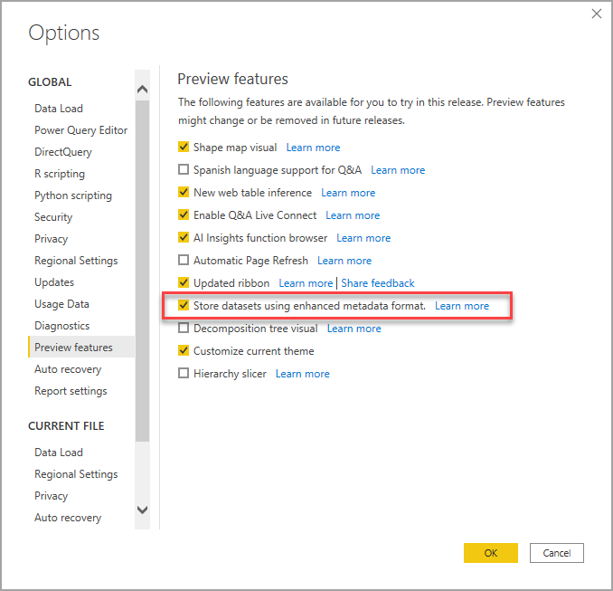

# <a name="using-enhanced-dataset-metadata-preview"></a>Uso de metadatos de conjunto de datos mejorado (versión preliminar)

Cuando Power BI Desktop crea informes, también crea metadatos de conjunto de datos en los archivos PBIX y PBIT correspondientes. Anteriormente, los metadatos se almacenaban en un formato específico de Power BI Desktop. Se usaban expresiones de M codificadas con Base 64 y orígenes de datos, y se formulaban suposiciones sobre cómo se almacenaban los metadatos.

Con el lanzamiento de la característica **Metadatos del conjunto de datos mejorado**, se quitan muchas de estas limitaciones. Con la característica **Metadatos del conjunto de datos mejorado** habilitada, los metadatos creados por Power BI Desktop usan un formato similar al de los tabulares de Analysis Services, que se basa en el [Modelo de objetos tabulares](/analysis-services/tom/introduction-to-the-tabular-object-model-tom-in-analysis-services-amo).


La característica **Metadatos del conjunto de datos mejorado** es estratégica y fundamental, ya que la futura funcionalidad de Power BI se generará en función de sus metadatos. Algunas de las funcionalidades adicionales que se benefician de la característica Metadatos del conjunto de datos mejorado incluyen la [lectura y escritura de XMLA](https://docs.microsoft.com/power-platform-release-plan/2019wave2/business-intelligence/xmla-readwrite) para la administración de conjuntos de datos de Power BI y la migración de cargas de trabajo de Analysis Services a Power BI para aprovechar las características de próxima generación.


## <a name="enable-enhanced-dataset-metadata"></a>Habilitación de los metadatos de conjuntos de datos mejorados

La característica **Metadatos del conjunto de datos mejorado** se encuentra actualmente en versión preliminar. Para habilitar los metadatos de conjuntos de datos mejorados, en Power BI Desktop, seleccione **Archivo > Opciones y configuración > Opciones > Características en versión preliminar** y, después, active la casilla **Permite almacenar los conjuntos de datos con el formato de metadatos mejorado**, como se muestra en la imagen siguiente. 



Se le pedirá que reinicie Power BI Desktop.


Una vez habilitada la característica de versión preliminar, Power BI Desktop intentará actualizar los archivos PBIX y PBIT que usan el formato de metadatos anterior. 

> [!IMPORTANT]
> La habilitación de la característica de **metadatos mejorados del conjunto de datos** se traduce en una actualización irreversible de los informes. Cualquier informe de Power BI cargado o creado con Power BI Desktop, una vez habilitados los **metadatos mejorados del conjunto de datos**, se convierten de forma irreversible al formato de metadatos mejorados del conjunto de datos.

## <a name="report-backup-files"></a>Archivos de copia de seguridad de informe

La actualización de un informe para usar la característica de **metadatos mejorados de conjuntos de datos** es irreversible. Sin embargo, durante la actualización, se crea un archivo de copia de seguridad de informe para guardar una versión del informe en su formato original (anterior a la actualización). El archivo de copia de seguridad se quitará después de 30°días. 

Para buscar el archivo de informe de copia de seguridad, haga lo siguiente:

1. Vaya a la ubicación siguiente: ```C:\Users\<user>\AppData\Local\Microsoft\Power BI Desktop\TempSaves\Backup```. Si usa la versión de Power BI Desktop de Microsoft Store, use esta ubicación: ```C:\Users\<user>\Microsoft\Power BI Desktop Store App\TempSaves\Backups``` 

2. Ahí, busque una copia del informe con el nombre y la marca de tiempo del archivo original.

3. Copie el archivo en la ubicación que prefiera para conservarlo.

4. Asegúrese de que la característica en vista previa (GB) **Formato de metadatos mejorados** está deshabilitada en Power BI Desktop si elige abrir o usar ese archivo original. 

El archivo de copia de seguridad se crea cuando se actualiza el informe, por lo que no se incluyen los cambios realizados después de la actualización. Nuevos informes creados cuando la característica **Formato de metadatos mejorados** está habilitada no tiene un archivo de copia de seguridad.


## <a name="considerations-and-limitations"></a>Consideraciones y limitaciones

En la versión preliminar, se aplican las siguientes limitaciones cuando está habilitada la característica en versión preliminar.

### <a name="unsupported-features-and-connectors"></a>Características y conectores no admitidos

Se aplican las siguientes limitaciones:

Al abrir un archivo PBIX o PBIT existente que no se ha actualizado, se producirá un error en la actualización si el conjunto de datos contiene cualquiera de las siguientes características o conectores. Si se produce este error, no debería haber ningún impacto inmediato en la experiencia del usuario y Power BI Desktop seguirá usando el formato de metadatos anterior.

* Todos los conectores personalizados (limitación de la versión de mayo 2020)
* Scripts de Python
* Azure DevOps Server
* Conector de BI
* Denodo
* Dremio
* Exasol
* Indexima
* IRIS
* Jethro ODBC
* Kyligence Enterprise
* Mark Logic ODBC
* Qubole Presto
* Team Desk
* Expresiones M que contienen determinadas combinaciones de caracteres como "\\n" en nombres de columna
* Cuando se usan conjuntos de datos con la característica **Metadatos del conjunto de datos mejorado** habilitada, los orígenes de datos de inicio de sesión único (SSO) no se pueden configurar en el servicio Power BI

Si usa la versión de **junio de 2020** de Power BI Desktop (o posterior), todos los conectores personalizados y todos los conectores integrados *se admiten* para Power BI Desktop y el servicio Power BI. Durante el proceso de publicación al usar la versión de junio de 2020 o posterior, si la puerta de enlace encuentra problemas, el conjunto de datos se publicará correctamente, pero los usuarios deberán volver a publicar el informe para actualizar los datos. El cuadro de diálogo **Configuración del origen de datos** es el único indicador de los problemas que se producen durante el proceso de publicación.

Los informes que usan características o conectores no admitidos no se actualizarán al nuevo formato. Los informes que ya se hayan actualizado o que se hayan creado después de habilitar esta característica nueva no permitirán agregar las características o los conectores no compatibles mencionados. 

No se admiten consultas con orígenes de datos dinámicos. Los informes que tienen orígenes de datos dinámicos no se actualizarán al formato nuevo y los informes que ya se actualizaron o que se crearon recientemente con la característica habilitada no permitirán agregar orígenes de datos dinámicos. Una consulta tiene un origen de datos dinámico si el origen cambia en función de un parámetro, una entrada de función o una función volátil. 

No se admiten las consultas con errores en pasos o ramas ascendentes. 

Además, los archivos PBIX y PBIT que ya se han actualizado correctamente para usar **Metadatos del conjunto de datos mejorado** *no pueden* usar las características anteriores (ni los conectores no admitidos).

### <a name="lineage-view"></a>Vista de linaje
Los conjuntos de datos que usan el nuevo formato de metadatos no muestran actualmente vínculos a flujos de datos en la vista de linaje en el servicio Power BI.

## <a name="next-steps"></a>Pasos siguientes

Puede hacer todo tipo de cosas con Power BI Desktop. Para obtener más información sobre sus capacidades, consulte los siguientes recursos:

* [¿Qué es Power BI Desktop?](../fundamentals/desktop-what-is-desktop.md)
* [Novedades de Power BI Desktop](../fundamentals/desktop-latest-update.md)
* [Información general sobre consultas con Power BI Desktop](../transform-model/desktop-query-overview.md)
* [Tipos de datos en Power BI Desktop](desktop-data-types.md)
* [Combinar datos y darles forma con Power BI Desktop](desktop-shape-and-combine-data.md)
* [Tareas de consultas comunes en Power BI Desktop](../transform-model/desktop-common-query-tasks.md)
