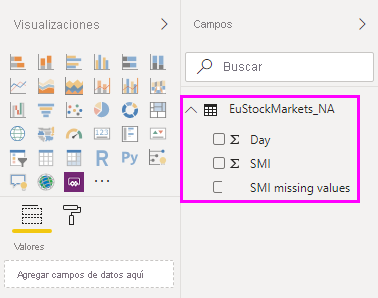
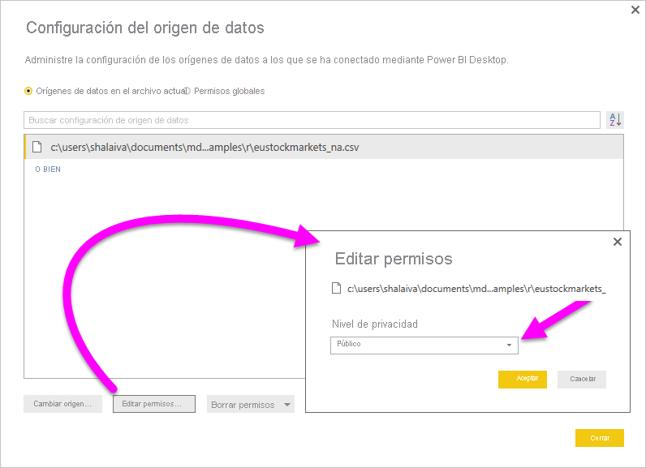

# <a name="use-r-in-power-query-editor"></a>Uso de R en el Editor de Power Query

[El lenguaje R](https://mran.microsoft.com/documents/what-is-r) es un lenguaje de programación eficaz que usan muchos estadísticos, científicos de datos y analistas de datos. R se puede usar en el Editor de Power Query de Power BI Desktop para llevar a cabo las siguientes tareas:

* Preparar modelos de datos.

* Crear informes.

* Realizar limpieza de datos, modelado de datos avanzado y análisis de conjuntos de datos, que incluyen la finalización de datos que faltan, predicciones, agrupación en clústeres, etc.  

## <a name="install-r"></a>Instalar R

R se puede descargar de forma gratuita de la [página de descarga de Revolution R Open](https://mran.revolutionanalytics.com/download/) y del [repositorio de CRAN](https://cran.r-project.org/bin/windows/base/).

## <a name="install-mice"></a>Instalación de mice

Como requisito previo, debe instalar la [biblioteca de mice](https://www.rdocumentation.org/packages/mice/versions/3.5.0/topics/mice) en el entorno de R. Sin mice, el código de script de ejemplo no funcionará bien. El paquete mice implementa un método para solucionar el problema de los datos que faltan.

Para instalar la biblioteca de mice:

1. Ejecute el programa R.exe (por ejemplo, C:\Archivos de programa\Microsoft\R Open\R-3.5.3\bin\R.exe).  

2. Ejecute el comando de instalación desde el símbolo del sistema de R:

   ``` 
   install.packages('mice') 
   ```

## <a name="use-r-in-power-query-editor"></a>Uso de R en el Editor de Power Query

Para explicar cómo usar R en el Editor de Power Query, vamos a usar un conjunto de datos del mercado de valores de ejemplo incluido en un archivo .csv, y deberá hacer lo siguiente:

1. [Descargue el archivo EuStockMarkets_NA.csv](https://download.microsoft.com/download/F/8/A/F8AA9DC9-8545-4AAE-9305-27AD1D01DC03/EuStockMarkets_NA.csv). Recuerde dónde lo ha guardado.

1. Cargue el archivo en Power BI Desktop. En la pestaña **Inicio**, seleccione **Obtener datos** > **Texto/CSV**.

   

1. Seleccione el archivo EuStockMarkets_NA.csv y, después, **Abrir**. Los datos CSV se muestran en el cuadro de diálogo **Archivo de texto/CSV**.

   

1. Seleccione **Cargar** para cargar los datos del archivo. Una vez que Power BI haya cargado los datos, la nueva tabla aparece en el panel **Campos**.

   

1. Para abrir el Editor de Power Query, seleccione **Editar consultas** en la cinta **Inicio**.

   

1. En la pestaña **Transformar**, seleccione **Ejecutar script de R**. Se abrirá el editor **Ejecutar script de R**. Las filas 15 y 20 tienen datos que faltan, al igual que otras filas que no se pueden ver en la imagen. En los siguientes pasos se muestra cómo R completa esas filas de forma automática.

   

1. En este ejemplo, escriba el siguiente código de script en el cuadro **Script** de la ventana **Ejecutar script de R**. Reemplace *&lt;Ruta de acceso al archivo&gt;* por la ruta de acceso a EuStockMarkets_NA.csv en el sistema de archivos local, por ejemplo, C:/Usuarios/John Doe/Documentos/Microsoft/EuStockMarkets_NA.csv.

    ```r
       dataset <- read.csv(file="<Your File Path>/EuStockMarkets_NA.csv", header=TRUE, sep=",")
       library(mice)
       tempData <- mice(dataset,m=1,maxit=50,meth='pmm',seed=100)
       completedData <- complete(tempData,1)
       output <- dataset
       output$completedValues <- completedData$"SMI missing values"
    ```

    > [!NOTE]
    > Es posible que tenga que sobrescribir una variable denominada *output* para crear correctamente el conjunto de datos con los filtros aplicados.

7. Seleccione **Aceptar**. El Editor de Power Query muestra una advertencia de privacidad de los datos.

   
8. En el mensaje de advertencia, seleccione **Continuar**. En el cuadro de diálogo **Niveles de privacidad** que se abre, establezca todos los orígenes de datos en **Público** para que los scripts de R funcionen correctamente en el servicio Power BI. 

   

   Para más información sobre la configuración de privacidad y sus implicaciones, vea [Niveles de privacidad de Power BI Desktop](../admin/desktop-privacy-levels.md).

 9. Seleccione **Guardar** para ejecutar el script. 

   Observe que en el panel **Campos** hay una columna nueva denominada **completedValues**. En esta columna faltan algunos elementos de datos, como en las filas 15 y 18. Vea cómo R lo aborda en la sección siguiente.

   Con tan solo cinco líneas de script de R, el Editor de Power Query ha rellenado los valores que faltaban con un modelo predictivo.

## <a name="create-visuals-from-r-script-data"></a>Creación de objetos visuales a partir de los datos del script de R

Ahora, podemos crear un objeto visual para ver cómo el código de script de R, junto con la biblioteca de mice, completa los valores que faltan.


Puede guardar todos los objetos visuales completados en un archivo .pbix de Power BI Desktop, y usar el modelo de datos y sus scripts de R en el servicio Power BI.

> [!NOTE]
> Puede [descargar un archivo .pbix](https://download.microsoft.com/download/F/8/A/F8AA9DC9-8545-4AAE-9305-27AD1D01DC03/Complete%20Values%20with%20R%20in%20PQ.pbix) con todos estos pasos completados.

Una vez que haya cargado el archivo .pbix en el servicio Power BI, tendrá que realizar más pasos para habilitar la actualización de datos de servicio y los objetos visuales actualizados:  

* **Habilitar una actualización programada del conjunto de datos**: para habilitar una actualización programada del libro que contiene el conjunto de datos con los scripts de R, vea [Configuración de actualización programada](refresh-scheduled-refresh.md). En este artículo también encontrará información sobre las puertas de enlace personales.

* **Instalar una puerta de enlace personal**: hay que tener instalada una puerta de enlace personal en el equipo donde estén el archivo y R. El servicio Power BI accede a ese libro y vuelve a representar los objetos visuales actualizados. Para más información, vea [Uso de puertas de enlace personales en Power BI](service-gateway-personal-mode.md).

## <a name="limitations"></a>Limitaciones

Las consultas que incluyen scripts de R creados en el Editor de Power Query presentan algunas limitaciones:

* Toda la configuración del origen de datos de R se debe establecer en **Pública**. El resto de los pasos de una consulta del Editor de Power Query también deben ser públicos. 

   Para obtener la configuración del origen de datos, en Power BI Desktop, seleccione **Archivo** > **Opciones y configuración** > **Configuración de origen de datos**.

   

   En el cuadro de diálogo **Configuración de origen de datos**, seleccione uno o varios orígenes de datos y, después, **Editar permisos**. Establezca **Nivel de privacidad** en **Público**.

     
  
* Para programar una actualización del conjunto de datos o los objetos visuales de R, habilite Actualización programada e instale una puerta de enlace personal en el equipo que contiene el libro y R. 

Se puede hacer todo tipo de cosas con R y con las consultas personalizadas. Explore los datos y deles justo la forma en que quiera que aparezcan.

## <a name="next-steps"></a>Pasos siguientes

* [Introducción a R](https://mran.microsoft.com/documents/what-is-r) 

* [Ejecución de scripts de R en Power BI Desktop](desktop-r-scripts.md) 

* [Usar una IDE de R externa con Power BI](desktop-r-ide.md) 

* [Creación de objetos visuales mediante paquetes de R en el servicio Power BI](service-r-packages-support.md)
